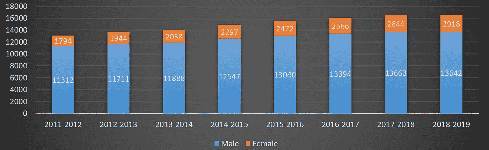

# 当心 PAF 又名“合作伙伴接受因素”

> 原文：<https://medium.com/javarevisited/beware-of-the-paf-aka-partner-acceptance-factor-e19967c18140?source=collection_archive---------2----------------------->

我第一次知道“WAF”是在一次工程师午餐讨论中，关于自制的 domotica 项目。显然，这样一个项目失败或成功的主要原因是**“妻子接受因素”**。据一些人说，在购买新的电视、收音机或任何带有复杂遥控器的电子设备时，同一 WAF 是每个决定中最关键的一点。

但是我坚信科技不是男人的专利，WAF 中的 W 让我有了更多的白发…科技不是男人的，或者至少不应该是。所以这也是我现在正式把“WAF”改名为“PAF”、**、【合作伙伴接受系数】**的原因！

我以前经历过这个重新命名的过程。在我的工作中，我们销售的设备名为“人机界面”、“T4”、“人机界面”、“T5”。这是一个触摸屏设备，火车司机使用它来选择旅程，播放哪些公告，回答紧急呼叫等。但是并不是所有的火车司机都是男性。于是通过在一个项目中引入“HMI”**“人机界面”**这个新名字，我得以慢慢闯入公司的产品命名史，将这个不友好的名字变成一个新名字。

当然，这只是一小步，但正如我们对 CoderDojo(一个儿童电脑俱乐部)所做的那样，**我们需要让女孩们相信科技是有趣的！使从事技术工作的人群多样化是很重要的。只有当相关人员的年龄、性别、出身都很好地融合在一起时，才能做出好的产品……**

随着 STE(A)M(科学、技术、工程、艺术和数学)在教育界受到越来越多的关注，我们看到选择科学道路的女孩人数在缓慢变化。例如，这是佛兰德(比利时)IT 工程学生数量的概况。

顺便说一句，如果有人问，如果你能买到现成的东西，为什么你会自己构建它，正确的答案是:**“因为我能！”**。即使你在这个过程中失败了，你也会学到新的东西！

在写关于 [Java](/javarevisited/top-5-java-online-courses-for-beginners-best-of-lot-1e1e240a758) 和树莓派的文章时，我甚至遇到了“CAF”**“社区接受因子”**。显然，根据 Mark Hecker(Pivotal Software 的 Spring 开发者)的说法，在 Raspberry Pi 上使用 Java 似乎是一个两极分化的话题。

你要么完全喜欢它，要么讨厌它，没有中间地带。对某些人来说，Pi 是为 [Python](/better-programming/top-5-courses-to-learn-python-in-2018-best-of-lot-26644a99e7ec) 制作的。当然，我不同意；-) Python 很棒，你可以很快上手，但我不喜欢你用它做的用户界面([我试过](https://webtechie.be/2017/12/20/pong-on-a-raspberry-pi)！).

JavaFX 为此提供了更好的代码。另一方面，我不得不重复我自己…为什么我更喜欢 Pi 上的 Java？**“因为我们能！”**

## 您可能喜欢的其他文章:

</javarevisited/what-java-programmers-should-learn-in-2020-648050533c83>  </free-code-camp/these-are-the-best-free-courses-to-learn-data-structures-and-algorithms-in-depth-4d52f0d6b35a>  </javarevisited/top-5-courses-to-learn-software-architecture-in-2020-best-of-lot-5d34ebc52e9> 