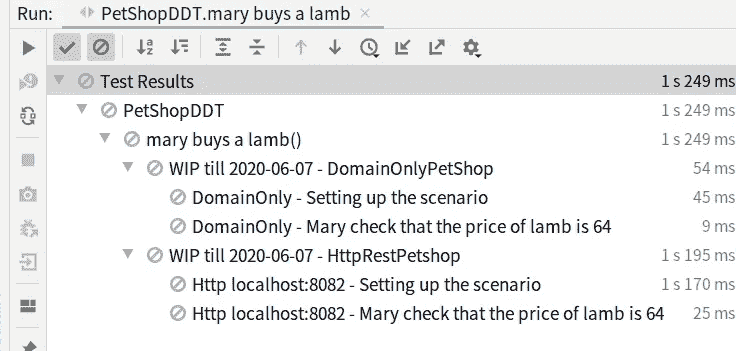
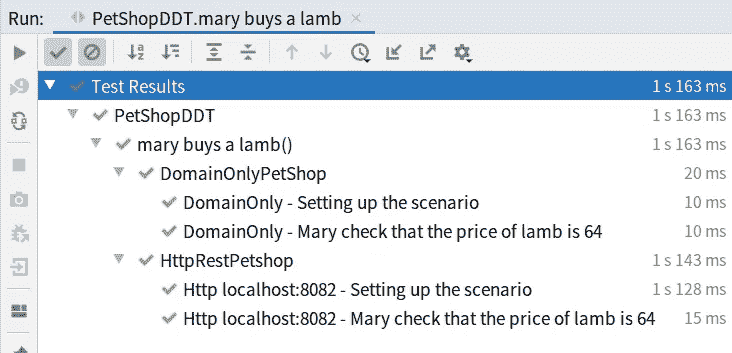
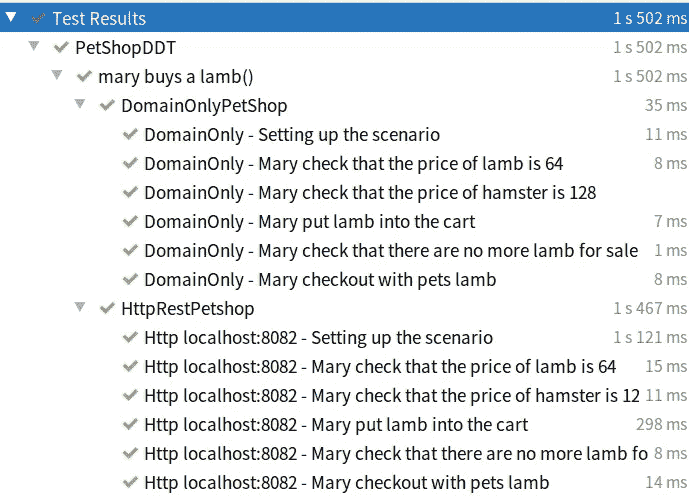

# 超越传统的验收测试

> 原文：<https://medium.com/javarevisited/beyond-traditional-acceptance-tests-79cbcee63eda?source=collection_archive---------1----------------------->

## 杀虫剂:编写领域驱动测试的库


瓢虫——一种天然杀虫剂。[https://pixabay.com/users/cocoparisienne-127419/](https://pixabay.com/users/cocoparisienne-127419/)

对此我很抱歉，但我最近忽略了这个博客，原因是我目前正试图写一本书，解释如何用[科特林](/javarevisited/top-5-courses-to-learn-kotlin-in-2020-dfc3fa7706d8)以函数方式编写完整的应用程序。这花费了我大量的时间，因为我需要解释函数式编程原理，同时还要编写一个真实的 web 应用程序(包括数据库、渐进式增强、身份验证)。等等。).嗯，我希望这是值得的努力。如果你感兴趣，你可以在这里注册更新[。](https://tinyurl.com/funkotlinbook)

顺便说一下，在写书的时候，我还创建了一个开源库来编写名为[杀虫剂](https://github.com/uberto/pesticide)的领域驱动测试。

我为伦敦 Java 社区做了一个介绍，解释了什么是 DDT 以及如何使用杀虫剂。

我也将在我自己的博客上谈论这件事，这似乎是公平的。先来个介绍。

## 领域驱动测试

最常见的自动化测试是所谓的单元测试。它们非常有用，但是它们在单个小单元上工作——因此得名——如果我们想以自动的方式验证我们的应用程序作为一个整体工作，我们需要编写一个不同粒度级别的测试。

[AcceptanceTests](https://wiki.c2.com/?AcceptanceTest) 是一种端到端测试我们的完整应用程序的方法，目的是确保它在正确的轨道上。传统的方法是记录用户与系统的交互，并在每次我们想要验证系统是否正确时回放。

不幸的是，用这种方式编写测试会使它们很难理解，因为目标隐藏在关于用户交互的非本质细节之外。

纳特·普莱斯(因谷歌而出名的[)发明了](http://www.growing-object-oriented-software.com/)[领域驱动的测试风格](https://www.youtube.com/watch?v=Fk4rCn4YLLU)，当他厌倦了以一种“点击这里，然后点击那里”的方式编写的测试。他们还受到了[宁静](http://www.thucydides.info/#/)和安东尼·马卡诺的剧本模式的影响。

这个名字来源于对测试应该使用业务领域术语来编写的关注。DDT 也是一个恰当的名字，因为它们在杀死虫子方面非常有效(就像杀虫剂一样)。

那么创新在哪里呢？这个想法是为我们的应用程序的两个或多个表示(**协议**)提供一个单一的接口(**解释器**)——例如`DomainOnly`和`Http`。这迫使我们定义一种独立于每个协议细节的通用语言。

我们还打算在测试中和与业务人员的对话中使用相同的术语。这样，我们可以促进软件开发人员和业务领域专家之间的交流。这就是所谓的`[ubiquitous language.](https://martinfowler.com/bliki/UbiquitousLanguage.html)`

过了一段时间，在编写 DDT 时，我们发现了帮助我们保持代码整洁的模式和其他不太好用的东西。最终，我决定提炼这些知识，用一种更通用、更优雅的方式编写一个库，并以开源方式发布。

> 杀虫剂是一个库，它将我们的需求描述为由我们系统的**参与者**(域[角色](https://www.infoq.com/presentations/pragmatic-personas/))和一个或多个**解释者**之间的交互列表组成的故事。

使用解释器的不同实现运行相同的测试，我们得到以下好处:

*   确信该功能在端到端和内存域中都有效。
*   使用贴近业务的语言记录我们的特色。
*   从测试中移除 UI 或技术细节。
*   确保基础设施层中没有业务逻辑**和**业务逻辑中没有基础设施细节。

现在让我们看看如何用杀虫剂写一个测试。

在 [GitHub](/@javinpaul/top-10-free-courses-to-learn-git-and-github-best-of-lot-967aa314ea) 杀虫剂示例项目中有几个例子。我们将看一下`PetShopDDT`的例子。假设我们需要为一家宠物店编写 RESTful API。

我的建议是在开始编写应用程序之前，直接从用户故事开始编写 DDT。

我们的故事会说这样的话:*“作为一个潜在客户，我想查看一只宠物的价格，以便购买它。”*

## 阶段 1 —编写 DDT

```
class PetShopDDT : DomainDrivenTest<PetShopInterpreter>*(allPetShopInterpreters) {**//something will go here***}**
```

为了进行编译，我们已经为我们的领域定义了解释器接口。大概是这样的:

```
interface PetShopInterpreter: DomainInterpreter<DdtProtocol> {fun populateShop*(*vararg pets: Pet*)*

    fun askPetPrice(petName: String): Int fun buyPet(petName: String): String}
```

您可以在这里定义您需要的所有方法，但有一些简单的规则:

*   它必须是一个接口，所以你可以有多个实现，每个你想使用的协议一个。
*   它只需要使用领域概念，比如 Json、Http 状态、按钮等等。不应该出现在这里。
*   这些方法应该反映一些原子用户交互，或者是一个问题(“询问宠物价格”)或者是一个动作(“购买宠物”)。

确切的名称现在并不重要，因为我们将在以后的工作中更改它们。

我们现在必须定义运行测试的协议列表。杀虫剂中已经定义了四种，但是你可以自己定义。

例如，这里我们想使用`DomainOnly`和`HttpRest`协议。这意味着我们需要创建两个`PetShopInterpreter`的实现，并将它们放在一个集合中供我们的测试使用。

```
val *allPetShopInterpreters* = *setOf(* DomainOnlyPetShop(),
    HttpRestPetshop*(*"localhost", 8082*)
)*
```

在这一点上，我们只能为每个定义协议和`prepare`方法，将所有的方法实现作为一个`TODO()`:

```
class HttpRestPetshop*(*val host: String, val port: Int*)* : PetShopInterpreter *{* override val protocol = Http*(*"$host:$port"*)* override fun prepare(): DomainSetUp = try *{
        //try to start the local http server 
        //or to connect with the deployed one* Ready
    *}* catch *(*t: Throwable*) {* NotReady*(*t.toString()*)
    }* override fun askPetPrice(petName: String): Int *= TODO()*... class DomainOnlyPetShop() : PetShopInterpreter *{

*    override val protocol = DomainOnly

    override fun prepare(): DomainSetUp = Ready override fun askPetPrice(petName: String): Int *= TODO()*...
```

要继续，我们需要定义至少一个**参与者**。参与者代表滴滴涕内部系统的用户。

让我们开始定义我们商店的客户。

```
data class PetBuyer(override val name: String): 
   DdtActor<PetShopInterpreter>() { fun `check that the price of $ is $`(pet: String, price: Int) =
     step(petName, expectedPrice) {
        val price  = askPetPrice(pet)
        expectThat(price).isEqualTo(expectedPrice)
     }
```

这里有几件事值得注意:

*   actor 类必须有一个名为 name 的字段。这个名字将作为演员的参考，所以我们不能在同一个测试中有两个同名的演员。
*   演员必须从`DdtActor`或`DdtActorWithContext`继承正确的`DomainInterpreter.`
*   应该使用`step`函数在 actor 中创建一个方法。这很重要，因为该方法将成为一个动态测试。
*   方法名称中的所有` $ '符号将被替换为步骤参数，以创建测试名称。通过这种方式，测试可以指出他们正在测试的确切的上下文。
*   actor 步骤的主要职责是将所有的期望(或断言)保持在一起，但是隐藏起来，这样它们就不会扰乱实际的测试。

现在我们可以将第一个测试放在一起:

```
class PetShopDDT : DomainDrivenTest<PetShopInterpreter>*(allPetShopInterpreters) {* val mary by NamedActor*(*::PetBuyer*)* @DDT
  fun `mary buys a lamb`() = ddtScenario **{** setting **{
      //set up here
****}** *atRise* play*(* mary.`check that the price of $ is $`*(*"lamb", 64*)* )*.****wip****(*LocalDate.of*(*2020, 6, 7*)*, "Working on it"*)* **}
}**
```

关于这段代码的几点说明:

*   测试类需要从`DomainDrivenTest`继承并指定哪些解释器应该运行(`allPetShopInterpreters`)。
*   可以使用`NamedActor`委托人创建执行元。
*   单个测试需要用`DDT`注释或者`TestFactory`标记，因为它们会生成多个测试。
*   每个测试都由一个`ddtScenario`生成，它负责为 Junit5 生成所有测试。
*   测试 DSL 是`setting … atRise play(steps)`，其中步骤是参与者的交互，设置部分是可选的，用于将系统置于给定状态。
*   可以用`wip`扩展指定一个在制品修饰符，它将忽略失败的测试，直到到期日。

我们像往常一样从我们的 ide 或者从命令行使用 [Gradle](https://javarevisited.blogspot.com/2020/05/top-5-courses-and-books-to-learn-gradle.html#axzz6O7LgbL92) 来运行测试。这是它在 IntelliJ 中的样子:

[](https://itnext.io/top-5-intellijidea-and-android-studio-courses-for-java-and-android-programmers-afcc27309b60)

第一次运行我们的测试

测试是灰色的，因为它们被标记为工作进行中，并且日期还没有到期。

注意每个步骤是如何变成一个测试的，它使用 Http 和 DomainOnly 协议运行相同的测试两次。此外，方法名中的美元符号被替换为实际值。

## 阶段 2——编写行走骨架

现在我们已经有了测试，我们应该用它来指导应用程序的开发。

一个好的实践是从 Http 解释器开始，然后建模我们的域接口。通过这种方式，我们避免了在与我们的 web 服务器不匹配的域接口上浪费时间的风险。

为了测试 Http 服务器，我们需要一个 Http 客户端。所以我们可以在`HttpInterpreter`里面放一个。

```
val client = JettyClient()
```

我们还需要在测试开始时启动我们的本地服务器

```
class HttpRestPetshop*(*val host: String, val port: Int*)* {
...
override fun prepare(): DomainSetUp = try *{* if *(*host == "localhost" && !started*) {* started = true
        *println(*"Pets example started listening on port $port"*)* val server = PetShopHandler*(*PetShopHub()*)* .*asServer(*Jetty*(*port*))*.start()
        registerShutdownHook **{** server.stop()
        **}** *}* Ready
*}* catch *(*t: Throwable*) {* NotReady*(*t.toString()*)
}*
```

我们通过覆盖`prepare`方法来做到这一点。在某种程度上，也许这段代码足够通用，可以成为`**Pesticide**`本身的一部分……但是目前你需要自己写类似的东西。

还要注意，只有当测试的指定主机是“localhost”时，我们才启动本地服务器。如果我们愿意，我们也可以在我们的云环境中使用相同的测试。

此时，我们需要实现我们的`askPetPrice`方法，使用 Http 客户端发送请求，然后解析响应以返回价格。类似于:

```
override fun askPetPrice*(*petName: String*)*: Int? *{* val req = Request*(*GET, uri*(*"pets/*${*petName*}*"*))* val resp = **client*(*req*)*** *expectThat(*resp.status*)*.*isEqualTo(OK)* val pet = klaxon.**parse**<Pet>*(*resp.bodyString()*)* return pet?.price
*}*
```

`HttpInterpreter`中唯一的断言是技术上的，比如在这种情况下检查响应代码。所有的域断言都应该留在参与者的步骤中。

好了，现在我们的测试要求 rest 调用，但是它将得到一个错误，因为还没有服务器代码。

因此，我们转到服务器，我们将实施我们的路线:

```
class PetShopHandler*(*val **hub**: PetShopHub*)*: HttpHandler *{* val klaxon = Klaxon() //json parser/serializer

   override fun invoke*(*request: Request*)* = petShopRoutes*(*request*)* val petShopRoutes: HttpHandler = *routes(
     *  **"/pets/{name}"** *bind* **GET** to **::petDetails**
   *)* fun petDetails*(*request: Request*)*: Response =
    request.*path(*"name"*)* ?.*let(*hub::getByName*)* ?.*let(*::toJson*)* ?.*let(*Response*(*Status.OK*)*::body*)* ?: Response*(*Status.BAD_REQUEST*)* private fun toJson*(*it: Pet*)* = klaxon.toJsonString*(*it*)
}*
```

在 Http4k 中，一切都是函数。我们将我们的路线附加到简单的`(Request) -> Response`类型的函数上。为了保持良好的函数风格，函数本身——在本例中为`petDetails`—由一系列更简单的函数组成。

实际的域在这里由`hub`字段表示。在写`PetShopHandler`的时候，我们“发现”了`PetShopHub`必须公开的方法——在这个例子中是`getByName`。

为了保持这个例子中的简单，我们使用`null`来捕获所有的错误。所以我们完全避免了异常，相反，如果任何一步给我们一个空值，我们就返回一个错误页面。

顺便说一句，如果你感兴趣，我的书将详细分析和解释这种风格。

## 阶段 3—编写域

所以现在我们的 Http DDT 在 PetShopHub 方法上失败了，这个方法还没有实现。

在这一点上，我们把 Http DDT 放在一边，我们只关注域 DDT，因为我们现在需要写域。

当我们将 Http 客户端放在`HttpInterpreter`中时，我们将 hub 的一个实例放在`DomainOnlyInterpreter`中，我们以这种方式使用它:

```
class DomainOnlyPetShop() : PetShopInterpreter *{*private val hub = PetShopHub()...
override fun askPetPrice*(*petName: String*)*: Int? =   
  hub.getByName*(*petName*)*?.price
```

现在我们可以创建我们的域了:

```
class PetShopHub() {private val pets: AtomicReference<List<Pet>> = AtomicReference*(emptyList*()*)
   *fun getByName*(*petName: String*)*: Pet? = pets.get().*firstOrNull* **{ it**.name == petName **}****}**
```

我们开始在内存中使用一个链表来存储宠物。如果这是一个真实的项目，在以后的某个时候，我们将注入一个函数来读写数据库或一些其他形式的持久性。

如果我们现在运行 DDT，我们可以看到他们仍然失败，因为商店是空的。我们需要在测试中添加一个设置，并填充商店:

```
class PetShopDDT ... val **lamb** = Pet*(*"lamb", 64*)
  v*al **hamster** = Pet*(*"hamster", 128*)* @DDT
  fun `mary buys a lamb`() = ddtScenario **{** setting **{
      populateShop*(*lamb, hamster*)*****}** *atRise* play*(* mary.`check that the price of $ is $`*(*"lamb", 64*)*,
    *)* **}**
```

我们还需要在解释器接口上实现该方法:

```
interface PetShopInterpreter : DomainInterpreter<DdtProtocol> *{* fun populateShop*(*vararg pets: Pet*)*
```

以及`HttpRestPetshop`:

```
class HttpRestPetshop ...override fun populateShop*(*vararg pets: Pet*)* =
    pets.*forEach* **{** val resp = client*(*addPetRequest*(***it***))
        expectThat(*resp.status*)*.*isEqualTo(ACCEPTED)* **}**
```

以及`DomainOnlyPetShop`:

```
class DomainOnlyPetShop() : PetShopInterpreter *{* override fun populateShop*(*vararg pets: Pet*)* =
    pets.*forEach* **{** hub.addPet*(***it***)* **}** ...
```

最后，DDT 将通过这两个协议！

我们可以移除`wip`标志，然后再次运行测试:



所有测试现在都是绿色的！

## 阶段 4 —向测试中添加新步骤

现在，我们可以继续向测试添加新的步骤，向应用程序添加新的特性，直到我们认为场景已经完成:

```
class PetShopDDT : DomainDrivenTest<PetShopInterpreter>*(allPetShopInterpreters) {* val mary by NamedActor*(*::PetBuyer*)* val lamb = Pet*(*"lamb", 64*)* val hamster = Pet*(*"hamster", 128*)* @DDT
  fun `mary buys a lamb`() = ddtScenario **{** setting **{** populateShop*(*lamb, hamster*)* **}** *atRise* play*(* mary.`check that the price of $ is $`*(*"lamb", 64*)*,
      mary.`check that the price of $ is $`*(*"hamster", 128*)*,               
      mary.`put $ into the cart`*(*"lamb"*)*,
      mary.`checkout with pets $`*(*"lamb"*)
      )* **}
}**
```

现在运行测试，我们可以看到一切都是绿色的:



成功完成测试运行

我们也可以从命令行用`./gradlew test`运行测试:

```
PetShopDDT > DomainOnly - Setting up the scenario PASSEDPetShopDDT > DomainOnly - Mary check that the price of lamb is 64 PASSEDPetShopDDT > DomainOnly - Mary check that the price of hamster is 128 PASSEDPetShopDDT > DomainOnly - Mary put lamb into the cart PASSEDPetShopDDT > DomainOnly - Mary check that there are no more lamb for sale PASSEDPetShopDDT > DomainOnly - Mary checkout with pets lamb PASSEDPetShopDDT > Http localhost:8082 - Setting up the scenario PASSEDPetShopDDT > Http localhost:8082 - Mary check that the price of lamb is 64 PASSEDPetShopDDT > Http localhost:8082 - Mary check that the price of hamster is 128 PASSEDPetShopDDT > Http localhost:8082 - Mary put lamb into the cart PASSEDPetShopDDT > Http localhost:8082 - Mary check that there are no more lamb for sale PASSEDPetShopDDT > Http localhost:8082 - Mary checkout with pets lamb PASSED
```

从这里开始应该是下坡路了。您可以在此找到所有 PetShop 测试的完整代码:

[](https://github.com/uberto/pesticide/tree/master/pesticide-examples/src/test/kotlin/com/ubertob/pesticide/examples/petshop) [## Uber to/杀虫剂

### 此时您不能执行该操作。您已使用另一个标签页或窗口登录。您已在另一个选项卡中注销，或者…

github.com](https://github.com/uberto/pesticide/tree/master/pesticide-examples/src/test/kotlin/com/ubertob/pesticide/examples/petshop) 

这里只有另一个有趣的特性值得一提——在测试期间存储和检索新数据。

例如，电子商务网站的一个常见模式是创建一个虚拟购物车或篮子来放置您的文章。如果站点不需要注册，它将为购物车生成一个唯一的 id，用户必须记住这个 id 直到结账。

到目前为止一切顺利。现在的问题是，我们无法预测购物车 id 将会是什么，那么我们如何编写关于它的断言呢？

让我们来看看玛丽把她的小羊放进手推车时的步骤:

```
fun `put $ into the cart`*(*petName: String*)* =
    step*(*petName*)* **{** cxt **->** *expectThat(*cxt.getOrNull()*)*.*isNull*()
        val cartId = createNewCart() ?: fail*(*"No CartId"*)* addToCart*(*cartId, petName*)* **cxt.store***(*cartId*)* **}**
```

在这里，我们从我们的响应中获得`cartId`,并将它存储在测试上下文中——见粗体行。

```
fun `checkout with pets $`*(*vararg pets: String*)* =
    step*(*pets.*asList*().*joinToString(*","*))* **{** ctx **->** val cartId = **ctx.get()**
        val cart = askCartStatus*(*cartId*)* val petList = cart?.pets?.*map(*Pet::name*)*.*orEmpty*()
        *expectThat(*petList*)*.*containsExactly(*pets.*toList*()*)* checkOut*(*cartId*)* **}**
```

下一步，我们可以检索`cartId`的当前值，并使用它来调用 checkout。

我认为这足以让我们先看看如何使用杀虫剂，还有其他的可能性，比如[测试 java 应用](https://www.freecodecamp.org/news/these-are-the-top-testing-tools-libraries-and-frameworks-for-java-developers-8c0e3f9bc11d/?source=user_profile---------1---------------------)，测试 javascript 页面，[测试微服务](/javarevisited/5-best-courses-to-learn-spring-cloud-and-microservices-1ddea1af7012)，测试遗留应用，等等。其中一些已经在示例中涉及到了，一些将在不久的将来涉及到。

让我们以一个大问题来结束:

在我的项目中使用农药安全吗？

好吧，这是你的电话，但请考虑到:

*   我们正在一个大项目中使用它，它是几年经验的结果。
*   这是测试代码，不会给你的应用带来风险。
*   它是开源的，相对较小，并且包含测试——即使我放弃了这个项目，你仍然可以使用它并扩展它。
*   它不是一个成熟的产品，所以可能会有粗糙的边缘，可能会有 API 的变化，虽然在 1.x 版本中没有。

那都是乡亲们！我真的希望杀虫剂库也能对其他人的项目有用。

我非常乐意在这个博客、Twitter 或 Github 上帮助和讨论任何关于杀虫剂的问题。

—

如果你对更多类似的帖子感兴趣，请点击这里或我的 twitter 账户@ [ramtop](https://twitter.com/ramtop) 关注我