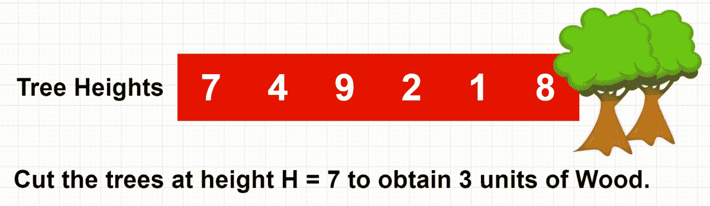

# 二分搜索法在森林中采集木材|编码采访|搜索

> 原文：<https://medium.com/javarevisited/binary-search-in-forest-for-wood-collection-coding-interview-searching-b9273b72306c?source=collection_archive---------0----------------------->

这是一个很容易的范畴问题，高盛也问过。

为了更好地理解这个问题，在阅读完每一节之后，试着编写这个方法的代码。如果你被困住了😉，您可以随时查看我提供的注释代码，供您参考。