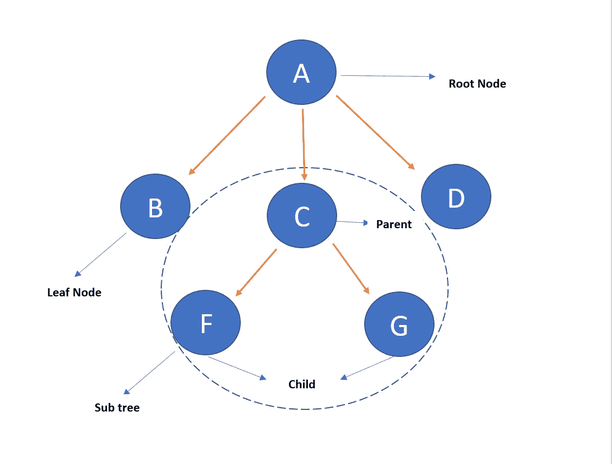

# 二分搜索法树

> 原文：<https://medium.com/javarevisited/binary-search-trees-cab4b53953fa?source=collection_archive---------3----------------------->

## 二分搜索法树简介


**关于树形数据结构，你想了解什么？**

二叉查找树是一种非常通用的数据结构，在插入、移除和搜索元素时速度更快。



树形结构

正如您在图中看到的，只能有一个根节点，所有其他节点都是通过使用根节点来访问的。c 是 F 和 G 节点的父节点，它们被认为是子节点。这些节点可以有**两个子节点，但不能超过两个子节点。**一些节点可以不存在被认为是叶节点的子节点。

**二叉树的属性是什么？**

*   节点的左子树只包含键小于节点键的节点。
*   节点的右边子树只包含大于该节点键的键。
*   左子树和右子树都必须是二叉查找树。

**二叉树有哪些应用？**

[二叉树](/javarevisited/20-binary-tree-algorithms-problems-from-coding-interviews-c5e5a384df30)主要用于搜索和排序计算，因为它们允许数据分层存储。插入、删除和遍历是可以在二叉树上执行的一些最频繁的操作。

**有什么好处？**

*   对分层数据存储方法的极好补充。
*   应反映所提供的数据集中存在的结构联系。
*   与[链表](/javarevisited/top-20-linked-list-coding-problems-from-technical-interviews-90b64d2df093)和[数组](/javarevisited/20-array-coding-problems-and-questions-from-programming-interviews-869b475b9121?source=---------15------------------)相比，插入和删除更快。
*   存储和传输数据的通用方法。
*   它可以存储大量的节点。

**如何实现二叉树？**

我们将使用一个辅助的*节点*类来存储 *int* 值。并保存对每个孩子的引用:

```
class **Node** {
    int value;
    Node leftChild;
    Node rightChild; Node(int value) {
        this.value = value;
        rightChild = null;
        leftChild = null;
    }
}
```

然后我们将添加树的开始节点，通常称为*根:*

```
public class **BinaryTree** { Node root; // ...
}
```

**有哪些基本操作？**

*   搜索
*   插入
*   [前序遍历](https://javarevisited.blogspot.com/2016/07/binary-tree-preorder-traversal-in-java-using-recursion-iteration-example.html#axzz6dXsEfLvJ)
*   [按序遍历](https://javarevisited.blogspot.com/2016/08/inorder-traversal-of-binary-tree-in-java-recursion-iteration-example.html)
*   [后序遍历](https://javarevisited.blogspot.com/2016/10/post-order-binary-tree-traversal-in-java-iteration-recursion.html#axzz5ghwj3kuU)

**什么是二叉查找树？**

[二叉查找树](https://javarevisited.blogspot.com/2015/10/how-to-implement-binary-search-tree-in-java-example.html#axzz6dXsEfLvJ)，在计算机科学中也称为有序或排序二叉树，是一种有根二叉树数据结构，其中每个内部节点存储一个大于该节点左子树中所有关键字但小于该节点右子树中所有关键字的关键字。

二叉树和二叉查找树有什么区别？

[二叉树](https://www.java67.com/2020/02/top-40-binary-tree-interview-questions.html)是一种简单的结构，具有简单的约束，即任何父节点都不能有两个以上的子节点，但是二叉查找树是二叉树的一个版本，它遵循节点应该被排序的特定顺序。

在我的下一篇文章中，我希望解释二叉树的这些基本操作。如此快乐的编码！！

</javarevisited/50-data-structure-and-algorithms-interview-questions-for-programmers-b4b1ac61f5b0>  </hackernoon/10-data-structure-algorithms-and-programming-courses-to-crack-any-coding-interview-e1c50b30b927> 