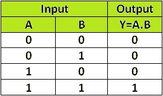
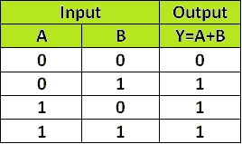

# C 语言中的位运算符——用应用程序解释清楚

> 原文：<https://medium.com/javarevisited/bitwise-operators-in-c-explained-clearly-with-applications-54d4ce5c6022?source=collection_archive---------1----------------------->

> **为什么是按位运算符？**

使用按位运算符完成的任务也可以在没有它们的情况下完成。但是，按位运算符速度更快，消耗的资源更少。所以，他们是有效率的。

> **和(&):**

“&”运算符接受两个数字，并对其中的每一位进行“&”运算。

**真值表:**

逻辑积算符

示例:

A— 1 1 0(十进制— 6)

B — 1 0 1(十进制— 5)(&)

Y— 1 0 0(十进制— 4)(结果)

**应用:**

用于检查一个数是否为偶数。

**(任意 _ 编号& 1)？奇数:偶数**//条件运算符

> **或(“|”)**

“|”运算符接受两个数字，并将它们的每一位都“|”。

OR 运算符

示例:

A — 1 1 0(十进制— 6)

B — 1 0 1(十进制— 5)(|)

Y — 1 1 1(十进制— 7)(结果)

**说明:**

**任务:**

我将去意大利或者去法国。

**成功结果:**

*   我去意大利
*   我去法国
*   我去意大利和法国

**失败结果:**

*   意大利和法国我都不去

> ***异或*——异或【^"):**

“^”运算符采用两个数字，而“^”则采用其中的每一位。

异或运算符

示例:

A — 1 1 0(十进制— 6)

B — 1 0 1(十进制— 5)(^)

Y — 0 1 1(十进制— 3)(结果)

**异或的性质:**

1.  ^ a = 0

2.0 ^ a = a

3.a ^ b ^ c = a ^ b ^ c

**解释:**

**任务:**

我要么去意大利，要么去法国

**成功结果:**

*   我只去意大利
*   我只去法国

**失败结果:**

*   意大利和法国我都不去
*   我去意大利和法国

因为，我已经用“非此即彼”明确提到了我的任务，这意味着我应该只去一个地方。

**应用:**

**问题 1 —查找丢失的号码:**

在给定的范围内，缺少一个数字。发现它

**解决方案:**

第一步:对给定的数字进行异或运算(姑且称之为 A)

第二步:对给定范围内的所有数字进行异或运算(姑且称之为 B)

步骤 3:结果是 A，B 的异或

**问题 2——寻找怪人:**

在给定的一组数字中，除了一个以外，所有的数字都出现两次。发现它

**解决方案:**

我们可以在这里应用 XOR 运算符的**属性 1。**

对所有数字进行异或运算以得到结果

> **左移(< < ):**

接受两个数字。

将第一个操作数的位移位，第二个操作数向左移动。

**解释:**

5 << 2

16-8-4-2-1

0–0–1–0–1(十进制— 5)

第一次换班后，

0–1–0–1–0

第二次轮班后，

**结果—1–0–1–0–0(十进制— 20)**

**应用:**

左移相当于将第一个操作数乘以幂(2，第二个操作数)。

5 * Pow (2，2) = 5 * 4 = 20

> **右移(>>):**

需要两个参数。

将第一个操作数的位移位，第二个操作数向右移动。

**解说:**

16 >> 2

16–8–4–2–1

1–0–0–0–0(十进制— 16)

第一次换班后，

0–1–0–0–0

第二次轮班后，

结果—0–0–1–0–0(十进制— 4)

**应用:**

右移相当于将第一个操作数除以幂(2，第二个操作数)。

16 / (Pow(2，2) = 16 / 4 = 4

> **参考文献:**

<https://www.geeksforgeeks.org/bitwise-operators-in-c-cpp/> 