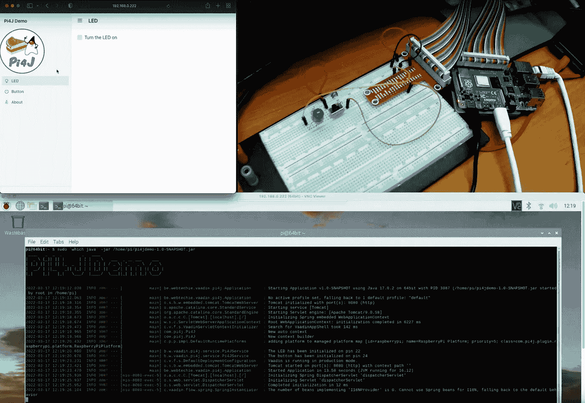
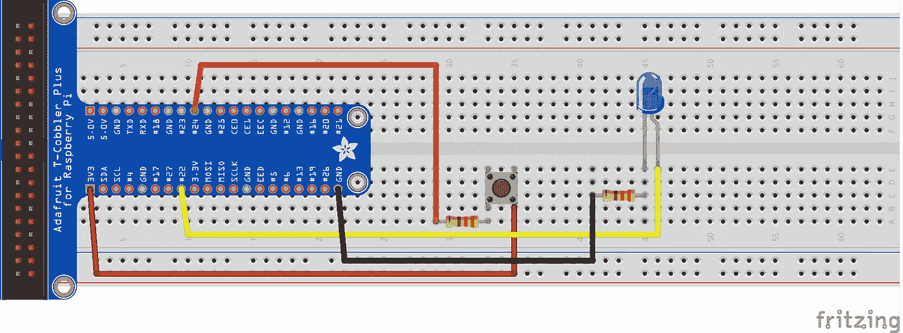
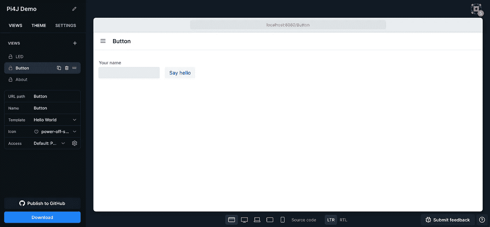
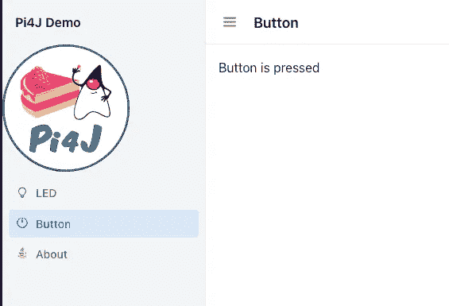

# 闪烁的 LED 上的树莓皮与瓦丁

> 原文：<https://medium.com/javarevisited/blink-a-led-on-a-raspberry-pi-with-vaadin-983ef490bc5e?source=collection_archive---------1----------------------->


就年龄而言，随着我成为一名高级开发人员，我已经从一种语言过渡到另一种语言。我的主要兴趣之一一直是干净、易于理解的 ui(用户界面)。我的旅程始于**导演**(创作多媒体光盘) **Flash** 网站动画和 **Flex** 富互联网应用程序。

当我在 10 年前开始使用 [**Java**](/javarevisited/10-best-places-to-learn-java-online-for-free-ce5e713ab5b2) 开发时，我们有一些项目使用了早期版本的 [**Vaadin**](https://javarevisited.blogspot.com/2019/01/10-web-development-frameworks-fullstack-developer-should-learn.html) 和 [**JavaFX**](/javarevisited/7-best-java-fx-online-courses-for-beginners-9e774ba6f996) 。当我继续开发服务器端应用程序时，我只继续使用 JavaFX 进行一些个人和业余项目，我喜欢用 XML(实际上是 FXML)和代码创建 UI 的方式，这与我喜欢使用 Flex 的方式完全相同。从那以后，我对 Java 和 JavaFX 的热爱与日俱增，它仍然是我的主要编程环境。

但是 [JavaFX](/javarevisited/6-free-courses-to-learn-servlet-jsp-and-java-fx-in-2020-best-of-lot-720201c84f63) 有一个缺失的部分:在浏览器中运行它……是的， [**JPRO**](https://www.jpro.one/) 可以做到这一点，但是它需要一个许可证和一个专用的服务器。是的，有一些项目正在将 JavaFX 完全引入浏览器，但它们正在进行中，尚未成熟…让我们看看另一种方法:Vaadin 流，并在 Raspberry Pi 上运行它来控制 LED 并显示按钮的状态。

[](https://javarevisited.blogspot.com/2020/06/top-5-courses-to-learn-java-fx-in-2020.html)

本文演示应用程序的最终结果

# 关于瓦丁

只是最近我重新发现了 [Vaadin 来构建 Web 用户界面](https://vaadin.com/)，这真的感觉像是浏览器中的 JavaFX。完整的 Java 代码来创建您的视图并在浏览器中运行它，而无需编写一个单独的 [HTML](/javarevisited/10-best-html-and-css-courses-for-beginners-in-2021-6757eec00032) 、 [CSS](/javarevisited/10-best-css-online-courses-for-beginners-and-experienced-developers-54aa2e8c0253) 、 [JavaScript](/javarevisited/10-best-online-courses-to-learn-javascript-in-2020-af5ed0801645) 或 [TypeScript](/@javinpaul/7-best-courses-to-learn-typescript-in-depth-58439e1ce729) 文件！ **Vaadin Flow** 是一个独特的框架，让您构建现代(响应迅速！)web 应用 100%用 Java 编写，不用写 HTML 或者 JavaScript。

在本教程中，我将使用这个 Vaadin 流结合 **Pi4J** 来创建一个 web 界面，以便与连接到 Raspberry Pi 的 GPIO(通用输入/输出)引脚的 LED 和按钮进行交互。[GitHub 上有完成的项目](https://github.com/FDelporte/Vaadin-examples)。

# 关于 Pi4J

[Pi4J，Raspberry Pi](https://pi4j.com/) 的 Java I/O 库，旨在将 Java 编程与电子学结合起来。该项目始于 2012 年。版本 1.3 于 2021 年 2 月发布，支持最新的 Raspberry Pi 板(4400 和 Compute 4)，是基于 Java 8 的最后一个版本。2021 年夏天，基于 Java 11、PiGpio、Java modules 等，推出了完全重构的 V2。

通过在项目中使用 Pi4J-dependency，连接到 Raspberry Pi 的 **GPIO(通用输入/输出)引脚的控制电子元件可以作为 [Java 代码](https://javarevisited.blogspot.com/2016/05/command-design-pattern-in-java-example-code.html)中的对象进行控制。Pi4J 使用本地库来控制 GPIOs，因此作为程序员，您不需要完全了解与硬件通信相关的所有“魔法”。**

# 为什么要在树莓派上运行 Java？！

Raspberry Pi 项目的目标是构建一台所有人都能负担得起的廉价 PC(起价 15 美元)。如果你没有电脑屏幕，可以将它连接到电视上，根据你的预算，有不同的版本可供选择。Raspberry Pi 是一款“完整的”Linux PC，提供不同版本的 Raspberry Pi 操作系统，让你可以轻松开始使用所有编程语言，当然也包括 Java。

但我爱上树莓派的主要原因是 GPIOs。当您查看 Raspberry Pi 板时，您会发现有 40 个引脚(2 排，每排 20 个)。那些是 GPIO(通用输入/输出)引脚。其中一些可以用作数字输入或输出引脚，这意味着 0 伏为关，3.3 伏为开。你能用它做的事情多得惊人！这些 GPIOs 引脚是树莓 Pi 如此成功的主要因素！你确实可以找到一台便宜的二手笔记本电脑，包括电池、屏幕等。但是你永远也不能像用树莓派那样简单地构建软硬件结合的实验。

树莓派的最后一个优点:它的力量！4 版本速度快，内存大。我写了一本关于它的书，并用它创建了许多不同的 Java 应用程序。您可以连接多达两个 4K 显示器，这意味着大量的空间来拥有不同的应用程序，终端，文件浏览器等。立刻打开。

# Spring + Vaadin + Pi4J 应用示例

让我们创建一个基于 Spring 的演示项目来说明 Vaadin 用户界面(网站)如何通过使用 [Pi4J 库](https://www.pi4j.com)与 Raspberry Pi 的 GPIOs 进行交互。GPIO 交互基于 [Pi4J 最小示例应用](https://pi4j.com/getting-started/minimal-example-application/)，使用一个按钮和一个 LED 来演示数字输入和输出交互。布线非常简单，只需要几个元件。



试验板布线

基本代码在[start.vaadin.com/app](https://start.vaadin.com/app)上生成，选择如下:

*   瓦丁 23
*   Java 17
*   流程(仅限 Java)
*   额外页面和自定义图标

[](https://javarevisited.blogspot.com/2018/09/top-5-courses-to-learn-intellij-idea-java-and-android-development.html)

启动 Vaadin 网站

下载源代码，解压缩并在您喜欢的 IDE 中打开。这是一个 [Maven](/javarevisited/6-best-maven-courses-for-beginners-in-2020-23ea3cba89) 项目，因此您可以立即运行它并检查自动生成的代码。当您启动它时，该应用程序将在设备本身的 [http://localhost:8080](http://localhost:8080) 上可用。

# 额外的依赖性

因为我们想通过 Pi4J 与 GPIOs 交互，所以我们需要向 pom.xml 添加一些额外的依赖项:

*   pi4j-核心
*   pi4j-插件-raspberrypi
*   pi4j-插件-pigpio

# Pi4J 服务

因为我们已经预先生成了一个 [Spring 应用程序](https://javarevisited.blogspot.com/2022/01/spring-boot-reactjs-example-for-java.html)，所以我们可以很容易地用一个服务来扩展它，以管理所有与 Pi4J 相关的方法。让我们从负责所有 GPIO 交互的 Pi4J 上下文的初始化开始。

```
private final Context pi4j;private static final int PIN_BUTTON = 24; // PIN 18 = BCM 24
private static final int PIN_LED = 22; // PIN 15 = BCM 22private final Queue<ButtonListener> buttonListeners;
private DigitalOutput led;public Pi4JService() {
    pi4j = Pi4J.newAutoContext();
    buttonListeners = new ConcurrentLinkedQueue<>();
    initLed();
    initButton();
}
```

一旦我们有了上下文，我们就可以用它来配置和初始化 LED 的数字输出和按钮的数字输入。在我们的示例应用程序中，我们只有一个根据按钮状态而变化的组件，但是通过使用 ButtonListener 接口和一系列实现，我们可以将无限数量的组件与按钮状态链接起来。

```
private void initLed() {
    try {
        var ledConfig = DigitalOutput.newConfigBuilder(pi4j)
                .id("led")
                .name("LED")
                .address(PIN_LED)
                .shutdown(DigitalState.LOW)
                .initial(DigitalState.LOW)
                .provider("pigpio-digital-output");
        led = pi4j.create(ledConfig);
        logger.info("The LED has been initialized on pin {}", PIN_LED);
    } catch (Exception ex) {
        logger.error("Error while initializing the LED: {}", ex.getMessage());
    }
}/**
* Toggle the LED on or off.
*
* [@param](http://twitter.com/param) on
*/
public void setLedState(boolean on) {
    led.setState(on);
}private void initButton() {
    try {
        var buttonConfig = DigitalInput.newConfigBuilder(pi4j)
                .id("button")
                .name("Button")
                .address(PIN_BUTTON)
                .pull(PullResistance.PULL_DOWN)
                .debounce(3000L)
                .provider("pigpio-digital-input");
        var button = pi4j.create(buttonConfig);
        button.addListener(e -> {
            logger.info("Button state changed to {}", e.state());
            buttonListeners.forEach(bl -> bl.onButtonEvent(e.state()));
        });
        logger.info("The button has been initialized on pin {}", PIN_BUTTON);
    } catch (Exception ex) {
        logger.error("Error while initializing the button: {}", ex.getMessage());
    }
}/**
* Add a button listener which will get all state changes of the button DigitalInput
*
* [@param](http://twitter.com/param) buttonListener
*/
public void addButtonListener(ButtonListener buttonListener) {
    buttonListeners.add(buttonListener);
}
```

此外，还有一些助手方法来显示 Pi4J 库的状态。这只是其中之一，请查看完整实现的源代码:

```
/**
* Providers are intended to represent I/O implementations and provide access to the I/O interfaces available on
* the system. Providers 'provide' concrete runtime implementations of I/O interfaces.
*/
public String getProviders() {
    if (pi4j == null || pi4j.providers() == null) {
        return "None";
    }
    return pi4j.providers().all().entrySet().stream()
            .map(e -> e.getKey() + ": " + e.getValue())
            .collect(Collectors.joining(","));
}
```

# 切换 LED 的用户界面

现在让我们更改第一页来控制 LED。代码实际上非常有限，因为我们使用了一个`Checkbox`并添加了一个值监听器来告诉我们的 Pi4JService 改变 LED 的状态。

```
public class ButtonView extends HorizontalLayout implements ButtonListener {Logger logger = LoggerFactory.getLogger(ButtonView.class);private final UI ui;
    private final Label lbl;public ButtonView([@Autowired](http://twitter.com/Autowired) Pi4JService pi4JService) {
        ui = UI.getCurrent();
        lbl = new Label("Waiting for button change...");
        add(lbl);setMargin(true);
        setVerticalComponentAlignment(Alignment.END, lbl);pi4JService.addButtonListener(this);
    }[@Override](http://twitter.com/Override)
    public void onButtonEvent(DigitalState state) {
        var isPressed = state.equals(DigitalState.HIGH);
        logger.info("Button event in listener: {} - Is on: {}", state, isPressed);
        ui.accessSynchronously(() -> lbl.setText(isPressed ? "Button is pressed" : "Button is released"));
    }
}
```

[](https://javarevisited.blogspot.com/2018/07/top-5-websites-to-learn-coding-in-java.html)

LED 用户界面

# 用户界面来查看按钮的状态

这个用户界面有更多的代码。它扩展了`ButtonListener`,所以需要覆盖`onButtonEvent`,但是代码的其他部分非常容易理解。这里需要额外注意的一点是:我们需要使用`ui.accessSynchronously`来改变作为视图一部分的组件，因为 Pi4JService 和用户界面运行在不同的线程中。

```
public class ButtonView extends HorizontalLayout implements ButtonListener {Logger logger = LoggerFactory.getLogger(ButtonView.class);private final UI ui;
    private final Label lbl;public ButtonView([@Autowired](http://twitter.com/Autowired) Pi4JService pi4JService) {
        ui = UI.getCurrent();
        lbl = new Label("Waiting for button change...");
        add(lbl);setMargin(true);
        setVerticalComponentAlignment(Alignment.END, lbl);pi4JService.addButtonListener(this);
    }[@Override](http://twitter.com/Override)
    public void onButtonEvent(DigitalState state) {
        var isPressed = state.equals(DigitalState.HIGH);
        logger.info("Button event in listener: {} - Is on: {}", state, isPressed);
        ui.accessSynchronously(() -> lbl.setText(isPressed ? "Button is pressed" : "Button is released"));
    }
}
```



按钮用户界面

主类中还需要一个额外的改变。因为我们想将来自`backend`的更改发送到`user interface`，所以我们需要添加 [@Push 属性](https://vaadin.com/docs/latest/flow/advanced/server-push)。这个微小的变化允许您从服务器更新 UI，而无需用户明确请求更新。这是基于客户端与服务器的连接(如果支持 WebSocket，或者其他连接),客户端建立该连接，然后服务器可以使用该连接向客户端发送更新。

```
[@SpringBootApplicatio](http://twitter.com/SpringBootApplicatio)n
[@Theme](http://twitter.com/Theme)(value = "pi4jdemo")
[@NpmPackage](http://twitter.com/NpmPackage)(value = "line-awesome", version = "1.3.0")
[@Push](http://twitter.com/Push)
public class Application extends SpringBootServletInitializer implements AppShellConfigurator {
```

# 带有 Pi4J 信息的用户界面

为了能够调试 Pi4J 如何与 GPIOs 交互，一些附加信息被添加到“About”屏幕以显示加载的平台和提供者。注册表包含所有初始化的输入和输出的列表，所以我们期望在这里看到 LED 和按钮。

```
public class AboutView extends VerticalLayout {
    public AboutView([@Autowired](http://twitter.com/Autowired) Pi4JService pi4JService) {
        setSpacing(false);
        add(
            new H2("Java"),
            new Paragraph("Version: " + System.getProperty("java.version")),
            new H2("Pi4J"),
            new Paragraph("Default platform: " + pi4JService.getDefaultPlatform()),
            new Paragraph("Loaded platforms: " + pi4JService.getLoadedPlatforms()),
            new Paragraph("Providers: " + pi4JService.getProviders()),
            new Paragraph("Registry: " + pi4JService.getRegistry())
        );
        setSizeFull();
        getStyle().set("text-align", "left");
    }
}
```


关于 UI

# 构建并上传到 Raspberry Pi

如果您在 PC 上开发，您可以使用以下命令构建应用程序

*   视窗:`mvnw clean package -Pproduction`
*   Mac & [Linux](/javarevisited/6-best-websites-to-learn-linux-4861ac21bfdf) : `./mvnw clean package -Pproduction`

并使用以下命令上传到您的 Raspberry Pi(用您的板替换登录名`pi`和 IP 地址):

```
$ scp target/pi4jdemo-1.0-SNAPSHOT.jar pi@192.168.0.222://home/pi/
```

# 在树莓派上运行

我们现在可以在我们的 Raspberry Pi 上启动应用程序，但是需要运行`sudo`,因为 Pi4J(仍然)需要它来使用 PiGpio 作为本地库与 Gpio 交互。

```
$ sudo java -jar /home/pi/pi4jdemo-1.0-SNAPSHOT.jar
```

如果您以普通用户的身份用 SDKMAN 安装 Java，您可能会得到以下错误:

```
sudo: java: command not found
```

解决这个问题的一种方法是让命令本身通过使用``which java``来查找 Java 的安装位置:

```
$ sudo `which java` -jar /home/pi/pi4jdemo-1.0-SNAPSHOT.jar____   _  _  _        _   ____                          
|  _ \ (_)| || |      | | |  _ \   ___  _ __ ___    ___  
| |_) || || || |_  _  | | | | | | / _ \| '_ ` _ \  / _ \ 
|  __/ | ||__   _|| |_| | | |_| ||  __/| | | | | || (_) |
|_|    |_|   |_|   \___/  |____/  \___||_| |_| |_| \___/INFO 1807 --- [           main] be.webtechie.vaadin.pi4j.Application     : Starting Application v1.0-SNAPSHOT using Java 17.0.2 on 64bit with PID 1807 (/home/pi/pi4jdemo-1.0-SNAPSHOT.jar started by root in /home/pi)
INFO 1807 --- [           main] be.webtechie.vaadin.pi4j.Application     : No active profile set, falling back to 1 default profile: "default"
INFO 1807 --- [           main] o.s.b.w.embedded.tomcat.TomcatWebServer  : Tomcat initialized with port(s): 8080 (http)
INFO 1807 --- [           main] o.apache.catalina.core.StandardService   : Starting service [Tomcat]
INFO 1807 --- [           main] org.apache.catalina.core.StandardEngine  : Starting Servlet engine: [Apache Tomcat/9.0.58]
INFO 1807 --- [           main] o.a.c.c.C.[Tomcat].[localhost].[/]       : Initializing Spring embedded WebApplicationContext
INFO 1807 --- [           main] w.s.c.ServletWebServerApplicationContext : Root WebApplicationContext: initialization completed in 6486 ms
INFO 1807 --- [           main] c.v.f.s.VaadinServletContextInitializer  : Search for VaadinAppShell took 125 ms
INFO 1807 --- [           main] com.pi4j.Pi4J                            : New auto context
INFO 1807 --- [           main] com.pi4j.Pi4J                            : New context builder
INFO 1807 --- [           main] c.p.p.impl.DefaultRuntimePlatforms       : adding platform to managed platform map [id=raspberrypi; name=RaspberryPi Platform; priority=5; class=com.pi4j.plugin.raspberrypi.platform.RaspberryPiPlatform]
INFO 1807 --- [           main] b.w.vaadin.pi4j.service.Pi4JService      : The LED has been initialized on pin 22
INFO 1807 --- [           main] b.w.vaadin.pi4j.service.Pi4JService      : The button has been initialized on pin 24
INFO 1807 --- [           main] c.v.f.s.DefaultDeploymentConfiguration   : Vaadin is running in production mode.
INFO 1807 --- [           main] o.s.b.w.embedded.tomcat.TomcatWebServer  : Tomcat started on port(s): 8080 (http) with context path ''
INFO 1807 --- [           main] be.webtechie.vaadin.pi4j.Application     : Started Application in 14.089 seconds (JVM running for 17.643)
INFO 1807 --- [nio-8080-exec-1] o.a.c.c.C.[Tomcat].[localhost].[/]       : Initializing Spring DispatcherServlet 'dispatcherServlet'
INFO 1807 --- [nio-8080-exec-1] o.s.web.servlet.DispatcherServlet        : Initializing Servlet 'dispatcherServlet'
INFO 1807 --- [nio-8080-exec-1] o.s.web.servlet.DispatcherServlet        : Completed initialization in 3 ms
INFO 1807 --- [nio-8080-exec-1] c.vaadin.flow.spring.SpringInstantiator  : The number of beans implementing 'I18NProvider' is 0\. Cannot use Spring beans for I18N, falling back to the default behavior
INFO 1807 --- [       Thread-7] b.w.vaadin.pi4j.service.Pi4JService      : Button state changed to LOW
INFO 1807 --- [       Thread-7] b.w.vaadin.pi4j.views.button.ButtonView  : Button event in listener: LOW - Is on: false
INFO 1807 --- [       Thread-8] b.w.vaadin.pi4j.service.Pi4JService      : Button state changed to HIGH
INFO 1807 --- [       Thread-8] b.w.vaadin.pi4j.views.button.ButtonView  : Button event in listener: HIGH - Is on: true
```

在此视频中，您可以看到 Raspberry Pi 上正在运行的应用程序的日志，同一网络中 PC 上的一个浏览器来展示响应的 web 界面，以及带有 LED 和按钮的试验板和 Raspberry Pi 的摄像头视图:

# 结论

多亏了 Vaadin 提供的启动站点，您只需点击几下鼠标就可以获得一个完全运行的应用程序。使用 Pi4J 库很容易添加 GPIO 交互，并允许您与连接到 Raspberry Pi 的 GPIO 引脚的电子组件完全交互。有了本文的源代码，您可以很容易地开始使用其他类型的组件并进一步扩展。

*原载于*[*https://dzone.com*](https://dzone.com/articles/blink-a-led-on-a-raspberry-pi-with-vaadin)*。*