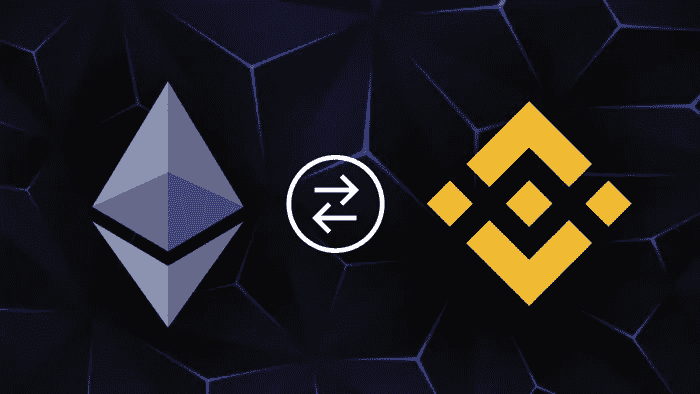

# 以太坊和 BSC 之间的区块链桥梁

> 原文：<https://medium.com/javarevisited/blockchain-bridge-between-ethereum-and-bsc-823baa2ffc5d?source=collection_archive---------1----------------------->

在扩展区块链网络以利用跨链交易时，互操作性是首要关注点。在区块链桥的帮助下，两个独特的[区块链](/javarevisited/best-blockchain-courses-and-certification-in-2020-63729f8f04d0)可以相互连接，在不同的共识机制下运行。

区块链桥使不同的链可以互操作，帮助它们共享和执行智能合约指令，来回共享资源，转移令牌。链条不再局限于它们的起源。

区块链桥为用户提供了各种好处:

*   一个[区块链](/javarevisited/7-free-courses-to-learn-blockchain-in-2020-764e66b47ebe)用户可以在两个不同的区块链的帮助下创建 dApps，而不依赖于宿主区块链。
*   用户可以通过在具有不同共识机制的平台之间进行交易来利用跨链交易。
*   用户可以使用区块链桥轻松地从不稳定的加密货币立即转换为稳定的货币。
*   网桥还允许在不同区块链的 dApp 上托管数字资产。

为了更好地理解桥梁及其机制，我们必须了解它们的各种类型。有两种不同类型的区块链桥，如下所述:

**密集桥**

联合桥是一个集中的桥，允许人们与一个公司的池或一个中间人交互以进行令牌转移。如果 BNB 和以太网正在进行令牌传输，则应该有两个包含以太网和 BNB 的大型池。当发送者用乙醚进行转移时，乙醚被加入池中，池从第二个池中向他发送等量的 BNB。集中管理机构收取少量费用来启动这一过程。

**不可信桥**

无信任桥是去除了中介/第三方角色的分散桥。无信任桥不使用 API 来监控令牌的燃烧和铸造。相反，他们使用智能合同来冻结用户当前的密码，并为他提供相同数量的新网络令牌。

# 以太坊和 BSC 之间的区块链桥梁

你可以借助 Solidity 编程语言在币安智能链和以太坊之间搭建一座去中心化的[区块链桥。许多区块链网桥使用 API 来发起令牌传输，容易受到黑客攻击和虚假交易的攻击。](https://www.leewayhertz.com/decentralized-token-bridge-ethereum-bsc/)

因此，从完全分散的桥中移除 API 将获得安全的区块链桥，并且不受攻击。按照以下步骤在 BSC 和[以太坊](https://javarevisited.blogspot.com/2021/11/top-5-courses-to-learn-ethereum-for.html)之间创建一个分散式网桥:

**第一步**

首先，为桥基设置一个智能合同。

**第二步**

在创建和部署桥基础代码之后，部署币安桥。

**第三步**

在部署币安桥之后，部署以太坊令牌桥。

**第四步**

完成合同后，开始铸造和焚烧伊托肯。

**第五步**

在铸造和烧制 IToken 之后，对迁移进行编程。

**第六步**

完成迁移编程后，开始为令牌库编写智能合约。

**第 7 步**

在币安智能链上部署令牌

**第 8 步**

在 BSC 上部署后，在以太坊链上部署令牌。

**第 9 步**

对迁移功能进行编程。

第十步

现在部署 BSC 和以太坊之间的桥梁。

**第 11 步**

在桥部署之后，部署分散的桥。

**第 12 步**

编写用于传输事件的桥 API。

**第十三步**

编程桥 API 后，在以太坊桥上部署私有功能键。

**第 14 步**

最后，为桥接编写令牌平衡函数。

随着区块链桥的出现，[区块链技术](https://www.java67.com/2018/02/5-free-blockchain-technology-courses.html)不断获得牵引力。桥接解决方案有助于 Defi 应用程序，增强分散式金融系统的招股说明书。通过启动不同区块链之间的互操作连接，[区块链桥](https://www.leewayhertz.com/blockchain-interoperability-crosschain-technology/)在分散的环境中支持跨链通信。因此，它结束了商业生态系统中单一作者的主权控制力。