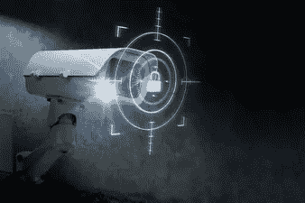

# 区块链生态系统监控工具

> 原文：<https://medium.com/javarevisited/blockchain-ecosystem-monitoring-tool-a18b71fef4ff?source=collection_archive---------1----------------------->

区块链基于去中心化的模式工作，允许对等方通过节点网络添加数据。每个节点独立地支持网络上完成的各种事务，并且每个对等组织可以在这个节点网络上协作。因为没有一个中央或单一的机构来管理这种交易，您如何保护它们免受密码破解、欺诈和盗窃呢？

***区块链网络上真实世界实体的缺失，使得稳健的监控工具成为保证数字交易真实性和安全性的必要条件。***

## **区块链监测分析工具的好处**

在数字空间的金融犯罪和欺诈活动的时代，保护区块链活动的完整性和安全性变得比以往任何时候都更加重要。根据 CipherTrace 加密货币情报报告，2020 年初发生了一系列欺诈、黑客和盗窃事件，金额高达 13 亿美元。区块链开发的需求和普及需要能够分析风险、合规性法规和监控交易的集成工具。然而，区块链生态系统监控工具的作用不仅仅是风险和合规性评估。预计他们将通过为加密业务配备适当的资源来防止区块链平台上的非法资金和交易，从而改变加密业务的面貌。

从维护区块链交易的真实性和完整性到调查与加密货币相关的犯罪，区块链监控和分析工具可以在未来保护加密业务免受数字盗窃和黑客攻击。

区块链生态系统监控工具解决了两个主要挑战，即合规性以及监控和调查。不同的监控和分析机制在监管领域(RegTech)发挥着重要作用，这些工具可以帮助加密企业和其他机构减轻与区块链相关的合规和监控风险。

## **符合性**

加密交易所等虚拟资产服务提供商可以受益于风险评估和缓解功能，这些功能有助于区分真实的广告欺诈交易。为了克服洗钱和其他非法活动等挑战，[区块链监控软件](https://www.leewayhertz.com/compliance-and-monitoring-software/)对企业实施合规性规定，以避免犯罪活动。促进区块链交易的企业可以将某些规则和标准作为监管义务，并利用区块链监控工具来评估与这些交易相关的风险。

## **监视/调查**

区块链监控工具还可以协助与加密货币相关的调查和监控。由于加密交易目前缺乏监管系统，[区块链监控工具可以通过部署识别加密服务的聚类算法来帮助](https://www.leewayhertz.com/compliance-and-monitoring-software/)法律当局检测欺诈。

## **区块链监控将如何影响加密货币世界？**

由于没有法律框架来监控区块链上的交易，区块链分析工具需要三个主要功能-

## **区块链地址分类识别**

为了确保特定区块链地址的有效性和真实性，您的区块链监控工具将区块链地址与现实世界的实体相关联。监控和分析工具可以做到这一点的主要方式之一是通过聚类算法、监控诈骗数据库、灰尘攻击和网络抓取等技术。区块链监控工具使用的聚类算法方法可以识别加密服务和相关交易，从而更容易将交易与现实世界的实体联系起来。

## **风险评估**

企业可以评估区块链平台上发生的任何类型的交易所涉及的风险。例如，区块链生态系统监控可以帮助企业主追踪资金的来源，跟踪资金流动，识别揭示发送者身份和历史的特定地址，接收者钱包的详细信息等。监控工具评估风险的主要方式之一是开发和利用与机器学习技术集成的风险模型。这种风险模型是基于某些参数创建的，如交易金额、资金来源等。，机器学习算法会为每一笔区块链交易分配一个特定的风险分值。

## **监视和调查**

区块链生态系统监控还提供可视化工具，以了解和调查区块链交易的性质，包括区块链地址。大多数工具都包括一个图形界面，其中包含表示不同交易/地址之间关联的交易图和图表。

在一个充满日益增加的金融犯罪的世界中，对区块链生态系统监控和分析的需求变得势在必行。在大规模采用[区块链开发](https://www.leewayhertz.com/blockchain-development-company/)之前，保护加密货币免受金融欺诈和盗窃变得至关重要。区块链监控工具对于检测和避免区块链上的欺诈活动非常有帮助，进一步确保个人和企业可以享受区块链网络提供的长期利益和可持续性。