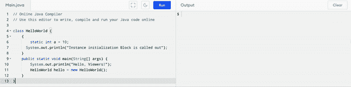
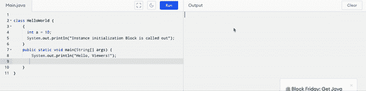
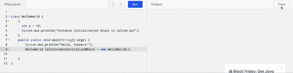
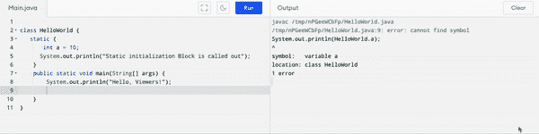

# JAVA:块的内幕

> 原文：<https://medium.com/javarevisited/blocks-in-java-27085f671cc5?source=collection_archive---------1----------------------->

[](https://www.java67.com/2016/08/10-jvm-options-for-java-production-application.html)

当我们说 blocks 时，你想到的第一件事是什么，它通常是一个大而重的正方形或平边的东西。

现在在 java 中，当我们说 blocks 时，它的意思是在花括号{ }中定义的一组指令。它没有任何名称，所以您不能显式地调用它，它将由 [JVM](/javarevisited/7-best-courses-to-learn-jvm-garbage-collection-and-performance-tuning-for-experienced-java-331705180686) 自动调用。所以说到块，我们应该知道在类内部直接定义为成员的块被称为初始化块。java 中有两种类型的初始化块:

# **1。实例初始化块**

如上所述，直接在类内部定义而没有静态修饰符的块被称为初始化块。初始化对象后，JVM 会自动调用它。

在实例初始化块中，必须只定义实例变量。让我们看看在实例块中定义静态成员的时候。

```
 class HelloWorld {
    {
        static int a = 10;
      System.out.println("Instance initialization Block is called out");
    }
    public static void main(String[] args) {
        System.out.println("Hello, Viewers!");
        HelloWorld hello = new HelloWorld();
    }
}
```

当我们要执行这个脚本时，请看下面的 gif，你会知道为什么我们不推荐用静态关键字定义变量。



在实例初始化的块中定义静态关键字

现在让我们看看，当我们不创建一个类的对象，而只是在没有静态关键字的情况下运行程序时，会发生什么。

```
 class HelloWorld {
    {
      int a = 10;
      System.out.println("Instance initialization Block is called out");
    }
    public static void main(String[] args) {
        System.out.println("Hello, Viewers!");

    }
}
```



当你运行程序而没有创建一个类的对象时

看看发生了什么，我们实例初始化的块甚至没有被执行，但是为什么呢？这是一个原因，正如你所知，我们没有创建一个对象，每当我们创建一个类的对象，我们使用构造函数。现在你这么想了什么？所以构造函数的基本用途是初始化类的实例变量。如果你不创建一个对象，它不会初始化实例变量的值，所以在这种情况下，这就是发生的事情。实例初始化的块只有在我们创建类的对象时才会执行。下面是一个带有 GIF 的例子。

```
 class HelloWorld {
    {
      int a = 10;
      System.out.println("Instance initialization Block is called out");
    }
    public static void main(String[] args) {
        System.out.println("Hello, Viewers!");
        HelloWorld callInstanceInitializedBlock = new HelloWorld();

    }
}
```



当你创建一个类的对象时

> **从上面的解释，我们可以说，每当有一个对象被创建时，实例块就会被执行。**

# **2。静态初始化块**

在类内部直接用静态修饰符定义的块称为静态初始化块。

```
 class HelloWorld {
   static {
       int a = 10;
      System.out.println("Static initialization Block is called out");
    }
    public static void main(String[] args) {
        System.out.println("Hello, Viewers!");

    }
}
```



静态初始化块

现在如果你已经看到了上面 Gif 中的输出，你会发现静态块在“Hello Viewers！”，但是为什么。答案很简单，所有用 static 修饰符定义的成员或变量都会在类被加载时被加载到内存中，也就是方法区。

> 如上所述，初始化类后，静态初始化的块将被 JVM 自动调用。所以通过这样的解释，我们可以说静态块在类加载过程中只会执行一次。
> 
> **我们将在以后的博客中讨论方法区域、堆栈内存和堆内存，那时我们将熟悉变量和方法的类型。**

