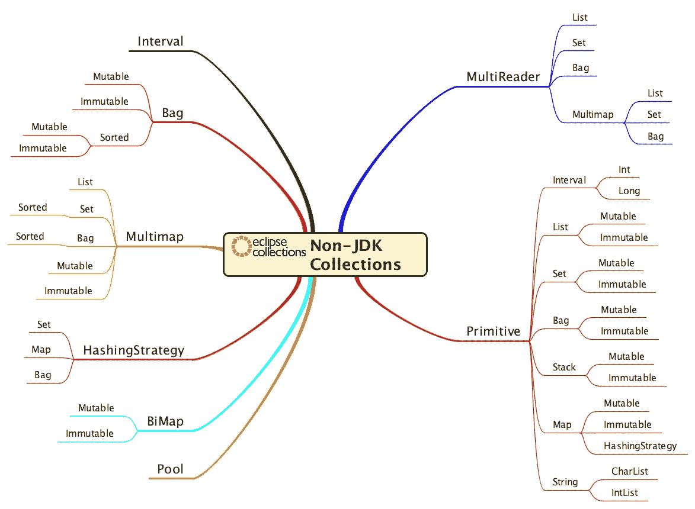

# 博客系列:没人告诉过你的缺失的 Java 数据结构

> 原文：<https://medium.com/javarevisited/blog-series-the-missing-java-data-structures-no-one-ever-told-you-about-17f34cc4b7e2?source=collection_archive---------2----------------------->

Eclipse 系列的三个部分都在一个方便的地方。

照片由[雅各布·科恩](https://unsplash.com/@jakobkohn?utm_source=medium&utm_medium=referral)在 [Unsplash](https://unsplash.com?utm_source=medium&utm_medium=referral) 上拍摄

# 需要时进行工程设计

自从我创建了第一个最终成为 Eclipse 集合的 Java 类以来，已经过去了 17 年。在科技时代，这可能是一万年前的事了。2004 年占主导地位的操作系统是 Windows XP，最流行的编程语言是 PHP，直到五年后，甲骨文收购了 Sun，成为 Java 的管家。

2004 年，我在一个 Java 库中构建数据结构和算法，这个库从第一年就为 lambdas 做好了准备。我还不如造一艘方舟，期待一场小雨。我可能要等整整十年 Java 才能最终得到 lambdas。有时候我确实觉得自己有点像诺亚。许多其他人认为用 Java 构建一个集合框架的努力是徒劳的，该框架的算法需要 lambdas，并且在此期间需要使用匿名内部类。

我开始并继续在 Eclipse 集合中构建组件，因为没有人在我需要的任何时候提供我所需要的东西。我在 Eclipse 集合中需要的第一件东西是小的内存高效的`List`、`Set`和`Map`类。我构建的第一个类仍然在库中，并且有名为`FixedSizedList`、`FixedSizeSet`和`FixedSizeMap`的接口。如果你去挖掘，你仍然会发现像`SingletonList`、`DoubletonList`、`TripletonList`、`QuadrupletonList`、`QuintupletonList`这样有趣的发音类。类先于接口，当你遵循进化设计时就会发生这种情况。这些最初的可变类将在多年后成为它们的不可变等价类的基础，现在它们的大小达到了 10—`ImmutableDecapletonList`。

在 2004 年，没有其他人有类似的东西，所以我建造了我需要的东西，然后继续前进。当我需要的时候，这些课程正是我所需要的。

从那以后，还需要和建造更多的东西。

## 我不是一个人在建造我需要的东西

这些年来，Eclipse 集合已经有超过 100 个贡献者。人们在需要的时候向库中添加了一些东西，库也在继续成长和发展，以满足其支持性开发社区的持续需求。

在许多开发人员的帮助下，我们今天所达到的是一套全面的 Java 数据结构和算法。在下面的博客中，您可以找到有助于区分 Eclipse 集合的十件事情。

 [## 使用 Eclipse 集合的十大理由

### 你可能只需要一个。

medium.com](/oracledevs/ten-reasons-to-use-eclipse-collections-91593104af9d) 

# 博客系列

我写了一系列博客来捕捉一些我觉得在 Java 开发社区中不常见的数据结构。我有意关注数据结构，而不是算法。Eclipse Collections 是一个面向对象的库，所以算法是数据结构上的方法。我已经写了很多 Eclipse 集合中的算法，比如`select`、`reject`、`collect`、`detect`、`groupBy`、`countBy`等等。本系列中的每个博客都有代码示例，展示了数据结构上可用的各种算法。

这是我在由三部分组成的博客系列中所涉及的数据结构的图片。

博客系列中涵盖的类型的思维导图

# 第 1 部分—如果你唯一的工具是一张地图，寻找空值

在博客系列的第 1 部分中，我写了 Eclipse 集合中的以下数据结构。

*   间隔
*   包
*   多地图
*   哈希战略
*   BiMap
*   泳池

`Bag`和`Multimap`是类似于`Map`的类型的很好的例子，在这里你不必担心`null`的值，就像你在 Java 中使用`Map`来模拟这些结构一样。

 [## 没有人告诉过你的缺失的 Java 数据结构—第 1 部分

### Eclipse Collections 提供了 JDK 中没有的其他集合类型。

medium.com](/javarevisited/the-missing-java-data-structures-no-one-ever-told-you-about-part-1-f45b6d0ee969) 

# 第 2 部分——比起外部迭代器，更喜欢内部迭代器

如果你想理解为什么我们在 Eclipse 集合中“更喜欢内部迭代器而不是外部迭代器”,你也应该理解，那么我强烈推荐阅读博客系列的这一部分。在博客系列的第 2 部分中，我写了 Eclipse 集合中的以下数据结构。

*   同步收藏
*   多读者收藏

`MultiReader`集合是让我们尽可能多地使用内部迭代器的类型。不管行人是否记得先按下按钮，人行横道都应该停止交通。

 [## 没有人告诉过你的缺失的 Java 数据结构—第 2 部分

### Eclipse 集合中的多读取器集合实现。

medium.com](/javarevisited/the-missing-java-data-structures-no-one-ever-told-you-about-part-2-f484a588cce3) 

# 第三部分——等待瓦尔哈拉

这篇博客的妙语是，我们不能等待[项目瓦尔哈拉](https://openjdk.java.net/projects/valhalla/)，因此，你也不需要等待。你今天有能力停止以不必要的盒子的形式产生垃圾。便利是有代价的，在这种情况下，开发人员将使用装箱集合在 Java 堆中为此付出代价。在博客系列的第 3 部分中，我写了 Eclipse 集合中可用的以下原始数据结构。

*   原始列表
*   原始集合
*   原始包
*   原始堆栈
*   原始地图
*   原始惰性的
*   原始同步集合
*   原始不可修改集合
*   原始字符串

 [## 没有人告诉过你的缺失的 Java 数据结构——第 3 部分

### 了解 Eclipse 集合中的原始集合支持。

medium.com](/javarevisited/the-missing-java-data-structures-no-one-ever-told-you-about-part-3-d26387b9e66e) 

# 摘要

写这个博客系列是一次有趣的经历。我没有意识到我已经忘记了多少十多年前在图书馆做的决定。这些决策今天仍然提供了很多价值，并指导着框架的持续发展。我很高兴我能够获得一些关于框架的“部落知识”,并把它写在这个博客系列中。我希望这些知识能够进入新一代有才华的开发人员的手中，他们可以帮助 Eclipse 集合和 Java 编程语言走向未来。

*我是*[*Eclipse Collections*](https://github.com/eclipse/eclipse-collections)*OSS 项目在*[*Eclipse Foundation*](https://projects.eclipse.org/projects/technology.collections)*的项目负责人。* [*月食收藏*](https://github.com/eclipse/eclipse-collections) *开作* [*投稿*](https://github.com/eclipse/eclipse-collections/blob/master/CONTRIBUTING.md) *。如果你喜欢这个库，你可以在 GitHub 上让我们知道。*

其他 **Java 编程文章**你可能喜欢:
[完整的 Java 开发者路线图](https://javarevisited.blogspot.com/2019/10/the-java-developer-roadmap.html)
[7 门适合初学者的最佳数据结构和算法课程](/javarevisited/7-best-courses-to-learn-data-structure-and-algorithms-d5379ae2588)
[10 门适合初学者的免费 Spring 框架课程](/javarevisited/top-10-free-courses-to-learn-spring-framework-for-java-developers-639db9348d25)
[10 门适合 Java 开发者的免费 Spring Boot 课程](/javarevisited/10-free-spring-boot-tutorials-and-courses-for-java-developers-53dfe084587e)
[10 个工具每个 Java 开发者都应该知道的](http://www.java67.com/2018/04/10-tools-java-developers-should-learn.html)
[10 个学习 Java 编程语言的理由](http://javarevisited.blogspot.sg/2013/04/10-reasons-to-learn-java-programming.html)[2021 年](/javarevisited/5-essential-frameworks-every-java-developer-should-learn-6ed83315f1fb) 针对初学者的
[10 门免费数据结构与算法课程](/javarevisited/10-free-data-science-online-courses-for-beginners-a5fe78c2cb7b)
[50+数据结构与算法面试题](/hackernoon/50-data-structure-and-algorithms-interview-questions-for-programmers-b4b1ac61f5b0)

 [## 2021 年 Java 程序员路线图

### 2021 年成为 Java 开发人员的图解指南，包含相关课程的链接

medium.com](/javarevisited/the-java-programmer-roadmap-f9db163ef2c2)