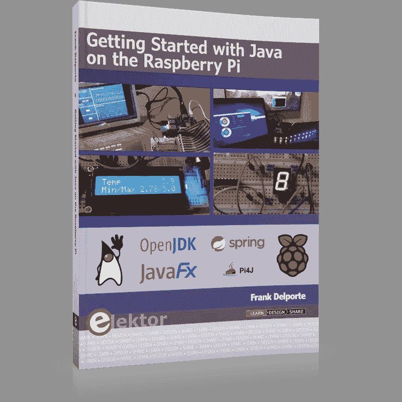

# 书籍介绍:《树莓 Pi 上的 Java 入门》

> 原文：<https://medium.com/javarevisited/book-introduction-getting-started-with-java-on-raspberry-pi-b97ae0dfedaf?source=collection_archive---------2----------------------->

2019 年初我开始在树莓 Pi 上试验 Java 和 JavaFX 11。我的目标是为我儿子的鼓室开发一个[触摸屏控制器，用继电器板](/javarevisited/drumbooth-touchscreen-controller-with-raspberry-pi-and-javafx-f42583bfe14f)控制一些 LED 灯条和其他灯。

我不得不研究和学习很多东西，并开始写博客和写这个过程，这导致了…一本书！

# 树莓 Pi 上的 Java SDK

在这个项目开始的时候，Raspbian OS 包含了 Java SDK 8，我首先需要为 Raspberry Pi 找到正确的 SDK。当你现在开始时，由于 Raspbian OS 已经升级到 Java 11，这已经容易得多了，但你仍然需要一些额外的步骤才能使用 JavaFX，正如我在这篇中等帖子中所描述的:“[在 Raspberry Pi](/javarevisited/installing-java-and-javafx-on-the-raspberry-pi-d68d0ad7b484) 上安装 Java JDK 和 JavaFX”。

# HelloLed

任何好的编码实验都是从 HelloWorld 应用程序开始的，对于硬件项目来说，它是一个闪烁的 LED。能够用 Java 和 Raspberry Pi 上的 JavaFX 按钮做到这一点是我的第一个神奇时刻。当然没有火箭科学，但是你[仍然需要理解树莓 Pi 的管脚是如何工作的，以及你如何用 Java 代码](/javarevisited/java-libraries-which-will-help-you-to-program-for-electronics-and-the-raspberry-pi-149ba0af72f3)控制它们。

# 这本书

因为我喜欢写作，我在 LeanPub 上的[电子书《树莓 Pi 上的 Java 入门》中描述了每一步，现在 Elektor 商店](https://leanpub.com/gettingstartedwithjavaontheraspberrypi)也有[纸质版。](https://www.elektor.com/getting-started-with-java-on-the-raspberry-pi)

你可以在这本书里找到很多关于 Java、JavaFX 和 Raspberry Pi 的信息，都用简单的例子来说明。没有完整的程序，因为这些都是“构建模块”,您可以使用并组合到您想要构建的应用程序中。

一些主题:

*   Java 和 Linux 命令速成教程。
*   如何安装和使用 Maven 来构建您的应用程序？
*   如何[在 Java 中读取和使用位和字节以及有符号和无符号值的区别](/javarevisited/the-mystery-of-the-negative-byte-value-in-java-8c9923d9239d)。用 led 数字显示的例子来说明。
*   使用 JavaFX 构建用户界面，与硬件进行交互。
*   使用 Pi4J 框架和依赖关系来控制 led、按钮、显示器、LED 灯条、继电器板等。
*   构建一个 Spring 应用程序，通过 web 接口(REST)与您的 Pi 交互，并将传感器数据存储在数据库中。
*   在 Raspberry Pi 上设置队列，以发送和接收来自 Arduino 板、PC 和其他 Raspberry Pi 的消息。
*   很多其他的例子来开始你自己的 DIY 项目。
*   成为更好的开发人员的技巧和诀窍。
*   对我的一些 Java 英雄的采访: [Karen Mouws](https://twitter.com/LimsKaren) (STEM 和多样性)[Trisha Gee](https://twitter.com/trisha_gee)(IntelliJ IDEA)[何](https://twitter.com/XiaokaiHe) (Visual Studio 代码)[Alexander belkrylov](https://twitter.com/gigabel)(BellSoft Liberica JDK)[Jakob Jenkov](https://twitter.com/jjenkov)(Java 和[tutorials.jenkov.com](http://tutorials.jenkov.com/))[Johan Vos](https://twitter.com/johanvos)(open jfx、JavaFX 和 glouhq)[Gerrit 格伦瓦德【t】](https://twitter.com/hansolo_)

即使你是一个经验丰富的 Java 开发人员，但想开始硬件实验，这本书会给你新的见解，并帮助你建立你的第一个电子项目。

电子书和纸质书的封面[“Raspberry Pi 上的 Java 入门”](https://leanpub.com/gettingstartedwithjavaontheraspberrypi)

# 来源

GitHub 上的这个 [JavaOnRaspberryPi 项目中提供了所有的示例代码、脚本和附加信息的链接。查看我的博客](https://github.com/FDelporte/JavaOnRaspberryPi) [webtechie.be](https://www.webtechie.be/) 中基于该书示例的一些帖子，以及更多 Java 和 Raspberry Pi 的乐趣！