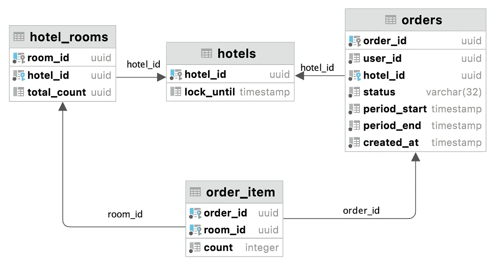

# 允许超售的预订系统

> 原文：<https://medium.com/javarevisited/booking-system-admitting-overbooking-17ab8984dd5b?source=collection_archive---------3----------------------->

照片由[海伦娜·洛佩斯](https://unsplash.com/@wildlittlethingsphoto?utm_source=medium&utm_medium=referral)在 [Unsplash](https://unsplash.com?utm_source=medium&utm_medium=referral) 拍摄

在[上一篇文章](/javarevisited/booking-system-with-pessimistic-locks-4ec107e4bd5)中，我描述了如何使用悲观锁构建预订服务。它的主要特点是不允许超额预订。

尽管如此，还是会出现超额预定的情况。比如订酒店房间的时候。客户经常取消这些预订，因此超额预订有助于减少客房闲置的机会。如果突然没有人取消预订，酒店通常可以为客人提供更好的房间。

# 超额预订模型

假设我们有 10 套标准公寓和 10 套豪华套房。在这种情况下，预订标准间的客人可以入住豪华套房。这将比房间闲置更有利可图。同样假设，我们知道通常有 15%的预订被取消。

首先，我们需要决定我们准备好允许预订的房间类型——例如，15 个标准套房和 11 个豪华套房。在现实世界中，这种分布很可能由机器学习模型设定，考虑到客户提前预订房间的数量、利润最大化和其他参数。

# 履行

现在解决这个问题变得非常类似于[预订而不超额预订](/javarevisited/booking-system-with-pessimistic-locks-4ec107e4bd5)，包括锁的获取。

RDBMS 模式的一个例子

算法可以是这样的:

1.  使用`lock_until`栏获取酒店的锁(最长有效期为 15-20 秒)。
2.  使用`period_start`和`period_end`获取客户日期范围内酒店的所有有效订单。
3.  根据超额预订模型，检查订单是否符合我们的限制。
4.  创建一个将在 5 分钟内付款的订单。
5.  打开酒店的锁。

如果在 5 分钟内没有付款，订单状态将更改为过期。

您不需要带锁来搜索哪些酒店在所选日期可用。

# 多种饲料

由于用户可以在不同的系统中预订公寓，这项任务可能会变得复杂。假设有人在我们的聚合服务上，有人直接在酒店网站上。

当流程中涉及第三方系统时，我们不能使用分布式事务。因此，同步冲突是不可避免的。我们应该记住这件事，这种情况应该根据业务要求来处理。例如，接受同步后的实际超额预订可能大于给定模型中的超额预订，并让酒店自行处理。或者通过将超额预订限制调整到潜在的同步冲突。