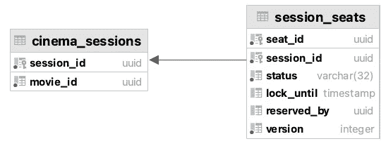
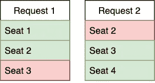
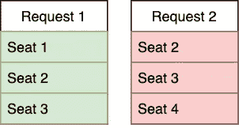

# 带有悲观锁的预订系统

> 原文：<https://medium.com/javarevisited/booking-system-with-pessimistic-locks-4ec107e4bd5?source=collection_archive---------0----------------------->

[JESHOOTS.COM](https://unsplash.com/@jeshoots?utm_source=medium&utm_medium=referral)在 [Unsplash](https://unsplash.com?utm_source=medium&utm_medium=referral) 上拍照

创建订票系统有一个共同的任务:在电影院买票，在飞机上选择座位等。本文将研究如何基于 RDBMS 或键值存储构建这样一个系统。我将使用 [PostgreSQL](/javarevisited/7-best-free-postgresql-courses-for-beginners-to-learn-in-2021-3bf369d73794) 作为关系数据库的示例，使用 Apache Ignite 作为键值存储。

值得注意的是，我们将考虑不允许超售的情况。作为一项规则，飞机票出售，允许超售(他们可以出售比飞机上的座位更多的机票)，因为乘客经常取消机票。但是当我们预定特定的座位时，我们希望我们是唯一的持有者。

# 悲观锁还是乐观锁

首先，让我们弄清楚我们应该使用哪种锁机制。
大多数任务都假设我们有这样一个流程:

1.  用户看到具有可用和预订座位的电影院的方案。
2.  用户选择所需的地点，并向服务器发送请求。
3.  位置被保留 5-15 分钟，在此期间用户必须付款。
4.  如果支付成功，座位被视为已购买。

一旦我们描述了流程，如何行动就变得更清楚了。我们不能在等待付费时使用乐观锁定，因为这将意味着几个用户可能有时间为座位付费，但只有他们中的第一个会得到它。但是对于最初的预订，我们可以使用任何锁。

# 预订一个座位

首先，让我们看一下只预订一个座位的情况，因为它稍微简单一些。重点是将状态与特定的对象字段(或表列)同步。为此我们来定义一下`lock_until`。

数据库结构的一部分将如下所示:

在那篇文章的[中，我展示了如何使用 select-for-update(悲观锁)来更新实体，所以现在让我们使用版本控制(乐观锁)。](/javarevisited/spring-transactional-mistakes-everyone-did-31418e5a6d6b)

更新语句如下所示:

实际的业务逻辑是这样的:

使用 PostgreSQL 保留

在键值存储的情况下，唯一的区别是使用`replace`而不是 update。

使用 Apache Ignite 保留

当付款完成后，我们显式重置`lock_until`并更新状态。

# 预订许多座位

通常我们不得不创建一个服务来预订不是一个，而是几个座位。因此，如果并发请求重叠了几个席位，我们需要决定如何处理冲突。

两个用户都不满意

如果我们什么都不做，可能会出现第一个请求成功预订了 3 个席位中的 2 个的情况，第二个请求也是如此。结果两个用户都不满意。不太可能，他们只会买两个座位。

如果其中一个请求会彻底失败，而第二个请求会成功，这对我们来说就更好了。

只有一个用户不满意

为此，我们可以对[关系数据库](/hackernoon/top-5-sql-and-database-courses-to-learn-online-48424533ac61)使用**表**锁，但它不是键值存储的选项。此外，表锁会降低所有其他影院会话的整体性能。

相反，我们也可以对`cinema_sessions`表使用`lock_until`方法。对于保留操作处理，我们最多只需要锁定 10-15 秒。

使用 Apache Ignite 锁定 CinemaSession

现在只有一个用户可以同时预订一组座位。一旦完成，我们立即释放特定影院会话的锁。另外，不同的电影时段不会相互影响。

您可能喜欢的其他 **Java 并发和多线程文章和资源**

</javarevisited/8-best-multithreading-and-concurrency-courses-for-experienced-java-developers-8acfd3b25094>  </javarevisited/6-multithreading-and-concurrency-books-every-java-programmer-should-read-b6a08d2aae54>  <https://javarevisited.blogspot.com/2014/07/top-50-java-multithreading-interview-questions-answers.html#axzz6hX6XfwBD> 