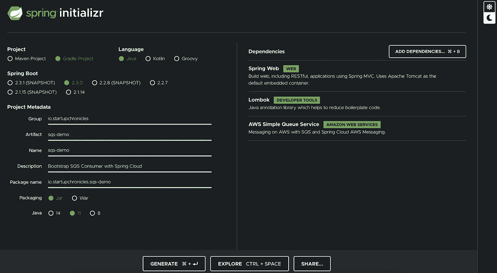
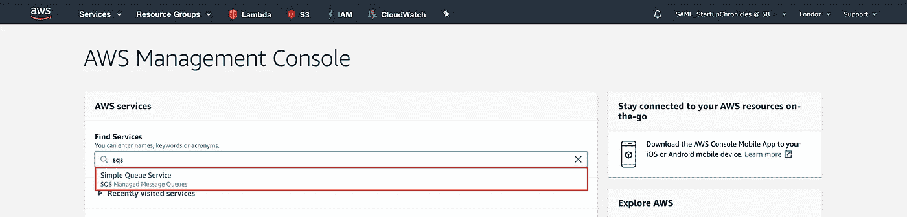
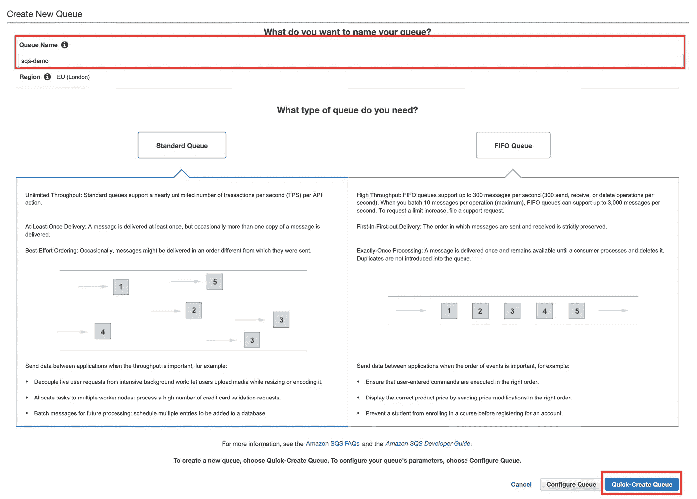
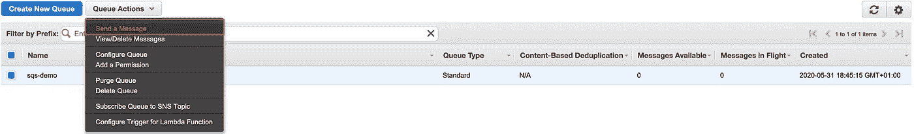
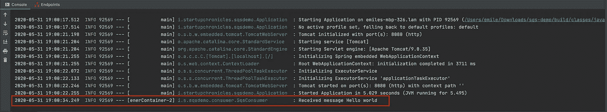
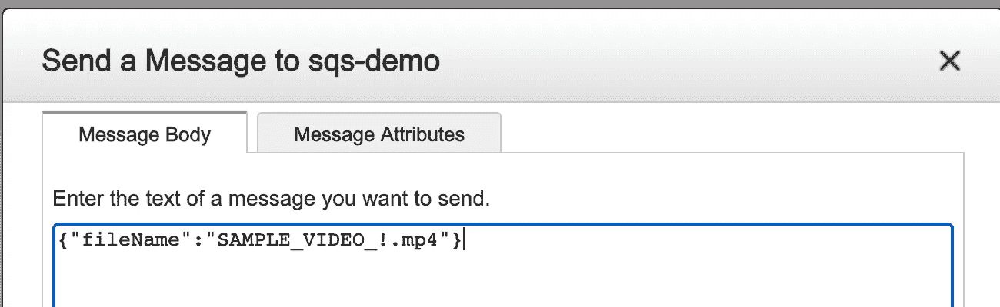
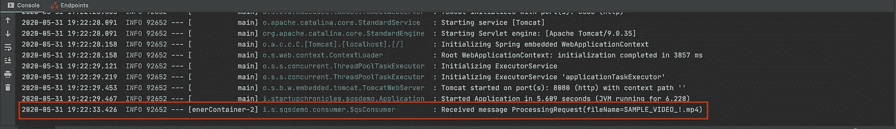

# 使用 Spring 云消息的引导 SQS

> 原文：<https://medium.com/javarevisited/bootstrap-sqs-with-spring-cloud-messaging-b0c46ea537b3?source=collection_archive---------2----------------------->

用不到 20 行代码建立一个简单队列服务(SQS)消费者，用于异步消息处理

照片由[李维·琼斯](https://unsplash.com/@levidjones)在 [Unsplash](http://www.unsplash.com) 拍摄

对于一些不需要向最终用户提供即时反馈的工作负载(*例如视频处理/转换*)，异步消息处理近年来已成为极具吸引力的产品。由于有了 [AWS](/javarevisited/top-10-courses-to-learn-amazon-web-services-aws-cloud-in-2020-best-and-free-317f10d7c21d) ，您有了一个触手可及的消息平台，您不必担心基础设施的管理，而是专注于为您的客户提供价值。

## 你需要什么

*   Java 8 或以上版本
*   格雷尔/梅文
*   AWS 帐户
*   拥有 SQS 访问权限的 IAM 用户

# 项目设置

与任何 Spring 项目一样，[Spring initializer](http://start.spring.io)提供了一种简单、用户友好的方式来生成项目。让我们添加我们将需要的所有依赖项，然后在您喜欢的 IDE 中打开项目

Spring 初始化器项目设置

# 创建 SQS 异步客户端

注意，这里我们使用`DefaultAWSCredentialsProviderChain`来获取 IAM 凭证，而不是定义一个静态凭证提供者。这将告诉 [Spring Cloud](/javarevisited/5-best-courses-to-learn-spring-cloud-and-microservices-1ddea1af7012) 使用环境中提供的凭证来配置访问，这样您就不必在部署应用程序时指定任何凭证(所有*[*AWS*](/javarevisited/top-10-courses-to-learn-amazon-web-services-aws-cloud-in-2020-best-and-free-317f10d7c21d)*服务* *都为您预先配置了这些凭证*)。*

# *配置 Spring Cloud*

*默认情况下， [Spring Cloud](/hackernoon/top-5-spring-boot-and-spring-cloud-books-for-java-developers-75df155dcedc) Messaging 认为您正在使用 CloudFormation 模板运行您的应用程序。当您运行您的应用程序时，它会抛出一个关于堆栈不存在的异常，因此这将禁用该功能。除非使用 CloudFormation，否则将上面的属性设置为 false。*

# *建立 SQS*

*在 AWS 控制台服务搜索中键入`SQS`，并选择出现的第一个选项`Simple Queue Service (SQS)`*

**

*选择 SQS 服务*

*点击`Get Started Now`按钮，为您的队列输入一个名称。出于本教程的目的，我将使用`sqs-demo`。选择您想要的队列类型(*自明*)并点击`Quick Create Queue`*

*

SQS 期权* 

# *添加 SQS 消费者*

*设置一个新的消费者并用`@Component`对其进行注释，这样 [Spring](/javarevisited/top-10-free-courses-to-learn-spring-framework-for-java-developers-639db9348d25) 就可以引导一个新的类和`@Slf4j`，这样我们就可以获得 [Lombok](https://javarevisited.blogspot.com/2018/01/top-20-libraries-and-apis-for-java-programmers.html) 提供的一些日志功能。*

*用`@SqsListener("QUEUE_NAME")`注释我们的方法告诉 [Spring](/javarevisited/top-5-books-and-courses-to-learn-restful-web-services-in-java-using-spring-mvc-and-spring-boot-79ec4b351d12) 从 SQS 获取队列并开始监听消息。运行应用程序，如果我们现在在 SQS 界面中发送一条测试消息，我们应该会看到它记录到我们的控制台中。*

**

*向 SQS 控制台发送消息*

**

*SQS 消息收到*

# *处理 JSON 消息*

*定义一个新的模型(*不需要与下面的*相同)，我们将使用它来描述我们在监听器上接收到的消息。*

*处理请求模型*

*Spring Cloud Messaging 在序列化/去序列化它发送/接收的消息时配置它自己的对象映射器。不幸的是，这不支持 JSON 开箱即用，所以我们需要配置它。*

*本质上，我们使用应用程序的默认对象映射器定义了一个新的消息转换器，然后将它传递给一个`QueueMessageHandlerFactory`，后者告诉 [Spring](/javarevisited/5-advanced-spring-framework-books-experienced-java-developers-should-read-in-2020-best-of-lot-2a786fc5ad31) 在解序列化它在侦听器中接收的消息时使用我们的自定义消息转换器。将您在`@SqsListener`上指定的输入参数更改为新创建的模型，并发送另一条消息，这次是 JSON 格式，您应该会看到它记录到控制台。*

**

*JSON 消息*

**

*收到的 JSON 消息*

# *包装东西*

*到目前为止，您可能已经看到异步设置和处理消息是多么容易。所以让我们回顾一些事情*

*   ***AWS 服务**:消除对基础设施、扩展等的过度管理。*
*   ***Spring Cloud Messaging** :提供了一种独立于服务提供商定义消息 API 的抽象方法*
*   ***defaultawscredialsproviderchain**:使用环境变量来设置 IAM 访问*
*   ***杰克森序列化/去序列化**:默认不支持，需要额外配置*

*该项目的完整源代码可以在[这里](https://github.com/Startup-Chronicles/sqs-demo)找到，包括本教程中使用的所有要点*

## *参考*

*[弹簧初始化器](http://www.start.spring.io)*

*[项目源代码](https://github.com/Startup-Chronicles/sqs-demo)*