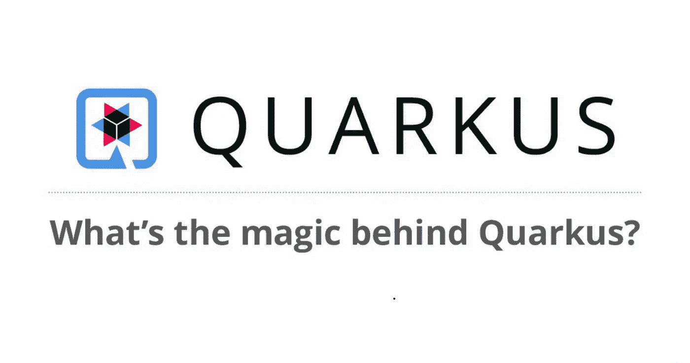
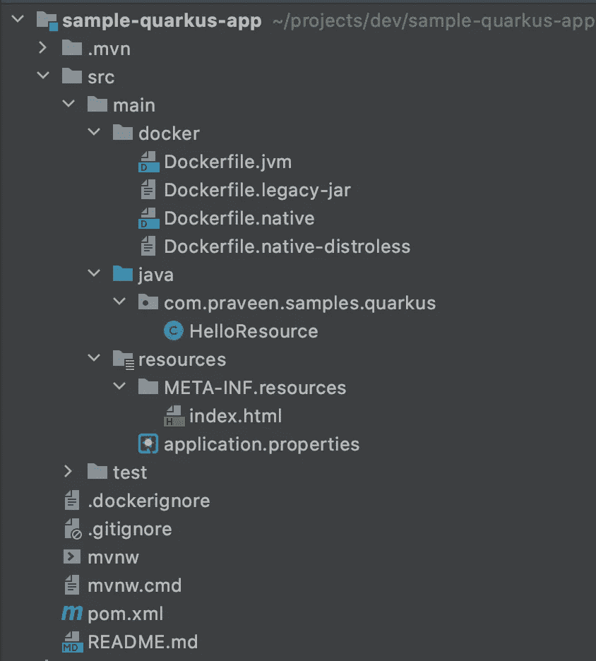
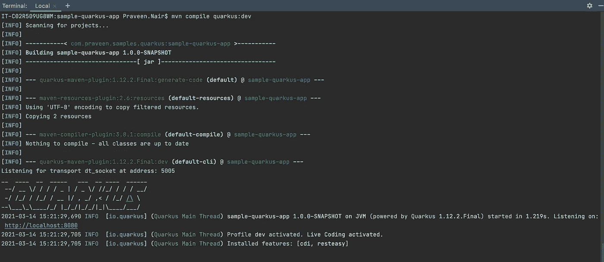
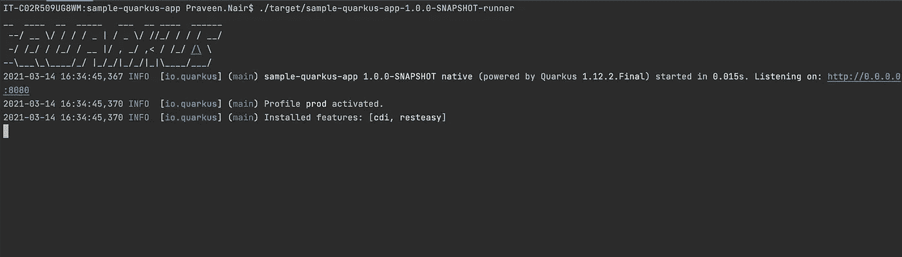

# 启动 Quarkus 应用程序

> 原文：<https://medium.com/javarevisited/bootstrapping-a-quarkus-app-a87dbec0b7e5?source=collection_archive---------1----------------------->



Quarkus:超音速亚原子 Java

## 概观

微服务现在是每个软件开发工作区的常用术语。让我提醒您，微服务的最简单定义是:

> 微服务是一种将大型软件项目分解为松散耦合的模块的方式，这些模块通过简单的应用编程接口(API)相互通信。

Java 生态系统始终是技术如何以新的方式和框架重塑自身的一个令人惊叹的例子。例如，思考一下 [Spring Boot](https://spring.io/projects/spring-boot) 如何带来 Java 社区特性，使这种语言成为世界上大多数新项目中最广泛使用的语言，是很有趣的。

但是现在，我们有如此多的创新项目，它们都是为了在云上运行并采用微服务架构而全新设计的。

[Java](/javarevisited/10-books-java-developers-should-read-in-2020-e6222f25cc72) 被证明是一项拥有活跃社区的神奇技术，但在许多项目中已经失去了阵地，在这些项目中 [Python](/javarevisited/top-10-courses-to-learn-python-for-web-development-in-2020-best-of-lot-efe11fb6d212) 或 [NodeJS](/javarevisited/7-free-courses-to-learn-node-js-in-2020-2f1dd6722b49) 由于其更低的 CPU、启动时间和内存消耗，使得云成本更低。

想着让 Java 在云原生应用中变得相关和强大，于是推出了 [**Quarkus**](https://quarkus.io/) 项目。

## 夸库斯

[Quarkus](/javarevisited/10-best-free-dropwizard-vert-x-micronaut-and-quarkus-online-courses-for-java-developers-9c2b4161f17) 是一个 Red Hat 计划，它以云原生、容器优先、微服务就绪框架为特色，用于编写基于您今天已经在使用的标准和框架的 Java 应用程序( [Hibernate](/javarevisited/top-5-hibernate-online-training-courses-for-beginners-and-advance-java-programmers-469460596b2b) 、RESTEasy、Camel、Vert)。x 等)。

这是什么意思？

*   **容器优先**:最小占用空间的 Java 应用程序，最适合在容器中运行。
*   **原生云**:在 Kubernetes 这样的环境中采用 12 要素架构。
*   **微服务第一**:为 Java 应用带来闪电般的启动时间和代码周转。

我想现在我们对为什么要用夸库进行实验有了一个大概的了解。在这篇博客中，我们将创建一个简单的 quarkus 应用程序，并使用 [maven 工具](/javarevisited/6-best-maven-courses-for-beginners-in-2020-23ea3cba89)运行它。

## 1.我们的第一个应用

构建 Quarkus Java 应用程序的要求:

*   JDK 8 或 11+安装有适当配置的`JAVA_HOME`
*   Apache Maven 3.6.2 以上
*   GraalVM(如果需要本地应用)

Quarkus 应用程序可以使用 [Maven](/javarevisited/top-10-free-courses-to-learn-maven-jenkins-and-docker-for-java-developers-51fa7a1e66f6) 或 [Gradle](/javarevisited/5-best-gradle-courses-and-books-to-learn-in-2021-93f49ce8ff8e) 插件快速启动。该插件将生成一个最小的项目结构，配置文件中包含一个样本 REST 端点和 Quarkus 的 Maven 依赖项。

如果您喜欢交互式图形用户界面，您可以导航到 [code.quarkus.io](https://code.quarkus.io/) 下载一个符合您特定需求的引导项目。

假设您已经安装了 maven，在终端上运行下面的命令:

```
mvn io.quarkus:quarkus-maven-plugin:1.12.2.Final:create \
    -DprojectGroupId=com.praveen.samples.quarkus \
    -DprojectArtifactId=sample-quarkus-app \
    -DclassName="com.praveen.samples.quarkus.HelloResource" \
    -Dpath="helloworld"
```

这将生成项目框架，一个暴露了 */helloworld* 端点的 *HelloResource* ，配置，Maven 项目和 docker 文件。

一旦导入到 IDE 中，我们将得到一个类似于下图所示的结构:

[](https://www.java67.com/2018/02/5-free-docker-courses-for-java-and-DevOps-engineers.html)

项目树结构

一旦导入成功，检查我们的资源文件`HelloResource`的内容:

```
@Path("/helloworld")
public class HelloResource {

    @GET
    @Produces(MediaType.*TEXT_PLAIN*)
    public String hello() {
        return "Hello RESTEasy";
    }
}
```

目前看来不错。现在我们有了一个简单的 qurakus 应用程序，带有一个 RESTEasy JAX-RS 端点。您可以在根目录中找到关于生成的自述文件的更多详细信息。让我们打开一个终端并运行以下命令来测试它:

```
mvn compile quarkus:dev
```



启动控制台日志。

我们的 REST 端点应该在[http://localhost:8080/hello world](http://localhost:8080/q/dev/)公开。你可以用浏览器点击网址或者 [*卷曲*命令](https://javarevisited.blogspot.com/2017/03/10-examples-of-curl-command-in-unix-and-Linux.html)，&你会看到:

```
Hello RESTEasy
```

你会看到 Quarkus 现在附带了一个开发用户界面，它只在[http://localhost:8080/q/Dev/](http://localhost:8080/q/dev/)的开发模式下可用。它允许您快速可视化当前加载的所有扩展，查看它们的状态并直接进入它们的文档。更多详情请访问[开发界面](https://quarkus.io/guides/dev-ui)。

## 2.依赖注入

[Quarkus](https://javarevisited.blogspot.com/2020/09/top-5-courses-to-learn-dropwizard-Micronaut-Quarkus-Java-Microservices.html) 在开发模式下运行时提供热重装能力( *mvn 编译 quarkus:dev* )。我们不需要重新启动或明确保存更改。让我们创建一个服务并注入到我们的示例应用程序中，看看热重载和 DI 是如何工作的。

首先，我们将创建一个 *HelloService* 类:

```
@ApplicationScoped 
public class HelloService{

  public String sayHello(String name){         
      return "Hello " + name;     
  } 
}
```

现在，我们将修改 *HelloResource* 类，注入 *HelloService* 并添加一个新方法:

```
@Inject 
HelloService helloService; @GET 
@Produces(MediaType.APPLICATION_JSON) 
@Path("/hello/{name}") 
public String greet(@PathParam("name") String name) {     
    return helloService.sayHello(name); 
}
```

接下来，让我们测试我们的新端点:[http://localhost:8080/hello world/hello/jasmine](http://localhost:8080/helloworld/hello/praveen)

```
Hello jasmine
```

我们将再做一个更改，以证明同样的情况也可以应用到属性文件。让我们编辑 *application.properties* 文件，并再添加一个键:

```
greet-message=Good day
```

之后，我们将修改 *HelloService* 来使用我们的新属性:

```
@ConfigProperty(name = "greet-message") 
private String greetMessage;public String sayHello(String name) {     
    return greetMessage + " " + name; 
}
```

如果我们再次点击相同的 url，我们现在应该会看到:

```
Good day jasmine
```

## 3.包装应用

现在我们已经尝试了一些特性，是时候使用 [JVM](/javarevisited/7-best-courses-to-learn-jvm-garbage-collection-and-performance-tuning-for-experienced-java-331705180686) 打包应用程序了。您可以运行下面的命令来打包应用程序。

```
mvn package
```

这将在*目标*目录中生成 2 个 jar 文件:

*   */quar kus-app/quar kus-run . jar*—一个可执行的 jar，其依赖项被复制到 *target/lib。*
*   */sample-quar kus-app-1.0-snapshot . jar*—包含类和资源文件。

运行打包的应用程序:

```
java -jar target/quarkus-app/quarkus-run.jar
```

Wohoo！！我们刚刚在 JVM 模式下启动了一个 Quarkus 应用程序。

## 4.GraalVM 和本机应用程序

接下来，我们将生成应用程序的本机映像。本机映像将缩短启动时间和首次响应时间。换句话说，它包含了运行所需的一切，包括运行应用程序所需的最小 JVM。

> 正在安装 GraalVM

首先，我们需要安装 [GraalVM](https://www.graalvm.org/) ，这是一个高性能、可嵌入、多语言的虚拟机，用于运行用 [JavaScript](/javarevisited/top-10-javascript-courses-from-pluralsight-to-learn-in-2021-26352abe4fcd) 、 [Python](/javarevisited/10-best-python-certification-courses-from-coursera-4576890eb6b3) 、 [Ruby](/javarevisited/10-best-ruby-on-rails-courses-for-beginners-dca4d66e9f7b) 、 [R](/javarevisited/10-best-r-programming-courses-for-data-science-and-statistics-8f84ebec4974) 、基于 JVM 的语言如 [Java](/javarevisited/10-best-places-to-learn-java-online-for-free-ce5e713ab5b2) 、 [Scala](/javarevisited/10-best-scala-and-functional-programming-online-courses-for-beginners-b6461b27bf) 、 [Kotlin](/javarevisited/top-5-courses-to-learn-kotlin-in-2020-dfc3fa7706d8) 和基于 LLVM 的语言如 [C 编写的应用程序](/javarevisited/10-best-c-programming-courses-for-beginners-2c2c1f6bcb12)

GraalVM 版本可在 https://github.com/graalvm/graalvm-ce-builds/releases[获得](https://github.com/graalvm/graalvm-ce-builds/releases)

对于 Quarkus 版本 **1.12.2.Final** ，建议安装带有 **JDK 11** 支架的**GraalVM 21**(**GraalVM-ce-Java 11–21 . 0 . 0)**。

下载 **GraalVM** 并解压到你喜欢的文件夹中。在 GraalVM 包中，您会发现:

*   一个 JVM
*   JavaScript 引擎& node.js 运行时
*   LLVM 引擎

现在导出 **GRAALVM_HOME** ，其中包含 GRAALVM 的安装路径:

```
export GRAALVM_HOME=/path/to/graal
```

接下来，我们需要**本机映像**工具，它允许您提前将 Java 代码编译成独立的可执行文件。您可以按如下方式安装本机映像工具:

```
${GRAALVM_HOME}/bin/gu install native-image
```

有关 GraalVM 安装的更多详细信息，请访问 [install-graalvm](https://www.graalvm.org/docs/getting-started/#install-graalvm) 。

> 构建本机可执行文件

现在我们已经配置了 graalvm，我们可以对我们的应用程序进行本地打包了。我们已经在 pom.xml 中定义了`native`概要文件。我们现在将停止应用程序(Ctrl + C ),如果还没有停止的话，并运行命令:

```
mvn package -Pnative
```

这可能需要几秒钟才能完成。因为本机映像试图(提前)创建所有代码 AOT 以加快启动速度，所以我们的构建时间会稍长一些。

运行下面的命令来验证我们的本机工件是否被正确构造。

```
mvn verify -Pnative
```

如果结果是成功的，那么你的工件就是好的。在 package and verify 命令之后，您会在目标文件夹中看到一个本机可执行运行程序文件。要直接运行本地可执行文件，只需在终端中执行以下命令。

```
./sample-quarkus-app-1.0.0-SNAPSHOT-runner
```

[](https://medium.com/javarevisited/top-10-courses-to-learn-linux-command-line-in-2020-best-and-free-f3ee4a78d0c0?source=collection_home---4------0-----------------------)

本机应用已启动。

答对了。！我们的 Quarkus 原生应用刚刚开始。现在看看之前的 JVM 应用启动时间和原生应用启动时间的区别。

**JVM 模式启动**:1.219 秒

**本机模式启动**:0.015 秒

**~98%** 启动时间缩短。这难道不令人印象深刻吗！！！

## 5.码头工人建造

现在我们已经准备好了我们的本机工件，我们将使用我们的本机工件创建一个图像。为此，我们必须在我们的机器上运行一个容器运行时(即 [Docker](https://www.docker.com/products/docker-desktop) )。

为了构建 Quarkus 应用程序的本地容器映像，首先使用本地概要文件和容器构建来构建应用程序，如下所示:

```
mvn package -Pnative -Dquarkus.native.container-build=true
```

以上命令需要一些时间才能完成...

现在，如果你看到当我们创建项目时，它为我们创建了一个 docker 文件 *Dockerfile.native，*这是运行应用程序的最低要求。如果你想改变基本操作系统，你可以根据需要修改 [docker 文件](/javarevisited/top-5-free-courses-to-learn-docker-for-beginners-best-of-lot-b2b1ad2b98ad?source=collection_home---4------2-----------------------)。

> 提供的`Dockerfiles`使用 [UBI](https://access.redhat.com/containers/?tab=overview#/registry.access.redhat.com/ubi8/ubi) (通用基础映像)作为父映像。这个基本图像已经被裁剪为在容器中完美地工作。`Dockerfiles`使用基础图像的 [*最小*版本](https://access.redhat.com/containers/#/registry.access.redhat.com/ubi8/ubi-minimal)来缩小生成图像的尺寸。欲了解更多详情，请点击这里。

```
FROM registry.access.redhat.com/ubi8/ubi-minimal:8.3
WORKDIR /work/
RUN chown 1001 /work \
    && chmod "g+rwX" /work \
    && chown 1001:root /work
COPY --chown=1001:root target/*-runner /work/application

EXPOSE 8080
USER 1001

CMD ["./application", "-Dquarkus.http.host=0.0.0.0"]
```

现在运行下面的 cmd 来构建 docker 映像:

```
docker build -f src/main/docker/Dockerfile.native -t quarkus/sample-quarkus-app .
```

这会产生图像。运行 *docker 图像*进行确认。现在使用下面的代码运行容器:

```
docker run -i --rm -p 8080:8080 quarkus/sample-quarkus-app
```


码头运行

容器在**0.041 秒**的极低时间启动。

现在我们知道这是夸库的优势之一。现在我们的图像可以被运送到任何地方 [Openshift](/javarevisited/6-best-openshift-courses-for-beginners-and-experienced-developers-d124edd2baff) ， [Kubernetes](/javarevisited/10-best-kubernetes-courses-for-developers-and-devops-engineers-94c35cd3a2fd) 等等。

最后，我们可以测试我们的 REST 端点来验证我们的应用程序。点击[http://localhost:8080/hello world/hello/jasmine](http://localhost:8080/helloworld/hello/praveen)

```
Good day jasmine
```

## 摘要

在这篇博客中，我们已经看到 Quarkus 是一个很好的补充，它可以更有效地将 Java 带到云中，最重要的是，我们不需要学习任何新东西，毕竟它都是 Java！！Quarkus 每天都有很多新功能加入，所以你可以在 Quarkus GitHub 库[上尝试并关注它们。](https://github.com/quarkusio/quarkus-quickstarts)

我已经在这里分享了上面我们尝试过的[示例应用程序的代码。快乐学习！！](https://github.com/PraveenGNair/sample-quarkus-app)

参考资料:

[https://quarkus.io/guides/](https://quarkus.io/guides/)

[https://www.graalvm.org/docs/getting-started/](https://www.graalvm.org/docs/getting-started/)