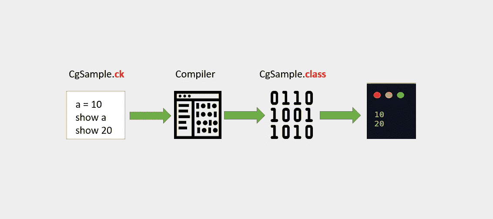
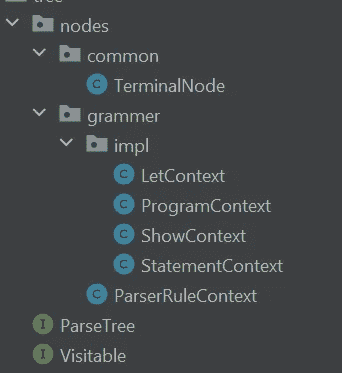

# 用 Java 构建一个微型编译器

> 原文：<https://medium.com/javarevisited/build-a-tiny-compiler-in-java-662f67a1ce85?source=collection_archive---------1----------------------->

Codekrypt 编译器

你在谷歌搜索“如何用 Java 创建一个编译器？”，“Java 中的微型编译器？”，“AST 到 Java 字节码”。那你来对地方了。**微小**这个词是主观的。但是，代码很简单，足以理解编译器开发的端到端流程。

## 空谈不值钱。给我看看代码！

这就对了: [Codekrypt 编译器 Github](https://github.com/arjunsk/codekrypt-compiler/tree/master/compiler-examples/ck-compiler)

## 先决条件:

1.  [访客模式](https://github.com/arjunsk/java-bytecode/tree/master/java-asm/visitor-pattern-example)
2.  [Java ASM](https://github.com/arjunsk/java-bytecode/tree/master/java-asm/ow2-asm-example)

## 编译器阶段:

1.  **词法**分析【字符串→令牌】
2.  **句法**分析(即解析)[ Token → AST ]
3.  **语义**分析【验证 AST】
4.  优化(可选)
5.  代码生成[AST → Java 字节码]

## 语法:

为了简单起见，我们将使用下面的语法。

*   我们的`Program` 会有多个`Statement`。
*   一个`Statement`不是`Let`就是`Show`。
*   设的形式为`VAR = INT`。
*   显示形式为`SHOW INT`或`SHOW VAR`。
*   VAR →变量(小写或大写字母的字符串)
*   INT →(整数，即`Positive Number`不带小数)

这个语法来自 ANTRL4 的另一篇文章。

让我们从实现编译器开始。

# 1.词法分析(标记器)

`nextToken()` →我们对每个字符进行迭代，看看能否转换成令牌。

`getCurrentToken()` →调用`nextToken()`后，我们获取当前设置的令牌。

我们的**令牌**会持有`type` & `value`。

# 2.解析器+ AST

简单地说，解析器就是使用`Lexer`来填充下面的框架类。

需要注意的重点是`ProgramContext`、`StatementContext`、`LetContext`、`ShowContext`、`TerminalNode` 是**可见**和**解析树**的子树。

## 为什么？

**可访问** →接受自定义访问者在各节点添加业务逻辑。

**解析树** →用于遍历子节点和传播访问者。

# 大西洋时间

我们创建了一个基类(`ParserRuleContext`)，它具体化了常见的方法，可以被它们的子类扩展。

语法元素(即 AST 节点)从这个基类扩展而来。

语法元素

现在 AST 的子节点(ie 实现)将**只有**有相关的变量和函数。我们来看一个`LetContext`的例子。

`LetContext` 节点只负责处理`variableName` & `variableValue`。

`[**TerminalNode**](https://github.com/arjunsk/codekrypt-compiler/blob/master/compiler-examples/ck-compiler/src/main/java/com/arjunsk/compiler/ck/domain/tree/nodes/common/TerminalNode.java)`因为他们没有孩子，所以逻辑略有不同。

# 3.访问者和语义

是啊！访客，是的。我们将在接下来的 3 个阶段使用访问者。

**语法**验证“Arjun 1234 良好”。(是有效的 sentance 吗？)

**语义**验证“阿琼善是”。(有意义吗？)

在我们的例子中，从语义上来说，我们需要验证变量在被`SHOW VAR1`引用之前是否声明了(`VAR1 = 10`)。

该验证逻辑可以使用**语义分析器**来实现。

# 4.访客和翻译。

解释器逐行运行你的代码。

我们将实现一个处理`LetContext` & `ShowContext`的访问者来打印我们代码的输出。

# 5.访问者和代码生成(Java ASM)

这部分会有点难，但是如果你有使用 [Java ASM](/javarevisited/20-essential-java-libraries-and-apis-every-programmer-should-learn-5ccd41812fc7) 的想法，那么真的会很简单。在这个阶段，我们将把 AST 转换成 Java 字节码。

> 为您的类生成 ASM 代码最简单的方法是使用 [ASMifier](https://github.com/arjunsk/java-bytecode/tree/master/java-asm/ow2-asm-example/src/main/java/com/arjunsk/asm/asmifier) 。

在`**visitProgram**()`中，我们打开`ClassWriter` 和`main MethodVistor`。

一旦`ClassWriter` 和`main Method Visitor`打开，我们调用`super()`将调用传播到子节点，即`VisitLet()`和`VisitShow()`，然后关闭这些编写器。

在`**visitLet**()`中，我们使用 Java Ops 代码:

*   `BIPUSH` (字节推送)
*   `ASTORE` + `VariableIndex` 将引用存储到一个[局部变量](https://javarevisited.blogspot.com/2018/03/finally-java-10-has-var-to-declare-local-variables.html#axzz5Xl86cS70)中。

**注 1** : VariableIndex 从 1 开始，因为索引 0 是为`main(String[] var0)`中的 args[]保留的。

**注 2** :我们保存`VariableIndex` 以便在`visitShow()`中进一步参考。

在`**visitShow**()`中，我们使用 Java Ops 代码:

*   `ALOAD` + `VariableIndex`:从局部变量(VAR)加载引用
*   `BIPUSH` (字节推送):如果是整数常量。(整数)
*   `INVOKEVIRTUAL`:调用`System.out.println()`

# 6.链接和编译。

要从生成的`.class`文件中读取`Java`代码，使用 [IntelliJ 的](/javarevisited/7-best-courses-to-learn-intellij-idea-for-beginners-and-experienced-java-programmers-2e9aa9bb0c05)反编译器。

反编译的类文件

## 结论

你坚持到了最后。干杯🍻！

Java 很冗长，很难一行一行地解释代码。但是我已经尽力给出了编译器开发过程的高层次概述。

请务必在 [Github](https://github.com/arjunsk/codekrypt-compiler/tree/master/compiler-examples/ck-compiler) 查看完整代码。开始**这个项目，因为我可能会用更成熟的语法更新这个项目。[父项目](https://github.com/arjunsk/codekrypt-compiler)包含了我已经尝试过的`parser-libraries`的例子。希望这篇文章对某人有所帮助！**

**觉得有意思？** 请通过以下方式表示您的支持👏。