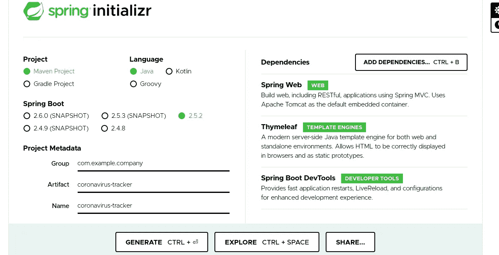

# 用 Spring Boot 和 JAVA 构建冠状病毒案例追踪应用程序！

> 原文：<https://medium.com/javarevisited/building-a-coronavirus-case-tracer-with-spring-boot-and-java-c16dd60d371c?source=collection_archive---------1----------------------->

在这篇博客中，我将解释如何用 Spring Boot 和 JAVA 创建自己的冠状病毒追踪应用程序，报告全球病例总数。报告了该国每个州的病例，然后还指定了前一天报告的病例数的变化。


这是应用程序的外观。

如果你被卡住了，不要担心，你可以在我的 [**GitHub**](https://github.com/Anushka-shukla/Trace-Case) 库中找到源代码。

因此，让我们来看看在构建这个应用程序之前您需要了解什么:

1.  你必须熟悉语言- [**JAVA**](/javarevisited/10-best-places-to-learn-java-online-for-free-ce5e713ab5b2) 。
2.  稍微没经验的 [**弹簧翘臀**](/javarevisited/top-10-courses-to-learn-spring-boot-in-2020-best-of-lot-6ffce88a1b6e?source=---------39------------------) **t** 都行。
3.  由于这将是一个 web 应用程序，所以你应该知道 [**HTML/CSS**](/javarevisited/10-best-html-and-css-courses-for-beginners-in-2021-6757eec00032) 。

现在你已经深深地吸了一口气，你已经知道上面列出的东西，让我告诉你你需要什么来建立这个项目的环境。

1. **JAVA 1.8+**

2. [**Maven 3.2+**](/javarevisited/6-best-maven-courses-for-beginners-in-2020-23ea3cba89)

3.一个 **IDE，**你可以选择[**IntelliJ IDEA**](/javarevisited/7-best-courses-to-learn-intellij-idea-for-beginners-and-experienced-java-programmers-2e9aa9bb0c05)**或者** [**Eclipse**](/javarevisited/6-free-best-eclipse-ide-courses-for-java-programmers-1229ee9e5d87) 。

# **建立新项目**

1.  转到[**https://start.spring.io/**](https://start.spring.io/)生成一个 **Maven 和 JAR** 打包，具有以下依赖关系:

*   [**弹簧腹板**](/javarevisited/my-favorite-spring-mvc-courses-for-java-developers-5ede7f85dd88)
*   **百里香叶**
*   **Spring Boot 开发工具**

对于其他选项，我们可以使用默认设置。点击**生成。**可以参考下图，供大家参考。

[](https://javarevisited.blogspot.com/2020/05/top-20-spring-boot-interview-questions-answers.html)

2.提取下载的 zip 文件，并在 IDE 中打开它。导入时选择 maven，因为它是一个 maven 项目。

3.打开 **pom.xml** 文件，确保您使用的是正确的 JAVA 版本，并确保您选择了正确的编译器。

现在，您已经完成了构建项目的环境设置。

## **数据来源**

我们正在构建一个 web 应用程序，因此我们需要一个数据源，或者您可以称之为数据集。所以我们将使用由 JHU·CSSE 提供的具有 [**数据**](https://raw.githubusercontent.com/CSSEGISandData/COVID-19/master/csse_covid_19_data/csse_covid_19_time_series/time_series_covid19_confirmed_global.csv) 的存储库。每当 Spring 应用程序加载时，就会向提到的存储库的 csv 文件发出 GET 请求，应用程序将获取所有数据，并以我们为 web 页面创建的格式解析这些数据。

## **让我们开始构建应用程序**

所以我们有一个主类，我们想做的是当这个应用程序运行时，它获取数据。

```
package com.company.coronavirustracker;import org.springframework.boot.SpringApplication;
import org.springframework.boot.autoconfigure.SpringBootApplication;
import org.springframework.scheduling.annotation.EnableScheduling; @SpringBootApplication@EnableSchedulingpublic class CoronavirusTrackerApplication { public static void main(String[] args) { SpringApplication.run(CoronavirusTrackerApplication.class, args); 
 }
}
```

1.我们将创建一个名为[**services . coronavirusdataservice .**](https://github.com/Anushka-shukla/Trace-Case/blob/main/src/main/java/com/company/coronavirustracker/services/CoronaVirusDataService.java)**的新 JAVA 类。我们在这里所做的是创建一个名为 **fetchVirusData()** 的方法，该方法将向数据 URL 发出一个 **HTTP** 请求，并获得一个字符串形式的响应。这个方法将有一个“ **@PostConstruct** ”注释，这意味着一旦我们完成创建类“ **CoronaVirusDataService** ”的实例，您就可以执行发出 HTTP 请求的方法。在这之后，您可以运行应用程序并检查您是否正在控制台中打印数据。它将采用逗号分隔的文本格式。**

**现在我们必须解析这个 csv 数据。转到[**https://commons.apache.org/proper/commons-csv/**](https://commons.apache.org/proper/commons-csv/)**你会找到一个如下的**依赖关系**，并将其复制粘贴到你的 **pom.xml 文件中。******

```
**<dependency>
    <groupId>org.apache.commons</groupId>
    <artifactId>commons-csv</artifactId>
    <version>1.8</version>
</dependency>**
```

****您可以通过**标题自动检测**来解析它，因为在我们的数据中，第一行有标题，如州、国家等。我们希望每天都运行它，所以我们要做的是添加“ **@Scheduled** ”注释，通过 **cron** 表达式来调度方法 **fetchVirusData()** 的运行，并指定指定我们需要运行它的频率的字符串(分钟、小时、天、月)。****

****2.创建一个名为[的新类**模型。location stats**](https://github.com/Anushka-shukla/Trace-Case/blob/main/src/main/java/com/company/coronavirustracker/models/LocationStats.java)**在这里我们创建了**访问修饰符**和**创建了相同的 getters 和 setter**。现在，我们可以在 LocationStats 的**冠状病毒数据服务**中创建一个数组列表，并为 **LocationStats** 创建一个实例，并在每次收到请求时填充这个列表。******

****3.现在，我们希望这些数据以一种格式良好的方式呈现。为此我们将创建一个控制器，创建一个名为 [**控制器的新 JAVA 类。home Controller**](https://github.com/Anushka-shukla/Trace-Case/blob/main/src/main/java/com/company/coronavirustracker/controllers/HomeController.java)**并给它一个**“@ Controller”**的注释。然后创建一个名为 **home()** 的方法，该方法返回一个 web 页面的模板，数据将在这个模板中呈现，并且它将被映射到一个 HTML 文件。******

****4.现在在已经存在的模板文件夹中创建一个 [**HTML**](https://github.com/Anushka-shukla/Trace-Case/blob/main/src/main/resources/templates/home.html) 文件。你可以看看 [**百里香的**](https://www.thymeleaf.org/doc/tutorials/2.1/usingthymeleaf.html#a-multi-language-welcome) 文档，它可以为你提供所需的代码，你可以简单地复制粘贴并根据你想要的方式编辑你的网页。你可以使用 [**Bootstrap**](https://getbootstrap.com/docs/4.0/components/jumbotron/) 这是一个 [CSS 框架](http://www.java67.com/2019/01/5-free-bootstrap-course-to-learn-online.html)来使它看起来漂亮和体面，而不用把你的头太多。你也可以添加标题，颜色等。据你所说。****

****5.运行应用程序，在浏览器中打开[**http://localhost:8080/**](http://localhost:8090/)。****

****现在，您已经成功地完成了您的 web 应用程序。****

****[](https://javarevisited.blogspot.com/2018/07/top-5-websites-to-learn-coding-in-java.html)

耶！**** 

****如果你喜欢，请给它一个掌声。一定要让我知道你的反馈和建议，这样我就可以通过在这个博客上添加更多的东西来改进。****

****在[**LinkedIn**](https://www.linkedin.com/in/anushka--shukla/)[**Twitter**](https://twitter.com/anushka__shukla)**或** [**GitHub**](https://github.com/Anushka-shukla) 上与我连线。****

****谢谢大家！****