# 构建 Java 边缘检测应用程序

> 原文：<https://medium.com/javarevisited/building-a-java-edge-detection-application-6147b68e5d79?source=collection_archive---------0----------------------->

在这篇文章中，你会看到不同类型的过滤器，以及如何将它们应用到不同的图像。此外，我们将探索神经网络如何使用卷积或边缘检测。

# 过滤器的类型

下图显示了过滤器的类型:

[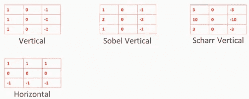](https://www.amazon.com/Hands-Java-Learning-Computer-Vision/dp/1789613965?tag=javamysqlanta-20)

*   Sobel :这个滤镜只是在中间增加了一点点权重或值
*   除了增加中间的重量，这个滤镜还增加了两边的重量

正如我们所见，零点位于垂直、Sobel 和 Scharr 滤波器的中间一列。因此，我们可以说，Sobel 和 Scharr 测量左侧和右侧之间的差异，因此，在某种程度上，他们是垂直滤波器。

您可能已经猜到，这些过滤器也有水平版本:


水平滤镜基本上是垂直滤镜的翻转版本。列变成行。它看起来像一个右翻转的版本，将所有的列转换为行。

# 基本编码

现在，让我们快速看一下进行卷积的 Java 代码，然后用我们已经看到的六种过滤器类型构建 Java 应用程序，当然还有一些不同的图像。

这是主类，`EdgeDetection`:

```
package ramo.klevis.ml;import javax.imageio.ImageIO;import java.awt.*;import java.awt.image.BufferedImage;import java.io.File;import java.io.IOException;import java.util.HashMap;public class EdgeDetection {
```

我们将从定义六个过滤器及其值开始，这是我们在上一节中看到的:

```
public static final String HORIZONTAL_FILTER = “Horizontal Filter”;public static final String VERTICAL_FILTER = “Vertical Filter”;public static final String SOBEL_FILTER_VERTICAL = “Sobel Vertical Filter”;public static final String SOBEL_FILTER_HORIZONTAL = “Sobel Horizontal Filter”;public static final String SCHARR_FILTER_VETICAL = “Scharr Vertical Filter”;public static final String SCHARR_FILTER_HORIZONTAL = “Scharr Horizontal Filter”;private static final double[][] FILTER_VERTICAL = {{1, 0, -1}, {1, 0, -1}, {1, 0, -1}};private static final double[][] FILTER_HORIZONTAL = {{1, 1, 1}, {0, 0, 0}, {-1, -1, -1}};private static final double[][] FILTER_SOBEL_V = {{1, 0, -1}, {2, 0, -2}, {1, 0, -1}};private static final double[][] FILTER_SOBEL_H = {{1, 2, 1}, {0, 0, 0}, {-1, -2, -1}};private static final double[][] FILTER_SCHARR_V = {{3, 0, -3}, {10, 0, -10}, {3, 0, -3}};private static final double[][] FILTER_SCHARR_H = {{3, 10, 3}, {0, 0, 0}, {-3, -10, -3}};
```

让我们定义我们的主方法，`detectEdges()`:

```
private final HashMap<String, double[][]> filterMap;public EdgeDetection() {filterMap = buildFilterMap();}public File detectEdges(BufferedImage bufferedImage, String selectedFilter) throws IOException {double[][][] image = transformImageToArray(bufferedImage);double[][] filter = filterMap.get(selectedFilter);double[][] convolvedPixels = applyConvolution(bufferedImage.getWidth(),bufferedImage.getHeight(), image, filter);return createImageFromConvolutionMatrix(bufferedImage, convolvedPixels);}
```

`detectEdges`暴露于图形用户界面，以便检测边缘，并且它接受两个输入:彩色图像`bufferedImage`和用户选择的过滤器`selectedFilter`。它使用`transformImageToArray()`函数将其转换成三维矩阵。我们将其转换成三维矩阵，因为我们有一个 RGB 颜色的图像。

对于每种颜色——红色、绿色和蓝色——我们构建了一个二维矩阵[:](http://www.java67.com/2014/10/how-to-create-and-initialize-two-dimensional-array-java-example.html)

```
private double[][][] transformImageToArray(BufferedImage bufferedImage) {int width = bufferedImage.getWidth();int height = bufferedImage.getHeight();double[][][] image = new double[3][height][width];for (int i = 0; i < height; i++) {for (int j = 0; j < width; j++) {Color color = new Color(bufferedImage.getRGB(j, i));image[0][i][j] = color.getRed();image[1][i][j] = color.getGreen();image[2][i][j] = color.getBlue();}}return image;}
```

有时候，第三维被称为**灵魂通道**，或者**通道**。在这种情况下，我们有三个通道，但通过卷积，我们会发现数量相当多的通道并不少见。

我们准备应用卷积:

```
private double[][] applyConvolution(int width, int height, double[][][] image, double[][] filter) {Convolution convolution = new Convolution();double[][] redConv = convolution.convolutionType2(image[0], height, width, filter, 3, 3, 1);double[][] greenConv = convolution.convolutionType2(image[1], height, width, filter, 3, 3, 1);double[][] blueConv = convolution.convolutionType2(image[2], height, width, filter, 3, 3, 1);double[][] finalConv = new double[redConv.length][redConv[0].length];for (int i = 0; i < redConv.length; i++) {for (int j = 0; j < redConv[i].length; j++) {finalConv[i][j] = redConv[i][j] + greenConv[i][j] + blueConv[i][j];}}return finalConv;}
```

请注意，我们对每种基本颜色分别应用卷积:

*   使用`convolution.convolutionType2(image[0], height, width, filter, 3, 3, 1);`，我们应用红色的二维矩阵
*   用`convolution.convolutionType2(image[1], height, width, filter, 3, 3, 1);`，我们应用绿色的二维矩阵
*   使用`convolution.convolutionType2(image[2], height, width, filter, 3, 3, 1);`，我们应用蓝色的二维矩阵

然后用`double[][]`，我们得到三种颜色的三个二维矩阵，也就是说它们是卷积的。

最终的卷积矩阵`double[][] finalConv`，将是`redConv[i][j] + greenConv[i][j] + blueConv[i][j];`的加法。我们将在构建应用程序时讨论更多细节，但是现在，我们一起添加这些的原因是因为我们不再对颜色感兴趣，或者至少对原始形式不感兴趣，但是我们**对边缘感兴趣。**

因此，正如我们将看到的，在输出图像中，边缘等高级特征将是黑白的，因为我们将三种颜色卷积加在一起。

现在我们有了`double[][] convolvedPixels`，在`detectEdges()`中定义的二维卷积像素，我们需要在`createImageFromConvolutionMatrix()`中显示它:

```
private File createImageFromConvolutionMatrix(BufferedImage originalImage, double[][] imageRGB) throws IOException {BufferedImage writeBackImage = new BufferedImage(originalImage.getWidth(), originalImage.getHeight(), BufferedImage.TYPE_INT_RGB);for (int i = 0; i < imageRGB.length; i++) {for (int j = 0; j < imageRGB[i].length; j++) {Color color = new Color(fixOutOfRangeRGBValues(imageRGB[i][j]),fixOutOfRangeRGBValues(imageRGB[i][j]),fixOutOfRangeRGBValues(imageRGB[i][j]));writeBackImage.setRGB(j, i, color.getRGB());}}File outputFile = new File(“EdgeDetection/edgesTmp.png”);ImageIO.write(writeBackImage, “png”, outputFile);return outputFile;}
```

首先，我们需要将这些像素转换成图像。我们使用`fixOutOfRangeRGBValues(imageRGB[i][j]), fixOutOfRangeRGBValues(imageRGB[i][j]));`来实现。

我们现在唯一想看到的是方法，`fixOutOfRangeRGBValues`:

```
private int fixOutOfRangeRGBValues(double value) {if (value < 0.0) {value = -value;}if (value > 255) {return 255;} else {return (int) value;}}
```

这需要像素的绝对值，因为，正如我们看到的，有时当差异不是从黑到白，而是从白到黑时，我们会有负值。

对于我们来说，这并不重要，因为我们只想检测边缘，所以我们将绝对值(大于`255`的值)作为最大值，因为 Java 和其他类似的语言，如 [C#](http://www.java67.com/2019/03/5-free-c-net-courses-to-learn-online.html) ，不能处理超过 255 的 RGB 格式。我们简单的把它写成 edge，`.png`文件`EdgeDetection/edgesTmp.png`。

现在，让我们用一些例子来看看这个应用程序。

让我们试试水平过滤器:

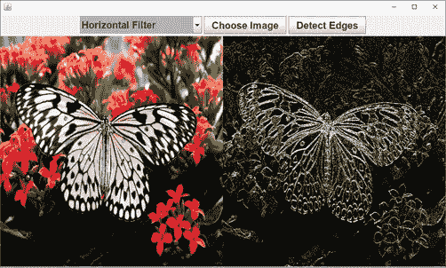

这个边缘相当窄；此图像有足够的像素:

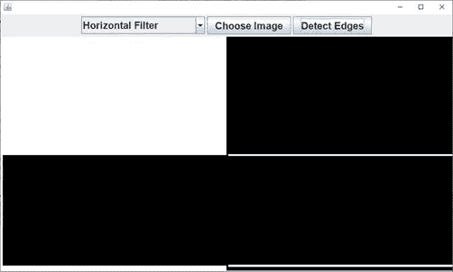

让我们试试**垂直滤镜**，它给我们一些看起来像边缘的东西:

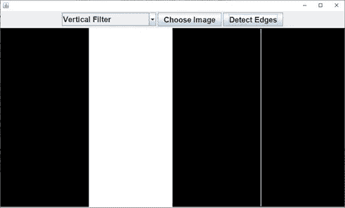

让我们在一个更复杂的图像上尝试一个垂直滤镜。正如您在下面的屏幕截图中看到的，所有垂直线都被检测到:

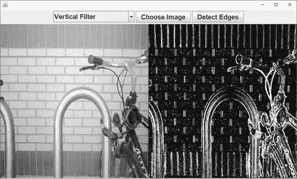

现在，让我们用**水平滤镜**看同样的图像:

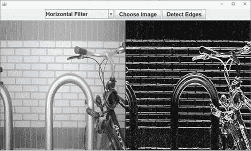

水平滤镜没有检测到任何垂直边缘，但它实际上检测到了水平边缘。

让我们看看`**Sobel Horizontal Filter**`做了什么:

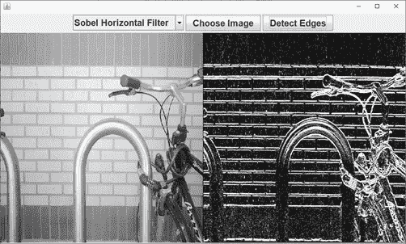

它只是增加了一点光，这是因为增加更多的重量意味着你让这些边缘更宽一点。

现在让我们来看看`**Sobel Vertical Filter**`:

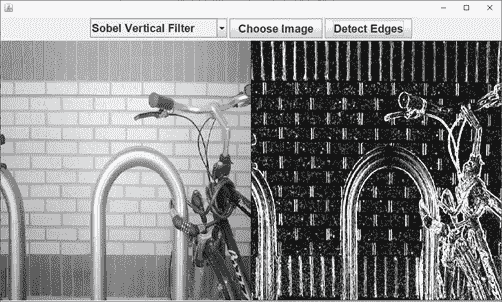

同样，这应该更亮。

这里是`**Scharr Vertical Filter**`:

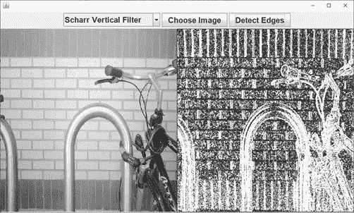

毫不奇怪， **Scharr 垂直滤镜**增加了更多重量，所以我们看到了更多明亮的边缘。边缘更宽，对从一边到另一边的颜色变化更敏感——水平滤镜不会有任何不同。

在我们的蝴蝶彩色图像中，水平滤镜是这样的:

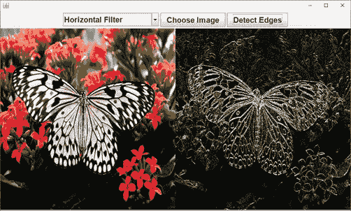

让我们看看`**Sobel Horizontal Filter**`:

稍微亮一点。让我们看看等价的`**Scharr Horizontal Filter**`是做什么的:

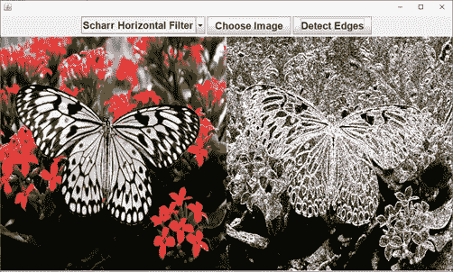

也亮了不少。让我们也试试`**Scharr Vertical Filter**`:


请随意在您自己的图像上尝试它，因为如果您找到一个实际上执行更好的滤镜，这不会很奇怪——有时，滤镜的结果取决于图像。

现在的问题是如何为我们的[神经网络](https://click.linksynergy.com/deeplink?id=JVFxdTr9V80&mid=39197&murl=https%3A%2F%2Fwww.udemy.com%2Fdeeplearning%2F)找到最佳滤波器。是 Sobel 滤波器，还是对变化敏感的 Scharr 滤波器，或者是非常简单的滤波器，例如垂直或水平滤波器？

当然，答案并不简单，正如我们提到的，这部分取决于图像、它们的颜色和低水平。那么我们为什么不让神经网络来选择过滤器呢？神经网络不是最擅长预测事物的吗？神经网络将不得不学习哪个过滤器对于它试图预测的问题是最好的。

基本上，神经网络将学习我们在神经元的隐藏层中看到的经典方法——在密集层中。这个会完全一样，只是运算不是简单的乘法运算；这将是卷积乘法。但这些只是神经网络必须学习的正常权重:

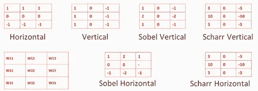

不给出这些值，而是让神经网络找到这些权重。

这是一个基本概念，它使深度神经网络能够检测更专业的特征，如边缘检测，甚至更高级的特征，如眼睛、汽车车轮和人脸。我们将看到，卷积层越深入，检测到的高级特征就越多。

希望你觉得这篇文章很有见地，也很有趣。如果你想用 Java 实现更多这样的计算机视觉项目，你必须检查一下 [***计算机视觉的动手 Java 深度学习***](https://www.amazon.com/Hands-Java-Learning-Computer-Vision/dp/1789613965?tag=javamysqlanta-20) *。克莱维斯·拉莫写的*

[](https://www.amazon.com/Hands-Java-Learning-Computer-Vision/dp/1789613965?tag=javamysqlanta-20)

[*面向计算机视觉的动手 Java 深度学习*](https://www.amazon.com/Hands-Java-Learning-Computer-Vision/dp/1789613965?tag=javamysqlanta-20) *将带您了解用 Java 高效训练深度神经网络以完成计算机视觉相关任务的过程。*

其他有用的**数据科学与机器学习**资源
[机器学习 by 吴恩达](https://click.linksynergy.com/deeplink?id=JVFxdTr9V80&mid=40328&murl=https%3A%2F%2Fwww.coursera.org%2Flearn%2Fmachine-learning)
[AI 为大家](https://click.linksynergy.com/deeplink?id=JVFxdTr9V80&mid=40328&murl=https%3A%2F%2Fwww.coursera.org%2Flearn%2Fai-for-everyone) by [吴恩达](https://medium.com/u/592ce2a67248?source=post_page-----6147b68e5d79--------------------------------)
[Top 8 Python 机器学习库](https://javarevisited.blogspot.com/2018/10/top-8-python-libraries-for-data-science-machine-learning.html)
[5 门免费课程学习机器学习用 R 编程](http://www.java67.com/2018/09/top-5-free-R-programming-courses-for-Data-Science-Machine-Learning-Programmers.html)
[2018 年 5 门免费课程学习 Python](http://www.java67.com/2018/02/5-free-python-online-courses-for-beginners.html)
[Top 5 数据科学与机器学习课程](https://hackernoon.com/top-5-data-science-and-machine-learning-course-for-programmers-e724cfb9940a)
[课程](https://hackernoon.com/top-5-tensorflow-and-ml-courses-for-programmers-8b30111cad2c)
[2018 年程序员可以学习的 10 项技术](http://www.java67.com/2018/01/top-10-web-mobile-and-big-data-framework-libraries-technologies-programmers-should-learn-in-2018.html)
[更好地学习 Python 的前 5 门课程](http://javarevisited.blogspot.sg/2018/03/top-5-courses-to-learn-python-in-2018.html)
[一个日本黄瓜农如何利用深度学习和 TensorFlow](https://cloud.google.com/blog/products/gcp/how-a-japanese-cucumber-farmer-is-using-deep-learning-and-tensorflow)

**P. S.** — —如果你需要一些免费资源来入手，可以查看一下这个免费课程 [***学习机器学习算法、软件、深度学习***](http://bit.ly/2DNKMdZ) 来开始你的准备。