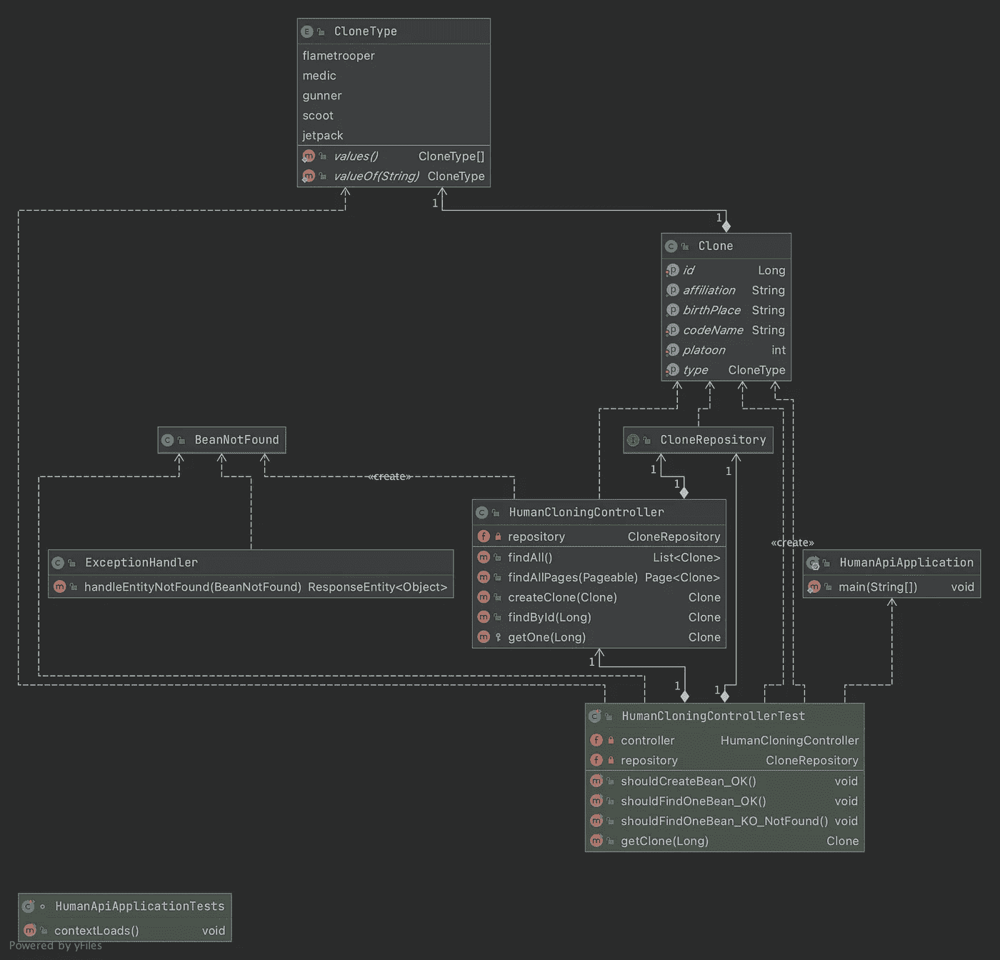

# 用 SpringBoot 构建简单的 rest API

> 原文：<https://medium.com/javarevisited/building-a-simple-rest-api-with-springboot-3f2e4b123ebb?source=collection_archive---------2----------------------->

## 卡米诺之旅——建筑休息 API 教程


如果你读过我以前的文章，你可能知道我喜欢用一个象征人类的对象作为例子，所以我将在本教程中继续讲述用 [Spring Boot](/hackernoon/top-5-spring-boot-and-spring-cloud-books-for-java-developers-75df155dcedc) 构建 REST API，但为了让它不那么学者化，更有趣，我将使用星球大战参考(因为我是这个电影系列的极客和粉丝)。
欢迎来到卡米诺。

# 你需要什么

首先，您必须选择初始化您的项目:
-[Spring initializr](https://start.spring.io/)
-从您的 IDE
因为我们将使用 [Spring Boot](/javarevisited/10-advanced-spring-boot-courses-for-experienced-java-developers-5e57606816bd?source=collection_home---4------0-----------------------) ，您需要将以下依赖项添加到您的项目中，以便它能够工作。

*   **Spring Web** :使用 Apache Tomcat 作为默认的嵌入式容器。
*   **Spring Data JPA** :使用 [Spring Data](https://www.java67.com/2021/01/spring-data-jpa-interview-questions-answers-java.html) 和 [Hibernate](/javarevisited/top-5-hibernate-online-training-courses-for-beginners-and-advance-java-programmers-469460596b2b) 的 Java 持久性 API。
*   **H2 数据库**:嵌入内存数据库。

# 它会是什么样子

[](https://www.java67.com/2018/06/5-best-courses-to-learn-spring-boot-in.html)

UML 表示

# 三，二，一…开始

## 实体

首先，我们需要声明我们将在本例的其余部分使用的对象，克隆人士兵的定义: *Clone。*

为了在[数据库](/hackernoon/top-5-sql-and-database-courses-to-learn-online-48424533ac61)中保存我们的对象，它需要一个 Id，这个 Id 将在我们保存它时自动生成。

## 仓库

为了操作数据库中的对象，我们需要一个存储库

我们的 *CloneRepository* 扩展*jpare repository*谁扩展*PagingAndSortingRepository*允许使用分页请求，谁扩展 *CrudRepository* (CRUD 是创建、读取、更新、删除的缩写)。

对于 ou 存储库，我们可以使用类似于 *save* 、 *findById* 、 *findAll* 的方法(有或没有分页)。

## 控制器

现在我们有了对象，以及保存和检索它的存储库，我们需要操作的入口点:创建、查找、删除…

正如您所看到的，即使 ou repository 类中没有任何代码，我们也可以自由地使用里面的方法。

让我们看看这里有什么:

*   [**@RestController** :](https://javarevisited.blogspot.com/2017/08/difference-between-restcontroller-and-controller-annotations-spring-mvc-rest.html#ixzz6OYNB9oii) 表示我们的数据将在响应的主体中返回，而不是在模板中
*   我们有**@ get mapping****@ post mapping**和 **@DeleteMapping** ，它们表示链接到我们方法的 Http 方法。
*   我们的方法有一个 **BeanNotFound** throw(我们将在后面看到如何使用它)。

## 处理异常

处理异常的正确方法是什么，是每个方法中的 try/catch 块，还是以特定的方式拦截它们，然后以统一的方式使用它们？

第二种方法更干净，因为我们可以将所有的异常放在同一个地方，并以同样的方式对待它们。

如您所见，我们的 **BeanNotFound** 被**异常处理程序**拦截，然后我们返回我们的异常消息作为 [404 错误](https://en.wikipedia.org/wiki/HTTP_404)。

# 测试我们的 API

为了测试我们的 API，我们需要首先启动我们的应用程序。
然后我们可以尝试使用 [postman](/javarevisited/7-best-courses-to-learn-postman-tool-for-web-service-and-api-testing-f225c138fa5a?source=---------13------------------) 或任何其他允许您进行 HTTP 调用的工具来连接到我们在控制器中创建的入口点。

## 创建克隆

正如控制器中所描述的，我们需要使用 HTTP POST 方法在它的主体中传递我们的克隆体的信息。

```
HTTP POST [http://localhost:8080/kamino/](http://localhost:8080/kamino/){
  "codeName": "CT-7567 REX",
  "type": "gunner",
  "platoon": 501
}
```

会给我们这个回复

```
{
  "id": 1,
  "birthPlace": "Kamino",
  "codeName": "CT-7567 REX",
  "type": "gunner",
  "platoon": 501,
  "affiliation": "Galactic Republic"
}
```

Id 是自动生成的，所以如果我们创建另一个克隆，值将会是 2，然后是 3，并且会一直递增。

## 查找所有创建的克隆体

为了找到创建的克隆，我们将调用 GET "/"端点，它将返回我们所有创建的克隆的列表

```
HTTP GET http://localhost:8080/kamino/
```

威尔给了我们这样的回答:

```
[
  {
    "id": 1,
    "birthPlace": "Kamino",
    "codeName": "CT-7567 REX",
    "type": "gunner",
    "platoon": 501,
    "affiliation": "Galactic Republic"
  },
  {
    "id": 2,
    "birthPlace": "Kamino",
    "codeName": "CC-3636 WOLFFE",
    "type": "gunner",
    "platoon": 501,
    "affiliation": "Galactic Republic"
  }
]
```

## 删除克隆

要删除数据库中的克隆，我们将调用删除端点

```
HTTP DELETE http://localhost:8080/kamino/1
```

将 1 作为参数传递，我们将删除 id 为 1 的克隆。因此，如果我们再次调用 find 方法，我们将只剩下一个克隆。

```
{
  "id": 2,
  "birthPlace": "Kamino",
  "codeName": "CC-3636 WOLFFE",
  "type": "gunner",
  "platoon": 501,
  "affiliation": "Galactic Republic"
}
```

感谢您的时间，您可以在 Github 资源库中找到与那篇文章[相关的所有源代码。](https://github.com/ErwanLT/HumanCloningFacilities)