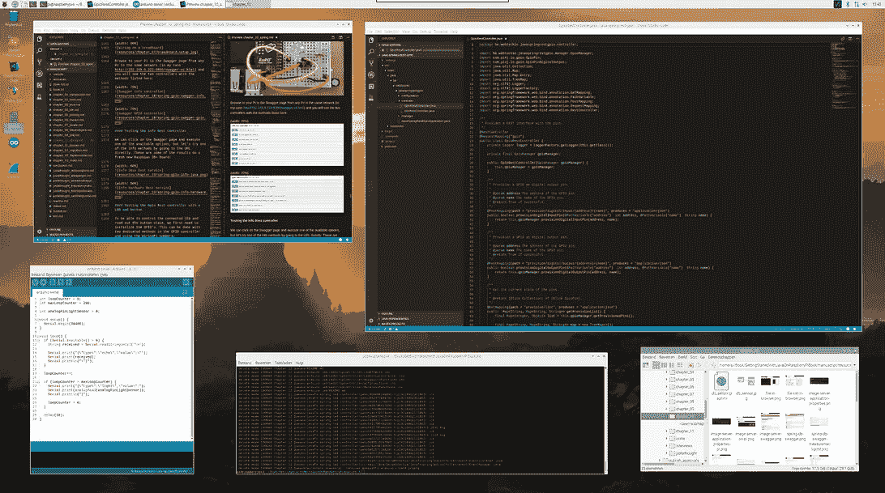
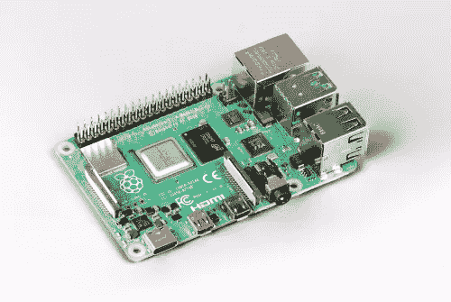

# 使用 Visual Studio 代码在 Raspberry Pi 上用 Java、Maven 和 Pi4J 构建一个电子项目

> 原文：<https://medium.com/javarevisited/building-an-electronics-project-with-java-maven-and-pi4j-on-raspberry-pi-with-visual-studio-code-13730b09ed97?source=collection_archive---------1----------------------->

5 月 29 日星期四，Raspberry Pi [发布了一款 75 美元的新主板，8GB 内存](https://www.raspberrypi.org/blog/8gb-raspberry-pi-4-on-sale-now-at-75/)，一款非常小但功能强大的电脑。这种新的主板紧挨着 2GB (35 美元)和 4GB (55 美元)的主板，这两种主板具有相同的处理器和端口。

4K 显示器连接到 Raspberry Pi 4

一段时间前，我买了 4GB 的版本，并结合了 4K 显示器，真的被这个板的力量惊呆了。在截图上，你可以看到它运行在两个 Visual Studio 代码窗口，Arduino IDE 和其他一些…

# MagPi 杂志

根据我在 Raspberry Pi 上开始 Java 开发的经验，我为 MagPi 杂志写了两篇文章，该杂志由 Raspberry Pi 基金会出版，可以从他们的网站上免费下载或购买纸质版本:

*   [第 93 期:学习 Java 和电子学](https://magpi.raspberrypi.org/issues/93)
*   [第 94 期:Java 电子学:构建一个 Maven 应用](https://magpi.raspberrypi.org/issues/94)(第 54 页)

这两篇文章描述了在 Visual Studio 代码中使用 [Maven](/javarevisited/top-10-free-courses-to-learn-maven-jenkins-and-docker-for-java-developers-51fa7a1e66f6?source=collection_home---4------3-----------------------) 在 Raspberry Pi 上启动 [Java 开发](/javarevisited/10-free-courses-to-learn-java-in-2019-22d1f33a3915?source=collection_home---4------8-----------------------)所需的每个步骤。Pi4J 框架还用于控制 LED 并读取连接到 Raspberry Pi 板 GPIO 的按钮的状态。

为了让一切更清楚，这个视频展示了文章中描述的每个步骤:

# 64 位 Raspbian 操作系统

Raspbian 操作系统是 Raspberry Pi 的默认操作系统，但现在只有 32 位版本，这意味着每个进程“只能”使用 3GB。在 8GB 主板发布的同一天，一篇描述 64 位 Raspbian 操作系统测试版的[帖子在论坛上发布](https://www.raspberrypi.org/forums/viewtopic.php?f=117&t=275370)。这将允许安装使用更多内存的 64 位软件(例如最新版本的 Visual Studio 代码)。

# 从 USB 存储启动

树莓派的一个弱点是带有操作系统的 SD 卡。例如，如果你切断电源，它可能会损坏。但是也有一个 [beta 测试解决方案，允许我们使用 USB 存储设备](https://www.raspberrypi.org/forums/viewtopic.php?t=274595)。

# 结论

当 8GB 内存+ 64 位操作系统+ USB 大容量存储启动通过测试阶段，树莓 Pi 将成为一个更强大的日常使用的 PC，价格非常低！我真的很期待升级我的家庭办公室……:-)