# 使用 Gluon Mobile 和 GitHub 操作，从一个 JavaFX 项目中为所有 PC 和移动平台构建本地应用程序

> 原文：<https://medium.com/javarevisited/building-native-applications-for-all-pc-and-mobile-platforms-from-a-single-javafx-project-with-cf1c591fa10a?source=collection_archive---------3----------------------->

帖子[“用 Gluon 工具启动 JavaFX 项目”](https://webtechie.be/post/2020-11-17-starting-javafx-project-with-gluon-tools/)向你展示了如何借助[“Gluon 插件”](https://plugins.jetbrains.com/plugin/7864-gluon)在 IntelliJ IDEA 中点击几下就启动一个 Gluon 移动多视图项目。

在本帖中，我们将使用这样一个项目，并使用 GitHub Actions 从一个代码库将它构建为 Windows、macOS、iOS、 [*Linux*](/javarevisited/top-10-courses-to-learn-linux-command-line-in-2020-best-and-free-f3ee4a78d0c0?source=collection_home---4------0-----------------------) 和 [Android](/javarevisited/top-5-courses-to-learn-android-for-java-programmers-667e03d995b4) 的原生应用程序！

> 对，没错！
> 真“写一次，到处跑”！！！

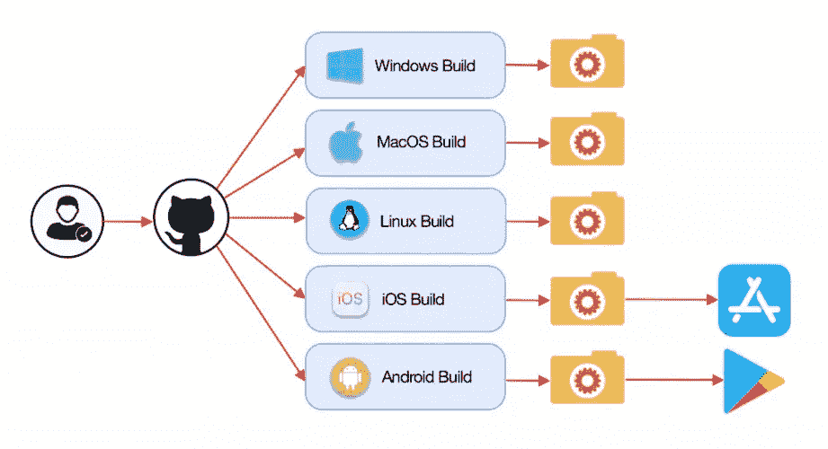

# 应用程序

这个应用程序是基于我去年为我的书[“Raspberry Pi 上的 Java 入门”](https://webtechie.be/books/)创建的 Java 库而构建的，它可以帮助你从色环计算电阻的值。该库在[“作为 Java Maven 库的电阻颜色代码和计算”](https://webtechie.be/post/2019-11-25-resistor-color-codes-and-calculations-a-java-maven-library/)中有进一步描述。

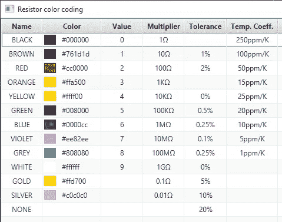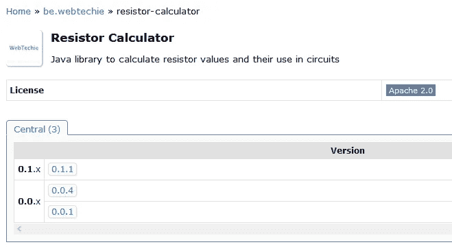

# 基于“胶子移动多视角”

基于一个“Gluon Mobile Multiview”项目，创建一个具有两个计算视图和一个“关于”视图的工作应用程序只需要几个小时。非常感谢 Gluon 的 José Pereda，他非常友好地通过一些巧妙的调整和 CSS 改进，将我丑陋的概念证明改进为一个更好看的布局。

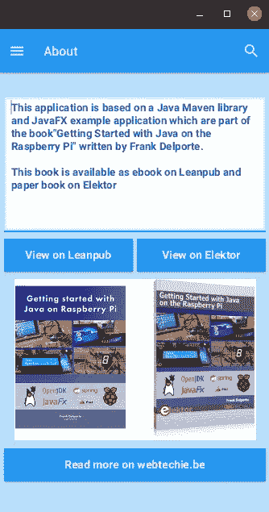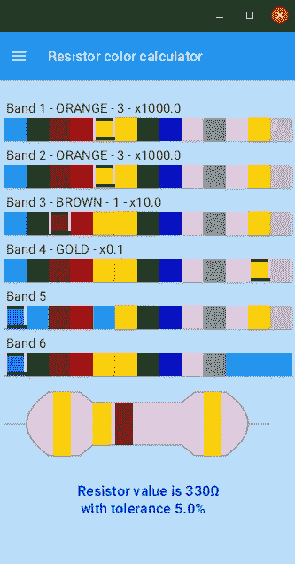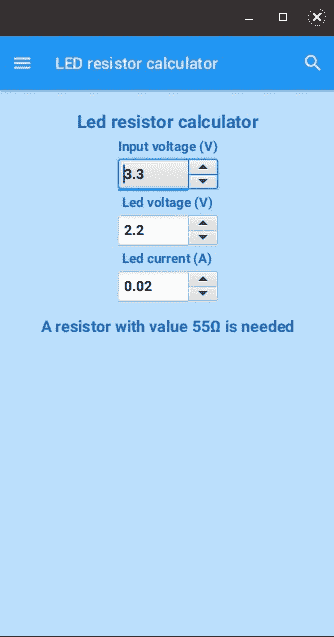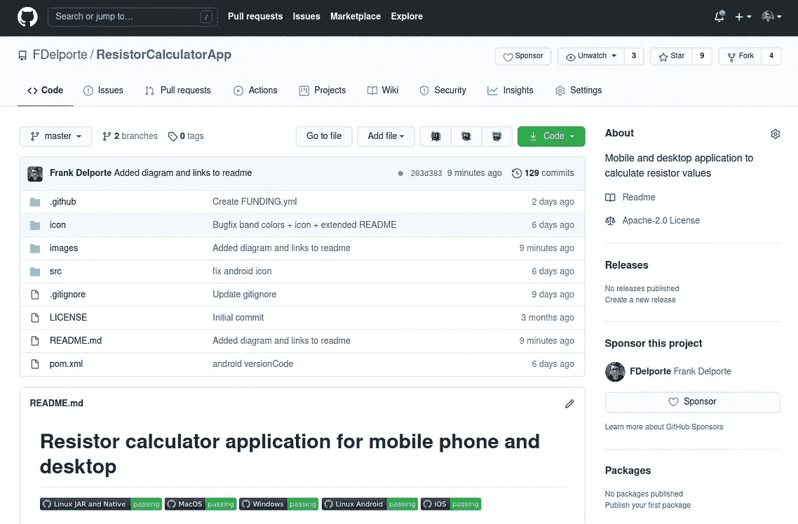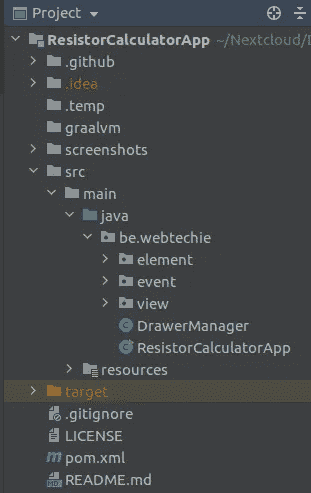

# 还没完成…

由于第一个版本的创建是为了从 [JavaFX](/javarevisited/6-free-courses-to-learn-servlet-jsp-and-java-fx-in-2020-best-of-lot-720201c84f63) 应用程序到本地应用程序和应用程序商店出版物的概念验证流程，因此代码还没有微调…

还有一些事情要做:

*   在“关于”屏幕上打开网址的按钮，使用仅支持 iOS 和 Android 的`com.gluonhq.attach.browser.BrowserService`。所以要么需要扩展 Gluon-library，要么这个应用程序需要检查环境并运行适当的命令。
*   颜色计算器屏幕的布局不适合横向布局，因此需要重新设计。
*   电阻图应根据可用空间进行缩放。
*   在所有设备上实现像素完美布局的一般工作。

GitHub 项目欢迎任何帮助和请求；-)

# GitHub 操作

[GitHub Actions](https://github.com/features/actions) 通过 GitHub 的持续集成和持续部署，您可以自动化您的软件工作流程。

通过添加。yml-文件到目录”。github/workflows”在您的项目中，这些将按照配置运行。在[“GitHub 操作简介”](https://docs.github.com/en/free-pro-team@latest/actions/learn-github-actions/introduction-to-github-actions)中提供了一个简单的例子，它检查推送的代码，安装软件依赖项，并运行`bats -v`:

```
name: learn-github-actions
on: [push]
jobs: 
   check-bats-version:
   runs-on: ubuntu-latest
   steps:
      - uses: actions/checkout@v2
      - uses: actions/setup-node@v1
      - run: npm install -g bats
      - run: bats -v
```

# 胶子

Gluon 提供了一种简单而现代的方法来开发 Java 客户端应用程序。这些应用程序可以在 JVM 上运行，也可以转换成特定于平台的本机映像，这种映像启动速度极快，只占用很少的空间。此外，除了所有桌面环境之外，应用程序还可以面向 Android、iOS 和嵌入式。

# Gluon 客户端插件

Gluon 客户端插件通过将 Java 客户端应用程序及其所有必需的依赖项编译成本地代码，利用 GraalVM、OpenJDK 和 [JavaFX](https://javarevisited.blogspot.com/2020/06/top-5-courses-to-learn-java-fx-in-2020.html#axzz6ehrUZiIN) ，以便它可以作为目标平台上的本地应用程序直接执行。

优势之一是启动时间更快，因为不再需要启动 JVM。生成的应用程序将完全集成到本机操作系统中。

更多信息可在 Gluon 网站的[文档页面获得。](https://docs.gluonhq.com/)

# Gluon GitHub 构建许可操作

GitHub Actions 系统允许“插入”第三方提供的构建步骤。这些都是 GitHub 项目，它们允许你简化你的。yml-文件。

gluon 创建了这样一个构建动作，您可以将它集成到您的 JavaFX 本地应用程序的构建过程中:[“Gluon-build-license”](https://github.com/gluonhq/gluon-build-license)以便在构建过程中正确使用您的 Gluon 许可证密钥。您需要将此许可证添加到您的 GitHub 项目库机密中。

这个许可步骤是可选的！如果你没有，应用程序启动时会显示一个弹出窗口。如果你正在做一个学生或开源项目，你可以申请一个免费的许可给 glon，如[“免费 glon 许可”](https://gluonhq.com/programs/free-gluon-licenses/)所述。

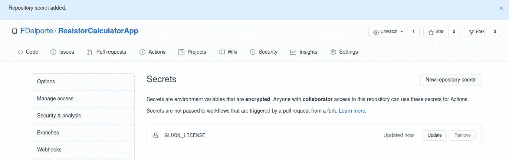

# 使用 GraalVM 构建为本机应用程序

胶子衬底消除了使用 GraalVM 原生映像的大部分复杂性。你可以用 Java 创建一个应用程序，在你的桌面上测试它，然后通过在 [Maven](/javarevisited/6-best-maven-courses-for-beginners-in-2020-23ea3cba89) 中定义一个配置文件来编译 Java 字节码并将其链接到特定平台的本机映像。生成的二进制文件可以部署到 AppStore 或 Google Play。

# GitHub 操作的构建过程

在这篇文章中，所有不同的构建过程都被分成不同的部分。yml-files，但是 GitHub Actions 允许您将不同的“作业”合并到一个这样的文件中。

# 总体描述

的。yml-structure 对于所有构建类型都非常相似，其结构如下:

*   为构建文件命名
*   定义您希望构建从哪个分支提交和/或提取请求开始
*   定义要运行的操作系统
*   下载 GraalVM
*   对于桌面:创建一个将复制构建结果的临时目录
*   用 [Maven](/javarevisited/top-10-free-courses-to-learn-maven-jenkins-and-docker-for-java-developers-51fa7a1e66f6?source=collection_home---4------3-----------------------) 、GraalVM 和 Gluon 客户端插件构建应用程序
*   桌面:将应用程序复制到桌面的登台目录，并将登台上载到构建过程的结果包中
*   应用程序:上传到 Apple TestFlight 或 Google Play

根据操作系统的不同，需要进行一些额外的设置步骤，如下所述。

# 桌面应用程序

## Linux JAR +本地应用程序

动作文件: [maven-ubuntu-linux.yml](https://github.com/FDelporte/ResistorCalculatorApp/blob/master/.github/workflows/maven-ubuntu-linux.yml)

对于 Linux，需要一个额外库的列表，这是在下载 GraalVM 之后通过一个额外的步骤完成的。

```
- name: Install libraries
  run: sudo apt install libasound2-dev libavcodec-dev libavformat-dev libavutil-dev libgl-dev libgtk-3-dev libpango1.0-dev libxtst-dev
```

这个构建过程会生成一个 JAR 和一个 Linux 本地应用程序。对于第一个，我们运行一个 Maven 包:

```
- name: Build JAR with Maven
  run: mvn -B package
```

因为构建过程是在 Linux 机器上运行的，所以我们可以将目标定义为 desktop 来构建一个带有 Gluon Maven 客户端插件的原生 Linux 应用程序，并且需要提供 GraalVM 位置:

```
- name: Gluon Build
  run: mvn -Pdesktop client:build client:package
  env:
     GRAALVM_HOME: ${{ env.JAVA_HOME }}
```

## Windows 本机应用程序

动作文件: [maven-windows.yml](https://github.com/FDelporte/ResistorCalculatorApp/blob/master/.github/workflows/maven-windows.yml)

要构建应用程序的 Windows 版本，需要 Visual Studio，这可以通过两个额外的步骤来完成:

*   [Microsoft/setup-msbuild](https://github.com/microsoft/setup-msbuild):GitHub 动作，方便在构建的工作流路径中配置 MSBuild。NET 框架应用程序。
*   [egor-tensin/vs-shell](https://github.com/egor-tensin/vs-shell) :设置 Visual Studio shell 环境的 GitHub 动作。

```
- name: Add msbuild to PATH
  uses: microsoft/setup-msbuild@v1.0.2
- name: Visual Studio shell
  uses: egor-tensin/vs-shell@v1
```

脚本的其余部分类似于 Linux，最后，我们只将 exe 文件复制到包中。

## MacOS 本机应用程序

动作文件: [maven-macos.yml](https://github.com/FDelporte/ResistorCalculatorApp/blob/master/.github/workflows/maven-macos.yml)

构建 Apple 应用程序需要 Xcode。同样，我们可以通过使用现有操作将它添加到我们的步骤中:

*   [maxim-loba nov/setup-xcode](https://github.com/maxim-lobanov/setup-xcode):GitHub 动作，用特定版本的 Xcode 设置你的工作流程。

```
- uses: maxim-lobanov/setup-xcode@v1
  with:
    xcode-version: '11.7.0'
```

并将结果文件“target/client/x86 _ 64-Darwin/Resistor Calculator”复制到包中。

# 智能手机应用

当我开始从事这篇文章和这个项目时，我只是想在所有平台上实现成功的本地构建。但是后来胶子介入并进一步推动了这件事，你猜怎么着？由于 Erwin Morrhey 的努力，这款应用程序现在已经同时出现在了 Google Play[和苹果应用商店](https://play.google.com/store/apps/details?id=be.webtechie.resistorcalculatorapp)[上。](https://apps.apple.com/us/app/gluon-resistor-calculator/id1540638756)

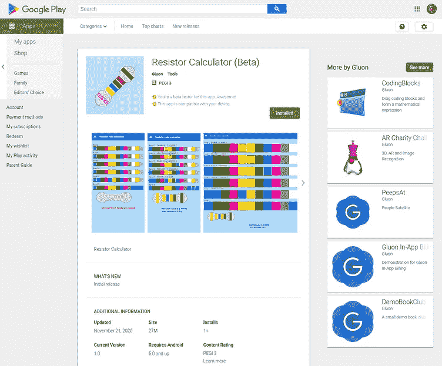

GitHub 动作中包含了构建和上传到这两个商店所需的所有步骤！！！

您将需要一个开发人员帐户，用于存储和所需的密钥。由于我还没有它们，Gluon 已经做了一个分支，这些步骤只有在提供了所需的密钥的情况下才能完全运行，正如你在 GluonHQ GitHub 库中的[分支上看到的那样。](https://github.com/gluonhq/ResistorCalculatorApp)

## iOS 应用程序(MacOS 版本)

动作文件: [maven-ios.yml](https://github.com/FDelporte/ResistorCalculatorApp/blob/master/.github/workflows/maven-ios.yml)

需要额外的设置，你可以通过在 GitHub 项目的 secrets-section 中定义它们来隐藏它们，就像我们已经对 Gluon 许可证密钥所做的那样。

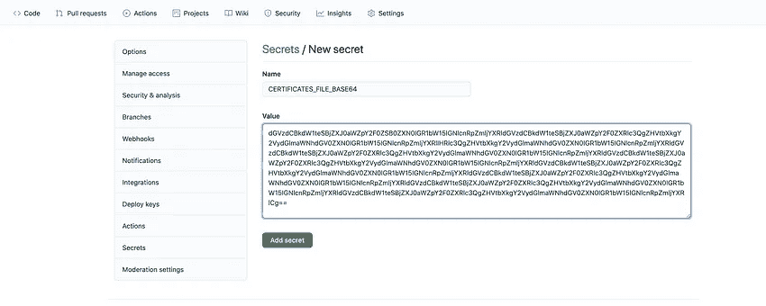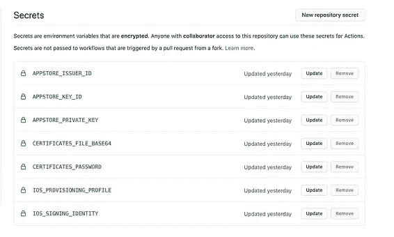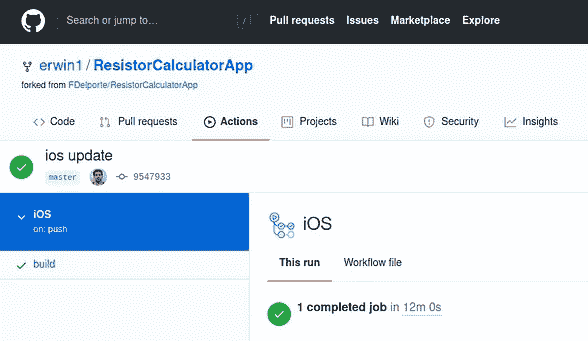

同样，我们可以使用现有的 GitHub 操作来扩展我们之前的“MacOS native”构建文件:

*   [Apple-Actions/import-Code sign-cert](https://github.com/Apple-Actions/import-codesign-certs):用于将代码签名证书导入到钥匙串中的 GitHub 操作。
*   [Apple-Actions/download-provisioning-profiles](https://github.com/Apple-Actions/download-provisioning-profiles):从 Apple AppStore Connect 下载预置描述文件的 Github 动作。
*   [Apple-Actions/upload-test flight-build](https://github.com/Apple-Actions/upload-testflight-build):将构建上传到 Apple TestFlight 的 GitHub 动作。

通过使用这些密钥，所有需要的步骤都可以在一个 GitHub 动作中运行。例如，将应用程序上传到 TestFlight 的最后一步:

```
- uses: Apple-Actions/upload-testflight-build@master
  if: ${{ github.repository_owner == 'gluonhq' }}
  with:
    app-path: target/client/arm64-ios/Resistor Calculator.ipa 
    issuer-id: ${{ secrets.APPSTORE_ISSUER_ID }}
    api-key-id: ${{ secrets.APPSTORE_KEY_ID }}
    api-private-key: ${{ secrets.APPSTORE_PRIVATE_KEY }}
```

## Android 应用程序(Linux 版本)

动作文件: [maven-ubuntu-android.yml](https://github.com/FDelporte/ResistorCalculatorApp/blob/master/.github/workflows/maven-ubuntu-android.yml)

该文件中使用的操作(基于之前的“Linux 本地”文件):

*   [timheuer/base64-to-file](https://github.com/timheuer/base64-to-file) :一个 GitHub 动作，它接受一个 base64 字符串并解码成一个文件，以便在后面的动作中用作参数。
*   [r0adkll/upload-Google-play](https://github.com/r0adkll/upload-google-play):上传一个 Android 的 GitHub 动作。apk 或者。aab 文件到 Google Play 控制台。

Google Play 的其他步骤包括初始化 Android 密钥库:

```
- name: Setup Android Keystore
  if: ${{ github.repository_owner == 'gluonhq' }}
  id: android_keystore_file
  uses: timheuer/base64-to-file@v1
  with:
    fileName: 'my.keystore'
    encodedString: ${{ secrets.GLUON_ANDROID_KEYSTORE_BASE64 }}
```

最后，上传通过以下方式完成:

```
- name: Upoad to Google Play
  if: ${{ github.repository_owner == 'gluonhq' }}
  uses: r0adkll/upload-google-play@v1
  with:
   serviceAccountJsonPlainText: ${{ secrets.ANDROID_SERVICE_ACCOUNT_JSON }}
   packageName: be.webtechie.resistorcalculatorapp
   releaseFiles: target/client/aarch64-android/gvm/Resistor Calculator.apk
   track: beta
```

# 结论

JavaFX 与 Gluon 工具和 GitHub 动作相结合的力量是惊人的。构建和分发真正的跨平台应用程序从未如此简单！要在不同的平台上运行，真的不需要任何代码更改。正如您从已处理的构建中看到的，完全相同的代码用于创建 Windows、Linux、MacOS、 [iOS](/javarevisited/my-favorite-free-courses-to-learn-ios-app-development-f172e7d3ba5d) 和 [Android](/javarevisited/5-free-courses-to-become-an-android-developer-d4d207f53675) 的原生应用程序！

胶子也在使用这个工作流程制作一个样品，这个样品可以在[github.com/gluonhq/hello-gluon-ci](https://github.com/gluonhq/hello-gluon-ci)上获得。

*原载于*[*https://webtechie . be*](https://webtechie.be/post/2020-11-24-javafx-gluon-mobile-github-actions/)*。*