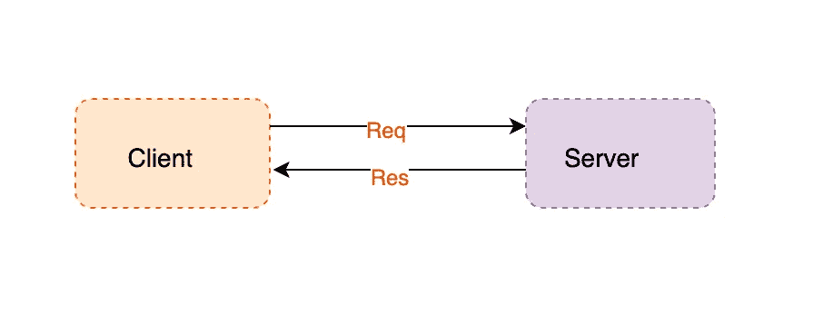

# 用普通 Java 构建简单的 REST API 客户端

> 原文：<https://medium.com/javarevisited/building-simple-rest-api-client-in-plain-java-3ec300092c06?source=collection_archive---------1----------------------->

## 使用 Java HttpClient 和 HttpUrlConnection 构建 Rest 客户端

> 最初发表于<https://asyncq.com/building-simple-http-client-in-java>

****

## **介绍**

*   **连接到 API 是构建复杂系统的非常自然的步骤。直到 Java 11，Java 才提供了连接 API 的良好工具。在 Java 11 之前，Java 有…**