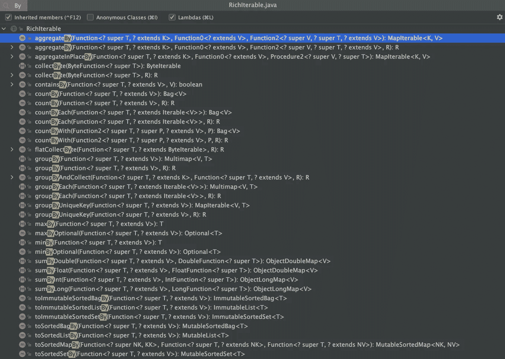

# 一个人呆一会儿

> 原文：<https://medium.com/javarevisited/by-yourself-some-time-e16c0f488847?source=collection_archive---------6----------------------->

介词`By`，及其对生产力的积极贡献。


阿鲁巴岛的棕榈岛——一个我想多呆些时间的地方

## 通过利用揭示意图的 Java APIs 实现智能工作

我们都有有限的时间。任何能节省我们编码时间、提高代码可读性的东西都是非常棒的。可读性是关键，因为我们读代码比写代码多得多。许多人可能不得不在整个生命周期中阅读一段代码，因此为他们节省时间是一个真正的好处。

## 使用 Eclipse 集合可以节省时间吗？

通过应用一些`Function`，可以将`**aggregate**`、`**group**`、`**sum**`、`**count**`、`**min**`、`**max**`和**的**、**转换为**其他排序集合*。下面的`By`方法在 [Eclipse 集合](https://github.com/eclipse/eclipse-collections)中的每个`[RichIterable](https://www.eclipse.org/collections/javadoc/9.0.0/org/eclipse/collections/api/RichIterable.html)`子类型上都可用。*



通过 RichIterable 中的方法(忽略 collectByte 方法)

我将展示来自 [Eclipse 集合 Pet Kata](https://github.com/eclipse/eclipse-collections-kata) 的三个例子，说明这些方法如何节省您阅读和编写代码的时间。

## CountBy

如果你想通过属性或对那些东西应用一个`Function`的结果来计数一个东西的集合，使用`[countBy](https://www.eclipse.org/collections/javadoc/9.0.0/org/eclipse/collections/api/RichIterable.html#countBy-org.eclipse.collections.api.block.function.Function-)`。该方法将类型`[Function](https://www.eclipse.org/collections/javadoc/9.0.0/org/eclipse/collections/api/block/function/Function.html)`作为参数，并返回一个`[Bag](https://www.eclipse.org/collections/javadoc/9.0.0/org/eclipse/collections/api/bag/Bag.html)`。这个方法是在 [Eclipse 集合 9.0](/@donraab/nine-features-in-eclipse-collections-9-0-a2ca97dfdf74) 中添加的。

下面的代码是一个强制性的 Java 解决方案，通过使用一个`Map`，获取一个`PetType`的`List`，并对每个`PetType`进行计数。

```
List<PetType> petTypes =
    this.people.flatCollect(Person::getPets).collect(Pet::getType);

Map<PetType, Integer> counts = Maps.mutable.empty();
for (PetType petType : petTypes)
{
    Integer count = petTypeCounts.get(petType);
    if (count == null)
    {
        count = 0;
    }
    petTypeCounts.put(petType, count + 1);
}

Assert.assertEquals(Integer.valueOf(2), counts.get(PetType.CAT));
Assert.assertEquals(Integer.valueOf(2), counts.get(PetType.DOG));

// The following test would fail as the Map would return null
Assert.assertEquals(Integer.valueOf(0), counts.get(PetType.CONDOR));
```

使用 Java 8 流和`groupingBy`和`counting`收集器可以简化这些代码。

```
Map<PetType, Long> counts =
    this.people.stream()
        .flatMap(person -> person.getPets().stream())
        .collect(Collectors.groupingBy(Pet::getType,
                                       Collectors.counting()));

Assert.assertEquals(Long.valueOf(2), counts.get(PetType.CAT));
Assert.assertEquals(Long.valueOf(2), counts.get(PetType.DOG));

// The following test would fail as the Map would still return null
Assert.assertEquals(Long.valueOf(0), counts.get(PetType.CONDOR));
```

下面的解决方案将使用 Eclipse 集合`Bag`类型，而不是`Map`。一个`[Bag](https://www.eclipse.org/collections/javadoc/9.0.0/org/eclipse/collections/api/bag/Bag.html)`是计数键的一个`Map`。Eclipse 集合中的`HashBag`实现使用一个`[ObjectIntHashMap](https://www.eclipse.org/collections/javadoc/9.0.0/org/eclipse/collections/impl/map/mutable/primitive/ObjectIntHashMap.html)`进行存储，因此不需要将计数装箱为`Integer`或`Long`。

```
Bag<PetType> counts =
    this.people.asLazy()
        .flatCollect(Person::getPets)
        .collect(Pet::getType)
        .toBag();

Assert.assertEquals(2, counts.occurrencesOf(PetType.CAT));
Assert.assertEquals(2, counts.occurrencesOf(PetType.DOG));
Assert.assertEquals(0, counts.occurrencesOf(PetType.CONDOR));
```

这段代码需要更少的时间来阅读，因为有更少的字符，但是如果你已经知道什么是`Bag`的话，方法`toBag`只会向你传达它的意图。

这里使用`countBy`对这个解决方案做了一个小小的修改。

```
Bag<PetType> counts =
    this.people.asLazy()
        .flatCollect(Person::getPets)
        .countBy(Pet::getType);

Assert.assertEquals(2, counts.occurrencesOf(PetType.CAT));
Assert.assertEquals(2, counts.occurrencesOf(PetType.DOG));
Assert.assertEquals(0, counts.occurrencesOf(PetType.CONDOR));
```

减少代码，更好地传达意图。我们正在按它们的`PetType`数所有的宠物。结果仍然是一个`Bag`，因为这是返回的最佳数据结构。

## 分组依据

如果您想使用一个函数为每个元素计算一个键来对集合的元素进行分组，请使用`[groupBy](https://www.eclipse.org/collections/javadoc/9.0.0/org/eclipse/collections/api/RichIterable.html#groupBy-org.eclipse.collections.api.block.function.Function-)`。该方法将类型`[Function](https://www.eclipse.org/collections/javadoc/9.0.0/org/eclipse/collections/api/block/function/Function.html)`作为参数，并返回一个`[Multimap](https://www.eclipse.org/collections/javadoc/9.0.0/org/eclipse/collections/api/multimap/Multimap.html)`。

下面的代码是一个强制性的 Java 解决方案，用于获取一个`Person`的`List`并按照它们的姓氏对它们进行分组。

```
Map<String, List<Person>> lastNamesToPeople = Maps.mutable.empty();
for (Person person : this.people)
{
    String lastName = person.getLastName();
    List<Person> peopleWithLastName =
        lastNamesToPeople.get(lastName);
    if (peopleWithLastName == null)
    {
        peopleWithLastName = Lists.mutable.empty();
        lastNamesToPeople.put(lastName, peopleWithLastName);
    }
    peopleWithLastName.add(person);
}

Assert.assertEquals(3, lastNamesToPeople.get("Smith").size());
```

使用 Java 8 Streams 和`Collectors`上的`groupingBy`方法可以简化这段代码。

```
Map<String, List<Person>> lastNamesToPeople = 
    this.people.stream()
        .collect(Collectors.groupingBy(Person::getLastName));

Assert.assertEquals(3, lastNamesToPeople.get("Smith").size());
// This code will throw a NullPointerException
Assert.assertEquals(0, lastNamesToPeople.get("Smith1").size());
```

使用 Eclipse 集合中的`groupBy`可以进一步简化这段代码。与`Collectors`上的`groupingBy`返回一个`Map`并将为丢失的键返回 null 不同，`groupBy` 返回一个`Multimap`。一个`Multimap`将为丢失的键返回空集合。

```
Multimap<String, Person> lastNamesToPeople =
    this.people.groupBy(Person::getLastName);

Assert.assertEquals(3, lastNamesToPeople.get("Smith").size());
// This assertion passes, as a Multimap will return an empty list
Assert.assertEquals(0, lastNamesToPeople.get("Smith1").size());
```

## GroupByEach

如果您想使用一个为每个元素计算多个键的函数将集合中的元素组合在一起，请使用`[groupByEach](https://www.eclipse.org/collections/javadoc/9.0.0/org/eclipse/collections/api/RichIterable.html#groupByEach-org.eclipse.collections.api.block.function.Function-)`。该方法将类型`[Function](https://www.eclipse.org/collections/javadoc/9.0.0/org/eclipse/collections/api/block/function/Function.html)`作为参数，并返回一个`[Multimap](https://www.eclipse.org/collections/javadoc/9.0.0/org/eclipse/collections/api/multimap/Multimap.html)`。`Function`必须返回`Iterable`的子类型。

这里有一个命令式的 Java 例子，获取人员列表，并根据他们拥有的`PetType`对他们进行分组，确保`PetType`是唯一的。

```
Map<PetType, Set<Person>> peopleByPetType = Maps.mutable.empty();

for (Person person : this.people)
{
    MutableList<Pet> pets = person.getPets();
    for (Pet pet : pets)
    {
        PetType petType = pet.getType();
        Set<Person> peopleWithPetType = 
            peopleByPetType.get(petType);
        if (peopleWithPetType == null)
        {
            peopleWithPetType = Sets.mutable.empty();
            peopleByPetType.put(petType, peopleWithPetType);
        }
        peopleWithPetType.add(person);
    }
}

Assert.assertEquals(2, peopleByPetType.get(PetType.CAT).size());
Assert.assertEquals(2, peopleByPetType.get(PetType.DOG).size());
```

我不知道有什么方法可以在不构建自己的`Collector`的情况下，使用 Java 8 Streams 和`Collectors`来做到这一点。下面是使用 Eclipse Collections `groupByEach`方法的解决方案。

```
Multimap<PetType, Person> multimap =
    this.people.groupByEach(
         Person::getPetTypes,
         Multimaps.mutable.set.empty());

Assert.assertEquals(2, multimap.get(PetType.CAT).size());
Assert.assertEquals(2, multimap.get(PetType.DOG).size());
```

在上面的例子中，我需要传递一个空的`MutableSetMultimap`作为要填充的目标集合，因为默认情况下会返回一个`MutableListMultimap`。这是因为*这个人*是一个`[MutableList](https://www.eclipse.org/collections/javadoc/9.0.0/org/eclipse/collections/api/list/MutableList.html)`。如果字段`this.people`是一个`[SetIterable](https://www.eclipse.org/collections/javadoc/9.0.0/org/eclipse/collections/api/set/SetIterable.html)`或子类，下面的将会工作。

```
Multimap<PetType, Person> multimap =
    this.people.groupByEach(Person::getPetTypes);

Assert.assertEquals(2, multimap.get(PetType.CAT).size());
Assert.assertEquals(2, multimap.get(PetType.DOG).size());
```

## 不要错过节省时间的机会

像`countBy`、`groupBy`和`groupByEach`这样的高级方法可以对你的代码进行定量和定性的改进。通过使用更高级的 API，比如 Eclipse 集合中的`By`方法，您可以在项目生命周期中为自己和您的团队节省大量时间。

顺便说一句，有时生活中的小事和 API 会造成很大的不同。

[*月食收藏*](https://github.com/eclipse/eclipse-collections) *为* [*投稿*](https://github.com/eclipse/eclipse-collections/blob/master/CONTRIBUTING.md) *。如果你喜欢这个库，你可以在 GitHub 上让我们知道。*