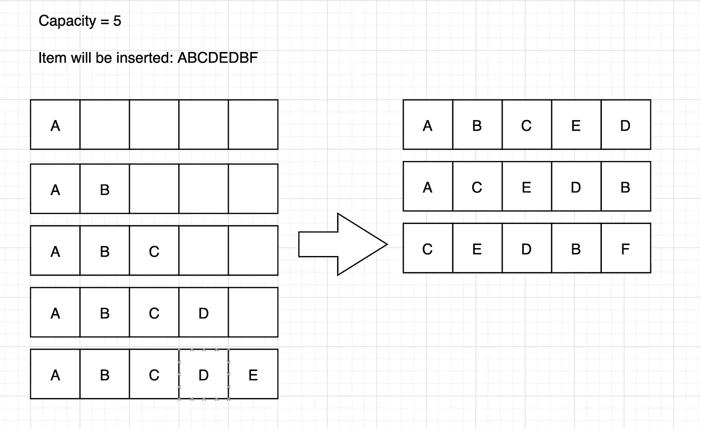

# Java 中的缓存替换算法

> 原文：<https://medium.com/javarevisited/cache-replacement-algorithms-in-java-parts1-f63f2962a714?source=collection_archive---------0----------------------->


来自 stock.adobe.com[的](https://stock.adobe.com/id/images/id/307936519?as_campaign=Freepik&as_content=api&as_audience=srp&tduid=4baa0a071af609923f6d9c3d56d02745&as_channel=affiliate&as_campclass=redirect&as_source=arvato)

高速缓存替换算法可以决定当高速缓存满时哪个项目将被移除。现在，这些算法有很多变种；但是，在这篇文章中，我将讨论 4 种算法:**先进先出/后进先出**、 **LRU** (最近最少使用)、 **LFU** (最少使用)和 **MRU** (最近最少使用)算法。

**准备**

对于本文中的 java 代码，我将使用 Lombok 库。请首先使用您的软件包管理器安装它。对于 maven 用户，您可以在 pom.xml 中添加

至于将被保存在缓存中的对象将具有这样的结构:

对于下面 4 个算法的所有实现，我将使用 LinkedList 和 HashMap 数据结构。

**先进先出/后进先出**

在 FIFO 中，该算法的行为类似于队列。列表头中的项目将被删除，而不考虑它以前被访问的频率或次数。而 LIFO 则相反，它的行为就像一个堆栈，尾部的项目将被删除。

代码实现如下所示。

**LRU**

在这里，我们替换最长时间未使用的项目。FIFO 缓存的实现几乎相同。不同之处在于，当存在缓存命中时，该项将被移动到尾部，而头部是一个很少长时间使用的项。

这里可以看到插图。



ABCDE 将立即填充缓存，因为缓存中有足够的空间。D 和 B 的位置将在最末端，因为存在与现有元素的缓存命中。f 是缓存中的新项目；因此，首先移除项目 A，然后将项目 F 插入尾部。该实现的 java 代码如下所示:

**MRU(最近使用)**

MRU 与 LRU 相反。在 MRU，最近使用的项目将从缓存中删除。这种方法很少使用，但有些情况下可以使用这种策略；比如我们看过那部电影之后的电影推荐。可以使用 MRU 策略将这部电影从缓存中逐出。

对于实现，我们可以使用前一篇文章中的 LRU 代码。不同之处在于，我们必须删除 LinkedList 尾部的一项，因为该项是最近使用的。需要更改的代码部分包括:

```
public void set(int key, int value) {
    if (this.cache.containsKey(key)) {
        // remove existing node from linked list
        this.ll.remove(this.cache.get(key));
    } else {
        // if linked list size same with capacity then remove last node
        if (this.ll.size() == this.capacity) {
            this.cache.remove(this.ll.getLast().getKey());
            this.ll.removeLast();
        }
    }
    // add new node in tail, and cache node in hash map
    this.ll.addLast(new Node(key, value));
    this.cache.put(key, this.ll.getLast());
}
```

从上面的代码片段中，我已经更改了代码，使用内置的 getLast()方法获取最后一个项目。

# **LFU(使用频率最低)**

在 LFU，我们必须跟踪项目的频率。当一个项目进入缓存时，更新该项目的频率。具有最小频率的项目将从缓存中移除。这里可以看到 Java 的实现。

```
@Builder.Default private HashMap<Integer, Node> cache = new HashMap<>();
@Builder.Default private HashMap<Integer, LinkedList<Node>> freqDic = new HashMap<>();

private LinkedList<Node> ll;
private int capacity;
private int size;
private int minFreq;
```

在上面的代码中，我使用了 3 个数据结构(2 个 HashMap，1 个 LinkedList)来帮助我构建这个算法。freqDic HashMap 的功能是跟踪该项在缓存中的频率。所以，这个 HashMap 的关键字是 frequency，值是 LinkedList。LinkedList 表示基于时间戳存储在缓存中的实际项目，这意味着头部是最老的，尾部是最新的。对于 get 实现，算法是:

1.  检查该项是否存在于缓存中，如果不存在则返回 null。
2.  从频率散列表中删除项目。如果 HashMap 中的 frequency 键没有任何成员，那么删除 frequency 键。
3.  更新驱逐项的频率，并将更新后的项放入频率散列表中。

```
public Node get(int key) {
   if (!this.cache.containsKey(key)) {
       return null;
   }
   Node temp = this.cache.get(key);
   // remove node from old frequency dictionary
   this.freqDic.get(temp.getFreq()).remove(temp);
   if (this.freqDic.get(temp.getFreq()).isEmpty()) {
       this.freqDic.remove(temp.getFreq());
       if (this.minFreq == temp.getFreq()) {
           this.minFreq += 1;
       }
   }
   // adding new frequency
   Node node = new Node(temp.getKey(), temp.getValue(), temp.getFreq() + 1);
   // update cache and freq dic with new node
   this.cache.put(key, node);

   LinkedList<Node> ll = this.getList(node.getFreq());
   ll.addLast(node);
   this.freqDic.put(node.getFreq(), ll);
   return temp;
}
```

对于 set 实现，算法有:

1.  检查项目是否存在于缓存中，如果存在，执行上面的 get 算法。
2.  如果缓存的大小小于容量，则将该项添加到缓存中，并将该项追加到频率散列表中以跟踪频率
3.  如果高速缓存的大小与容量相同，那么从高速缓存和频率散列表中移除具有最低频率的项目。如果 HashMap 中的 frequency 键没有任何成员，那么删除 frequency 键。

```
public void set(int key, int value) {

    if(this.get(key) != null) {
        return;
    }

    if (this.size == this.capacity) {
        Node delNode = this.freqDic.get(this.minFreq).getFirst();
        // remove minimum frequency
        this.freqDic.get(delNode.getFreq()).remove(delNode);
        if (this.freqDic.get(delNode.getFreq()).isEmpty()) {
            this.freqDic.remove(delNode.getFreq());
        }
        this.cache.remove(delNode.getKey());
        this.size -= 1;
    }

    this.minFreq = 1;
    Node node = new Node(key, value, this.minFreq);
    this.cache.put(key, node);

    LinkedList<Node> ll = this.getList(this.minFreq);
    ll.addLast(node);
    this.freqDic.put(this.minFreq, ll);
    this.size += 1;
}
```

总的来说，LRU 和 LFU 使用得更广泛。Redis 等数据库缓存支持这种[策略](https://docs.redis.com/latest/rs/administering/database-operations/eviction-policy/)以及随机策略，其中项目将被随机提取，但默认为 Volatile-LRU，即 LRU，其中 expire 值在字段中设置。在某些情况下，比如看一部最近上映的电影，MRU 政策可以用来解决这个问题。而 LIFO/FIFO 在高速缓存策略中从不使用，但在堆栈或队列等数据结构中会大量使用。

**参考文献**

1.  [https://en.wikipedia.org/wiki/Cache_replacement_policies](https://en.wikipedia.org/wiki/Cache_replacement_policies)