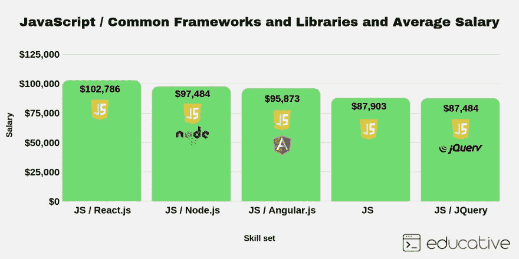
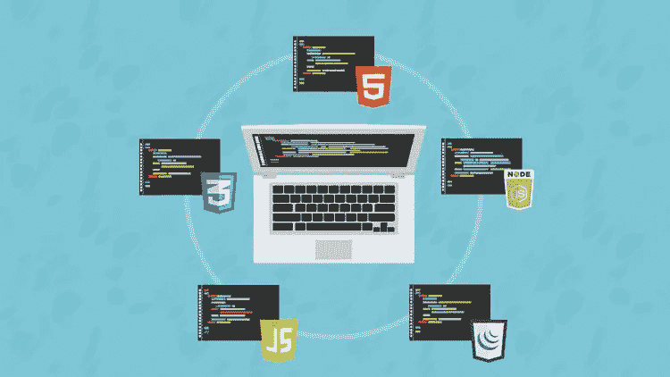

# 如何在四五十岁成为一名网页开发者？

> 原文：<https://medium.com/javarevisited/can-you-learn-programming-and-become-a-web-developer-in-the-40s-and-50s-f9e117f32721?source=collection_archive---------0----------------------->

## 职业建议和学习网络开发基本技能的资源

大家好，很多人认为[编程](/javarevisited/top-10-pluralsight-courses-to-learn-programming-and-software-development-during-covid-19-stay-at-30b7d8a4f88f)和 [Web 开发](/hackernoon/the-2019-web-developer-roadmap-ab89ac3c380e)是年轻人的事，是花花公子、极客、书呆子或者其他你称之为的人的事，但对年轻人来说，一旦你过了 40 岁，学习编程和 Web 开发几乎是不可能的。

> 这不是真的，有很多例子表明，人们在更老的时候就已经学会了编程，并且得到了他们想要的工作。

昨天，我和一位老朋友聊天，他不是编程出身，但在印度乡下的一所工程技术学院当老师。

给你一些背景，他刚满 40 岁，是两个好孩子的父亲。在过去的 15 年里，他一直在一所私立工程学院教生物技术专业的学生数学。

目前，他很高兴成为一名教师，因为印度的技术学院和学校工资很高，但他一直想探索世界，他现在意识到一份[软件开发](/javarevisited/top-10-programming-languages-you-can-learn-for-jobs-and-career-in-technology-491e611c22bc)或[编程工作](/javarevisited/top-10-technology-jobs-for-programmers-and-it-professionals-c10784090031)可以给他提供这样的机会。所以，他联系我，想知道现在开始[编程生涯](/javarevisited/these-are-the-highest-paying-tech-jobs-programmers-can-aim-to-increase-their-pay-c59e1eeb6904)是否太晚了。

他热衷于学习 Web 开发，尤其是使用最新的技术，如 [Angular](https://hackernoon.com/top-10-angular-courses-tutorials-and-books-for-web-developers-e8a8e2c490c2) 、 [React](https://hackernoon.com/the-2018-react-js-roadmap-4d0a43814c02) 、 [Vue.js](https://javarevisited.blogspot.com/2019/08/top-5-online-courses-to-learn-vue.js-best.html) 和 [Node.js](http://javarevisited.blogspot.sg/2018/01/top-5-nodejs-and-express-js-online-courses-for-web-developers.html) 。实际上，我给他看了这张图片，他对这个网络开发的机会感到很兴奋

尽管如此，他担心对他来说，成为一名网络开发人员或在软件开发公司工作可能已经太晚了。

他进退两难，所以打电话给我讨论。得知他的愿望，我很激动，并向他保证，任何时候都不晚，你需要的只是学习的热情和实现目标的奉献精神。

许多软件公司并不介意你过去做过什么，只要你能向他们展示你拥有他们所寻找工作的[相关技能](https://javarevisited.blogspot.com/2020/01/10-things-web-developers-should-learn.html)。

# 可以兼职学编程吗？

有一次他看到了对我的鼓励，他的下一个问题是，*他能不能兼职做编程，看看是否适合他？*比如，他到底会不会做[编码](https://javarevisited.blogspot.com/2019/03/top-5-online-courses-to-learn-to-code.html)？我知道他害怕编码，这是相当明显的，因为他的非编程背景，并试图将他的风险降至最低，这绝对不是坏事。

毕竟，他有一个家庭要养活。

关于这个问题，是的，一旦你学会了编程，你就可以从 Freelancer.com、Upwork 或 Fiverr 等网站做很多在线工作，这不仅能给你提供急需的经验，还能增强你作为程序员和软件开发人员的信心。

他很高兴有机会在网上兼职工作，因为这样，他不仅可以获得一些经验，还可以赚一些额外的钱用于学习和技能升级。

 [## 每个程序员都应该知道的 10 件事

### 了解作为一名新的或探索性的程序员应该知道和学习的更多内容，以及在哪里可以学到这些技能

medium.com](/swlh/10-things-every-programmer-should-know-26ba37cfcaf4) 

## 不花几年时间在编程上，要成为一名 Web 开发人员应该学些什么？

但是，问题永远不会结束，他问我*要成为一名 Web 开发人员，他应该学习什么？*

这一点我无法用一句话来解释，相反，我告诉他遵循这个 [**Web 开发者路线图**](https://hackernoon.com/the-2019-web-developer-roadmap-ab89ac3c380e) 并建议他开始学习使用 JavaScript 编码。

我还建议他先参加在线课程，比如柯尔特钢铁公司的 [**网络开发人员训练营**](https://click.linksynergy.com/deeplink?id=JVFxdTr9V80&mid=39197&murl=https%3A%2F%2Fwww.udemy.com%2Fthe-web-developer-bootcamp%2F) 。这是一门超级课程，不仅教你所有你需要知道的 web 开发知识，还通过展示基于项目的开发给你一些实践经验。

他现在处于学习的第二个月，现在对 [HTML](https://javarevisited.blogspot.com/2019/05/top-5-html-5-and-css-3-courses-for-web-developers.html) 、 [CSS](/javarevisited/5-free-html-and-css-courses-to-learn-front-end-web-development-online-8b04517c6ecb) 和 [JavaScript](/javarevisited/my-favorite-free-tutorials-and-courses-to-learn-javascript-8f4d0a71faf2) 有了基本的了解。

对于他来说，在编码和 Web 开发方面获得一些信心还需要一段时间，主要是因为他没有太多的时间可以花，但他在正确的道路上，我相信他迟早会达到他的目标。

如果你也在同一个十字路口*学习 Web 开发还是编程*为时已晚，那么不要气馁。你可以在任何你想做的时候做，不仅仅是在 30 多岁，40 多岁，甚至是 50 多岁。

你需要的只是正确的指导、决心和成功的资源。正如马克·吐温正确指出的那样:

> 年龄是精神对物质的问题。如果你不介意，没关系。(马克·吐温)

## 2023 年学习 Web 开发的最佳资源

如果你想成为一名网页开发者，这里有一些我推荐的资源:

*   [柯尔特·斯蒂尔的网络开发者训练营](https://click.linksynergy.com/deeplink?id=JVFxdTr9V80&mid=39197&murl=https%3A%2F%2Fwww.udemy.com%2Fthe-web-developer-bootcamp%2F)
*   [Vue JS 2 —完整指南(包括 Vue 路由器& Vuex)](https://click.linksynergy.com/deeplink?id=JVFxdTr9V80&mid=39197&murl=https%3A%2F%2Fwww.udemy.com%2Fvuejs-2-the-complete-guide%2F)
*   [使用 HTML5 和 CSS3，作者 Michael Palermo](http://pluralsight.pxf.io/c/1193463/424552/7490?u=https%3A%2F%2Fwww.pluralsight.com%2Fcourses%2Fhtml5css3-upgrade)
*   [网络开发者路线图(前端+后端)](https://dev.to/javinpaul/the-2019-web-development-frontend-backend-roadmap-4le2)
*   [为网络开发者提供 5 门免费的 HTML 和 CSS 课程](http://www.java67.com/2018/02/5-free-html-and-css-courses-to-learn-web-development.html)
*   [每个软件开发人员都应该学习的 11 项基本技能](https://dev.to/javinpaul/11-essential-skills-software-developers-should-learn-in-2020-1bio)
*   面向程序员的 10 门 Java 和 Web 开发课程
*   每个软件工程师都应该学会的 10 件事
*   [2023 年 Java 和 Web 开发者可以学习的 10 个框架](https://dev.to/javinpaul/10-frameworks-java-and-web-developers-can-learn-in-2019-17ke)
*   [每个网络开发者都应该学会的 10 件事](https://javarevisited.blogspot.com/2020/01/10-things-web-developers-should-learn.html)
*   [完整的 JavaScript 课程 2023:构建真实的项目！](https://click.linksynergy.com/deeplink?id=JVFxdTr9V80&mid=39197&murl=https%3A%2F%2Fwww.udemy.com%2Fthe-complete-javascript-course%2F)

如果你喜欢这篇文章，我会随时回答你关于职业或编程的任何问题。

**P. S.** —如果你想从一些最好的免费资源开始你的编程生涯，那么你也可以看看这个 [**21 个免费网站的列表，开始学习编程**](https://hackernoon.com/21-websites-to-learn-programming-for-free-5101c1ddf0c) 。它包含学习 Python 和 JavaScript 等编程语言的免费网站，以及 Git 和 IDEs 等一些基本工具。

 [## 免费学习编程和软件开发的 20 大网站

### Thes 是最好的网站、平台和在线培训学校，你可以在那里免费学习编程。

medium.com](/javarevisited/top-20-sites-to-learn-coding-in-2020-f57ff63d9cb3) 

**p . p . S**——如果你渴望在 2023 年成为一名 web 开发人员，并且正在寻找一门涵盖大部分这些框架和库的课程，那么我强烈推荐你在 Udemy 上查看由 Angela Yu 教授的完整的 2023 年 Web 开发人员训练营 课程。这是成为一名网站开发人员的最新和最有吸引力的在线课程。

 [## 完整的 2023 年网络开发训练营

### 欢迎来到完整的 Web 开发训练营，这是您学习编码并成为全栈 web…

udemy.com](https://click.linksynergy.com/deeplink?id=JVFxdTr9V80&mid=39197&murl=https%3A%2F%2Fwww.udemy.com%2Fcourse%2Fthe-complete-web-development-bootcamp%2F)