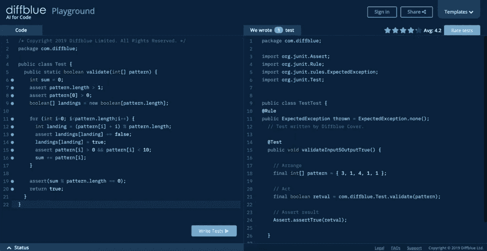
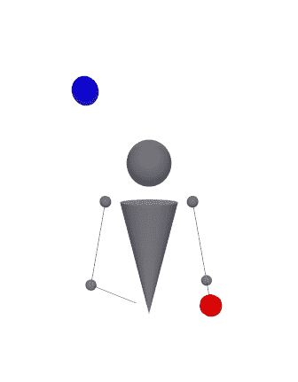

# 你会表演 AI 创造的杂耍戏法吗？

> 原文：<https://medium.com/javarevisited/can-you-perform-a-juggling-trick-created-by-ai-651254f14fe0?source=collection_archive---------0----------------------->

我们已经构建了一个工具,它使用人工智能为输入其中的任何 Java 代码自动创建单元测试。这个工具的一个鲜为人知的功能是，它不仅仅可以帮助你编写测试和开发新代码；我们发现它也可以用来创造全新的杂耍技巧。

## **杂耍的数学**

用数学方法描述杂耍技巧可能不太明显，但这正是 siteswap 符号所做的。Siteswap 是一种将杂耍技巧写成数字序列的方法，比如 531 或 552。不同的数字对应于将杂耍球抛到不同的高度:数字越高，抛得越高。戏法需要的球数是数的平均值，所以 531 是 3 球戏法，552 是 4 球戏法。

这种方法的一个有趣的方面是，它也可以用来发明新的把戏:想出一系列的数字，然后尝试变戏法。只要数字满足“两个球不会同时落在同一只手里”的条件，这个方法总是有效的许多现在完全标准的新杂耍技巧最初是通过提出一个有效的 siteswap 并尝试杂耍它而发明的。

## **AI 能生成有效的 siteswaps 吗？**

事实证明，我们的工具(Diffblue Cover)可以使用一个 Java 函数提出新的技巧，该函数接受一个整数数组，检查它们是否为负，并断言它们满足有效技巧的条件。这将生成一个单元测试，其中包括向函数中提供一个有效的 siteswap:

它第一次提出 31411。用杂耍球做的一次尝试表明，这是一个不错的小两球技巧。事实上，这是一个比某人通常编造的更好的把戏。这是由 siteswap 动画师提供的一个可视化图，展示了你输入的任何技巧:

通过稍微改变 Java 函数的输入，让 Diffblue Playground 选择不同的随机猜测，它产生了更多的杂耍技巧:124245 (3 个球，我们以前从未见过的技巧)和 51(3 个球的淋浴，最古老的杂耍技巧之一)。难度各不相同，但是所有的技巧都是可以做到的。

[获得免费试用](https://www.diffblue.com/free-trial)自己想出新花样！你可以用上面的动画师来看看它们是什么样子，用几个杂耍球试一试。我们很想看看人工智能创造的最难的魔术——在下面和我们分享吧！

## 您可能还会对以下内容感兴趣:

*   [人工智能术语了解](https://diffbluehq.medium.com/ai-terms-to-know-4e50ba94a603)
*   [井字游戏和人工智能的演变](/nextai/the-evolution-of-tic-tac-toe-and-ai-d548feca65ac)
*   [什么是 AI for Code？](/ai³-theory-practice-business/what-is-ai-for-code-d839f83b902d)