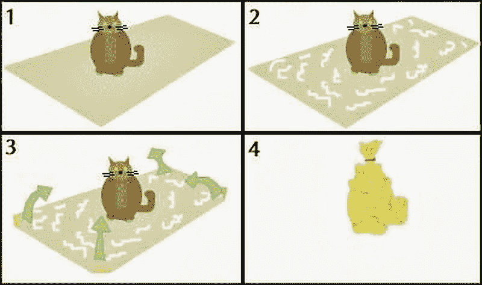
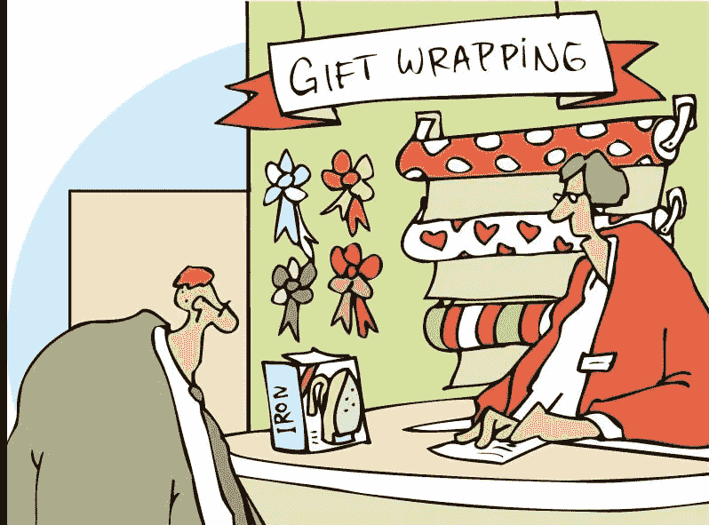
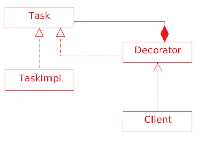

# 可以让你包装礼物吗？这是给我奶奶的。

> 原文：<https://medium.com/javarevisited/can-you-please-wrap-the-gift-it-is-for-my-grandma-1a15da02f60d?source=collection_archive---------9----------------------->

如何包装给奶奶的礼物的说明

你有没有遇到过这样的情况，你必须为某人的生日买一份礼物，但是直到最后一刻你才完全忘记了？如果这种事发生在你身上，你就会明白那是什么感觉。这的确很伤人，尤其是如果那个人是你深爱的人，比如你的祖母。这不是一种好的感觉，但这种事情发生了。

> 我们生活，我们学习！

你会怎么解决？也许你只有一点时间去街角的商店买些简单小巧的东西。你知道奶奶喜欢简单的东西。

我打赌你可能会这么做(你这个无耻的混蛋！).不幸的是，你知道这是行不通的，每个人都会注意到你忘了买礼物，而你只是买了你在去祖母生日派对的路上发现的第一个垃圾。每个人都会注意到，除非你是包装专家。

你大概能猜到我要讲这个故事的目的，对吗？
正确！今天我将谈论装饰设计模式。

你之前让小猫窒息了，所以你决定给奶奶买个熨斗。这次你决定请专业人士帮你包装。

> 专业包装人员是装饰和使东西看起来很棒的专家。他们做得这么好是因为他们一遍又一遍地练习同样的模式。

**“装饰者”设计模式。**
想象一下，你想给一个方法增加一些额外的功能，但是你不想影响它已经在做的事情。你能做的，是创建一个装饰类，它将包装对该方法的原始调用，并让所有客户端调用装饰。

**第一步——提取一个接口，公开你想要修饰的功能。**

**第二步——创建装饰器**

**步骤 3——让客户使用装饰器**

**最后注意:** 在这个解释中，我展示了使用 Java 继承的装饰器设计模式。但是也可以使用合成来实现。只要有可能，记住你应该更喜欢组合而不是继承。但在另一个故事里会有更多。

我希望你奶奶喜欢这个礼物。🎁👵❤️🐈

如果你喜欢这个故事，请给我们一些👏还有别忘了 [**跟着 Javing**](/@javing.uk)

*最初发布于*[http://javing . blogspot . com/2013/10/can-you-please-wrap-gift-it-is-for-my . html](http://javing.blogspot.com/2013/10/can-you-please-wrap-gift-it-is-for-my.html)