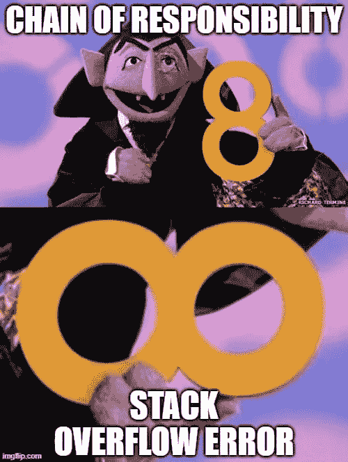

# Spring 应用中的责任链模式

> 原文：<https://medium.com/javarevisited/chain-of-responsibility-pattern-in-spring-application-f79b35f341e5?source=collection_archive---------0----------------------->

在本文中，我将向您展示如何在 Spring 应用程序中顺利地应用责任链模式。你可以在 GitHub 库中找到源代码。



文章模因封面

# 领域

让我们明确一下 CoR 模式的目的。你可以通过[这个链接](https://sourcemaking.com/design_patterns/chain_of_responsibility)阅读它的完整解释。尽管现在我和你们分享一个特别的例子。

想象一下，我们正在创建一个实时的丰富服务。它消费一条消息，用附加数据完成它，并产生最终的丰富消息作为输出。假设我们有三种类型的浓缩:

1.  通过`[SESSIONID](https://javarevisited.blogspot.com/2012/08/what-is-jsessionid-in-j2ee-web.html)` cookie 确定电话号码。
2.  通过`userId`字段检索人的年龄。
3.  通过他们的 IP 地址获得的人的地理位置。

# 发展

首先，我们需要`EnrichmentStep`界面。

```
public interface EnrichmentStep {
    Message enrich(Message msg);
}
```

接口接受当前的`Message`并返回一个丰富的。

> *在本例中，* `*Message*` *类是*<https://www.geeksforgeeks.org/create-immutable-class-java/>**不可变的。这意味着* `*EnrichmentStep*` *返回新的对象，而不是被修改的同一对象。不可变类的使用是很好的实践，因为它消除了许多可能的* [*并发问题。*](https://enlear.academy/how-to-avoid-a-deadlock-while-writing-concurrent-programs-java-example-988bb07db25f)*

*有 3 种类型的浓缩。因此，我们需要 3 个`EnrichmentStep`实现。我在给你看电话号码的例子。不过如果你好奇的话，你可以在仓库里看到其他的。*

*电话号码丰富步骤*

> **在这种情况下，我们不关心* `*PhoneNumberRepository*` *的实现。**

*那好吧。每个`EnrichmentStep`可能会用额外的数据增强输入消息。但是我们需要继续所有的浓缩步骤来获得完整的信息。责任链模式就派上了用场。让我们稍微重写一下`EnrichmentStep`界面。*

```
*public interface EnrichmentStep {
  Message enrich(Message message);

  void setNext(EnrichmentStep step);
}*
```

*每个`EnrichmentStep`实现可能引用下一个链元素。看一看修改后的`PhoneNumberEnrichmentStep`实现。*

*使用下一个元素的电话号码丰富步骤*

*现在`PhoneNumberEnrichmentStep`的工作方式有点不同:*

1.  *如果成功地丰富了消息，则满足的结果进行到下一个丰富步骤。*
2.  *否则，没有修改的消息会更进一步。*

*是时候将`EnrichmentStep`的实现连接成一个链表了，也就是建立责任链。*

*首先，我们来指出另一个必不可少的细节。你看，`EnrichmentStep`定义了总有下一步。但是链条不可能是无限的。因此，下一个链元素有可能不存在。在这种情况下，我们必须在每个`EnrichmentStep`中重复*非空*检查。因为任何实现都可能是最后一步。谢天谢地，有更好的选择。`NoOpEnrichmentStep`是只返回相同消息而不做任何动作的类。看看下面的代码块。*

```
*public class NoOpEnrichmentStep implements EnrichmentStep {

  @Override
  public Message enrich(Message message) {
    return message;
  }

  @Override
  public void setNext(EnrichmentStep step) {
    // no op
  }
}*
```

*它允许我们将这个对象设置为最后一个链元素。因此，它保证了`setNext`方法总是以某个值被调用，我们不必重复*非空*检查。*

> **`*NoOpEnrichmentStep*`*实际上是* [*空对象设计模式*](https://sourcemaking.com/design_patterns/null_object) *的一个例子。***

**现在我们正在创建`EnrichmentStepFacade`。看看下面的代码片段。**

**浓缩步骤外观**

**构造函数接受所有在当前[应用程序上下文](https://www.baeldung.com/spring-application-context)中注册为 Spring beans 的`EnrichmentStep`实现的列表(框架会自动完成这项工作)。如果列表为空，那么`chainHead`就是`NoOpEnrichmentStep`实例。**

**否则，当前元素将链接到下一个元素。但是最后一个链元素总是引用`NoOpEnrichmentStep`。这意味着调用所提供列表的第一个元素将执行整个链！更令人兴奋的是，您可以通过添加 Spring `[@Order](https://www.baeldung.com/spring-order)`注释来定义元素在链中的顺序。注入的`List<EnrichmentStep>`集合将被相应地排序。**

# **重构**

## **通用链元素**

**虽然解决方案正在运行，但还不完整。有几个细节需要改进。首先，再看一下`EnrichmentStep`的定义。**

```
**public interface EnrichmentStep {
  Message enrich(Message message);

  void setNext(EnrichmentStep step);
}**
```

**责任链是通用模式。也许我们可以把它应用到另一个场景中。所以，让我们将`setNext`方法提取到单独的接口。看看下面的定义。**

```
**public interface ChainElement<T> {
  void setNext(T step);
}**
```

**现在`EnrichmentStep`应该用适当的通用值扩展它。**

```
**public interface EnrichmentStep extends ChainElement<EnrichmentStep> {
  Message enrich(Message message);
}**
```

## **链构建封装**

**这是一个微小的进步。我们还能做什么？再看看下面的`EnrichmentStepFacade`定义。**

**浓缩步骤外观**

**事实上，`EnrichmentStep`接口代表了一个通用的链元素。所以，我们可以直接将代码封装在`ChainElement`接口中。查看下面的代码片段。**

**链构建封装**

**`buildChain`方法接受一个业务实现列表，该列表以实际用例以及作为最后一个元素的存根为基础(即`NoOpEnrichmentStep`)。**

**现在我们也可以重构`EnrichmentStepFacade`。看看下面的代码示例。**

**委派给 ChainElement.buildChain 的专有步骤外观**

**更加清晰易懂。**

## **AbstractEnrichmentStep**

**无论如何，关于`EnrichmentStep`的实现还是有一些需要注意的地方。看看下面的`PhoneNumberEnrichmentStep`定义。**

**使用下一个元素的电话号码丰富步骤**

**我想指出两个细节:**

1.  **`setNext`方法覆盖。每个实现都必须存储对下一个链元素的引用。**
2.  **调用了 2 次`next.enrich(...)`方法。因此，实现必须一遍又一遍地重复合同要求。**

**为了消除这些代码气味，我们声明了`AbstractEnrichmentStep`类。看看下面的代码片段。**

**抽象浓缩步骤**

**首先，下一个`EnrichmentStep`被封装在`AbstractEnrichmentStep`中，而`setNext`方法是最终的。因此，实现不需要存储更多的链元素。**

**其次，还有新方法`enrichAndApplyNext`。事实上，一个实现根本不用担心链接的细微差别。如果富集成功，则该方法返回新消息。否则，检索`Optional.empty`。**

**最后，`enrich`方法也是最终方法。因此，它的实现是固定的。如您所见，我们浓缩算法不是跨多个类复制的，而是放在一个方法中。很简单:**

1.  **如果`enrichAndApplyNext`返回值，则进入下一个加浓步骤。**
2.  **如果没有值，用原始消息调用下一步。**
3.  **如果出现任何错误，请将其记录下来，并继续正常的富集链。**

**最后一点至关重要。我们不知道会有多少实现，以及它们可能抛出什么异常。然而，我们不想完全停止浓缩过程，而只是跳过失败的链块执行。看看下面的`PhoneNumberEnrichmentRepository`实现，它扩展了已定义的`AbstractEnrichmentStep`。**

```
**@Service
class PhoneNumberEnrichmentStep extends AbstractEnrichmentStep {
  private final PhoneNumberRepository phoneNumberRepository; @Override
  protected Optional<Message> enrichAndApplyNext(Message message) {
    return message.getValue("SESSIONID")
        .flatMap(phoneNumberRepository::findPhoneNumber)
        .map(phoneNumber ->
            message.with("phoneNumber", phoneNumber)
        );
  }
}**
```

**如您所见，不再有基础设施代码了。纯粹的商业逻辑。**

# **改进点**

**如果你有许多浓缩步骤，那么你当然要监控它们的活动。**

1.  **在特定的步骤中，需要多少时间来充实信息？**
2.  **什么是浓缩统计？哪一个强化步骤最常失败？**
3.  **哪些步骤失败了，为什么？**

**度量是所有这些问题的答案。此外，`AbstractEnrichmentStep`声明还可以帮助我们更清晰地记录监控值。查看下面的代码片段。**

**用度量标准抽象浓缩步骤**

**首先有一个新的抽象方法`getEnrichmentType()`。每个实现都应该返回其类型，以正确区分结果指标。**

**规则是这样的:**

1.  **如果成功地丰富了消息，就调用`recordHit`方法。**
2.  **如果跳过消息丰富，则`recordMiss`开始。**
3.  **如果出现任何错误，那么`recordError`就会发挥作用。**
4.  **最后，通过调用`recordDuration`存储整个浓缩步骤的持续时间。**

**您可以按照自己的方式调整指标。这个想法是实现不关心这些细节。[开合原理](https://en.wikipedia.org/wiki/Open%E2%80%93closed_principle)在行动！**

# **结论**

**这就是我想告诉你的关于 Spring 生态系统中的责任实现链的全部内容。如果您有任何问题或建议，请在下面留下您的评论。感谢阅读！**

# **资源**

1.  **[带有源代码的存储库](https://github.com/SimonHarmonicMinor/spring-chain-of-responsibility-example)**
2.  **[空对象设计模式](https://sourcemaking.com/design_patterns/null_object)**
3.  **[责任链模式解释](https://sourcemaking.com/design_patterns/chain_of_responsibility)**
4.  **[Java 中的不变性](https://javarevisited.blogspot.com/2013/03/how-to-create-immutable-class-object-java-example-tutorial.html)**
5.  **[Spring 应用上下文](https://www.baeldung.com/spring-application-context)**
6.  **[开闭原理](https://javarevisited.blogspot.com/2015/07/strategy-design-pattern-and-open-closed-principle-java-example.html#axzz5CqPlkiLV)**