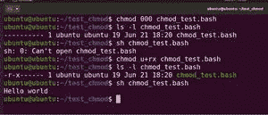
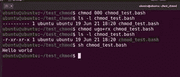
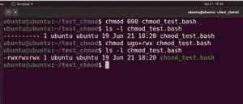
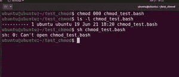
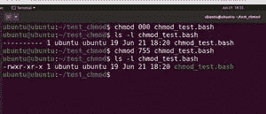

# Linux 中的 chmod 命令

> 原文：<https://medium.com/javarevisited/chmod-command-in-linux-bd523bd3b3ed?source=collection_archive---------2----------------------->

使用 chmod 命令获得目录访问权限，设置文件权限，或者只是控制用户的能力。本指南旨在帮助您管理和运行脚本。

关于 [chmod 命令](https://javarevisited.blogspot.com/2012/03/10-example-of-chmod-command-in-unix.html)

该命令具有典型的 Linux 语法:一个命令，然后是选项，最后是文件或文件夹，这些必须与命令本身一起应用:

```
chmod [reference][operator][mode] file...
```

首先，让我们看看现有的 [Linux](/javarevisited/top-10-courses-to-learn-linux-command-line-in-2020-best-and-free-f3ee4a78d0c0?source=collection_home---4------0-----------------------) 访问权限以及如何设置它们。有三种主要类型的权利:

```
r - reading;
w - writing;
x - execution.
```

此外，有三类用户可以在 Linux 文件上设置这些[权限:](https://javarevisited.blogspot.com/2011/11/file-permissions-in-unix-linux-example.html)

```
Reference   Class     Description
u          owner      file's ownerg          group      users who are members of
                     the file's groupo          others     users who are neither the
                     file's owner nor members of
                     the file's groupa           all       All three of the above, same as ugo
```

要查看文件权限，请使用

```
$ ls -l file
```

在哪里

破折号(-)表示这是常规文件

d 表示它是一个目录

设置权限的语法是:user _ group/action/type _ of _ right 符号，如“+”、“-”，作为动作使用。考虑以下示例:

*   u+rx —使所有者能够执行；

[](https://www.java67.com/2018/02/5-free-linux-unix-courses-for-programmers-learn-online.html)

*   ugo+rx——允许每个人执行和阅读；


*   ug+w —允许组和所有者写入；



*   ugo+rwx——允许每个人做任何事情。

[](https://javarevisited.blogspot.com/2018/02/5-courses-to-learn-shell-scripting-in-linux.html)

但是还有另一种方法来写下访问权限:

*   0 —没有权限；
*   1 —仅执行；
*   2 —只写；
*   3 —执行和记录；
*   4 —只读；
*   5 —阅读和执行；
*   6 —阅读和写作；
*   7 —阅读、写作和执行。

Linux 和文件[的访问权限是相同的。设置它们，指定所有者的权限数量，然后是组的权限数量，最后是其余的权限数量。示例:](/javarevisited/7-best-linux-courses-for-developers-cloud-engineers-and-devops-in-2021-7415314087e1)

000 —限制每个人的写、读和执行；



744——允许拥有者拥有一切，只为其余者阅读；


755——允许所有者阅读和执行所有内容——只允许其他人阅读和执行；



777——允许每个人做任何事:

