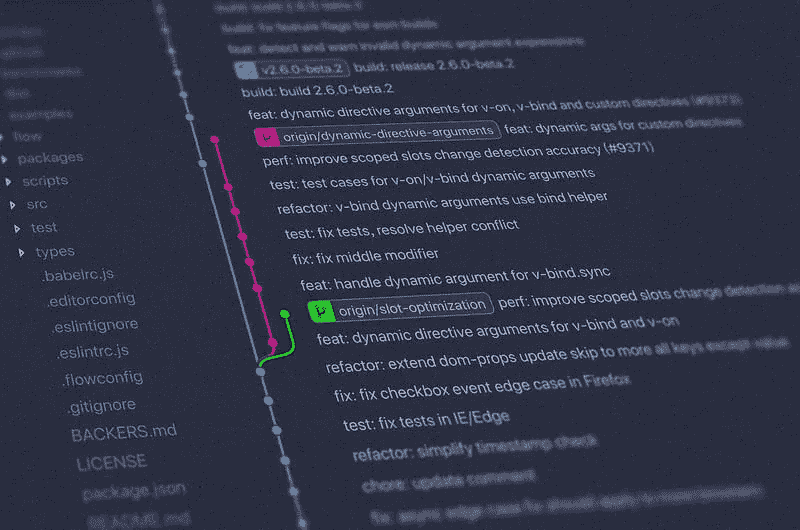
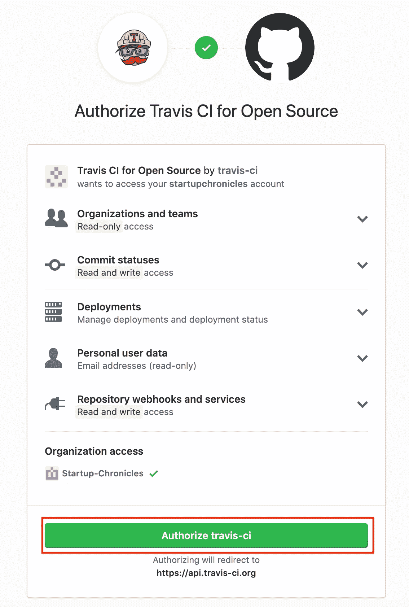
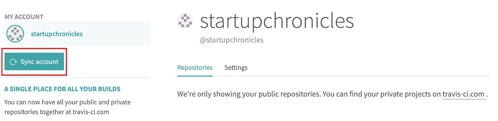
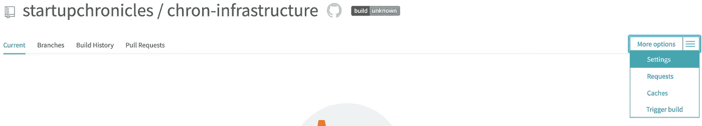
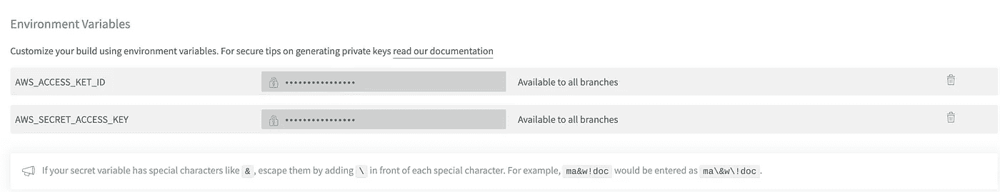
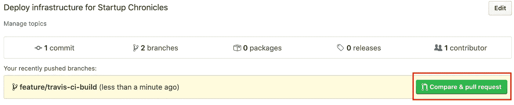
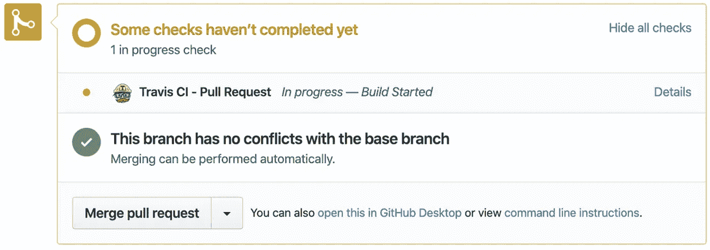
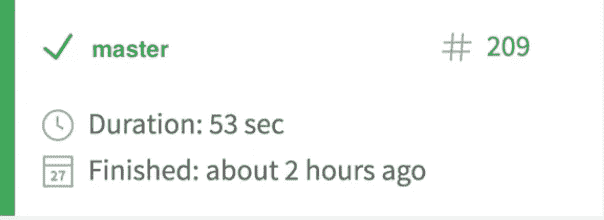

# Travis CI 和 Terraform 的 CI/CD

> 原文：<https://medium.com/javarevisited/ci-cd-with-travisci-terraform-62145090efa5?source=collection_archive---------2----------------------->

使用 TravisCI 和 Terraform 免费设置 CI/CD 管道以自动创建基础设施所需的一切



图像由 [Unsplash](https://unsplash.com/) 上的 [Yancy Min](https://unsplash.com/@yancymin) 拍摄

# 什么是 CI/CD

持续集成(CI)和持续部署(CD)是一组操作原则(在敏捷方法中最流行)，允许您更频繁、更可靠地交付代码变更，而不需要额外的交互。这对开发团队的意义在于，它允许您专注于提供商业价值，而不是专注于软件生命周期的操作部分。

坚果壳中的过程:

**CI** : `Build -> Package -> Test`

**CD** : `Deploy output from CI across all environments`

# 向 GitHub 授权 Travis CI

首先，转到 [Travis CI](http://travis-ci.com) 并点击`SIGN IN WITH GITHUB`按钮( ***注*** *:您的存储库必须是公共的，您才能使用这个服务*)。您应该会看到一个授权屏幕，要求您授予 Travis 从您的 GitHub 帐户读取数据的权限

[](https://medium.com/javarevisited/top-10-free-courses-to-learn-maven-jenkins-and-docker-for-java-developers-51fa7a1e66f6?source=collection_home---4------3-----------------------)

授权特拉维斯·CI

一旦您授权了 Travis，您将被带到您的仪表板，您可以开始连接您的存储库。

# 连接存储库

此时，您将需要一个 AWS IAM 用户设置，具有编程访问权限和相关凭据。如果你还没有这些，看看上周关于如何用 [AWS](/javarevisited/top-15-online-courses-to-learn-docker-kubernetes-and-aws-for-fullstack-developers-and-devops-d8cc4f16e773) 设置 Terraform 的教程。

</devops-dudes/setting-up-terraform-with-amazon-web-services-aws-afb2fde6cf18>  

在 Travis 仪表板的最左侧，您会看到一个带有`+`按钮的`My Repositories`面板，单击它可以添加一个新的存储库


添加新的存储库

如果您的存储库没有出现在列表中(现在或将来)，您可能需要进行一次性同步来添加它

[](https://medium.com/javarevisited/top-15-online-courses-to-learn-docker-kubernetes-and-aws-for-fullstack-developers-and-devops-d8cc4f16e773)

同步你的 GitHub 库

最后，我们必须将 AWS IAM 凭证添加到 builds 环境变量中。从您的`Dashboard`->-`More options` ->-`Settings`中选择您的资源库

[](https://medium.com/hackernoon/top-5-online-courses-to-crack-amazon-web-service-aws-solutions-architect-associate-exam-saa-c01-c667514ca72?source=---------15------------------)

构建设置

向下滚动到`Environment Variables`部分，在这里添加您的访问/密钥( ***注:*** *密钥必须与下面的名称*匹配)



添加 AWS 机密/访问密钥

# 添加 Travis YML 配置

Travis 让我们能够使用 YML config 定义您的管道，这样您就再也不用担心手动交互了。作为开发过程的一部分，这给了您通过代码为您拥有的每个存储库定义新管道的灵活性

在您的库的根目录下创建一个名为`.travis.yml`的新文件，并用以下内容填充它(完整的命令列表可以在[这里找到](https://docs.travis-ci.com/user/customizing-the-build))

travis.yml

现在我们已经有了 YML，让我们将代码推送到 GitHub，然后开始创建 Pull 请求(PR)

```
git add . 
git commit -m "Initial commit of Travis CI configuration" 
git push -u origin feature/travis-ci-build
```

# 创建拉取请求

在你的库的 GitHub 界面中点击`Compare & pull request`

[](https://medium.com/@javinpaul/top-10-free-courses-to-learn-git-and-github-best-of-lot-967aa314ea)

打开新的 PR

它应该自动默认为您最近提交的分支，但如果没有，请从下拉列表中选择它。接下来，给你的公关一个标题，描述，然后点击`Create pull request`按钮。

[](https://medium.com/javarevisited/11-essential-skills-to-become-software-developer-in-2020-c617e293e90e?source=extreme_sidebar---------0-2----------------------)

创建公关

一旦创建了 Pull 请求，GitHub 将向 Travis 发送一个通知，这将按照我们的 YML 定义触发一个新的构建步骤。



CI 合并检查

您可以在上面看到，只有当我们的 CI 流程已经验证了一个成功的构建时，合并才会完成。这阻止了您合并在生产系统中不起作用的代码——所以习惯这种处理拉请求的方式是一个好习惯。如果您现在前往 Travis 仪表板，您将看到您的构建正在运行，然后您可以跟踪日志中的输出！

# 部署到 AWS

因此，我们已经定义了一个构建计划，并成功地设置了在创建新 PR 时运行该计划。一旦你确认了 Terraform 的`Plan`阶段的输出，并对将要应用的更改感到满意，点击`Merge pull request`按钮。


合并 PR

现在记住，我们只想在我们的构建管道中执行 PR 的`Plan`阶段，而`Apply`阶段在我们合并时出现。因此，再次前往您的 Travis 仪表板，您应该会看到它执行另一个构建，但这一次实际上是部署更改！



成功部署到 AWS

# 结论

现在您已经集成了您的存储库，您可以为您开始的每个项目都这样做了！您已经可以看到在未来构建、测试和部署您的代码时，它将为您节省多少时间，所以从现在开始，尝试将它作为您开发生命周期的一部分。

请在下面的评论中让我知道你对这种风格的教程的看法，并请对未来教程的任何改进提出建议。下周见！

# 资源

**特拉维斯·茨**:【https://travis-ci.com/signin】T2

https://docs.travis-ci.com/user/customizing-the-build**特拉维斯构建命令**:<https://docs.travis-ci.com/user/customizing-the-build>

**用 AWS 设置 terra form**:[https://medium . com/startup chronicles/Setting-up-terra form-with-Amazon-we B- services-AWS-af B2 FDE 6 cf 18](/startupchronicles/setting-up-terraform-with-amazon-web-services-aws-afb2fde6cf18)

**Travis YML Config**:[https://gist . github . com/startup chronicles/9 f1 DD 05 ebb 5 f 37 e 30075 de 2094 cf 53 AE](https://gist.github.com/startupchronicles/9f1dd05ebb5f37e30075de2094cf53ae)