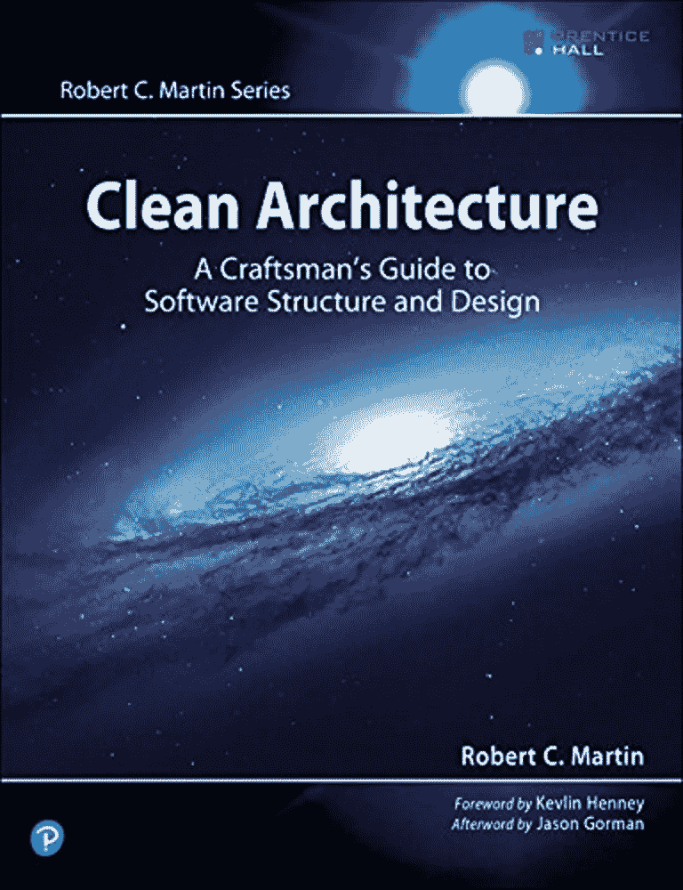
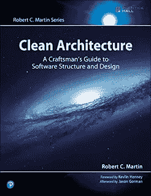
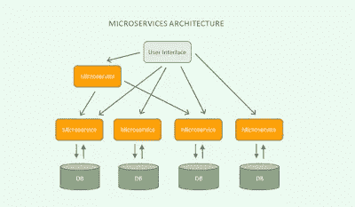
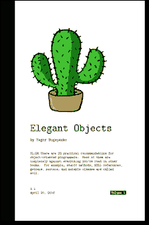

# 干净的架构回顾——开发者必读的软件设计书籍

> 原文：<https://medium.com/javarevisited/clean-architecture-a-must-read-software-design-book-for-developers-41189b8ca122?source=collection_archive---------0----------------------->

大家好，今天，我很兴奋地谈论另一本有用的软件架构书 **(** [**)干净的架构:软件结构和设计的工匠指南**](https://www.amazon.com/Clean-Architecture-Craftsmans-Software-Structure/dp/0134494164?tag=javamysqlanta-20) )来自我最喜欢的编程和编码书籍的作者之一，你猜对了，鲍勃叔叔。

同样是鲍勃叔叔(又名罗伯特·马丁)，他给你带来了 [**干净的代码**](http://www.amazon.com/Clean-Code-Handbook-Software-Craftsmanship/dp/0132350882?tag=javamysqlanta-20) 和 [**干净的编码器**](https://www.amazon.com/Clean-Coder-Conduct-Professional-Programmers/dp/0137081073?tag=javamysqlanta-20) **，**，这是所有经验水平的程序员和开发人员都钦佩的，是我的前辈在早期向我推荐的。

自从我上次读鲍勃大叔的经典著作已经有很长一段时间了，不知何故，我并不知道这本书。昨天，当一位同事提到这本书时，我感到很惊讶，我没有花时间意识到我需要购买和阅读这本书。我只是诅咒自己，为什么我以前不知道这本书，它仍然是新的，但鉴于我喜欢读他的书，它对我来说只是一个错过。

总之，这本最新的书叫做 **Clean Architecture** ，它将**改变你如何编写和测试你的程序**。

> 正如鲍勃叔叔所说，“让一个程序运行起来并不需要大量的知识和技能。”但是做好这件事很难。

在 [**Clean Architecture 的书**](https://www.amazon.com/Clean-Architecture-Craftsmans-Software-Structure/dp/0134494164?tag=javamysqlanta-20) 中，Bob 叔叔向你展示了如何从你的第一个决定开始就让你的软件项目正确，是的，就在你设计或编码之前。他揭示了在您计划和构建软件时将指导您的规则和实践。

这本书为你将面临的真正挑战提供了直接、严肃的解决方案，这些挑战将决定你的项目成败。

在过去，我读过几本书( [**干净代码**](/javarevisited/clean-code-a-must-read-coding-book-for-programmers-9dc80494d27c) 和 [**干净的编码者**](http://www.java67.com/2018/01/10-must-read-books-for-coders-of-all-level.html) )和鲍勃叔叔的许多文章，但一如既往，我发现这本书引人入胜，写得很好。鲍勃叔叔最棒的一点是他有能力让复杂的事情变得简单，他解释事情的方式非常有趣。

看他的书你不会觉得无聊，很多技术书都是这样，即使是好书。鲍勃叔叔的书另一个吸引我的地方是每章开头的卡通，它们太棒了。他们为即将到来的事情定下基调，并鼓励你去阅读这一章。

顺便说一句，如果你在这里是因为你想在你的职业生涯中成为一名解决方案架构师或软件架构师，那么我也推荐你去看看由 Mark Farraghar 在 Udemy 上开设的 [**如何成为一名杰出的解决方案架构师**](https://click.linksynergy.com/deeplink?id=JVFxdTr9V80&mid=39197&murl=https%3A%2F%2Fwww.udemy.com%2Fcourse%2Fhow-to-become-an-outstanding-solution-architect%2F) 课程，这是一门出色的课程，学习你将软件架构技能提升到一个新水平所需的所有软硬技能。

 [## 成为解决方案架构师:架构课程

### 您是 IT 项目团队中的开发人员、首席开发人员还是解决方案架构师？你想学习如何…

udemy.com](https://click.linksynergy.com/deeplink?id=JVFxdTr9V80&mid=39197&murl=https%3A%2F%2Fwww.udemy.com%2Fcourse%2Fhow-to-become-an-outstanding-solution-architect%2F) 

## 通过阅读《清洁建筑》一书，你会学到什么？

在《干净的架构》中，Bob 叔叔谈到了**设计和架构，**在第一章中，他解释了设计和架构之间的区别，以及为什么它对软件很重要。然后，他继续向客户解释该软件提供的价值。

你将重温同样的 [**坚实的设计原则**](https://pluralsight.pxf.io/c/1193463/424552/7490?u=https%3A%2F%2Fwww.pluralsight.com%2Fcourses%2Fprinciples-oo-design) 他已经在他早先的干净代码书中解释过了，但是这次他更深入一点。这本书结构合理，分为六个部分:
第 1 部分——简介
第 2 部分——编程范例
第 3 部分——设计原则
第 4 部分——组件原则
第 5 部分——架构
第 6 部分——细节

简介非常好，给一个天真的程序员一个很好的设计和架构概述，但是，即使是有经验的程序员也能从他的观点中学到很多。编程范例是真正行动开始的部分。

由于很多程序员只知道[面向对象编程](/swlh/5-free-object-oriented-programming-online-courses-for-programmers-156afd0a3a73)，这对他们来说会是一个惊喜。你将学习结构化和函数式编程，以及面向对象编程。

这本书最精彩的部分仍然是**第 3 部分，**他在那里解释了设计原则，坚实的设计原则。如果你意识到了这一点，那么这是一个很好的复习，但如果你没有意识到，那么这可能是学习和掌握这些基本设计原则的最佳资源。每个设计原则开头的卡通会帮助你记住在现实世界中什么时候使用这些原则。

顺便说一句，如果你真的想学习坚实的设计原则以及它如何帮助你写出更好的代码，那么我也推荐你去看看 Udemy 上的 [**坚实的原则:介绍软件架构和设计**](https://click.linksynergy.com/deeplink?id=JVFxdTr9V80&mid=39197&murl=https%3A%2F%2Fwww.udemy.com%2Fcourse%2Fsolid-design%2F) 课程。它用一些精心设计的代码很好地补充了这本书。

第四部分是从这里开始，你将学习驱动良好软件架构和[设计](https://javarevisited.blogspot.com/2018/02/top-5-java-design-pattern-courses-for-developers.html)的东西，比如高内聚和低耦合。

这是我从大学时代就听到的一句话，好的软件是具有高内聚和松耦合的软件，但只是意识到在没有正确指导的情况下实现这一点是多么困难。这一章将会给你足够的想法来实现这一点。

***第 5 部分*** *是关于架构本身的*，在这一部分中，您将了解服务和[微服务](https://javarevisited.blogspot.com/2018/02/top-5-spring-microservices-courses-with-spring-boot-and-spring-cloud.html)，应用程序不同部分、组件和业务规则之间的界限。这是本书最精彩的部分，因为正如标题所示，它完全专注于应用程序架构。您将了解流行服务和 [**微服务架构**](https://click.linksynergy.com/fs-bin/click?id=JVFxdTr9V80&subid=0&offerid=323058.1&type=10&tmpid=14538&RD_PARM1=https%3A%2F%2Fwww.udemy.com%2Fmicroservices-software-architecture-patterns-and-techniques%2F) 及其优缺点。

**第六部分**是关于企业应用的基本部分，如[数据库](https://javarevisited.blogspot.com/2018/05/top-5-sql-and-database-courses-to-learn-online.html)和 [web](https://javarevisited.blogspot.com/2018/04/top-5-java-frameworks-to-learn-in-2018_27.html#axzz5DmwFLA1K) 。它还包含案例研究，将演示如何在现实世界中应用您在本书中学到的原则。

# 我喜欢这本书的什么？

除了鲍勃叔叔的写作技巧和本章开头的漫画，还有一些我喜欢这本书的地方:

1.  鲍勃大叔对设计 vs 建筑的定义
2.  回顾每个程序员都应该知道的设计原则
3.  服务和[微服务架构的解释](https://javarevisited.blogspot.com/2021/09/microservices-design-patterns-principles.html)
4.  案例研究，尤其是视频销售
5.  关于建筑类比的附录

总的来说，这是一本很棒的书，适合任何想学习软件设计和架构基础知识的人，以及它如何影响产品的整体交付和性能。

有案例研究和几个真实世界的例子可以帮助你学习为你的产品选择正确的软件架构的艺术。

例如，微服务架构更适合**云原生开发**和部署，这是由于其较小的规模和分布式特性。

如果你想了解更多关于微服务架构的知识，特别是 Java，我建议你查看一下这个为 Java 开发者提供的 [**最佳微服务课程列表**](/javarevisited/top-5-courses-to-learn-microservices-in-java-and-spring-framework-e9fed1ba804d) 。

# 是什么让这本书变得更加有用？

这是我最近读过的最好的书之一，可能是仅次于叶戈尔·布加延科 的 [**优雅物件，我几个月前读过。T**](https://www.amazon.com/Elegant-Objects-1-Yegor-Bugayenko/dp/1519166915/?tag=javamysqlanta-20)

关于服务和微服务架构的讨论很棒，但如果 Bob 大叔更多地讨论事件驱动、基于请求和批处理架构，那就更好了。

如果你想成为[软件架构师](https://javarevisited.blogspot.com/2018/02/5-must-read-books-to-become-software-architect-solution.html)或[解决方案架构师](https://javarevisited.blogspot.com/2019/08/how-to-crack-aws-certified-solution-architect-exam.html)，这仍然是一本构建你的设计和架构基础的好书，也是一本必读书。

这就是《干净的架构:软件结构和设计工匠指南》的全部内容，这是鲍勃叔叔对编程世界的又一个杰出贡献。这本书也完成了一个三部曲的种类(“清洁代码三部曲”，也许？)，正如亚马逊的[书迷之一提到的**书评页**](https://www.amazon.com/Clean-Architecture-Craftsmans-Software-Structure/dp/0134494164?tag=javamysqlanta-20) 。

其他**编程文章**您可能会喜欢
[2023 Java 开发人员路线图](https://javarevisited.blogspot.com/2019/10/the-java-developer-roadmap.html)
[10 在 2023 年学习 Python 的原因](https://javarevisited.blogspot.com/2018/05/10-reasons-to-learn-python-programming.html)
[我最喜欢的课程是学习软件架构](/javarevisited/top-5-courses-to-learn-software-architecture-in-2020-best-of-lot-5d34ebc52e9)
[如何在 2023 年成为 DevOps 工程师](https://javarevisited.blogspot.com/2018/09/the-2018-devops-roadmap-your-guide-to-become-DevOps-Engineer.html)
[10 种编程语言您可以在 2023 年学习](http://www.java67.com/2017/12/10-programming-languages-to-learn-in.html)

[10 个框架 Java 和 Web 开发人员应该学习](http://javarevisited.blogspot.sg/2018/01/10-frameworks-java-and-web-developers-should-learn.html)
[10 个技巧成为更好的 Java 开发人员](http://javarevisited.blogspot.sg/2018/05/10-tips-to-become-better-java-developer.html)
[2023 年最应该学习的 5 个 Java 框架](http://javarevisited.blogspot.sg/2018/04/top-5-java-frameworks-to-learn-in-2018_27.html)
[10 个测试库每个 Java 开发人员都应该知道](https://javarevisited.blogspot.sg/2018/01/10-unit-testing-and-integration-tools-for-java-programmers.html)
[8 个项目在 2023 年成为 Python 大师](/javarevisited/8-projects-you-can-buil-to-learn-python-in-2020-251dd5350d56)
[7 学习 Java 设计模式的最佳课程](/javarevisited/7-best-online-courses-to-learn-object-oriented-design-pattern-in-java-749b6399af59)

感谢你到目前为止阅读这篇书评。如果你发现*清洁建筑书*有用，那么请与你的朋友和同事分享。如果您有任何问题或反馈，请留言。

**p . s .——**那么，你应该买这本书吗？当然，这是一个不错的选择，我也将把这本书列入我的高级开发人员和解决方案架构师的必读书目。

那么，你还在等什么？去 [**买干净的建筑**](https://www.amazon.com/Clean-Architecture-Craftsmans-Software-Structure/dp/0134494164?tag=javamysqlanta-20) 吧，这是一本好书，钱花得值。

 [## 干净的架构:软件结构和设计的工匠指南

### 干净的架构:软件结构和设计的工匠指南(罗伯特 c .马丁系列)

www.amazon.com](https://www.amazon.com/Clean-Architecture-Craftsmans-Software-Structure/dp/0134494164?tag=javamysqlanta-20)