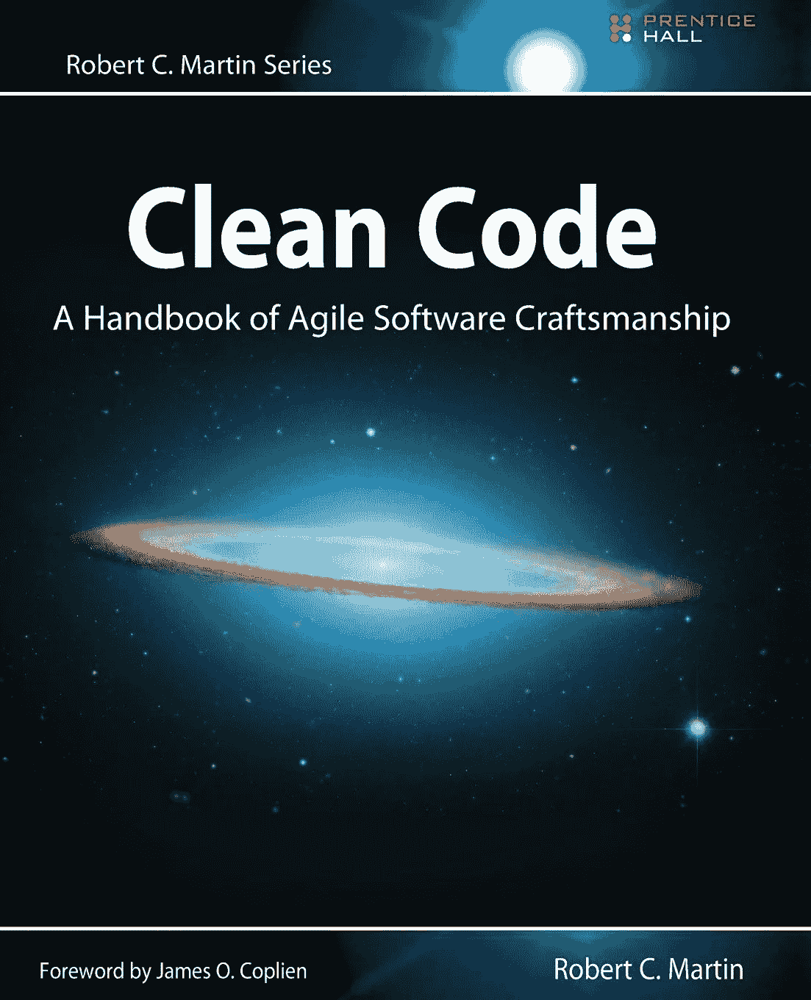
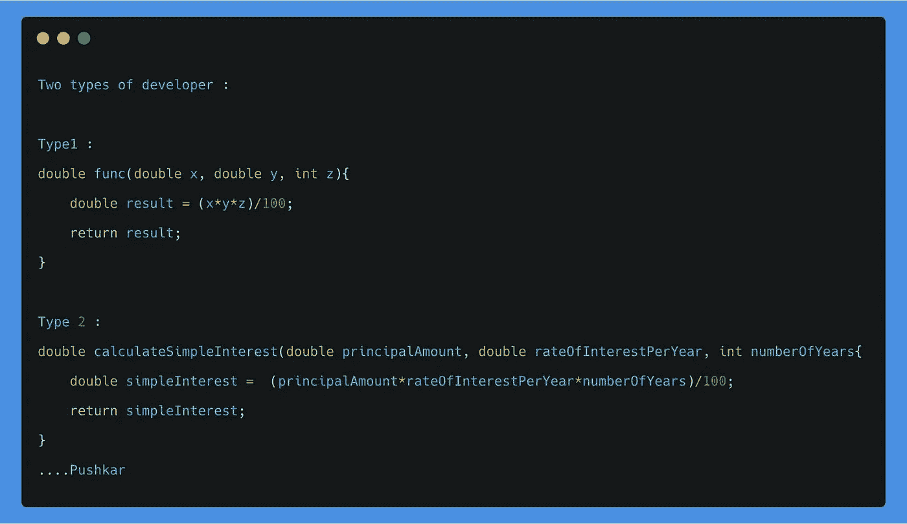
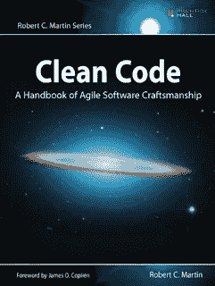
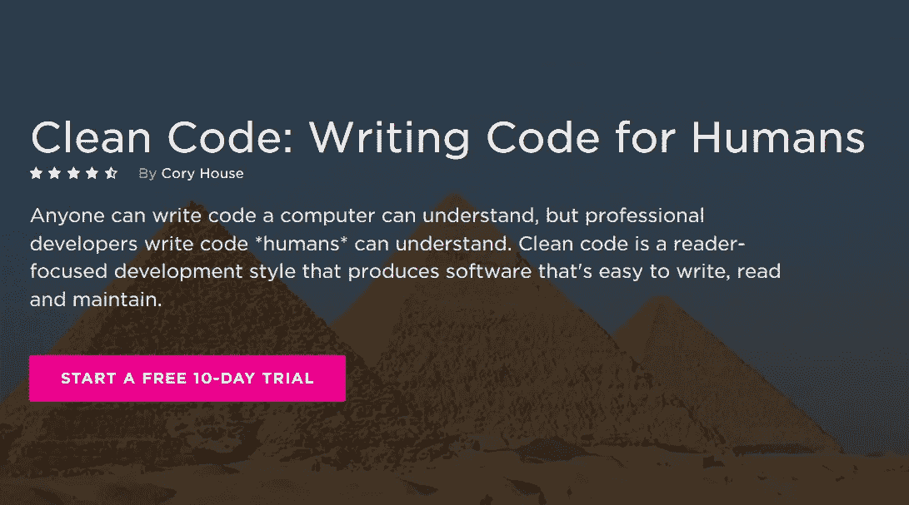

# 干净的代码审查——程序员必读的编码书籍

> 原文：<https://medium.com/javarevisited/clean-code-a-must-read-coding-book-for-programmers-9dc80494d27c?source=collection_archive---------1----------------------->

## 想学习将坏代码转换成好代码的艺术吗？这本书能有所帮助，值得 Java 程序员阅读。

image_credit —干净的代码簿

E 尽管 **Clean Code** 这本书在很多年前就已经出版了，并且已经有很多好的评论，我还是忍不住写下了我自己对这本伟大的书的体验。我在很多年前偶然看到了这本书，但是从那以后，我已经多次阅读了这本书，并且向我的读者、学生和开发人员推荐了这本书。

这是那种让你觉得为什么不早点看到它的书，当我第一次知道这本书的时候，我也有同样的感觉。 [**干净的代码**](http://www.amazon.com/Clean-Code-Handbook-Software-Craftsmanship/dp/0132350882?tag=javamysqlanta-20) 这本书讲的都是写好质量的代码，而你是如何判断代码质量的呢？

> 好吧，你不会欣赏好的，直到你看到了坏的代码，这就是这本书所做的。
> 
> 它首先呈现一段难看、难读、难理解、难维护的代码，然后[Bob 叔叔](https://medium.com/u/97aba963c3e2?source=post_page-----9dc80494d27c--------------------------------)一步一步地**重构这段代码**并将它们转换成你会为之自豪的杰作。

当你第一次阅读他的生成前 100 个质数的算法的例子时，你会尝到如何将坏代码转换成好代码的滋味。他解释了如何用厄拉多塞的[筛子来编写干净的代码](http://javarevisited.blogspot.sg/2015/05/sieve-of-Eratosthenes-algorithm-to-generate-prime-numbers-in-java.html#axzz4vpA7tbXo)是一个非常好的方法。

这是我在 LinkedIn 上找到的另一个**好代码与坏代码**的例子，它很好地抓住了干净代码的概念。

image_credit — Pushkar

你们中的一些人可能会说，干净的代码到底是什么？如果一个代码可以运行，那么它就足够了。其实不是。当我们过去在计算机科学实验室编写程序时，我们都会想到我们的教育项目和我们的学期实践考试，但现实世界是完全不同的，在这里你可以学到编写干净代码的艺术。

<https://click.linksynergy.com/deeplink?id=JVFxdTr9V80&mid=39197&murl=https%3A%2F%2Fwww.udemy.com%2Fclean-code%2F>  

其中一个原因是因为它不是一次性代码，它将比您预期的时间更长。例如，投资银行中的一些定价系统仍然在大型机中运行，而大型机已经有 40-50 年的历史了。如果一个代码不干净，它会使公司陷入困境，并降低其通过提供尖端解决方案保持竞争力的能力。既然一个代码在他的大部分生命周期中都需要维护，它必须允许你维护和扩展，这就是干净代码所做的。

重构也很容易，这是另一种编写干净代码的技术。如果你想了解更多关于重构的知识，我建议你加入 Udemy 上的 [**重构金字塔(Java)——逐步清理代码**](https://click.linksynergy.com/deeplink?id=JVFxdTr9V80&mid=39197&murl=https%3A%2F%2Fwww.udemy.com%2Fcourse%2Fpyramid-of-refactoring-java-interpreter-factories%2F) 课程，这是一门非常实用的学习 Java 重构技术的课程，如果你需要更多的选择，你也可以查看这个面向 Java 开发人员的最佳重构课程列表。

</javarevisited/7-best-courses-to-learn-refactoring-and-clean-coding-in-java-47bea3c67006>  

# 干净的代码值得一读吗？《干净代码手册》回顾

Clean Code book 结构良好，分为**三个主要部分**。第一部分讲述了编写干净代码的原则、模式和实践。这是我第一次了解到 [*固体设计原则*](https://click.linksynergy.com/deeplink?id=JVFxdTr9V80&mid=39197&murl=https%3A%2F%2Fwww.udemy.com%2Fcourse%2Fdesign-patterns-in-java-concepts-hands-on-projects%2F) 的地方，它改变了我写代码的方式。

例如，如果我不知道**“开放封闭设计原则”，**我永远也不会理解多态和抽象的全部力量。这些小原则不仅能帮助你更好地理解基础知识，还能帮助你写出更好的代码，更容易理解和维护。

第二部分充满了日益复杂的真实案例研究。每一个案例研究都是[将糟糕的代码转化为好代码](http://javarevisited.blogspot.sg/2014/01/10-tips-to-improve-programming-skill-become-better-programmer.html#ixzz3pN0N9tuF)的一次实践，更容易阅读、理解和维护。

顺便说一下，干净的代码不仅仅是关于架构，也是关于调试和性能，一个更容易阅读的代码也更容易调试和优化。

书名 [**《干净的代码:敏捷软件工艺手册》**](http://www.amazon.com/Clean-Code-Handbook-Software-Craftsmanship/dp/0132350882?tag=javamysqlanta-20) 完全证明了书中的内容是正确的，因为编码并不亚于工艺技术和他的论点*“即使糟糕的代码也能运行。但是如果代码不干净，它会使开发组织屈服。*

第三部分**是最重要的，一个回报，就像包含一系列启发法和代码的一个章节，在创建案例研究时收集气味。你可以把这一章作为一个知识库，描述我们在编写、阅读和清理代码时的思维方式。

这本书充满了[编程最佳实践](http://javarevisited.blogspot.sg/2014/10/10-java-best-practices-to-name-variables-methods-classes-packages.html#axzz4vpA7tbXo)，我的意思是正确命名变量、类和方法，你们中的一些人也可以在这里找到。**

它还非常强调[单元测试](https://javarevisited.blogspot.com/2019/04/top-5-junit-and-unit-testing-courses-java-programmers.html)和[测试驱动开发](https://dzone.com/articles/top-5-junit-and-unit-testing-courses-for-java-prog)，这是职业程序员的特征之一，也是他们区别于业余程序员的地方。

总之，**程序员必读书籍**，看完这本书，你应该能

*   区分好的和有害的代码。
*   写好代码以及如何将坏代码转化为好代码
*   创建好的名字、好的函数、好的对象和好的类
*   格式化代码以获得最大的可读性
*   在不模糊代码逻辑的情况下实现完整的错误处理
*   单元测试和实践测试驱动开发

顺便说一句，如果你不仅对一本书感兴趣，还对一些提高代码质量的在线培训课程感兴趣，我建议你查看来自 Pluralsight 的 Cory House 的免费课程 [**清洁代码:为人类编写代码**](https://pluralsight.pxf.io/c/1193463/424552/7490?u=https%3A%2F%2Fwww.pluralsight.com%2Fcourses%2Fwriting-clean-code-humans) 。

注册 [**10 天免费试用**](http://pluralsight.pxf.io/c/1193463/424552/7490?u=https%3A%2F%2Fwww.pluralsight.com%2Flearn) 即可获得绝对免费；允许你观看 200 分钟的任何课程。反正 Pluralsight 到处都是这样的宝石，它的月会员是每个程序员都应该考虑拥有的。

<http://pluralsight.pxf.io/c/1193463/424552/7490?u=https%3A%2F%2Fwww.pluralsight.com%2Flearn>  

以上是对**“干净代码:敏捷软件工艺手册”**的回顾，这是任何想要写出更好代码的开发人员、软件工程师、项目经理、团队领导或系统分析师的必读书籍之一。所以，如果你这时只想做一件事，就去 [**读干净代码**](http://www.amazon.com/Clean-Code-Handbook-Software-Craftsmanship/dp/0132350882?tag=javamysqlanta-20) 。你花的每一分钱，每一秒都是值得的。

你可能喜欢的其他**编程资源**和**书籍**

*   [搜索算法书评](/hackernoon/grokking-algorithms-book-review-aa4459da93f5)
*   [Java 和 Web 开发人员应该学习的 10 件事](http://javarevisited.blogspot.sg/2017/12/10-things-java-programmers-should-learn.html#axzz53ENLS1RB)
*   [Java 开发者应该知道的 10 个测试工具](http://javarevisited.blogspot.sg/2018/01/10-unit-testing-and-integration-tools-for-java-programmers.html)
*   [Java 并发实践书评](https://dzone.com/articles/does-java-concurrency-in-practice-still-valid-toda)
*   [10 门免费课程学习数据结构和算法](/javarevisited/top-10-free-data-structure-and-algorithms-courses-for-beginners-best-of-lot-ad807cc55f7a?source=collection_home---4------0-----------------------)
*   [每个 Java 开发人员都应该学习的 20 个库](https://javarevisited.blogspot.com/2018/01/top-20-libraries-and-apis-for-java-programmers.html)
*   【Java 开发人员在日常工作中使用的 10 种工具
*   [每个 Java 程序员都应该读的 10 本书](http://www.java67.com/2018/02/10-books-java-developers-should-read-in.html)
*   [学习数据结构和算法的 10 本最佳书籍](/javarevisited/10-best-books-for-data-structure-and-algorithms-for-beginners-in-java-c-c-and-python-5e3d9b478eb1)
*   [十大编程语言开始学习编码](http://www.java67.com/2017/12/10-programming-languages-to-learn-in.html)

感谢您阅读本文。如果你喜欢这篇干净的代码书评，请与你的朋友和同事分享。如果您有任何问题或反馈，请留言。

**P. S.** —如果你正在寻找学习设计模式以编写干净代码的在线课程，那么我也建议你看看 Udemy 上 Dmitri Nestruk 的[**Java 设计模式**](https://click.linksynergy.com/deeplink?id=JVFxdTr9V80&mid=39197&murl=https%3A%2F%2Fwww.udemy.com%2Fcourse%2Fdesign-patterns-java%2F) 课程。它将极大地提高您对用 Java 编写健壮且易于维护的面向对象代码的理解。

<https://click.linksynergy.com/deeplink?id=JVFxdTr9V80&mid=39197&murl=https%3A%2F%2Fwww.udemy.com%2Fcourse%2Fdesign-patterns-java%2F> 