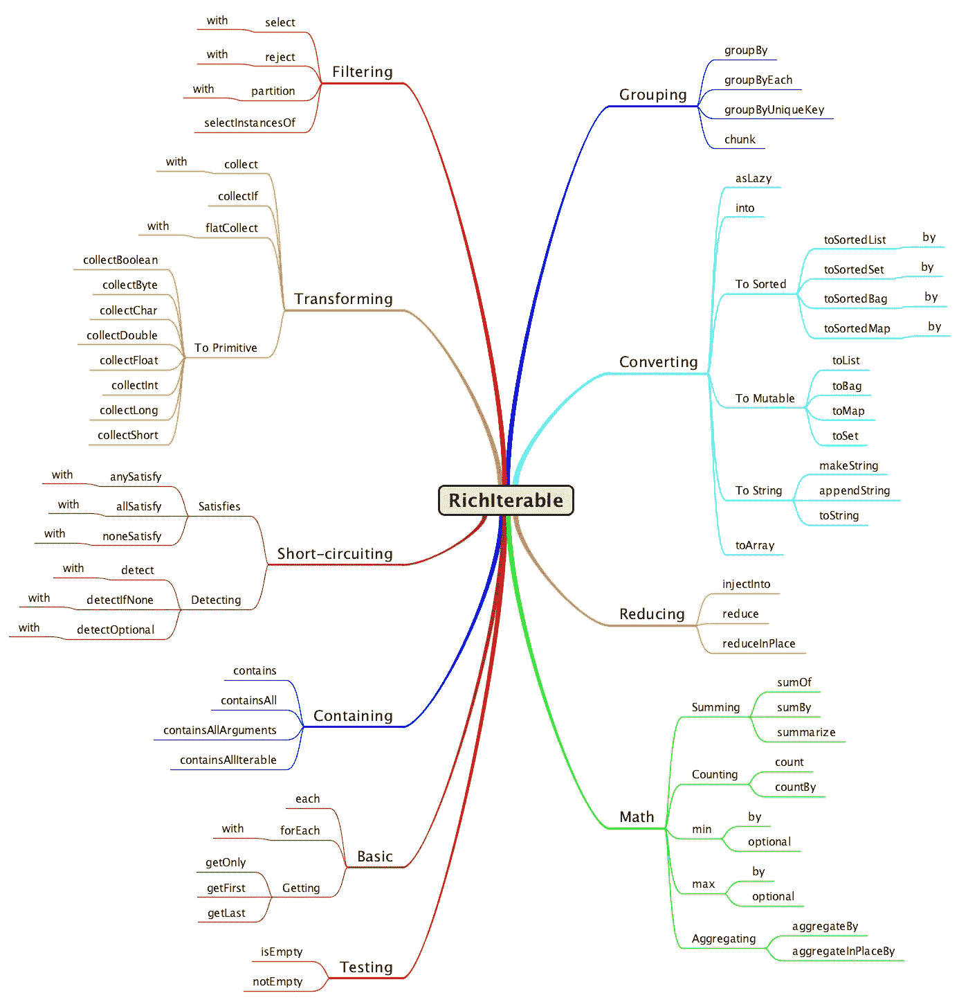

# 代码复制

> 原文：<https://medium.com/javarevisited/code-duplication-1e1f759a7fe3?source=collection_archive---------0----------------------->

重复的代码让我发痒，直到我把它擦掉。


发痒的干草！

# 我讨厌代码复制

没有什么比代码复制更让我烦恼的了。每次我发现代码库中有重复的地方，我都会感到难以忍受的痒。消除瘙痒的唯一方法是找到一种合适的方法来消除重复。

很多年前，当我发现代码重复时，我总是会想起 Ryan King 在雅虎论坛上发表的一篇文章中的这段话。

> 所以，复制很糟糕。一个人越讨厌重复，我就越相信他们在管理信息方面的观点。一个程序员，一旦注意到一些冗余，应该会陷入恐慌，开始喘不过气来，结结巴巴地说“El diablo！！El diablo está en mi 软件！”。
> 
> —瑞安·金

那么当我们发现代码重复时，我们能做些什么呢？我们可以学习去除它的方法。Google 和 StackOverflow 是寻找解决许多常见编程问题的答案的绝佳资源。它们可以是您发现和学习新 API 的第一站，这可能有助于减少您以前编写的一些重复代码。

# 简单的复制模式

有时代码重复很容易被发现和删除。我将从描述一些我一直在代码库中发现的非常简单的常见复制模式开始。

## 布尔测试模式

测试一个`boolean`值并返回真或假。这些年来，我见过的这种代码模式比你想象的还要多。

```
public boolean isSomething()
{
    if (!this.calculateSomeBooleanValue())
    {
        return true;
    }
    else
    {
        return false;
    }
}
```

改为写这个。

```
public boolean isSomething()
{
    return !this.calculateSomeBooleanValue();
}
```

## 集合工厂模式

这里有另一个简单的模式，可以很容易地修复。这种代码在测试用例中非常常见。解决包括测试在内的整个代码库的代码重复问题是很重要的。

```
List<String> list = new ArrayList<>();
list.add(**"one"**);
list.add(**"two"**);
list.add(**"three"**);
```

使用 Eclipse 集合[可变工厂模式](/@donraab/as-a-matter-of-factory-part-1-mutable-75cc2c5d72d9)可以如下替换这段代码。

```
List<String> list = Lists.***mutable***.with(**"one"**, **"two"**, **"three"**);
```

这里有一个 StackOverflow 上的回答，展示了用 Eclipse 集合在一行中初始化列表、集合和打包的不同[方法。](https://stackoverflow.com/questions/1005073/initialization-of-an-arraylist-in-one-line/28183168#28183168)

## 不可修改的静态集合初始值设定项模式

以下代码在 Java 9 之前的 Java 版本中很常见，用于创建静态的不可修改的`List`。

```
public static final List<String> *LIST*;

static
{
    List<String> newList = new ArrayList<>();
    newList.add(**"one"**);
    newList.add(**"two"**);
    newList.add(**"three"**);
    *LIST* = Collections.*unmodifiableList*(newList);
}
```

这可以用普通的旧 Java 更简单地写成如下。

```
public static final List<String> ***LIST*** =
        Collections.*unmodifiableList*(
                Arrays.*asList*(**"one"**, **"two"**, **"three"**));
```

这也可以使用 Eclipse 集合进行替换，如下所示。

```
public static final List<String> LIST =
        Lists.***mutable***.with(**"one"**, **"two"**, **"three"**).asUnmodifiable();
```

从 Java 9 开始，您还可以编写以下代码。方法`List.of()`返回一个不可修改的列表。

```
public static final List<String> LIST = 
        List.*of*(**"one"**, **"two"**, **"three"**);
```

如果您想拥有一个像没有可变方法的`ImmutableList`这样的契约式不可变接口，您也可以使用 Eclipse 集合中的`ImmutableList`。

```
public static final ImmutableList<String> LIST = 
        Lists.***immutable***.with(**"one"**, **"two"**, **"three"**);
```

## 静态映射初始化模式

如果在`Map`中有三个或四个以上的键/值对，初始化一个静态的`Map`可能会更有挑战性。

```
public static final Map<Integer, String> ***MAP***;

static
{
    Map<Integer, String> newMap = new HashMap<>();
    newMap.put(1, **"one"**);
    newMap.put(2, **"two"**);
    newMap.put(3, **"three"**);
    newMap.put(4, **"four"**);
    newMap.put(5, **"five"**);
    ***MAP*** = Collections.*unmodifiableMap*(newMap);
}
```

重构以使用 Eclipse 集合不可修改的映射。

```
public static final Map<Integer, String> ***MAP*** =
        Maps.***mutable***.<Integer, String>empty()
                .withKeyValue(1, **"one"**)
                .withKeyValue(2, **"two"**)
                .withKeyValue(3, **"three"**)
                .withKeyValue(4, **"four"**)
                .withKeyValue(5, **"five"**)
                .asUnmodifiable();
```

重构使用一个 Eclipse 集合`ImmutableMap`，它的接口中也没有突变方法。

```
public static final ImmutableMap<Integer, String> ***MAP*** =
        Maps.***mutable***.<Integer, String>empty()
                .withKeyValue(1, **"one"**)
                .withKeyValue(2, **"two"**)
                .withKeyValue(3, **"three"**)
                .withKeyValue(4, **"four"**)
                .withKeyValue(5, **"five"**)
                .toImmutable();
```

这是 StackOverflow 上的一个回答，展示了用 Eclipse 集合初始化静态地图的各种[方法。](https://stackoverflow.com/questions/507602/how-can-i-initialise-a-static-map/13943037#13943037)

# 迭代模式

我开始构建 [Eclipse 集合](https://github.com/eclipse/eclipse-collections)的主要原因之一是，我会看到开发人员一遍又一遍地编写相同的 for 循环。开发人员不断地在 Java 中重新实现集合迭代模式。我看到代码复制无处不在！在 Java 8 之前，开发人员这样做是因为 Java 开发人员可用的迭代模式仅限于 Collections 实用程序类。从 JDK 1.4 开始，Eclipse 集合就一直在开发中，并用于生产中。在过去的十五年里，Eclipse Collections 一直是我在 Java 中删除重复迭代模式代码的首选解决方案。

## 过滤模式

在 Java 8 之前，以下是根据某种条件将源集合过滤为目标集合的常用方法。

```
List<Integer> source = Arrays.asList(1, 2, 3, 4, 5);
List<Integer> target = new ArrayList<>();
for (Integer value : source)
{
    if (value % 2 == 0)
    {
        target.add(value);
    }
}
```

下面是使用 Eclipse Collections `select`方法重构的相同代码。

```
MutableList<Integer> source = Lists.***mutable***.with(1, 2, 3, 4, 5);
MutableList<Integer> target = source.select(each -> each % 2 ==0);
```

下面是 StackOverflow 对“过滤 Java 集合的最佳方式是什么？”这个问题的[回答](https://stackoverflow.com/questions/122105/what-is-the-best-way-to-filter-a-java-collection/12573823#12573823)

## 转换模式

在 Java 8 之前，以下是将一种集合类型转换成另一种集合类型的典型方式。

```
List<Integer> source = Arrays.asList(1, 2, 3, 4, 5);
List<String> target = new ArrayList<>();
for (Integer value : source)
{
    target.add(value.toString());
}
```

下面是使用 Eclipse Collections `collect`方法重构的相同代码。

```
MutableList<Integer> source = Lists.***mutable***.with(1, 2, 3, 4, 5);
MutableList<String> target = source.collect(Object::toString);
```

## 任何/所有/无模式

在 Java 8 之前，您要么使用带有`boolean`变量的`break`语句，要么从 if 语句内部直接返回，以查看集合中的元素是否匹配给定条件。

## 任何模式

```
List<Integer> source = Arrays.asList(1, 2, 3, 4, 5);
boolean **anyEvens** = false;
for (Integer value : source)
{
    if (value % 2 == 0)
    {
        **anyEvens** = true;
        break;
    }
}
```

用 Eclipse Collections `anySatisfy`方法重构。

```
MutableList<Integer> source = Lists.***mutable***.with(1, 2, 3, 4, 5);
boolean anyEvens = source.anySatisfy(each -> each % 2 == 0);
```

## 所有模式

```
List<Integer> source = Arrays.asList(1, 2, 3, 4, 5);
boolean **allEvens** = true;
for (Integer value : source)
{
    if (value % 2 != 0)
    {
        **allEvens** = false;
        break;
    }
}
```

用 Eclipse 集合`allSatisfy`方法重构。

```
MutableList<Integer> source = Lists.***mutable***.with(1, 2, 3, 4, 5);
boolean allEvens = source.allSatisfy(each -> each % 2 == 0);
```

## 无模式

```
List<Integer> source = Arrays.asList(1, 2, 3, 4, 5);
boolean **noneEvens** = true;
for (Integer value : source)
{
    if (value % 2 == 0)
    {
        **noneEvens** = false;
        break;
    }
}
```

用 Eclipse 集合`noneSatisfy`方法重构。

```
MutableList<Integer> source = Lists.***mutable***.with(1, 2, 3, 4, 5);
boolean noneEvens = source.noneSatisfy(each -> each % 2 == 0);
```

## 其他迭代模式

Eclipse 集合中还有许多其他迭代模式可以帮助您删除重复的代码。仅在`[RichIterable](https://www.eclipse.org/collections/javadoc/9.2.0/org/eclipse/collections/api/RichIterable.html)`父接口上就有超过一百种迭代模式和其他方法。



丰富的 API

# 有时代码复制是必要的

有时候，代码复制是解决性能问题的最佳解决方案。Eclipse 集合中一个很好的例子是原始集合。Eclipse Collections 对所有八种原语组合(`boolean`、`byte`、`char`、`double`、`float`、`int`、`long`、`short`)的列表、集合、包、堆栈和地图都有原语集合支持。实现所有这些容器类型的代码几乎是相同的。因此，如果您阅读 IntArrayList 的代码，它看起来会与`ShortArrayList`和`LongArrayList`中的代码非常相似。在您希望为 Java 中的基本类型提供库支持的情况下，重要的是尽可能利用代码生成策略，并且不要手动复制代码。对于 Eclipse 集合，我们使用 [StringTemplate](https://www.stringtemplate.org/) 库，并为每种容器类型编写一次模板，然后使用这些模板生成支持所有原语所需的八种容器类型。

在未来，如果 Valhalla 项目的工作成为 JDK 发布的一部分，并且我们获得了对基本类型的通用专门化的支持，我们可能会在 Java 中有新的语言级别策略，以减少我们今天必须生成的支持基本类型的代码量。我非常兴奋地看到这种支持可能会减少我们的代码复制负担。

# 复制的其他模式

那里有更多的复制模式。您的 IDE 和各种代码分析工具有时可以帮助您找到复制和粘贴导致的明显问题。其他时候，你可能只需要阅读你的代码，看看你是否能识别出一些代码过于详细地描述如何做某事的模式(因为循环有时是一种暗示)。写得好的代码应该清楚地告诉你**它在做什么**，而不是它是如何做的。

删除重复代码让我觉得很满足。它有助于降低应用程序或库的总拥有成本。需要阅读、测试、维护和部署的代码越少，意味着需要发现、调试和修复的潜在错误就越少。

[*月食收藏*](https://github.com/eclipse/eclipse-collections) *为* [*投稿*](https://github.com/eclipse/eclipse-collections/blob/master/CONTRIBUTING.md) *开放。如果你喜欢这个库，你可以在 GitHub 上让我们知道。*