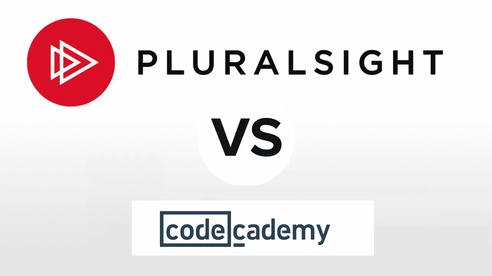
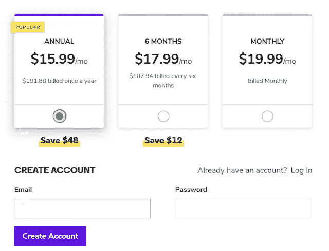

# CodeCademy vs plural sight vs educational Review？2023 年哪个最好？

> 原文：<https://medium.com/javarevisited/codecademy-or-pluralsight-which-is-a-better-platform-to-learn-coding-skills-59251a080642?source=collection_archive---------0----------------------->

## 这很重要，因为程序员需要不断学习，但在 CodeCademy、Pluralsight 和 Educative 之间，2023 年最好的在线学习平台是哪个？

不断学习和保持自我更新是编程生涯中最大的挑战，这就是为什么我总是希望提升我的技术技能。作为一个 [Java 博客](https://javarevisited.blogspot.com/)的作者和一个[媒体出版物](https://medium.com/javarevisited)的编辑，我收到了很多来自程序员和开发人员的询问。我的许多读者向我寻求建议，比如应该学习哪些书籍，哪个网站是学习编码的最佳网站？

我应该去哪里准备编码面试等等？我一直想到的一个问题是关于多重视觉和代码层？比如，哪个网站更适合学习新的技术技能和提升你目前的技能？

> 这是一个非常重要的问题，因为学习是职业程序员职业生涯中必不可少的一部分。如果你不学习新的东西，不提升自己，你会在工作和职业生涯中落后。

我经常建议我的读者和程序员同事投入一些时间和金钱来学习一些平台，如<https://click.linksynergy.com/deeplink?id=JVFxdTr9V80&mid=39197&murl=https%3A%2F%2Fwww.udemy.com%2F>**[**Coursera**](https://coursera.pxf.io/c/3294490/1164545/14726?u=https%3A%2F%2Fwww.coursera.org%2F)**one month**[**CodeCademy**](https://www.pjatr.com/t/TUJGR0lLR0JHRklJSkhCR0ZISk1N?url=https%3A%2F%2Fwww.codecademy.com%2Fpro%2Fmembership)[**LinkedIn Learning**](http://linkedin-learning.pxf.io/c/1193463/449670/8005)[**Educative**](https://www.educative.io?affiliate_id=5073518643380224)**Treehouse 写一篇关于复数视线 vs CodeCademy 的评论。

虽然在 [Udemy 和 Pluralsight](https://javarevisited.blogspot.com/2019/10/udemy-vs-pluralsight-review-which-is-better-to-learn-code.html) 之间进行选择很容易，因为一个是课程市场，你可以购买你想要的方向，只需为此付费，Pluralsight 有一个基于订阅的模式，加入 Pluralsight 意味着你可以访问他们所有的 7000 多门在线课程、测验、评估等等。你不需要选择和购买课程，只需一次订阅，你就可以上你想上的所有课程，这有点方便。

但是，当谈到 [**Codecademy**](https://www.pjatr.com/t/TUJGR0lLR0JHRklJSkhCR0ZISk1N?url=https%3A%2F%2Fwww.codecademy.com%2Fpro%2Fmembership) 和 [**Pluralsight**](http://pluralsight.pxf.io/c/1193463/424552/7490?u=https%3A%2F%2Fwww.pluralsight.com%2Flearn) 时，它们在支付和金钱方面非常相似，因为它们都提供基于订阅的模式，但它们之间仍有一些关键的差异，我们将在本文中进行回顾。顺便说一句，如果你购买任何付费计划，我也会得到报酬。****

# ****Pluralsight vs CodeCademy 年回顾****

****我给你三个标准来比较 [Pluralsight](http://pluralsight.pxf.io/c/1193463/424552/7490?u=https%3A%2F%2Fwww.pluralsight.com%2Flearn) 和 CodeCademy。这些要点将帮助你根据你的兴趣和学习方式决定哪一个是学习新技术的最佳在线平台。****

## ****1.教学风格(互动与视频)****

****Pluralsight 和 CodeCademy 的首要区别是学习风格或教学风格。 [**CodeCademy**](https://www.pjatr.com/t/TUJGR0lLR0JHRklJSkhCR0ZISk1N?url=https%3A%2F%2Fwww.codecademy.com%2Fpro%2Fmembership) 是 100%互动的，在这里你将一边读书或学习一边做事。你将在同一个屏幕上看到信息和练习控制台，这实际上鼓励你边做边学。****

> ****虽然这很好，但是在网上学习的时候并不总是可以做这个练习。例如，当我旅行或通勤上班时，我更喜欢观看在线视频，而不是在终端上编码。****

****当我坐在公共汽车或火车上时，不仅看视频更舒服，我更倾向于听。所以，如果你想最好地利用你的通勤时间，学习新技术，Pluralsight 有很多课程。****

****既然边做边学是最好的学习方法，如果你也喜欢这样，那么 [**CodeCademy**](https://www.pjatr.com/t/TUJGR0lLR0JHRklJSkhCR0ZISk1N?url=https%3A%2F%2Fwww.codecademy.com%2F) 是比 [**Pluralsight**](http://pluralsight.pxf.io/c/1193463/424552/7490?u=https%3A%2F%2Fwww.pluralsight.com%2Flearn) 更好的选择。****

> ****但是，如果你更喜欢看视频，想更好地利用你的旅行时间，然后在家或办公室练习编码，那么 Pluralsight 是你更好的选择。****

********

## ****2.内容****

****说到内容，尤其是内容的数量，Pluralsight 显然超过了 CodeCademy。Pluralsight 拥有超过 5000 门课程，可以学习几乎任何编程语言，如 [Java](https://javarevisited.blogspot.com/2017/12/10-things-java-programmers-should-learn.html#axzz5atl0BngO) 、 [C++](http://www.java67.com/2018/02/5-free-cpp-courses-to-learn-programming.html) 、 [Golang](/javarevisited/7-online-courses-to-learn-golang-or-go-programming-languages-in-2020-f599a25cf14a) 、 [Swift](https://javarevisited.blogspot.com/2019/01/top-5-ios-developer-course-to-learn-ios.html) 、 [Python](/better-programming/top-5-courses-to-learn-python-in-2018-best-of-lot-26644a99e7ec) 、 [JavaScript](https://javarevisited.blogspot.com/2018/06/top-10-courses-to-learn-javascript-in.html) 、 [Ruby](https://www.java67.com/2018/02/5-free-ruby-and-rails-courses-to-learn-online.html) 、 [Kotlin](https://javarevisited.blogspot.com/2018/02/5-courses-to-learn-kotlin-programming-java-android.html) 、 [Scala](https://javarevisited.blogspot.com/2019/01/5-free-scala-programming-courses-for-java-programmers-learn-online.html) 、Groovy、C、C#、Django、Flask 等框架 NET，以及 SQL、数据库、数据科学、机器学习、Linux 等技能。

你可以随便找一个课程学习几乎任何你想学的东西，包括 SVN 和 Git 以及一些古代和现代的工具，还有像 [Docker](/javarevisited/top-10-free-courses-to-learn-maven-jenkins-and-docker-for-java-developers-51fa7a1e66f6) 、 [Jenkins](https://javarevisited.blogspot.com/2018/09/top-5-jenkins-courses-for-java-and-DevOps-Programmers.html) 、 [Maven](https://javarevisited.blogspot.com/2019/03/top-5-course-to-learn-apache-maven-for.html) 、 [Kubernetes](https://javarevisited.blogspot.com/2019/01/top-5-free-kubernetes-courses-for-DevOps-Engineer.html) 、 [Gradle](/javarevisited/5-best-gradle-courses-and-books-to-learn-in-2021-93f49ce8ff8e) 、 [WebPack](https://javarevisited.blogspot.com/2021/12/top-5-courses-to-learn-npm-and-webpack.html) 、NPM 等。

另一件事是 [Pluralsight 课程](http://pluralsight.pxf.io/c/1193463/424552/7490?u=https%3A%2F%2Fwww.pluralsight.com%2Flearn)大多由他们领域的专家教授，这意味着你直接从权威那里学习。如果你查看 Pluralsight 讲师的简介，你会发现那里有几位著名的专业人士，比如 José Paumard，其中一位 Java 冠军在那里开设了一门关于 Java 多线程和并发性的课程。****

****Richard Warburton 是另一位 Java 冠军，他在 Pluralsight 上撰写了 [Java 集合课程](https://pluralsight.pxf.io/c/1193463/424552/7490?u=https%3A%2F%2Fwww.pluralsight.com%2Fcourses%2Fjava-fundamentals-core-platform)。然后你有来自萨梅尔·布纳、斯科特·艾伦、皮纳尔·戴夫和许多其他专家的课程。

虽然 [CodeCademy](https://www.pjatr.com/t/TUJGR0lLR0JHRklJSkhCR0ZISk1N?url=https%3A%2F%2Fwww.codecademy.com%2Fpro%2Fmembership) 没有那么多课程或技能路径，但它为大多数基本技能设计了巧妙的课程，如 [Web 开发](/better-programming/my-5-favorite-courses-to-learn-web-development-in-2019-a5e74167f8b2)、编程和计算机科学[、机器学习](https://hackernoon.com/10-machine-learning-data-science-and-deep-learning-courses-for-programmers-7edc56078cde)和[数据科学](https://dev.to/javinpaul/10-data-science-and-machine-learning-courses-for-programmers-looking-to-switch-career-57kd)等等。****

********

****他们关于编程语言的课程像[学 Java](https://www.pntrs.com/t/TUJGR0lLR0JHRklJSkhCR0ZISk1N?url=https%3A%2F%2Fwww.codecademy.com%2Flearn%2Flearn-java) 、[学 C++](/javarevisited/top-10-courses-to-learn-c-for-beginners-best-and-free-4afc262a544e) 、[、**学 Python 3**](https://www.pntrs.com/t/TUJGR0lLR0JHRklJSkhCR0ZISk1N?url=https%3A%2F%2Fwww.codecademy.com%2Flearn%2Flearn-python-3) 、[学 Go](/javarevisited/7-online-courses-to-learn-golang-or-go-programming-languages-in-2020-f599a25cf14a) 也让人印象深刻。事实上，他们与谷歌一起创建了 Learn Go 课程，这使它成为一门非常棒和有趣的课程。你在实践中学习；你得到即时反馈，这加强了学习。

这意味着 [Pluralsight](http://pluralsight.pxf.io/c/1193463/424552/7490?u=https%3A%2F%2Fwww.pluralsight.com%2Flearn) 为你提供了学习任何编程语言、框架、工具和技术的一站式服务，而 [CodeCademy](https://www.pjatr.com/t/TUJGR0lLR0JHRklJSkhCR0ZISk1N?url=https%3A%2F%2Fwww.codecademy.com%2Fpro%2Fmembership) 则提供了一些最流行的技能。这是一种独特的学习方法，互动平台也很有帮助。当我谈到内容时，让我指出我不喜欢复数视线的一点。有些球场非常古老，你最好远离它们。****

****因为 [Pluralsight](http://pluralsight.pxf.io/c/1193463/424552/7490?u=https%3A%2F%2Fwww.pluralsight.com%2Flearn) 有如此多的课程和更新的课程，所以也有 2011 年到 2012 年间的课程，这有点老了，不再相关了。这不是一个决定性的因素，因为他们确实有许多选择，但有些事情值得了解。****

## ****3.价格****

****说到价格，Codecademy 比 Pluralsight 稍微便宜一些。 [**Codecademy Pro 会员**](https://www.pjatr.com/t/TUJGR0lLR0JHRklJSkhCR0ZISk1N?url=https%3A%2F%2Fwww.codecademy.com%2Fpro%2Fmembership) 每月花费约**15.99 美元**(账单为每年 191.88 美元)，这样你可以节省 48 美元，这也是他们最受欢迎的选择。****

****<https://www.pjatr.com/t/TUJGR0lLR0JHRklJSkhCR0ZISk1N?url=https%3A%2F%2Fwww.codecademy.com%2Fpro%2Fmembership>  

他们还有一个 6 个月的计划，每月花费约 17.99 美元，还有一个月计划，每月花费约 19.99 美元，但相应地按 6 个月和每月计费。

他们的付费计划提供独家测验、项目、定制学习路径和社区支持，因为您有机会与其他专业会员联系，进行协作、共享资源等。

下面是 [**CodeCademy Pro 订阅计划**](https://www.pjatr.com/t/TUJGR0lLR0JHRklJSkhCR0ZISk1N?url=https%3A%2F%2Fwww.codecademy.com%2Fpro%2Fmembership) 的快照:

就 Pluralsight 而言，他们的年度订阅费用约为 299 美元(14%)，相比之下，每月订阅费用约为 29 美元。但是，如果你幸运的话，你还可以在他们推出 [**33%的折扣优惠**](https://pluralsight.pxf.io/c/1193463/424552/7490?u=https%3A%2F%2Fwww.pluralsight.com%2Fpricing) 时获得 199 美元的 Pluralsight 会员资格，这就是他们现在正在推出的优惠。这非常接近 CodeCademy 191.88 美元的计划，但你将获得更多的课程和内容。他们的年度计划允许访问他们的整个课程库、学习路径、频道、课程学习检查、课程讨论、练习文件、移动和电视应用程序，以及离线观看，这非常棒。他们也有一个[**plural sight Premium plan**](https://pluralsight.pxf.io/c/1193463/424552/7490?u=https%3A%2F%2Fwww.pluralsight.com%2Fpricing)一般价格在 499 美元左右，但他们提供 33%的折扣，这意味着你只需 299 美元就可以得到这个计划。该计划提供认证实践考试、互动课程和真实项目，这就是 CodeCademy Pro 提供的内容。

以下是 [**Pluralsight 个人和保费计划**](https://pluralsight.pxf.io/c/1193463/424552/7490?u=https%3A%2F%2Fwww.pluralsight.com%2Fpricing) 的简介:

所以，肯定的，CodeCademy 稍微便宜一点；考虑到他们拥有的内容数量，Pluralsight 在价格上也不会落后太多。

以上是我对 [**上的复习**](http://pluralsight.pxf.io/c/1193463/424552/7490?u=https%3A%2F%2Fwww.pluralsight.com%2Flearn)**vs .**[**CodeCademy**](https://www.pjatr.com/t/TUJGR0lLR0JHRklJSkhCR0ZISk1N?url=https%3A%2F%2Fwww.codecademy.com%2Fpro%2Fmembership)以及你应该选择哪个线上平台进行学习。

> *最终一切都会按照你想要的来？哪种教学或学习方式适合你？*

价格上有一点点差别，但当你比较 Pluralsight 和 CodeCademy 上的内容和课程数量时，这是完全合理的。

如果你更喜欢互动学习，并且预算紧张，请加入 CodeCademy Pro 如果你想访问多样化的在线培训平台，并且可以支付 299 美元(因为现在提供 33%的折扣)，请加入 Pluralsight Premium 计划。

<http://pluralsight.pxf.io/c/1193463/424552/7490?u=https%3A%2F%2Fwww.pluralsight.com%2Flearn>  

# Educative.io vs Pluralsight 评论

如果你不知道 Educative 是另一个在线学习平台，它因其基于文本的互动学习课程而获得了很大的吸引力。阅读通常比观看更快，如果你更喜欢阅读文本而不是观看视频，那么这就是结账的平台。

它有一些为编码面试做准备的最好的课程，像[钻研系统设计](https://www.educative.io/collection/5668639101419520/5649050225344512?affiliate_id=5073518643380224)和[钻研编码面试模式](https://www.educative.io/collection/5668639101419520/5671464854355968?affiliate_id=5073518643380224)。我强烈推荐他们。

<https://www.educative.io/collection/5668639101419520/5649050225344512?affiliate_id=5073518643380224>  <https://www.educative.io/collection/5668639101419520/5671464854355968?affiliate_id=5073518643380224>  

它也有很多像这个[免费 JavaScript 教程](https://www.educative.io/courses/learn-html-css-javascript-from-scratch)这样的免费资源来学习必要的技术。

你可以免费注册这门课程，但如果你喜欢充分利用这个平台，我建议你购买它的 [**教育订阅**](https://www.educative.io/subscription?affiliate_id=5073518643380224) ，每月花费 **$14.9** (现在有 50%的折扣)，对于需要持续学习的程序员和软件工程师来说完全值得。

如果你喜欢这个平台，那么订阅比购买个人课程更划算。它可以无限制地访问他们的所有课程。

我只能说 Educative 是一个基于文本的互动学习的伟大平台，他们的编码面试课程真的很好。如果你有任何关于加入这些学习平台的问题，请随意提问，我很乐意回答和指导。

您可能喜欢的其他**编程**和**开发**文章:

*   [2023 年 Java 开发者路线图](https://javarevisited.blogspot.com/2019/10/the-java-developer-roadmap.html)
*   [Udemy vs CodeCademy vs one month](https://javarevisited.blogspot.com/2019/09/codecademy-vs-udemy-vs-onemonth-which-is-better-for-learning-code.html)
*   [2023 年学习 Python 的 5 大课程](https://hackernoon.com/top-5-courses-to-learn-python-in-2018-best-of-lot-26644a99e7ec)
*   [2023 年前端和后端开发者路线图](https://hackernoon.com/the-2019-web-developer-roadmap-ab89ac3c380e)
*   [20 多个网站免费学习编码](https://dev.to/javinpaul/top-20-websites-to-learn-coding-with-java-python-sql-algorithms-and-git-for-free-in-2019-best-of-lot-l2l)
*   程序员开发运维路线图
*   [我最喜欢的学习数据结构和算法的免费课程](https://www.freecodecamp.org/news/these-are-the-best-free-courses-to-learn-data-structures-and-algorithms-in-depth-4d52f0d6b35a/?gi=a41bf34d0c99)
*   [2023 年 Java 开发人员可以学到的 10 件事](/swlh/10-things-java-developer-should-learn-in-2019-5e0cf388e07f)
*   Java 和 Web 开发人员应该学习的 10 个框架
*   [在线学习 10 门免费 Python 编程课程](https://javarevisited.blogspot.com/2018/12/10-free-python-courses-for-programmers.html)
*   [2023 年学数据库和 SQL 的 5 门课程](https://hackernoon.com/top-5-sql-and-database-courses-to-learn-online-48424533ac61)

感谢您阅读本文。如果你喜欢 Pluralsight 和 CodeCademy 或任何其他在线学习平台之间的比较，那么请与你的朋友和同事分享，他们会喜欢的。如果您有任何问题或反馈，请留言。

**附言**——那我呢？我有哪些订阅？嗯，我的学习要求非常多样化，我学到了很多东西，所以我不仅订阅了 CodeCademy 和 Pluralsight，而且我还购买了许多关于[**【Udemy】**](https://click.linksynergy.com/deeplink?id=JVFxdTr9V80&mid=39197&murl=https%3A%2F%2Fwww.udemy.com%2F)**，**[**Coursera**](https://coursera.pxf.io/c/3294490/1164545/14726?u=https%3A%2F%2Fwww.coursera.org%2F)**，OneMonth，**[**CodeCademy**](https://www.pjatr.com/t/TUJGR0lLR0JHRklJSkhCR0ZISk1N?url=https%3A%2F%2Fwww.codecademy.com%2Fpro%2Fmembership)**，**[**LinkedIn Learning**不过，我最想去的地方是 Pluralsight 和 Udemy。

**p . p . s .**——如果你愿意，你也可以同时尝试 CodeCademy 和 Pluralsight，坚持选择你喜欢的那一个，但不要错过](http://linkedin-learning.pxf.io/c/1193463/449670/8005) [**Pluralsight 33%的优惠**](http://pluralsight.pxf.io/c/1193463/424552/7490?u=https%3A%2F%2Fwww.pluralsight.com%2Flearn) ，它不是每天都有，注册他们的个人或高级计划，以利用这一优惠。

<https://pluralsight.pxf.io/c/1193463/871608/7490> ****