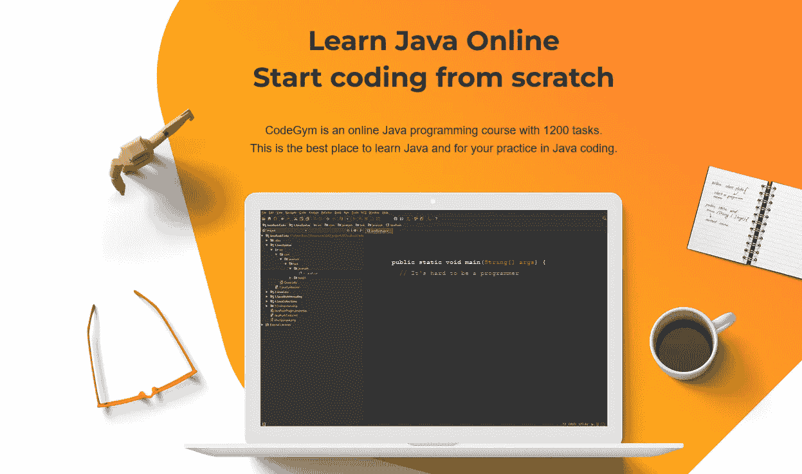
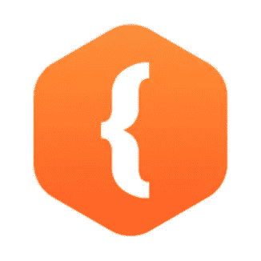
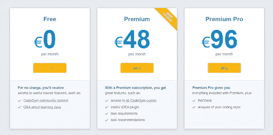

# CodeGym 评论 CodeGym Premium 值得在线学习 Java 吗？

> 原文：<https://medium.com/javarevisited/codegym-review-is-codegym-premium-worth-it-to-learn-java-online-d852c3b2f055?source=collection_archive---------1----------------------->

## 我对 Codegym 的评论，在线学习 Java 的互动平台之一。在本帖中，你会发现免费和高级 CodeGym 选项，以及哪一个是在线学习 Java 的最佳选择

大家好，如果你正在学习 Java 或者想学习 Java，但是不确定 CodeGym 是否适合你，那么你来对地方了。虽然 CodeGym 对于学习 Java 的初学者来说确实是一个不错的网站，但它并不适合所有人，尤其是那些想要深入学习 Java 概念(如并发性和 JVM 内部机制)的有经验的程序员。

早些时候，我已经分享了[免费学习 Java 编码的最佳地点](https://javarevisited.blogspot.com/2018/07/top-5-websites-to-learn-coding-in-java.html)，在本文中，我将回顾一下学习 Java 的互动平台之一 [**CodeGym**](https://codegym.cc/?ref=javinpaul3) 。但是，在我们看到 CodeGym 对于学习和掌握 Java 是否值得之前，让我告诉你一点关于 CodeGy 到底是什么。

CodeGym 是 Udemy 和 Coursera 等传统学习平台的一个优秀和创新的替代平台。它基本上是一个为想要学习 Java 的年轻热情的人设计的平台。CodeGym 平台的目标是在游戏的帮助下提供实用的学习方法，让学习变得有趣。

CodeGym 拥有一个包含 40 个不同级别的庞大库，以及超过 1200 个编码挑战，这将使学习远离枯燥和乏味。您可以通过理解基本的 Java 语法、面向对象编程原则、集合以及多线程来开始学习过程。

你需要记住的是 [CodeGym 学习平台](https://codegym.cc/sale/?ref=javinpaul3)覆盖了整个核心 Java，除了新版本 Java 的一些特性。

**注意** — CodeGym 现在正在进行大减价，一年的订阅价格为 149 美元，几乎是 75%的折扣，因为高级订阅的正常价格是每年 499 美元。您可以使用此链接获得此折扣，但仅在有限的时间内有效，之后年度保险费的价格将变为 499 美元/年。

这里是获得折扣的链接— [**加入 CodeGym，每年 149 美元**](https://codegym.cc/sale/?ref=javinpaul3)

在运用所学知识解决一定数量的编码任务之前，你会参加有趣的讲座。然后你将继续下一堂课，解决更多的编码练习，等等。您可以向 [**CodeGym 智能验证器**](https://codegym.cc/?ref=javinpaul3) 提交您对这些编码任务的解决方案。如果你的解决方案不正确，智能验证会给你各种提示，并为你指出正确的方向。

您可以通过完成特定练习中的所有编码挑战来解锁下一个级别。此外，还有几个游戏化的任务，你可以完成，以获得额外的印象分。

下面是他们流行任务的一个快照，可以真正帮助你自己在线学习 Java:

你还可以进入一个很棒的程序员社区，在你的编程之旅中为你提供指导。你可以和他们分享和讨论你的想法。还有一些其他的很酷的功能，你可以得到。

使用令人兴奋的编码任务，您将能够通过使用 Spring 框架和 Java 创建 RESTful web 服务。您将学习如何创建 web 服务端点来处理 HTTP 请求。您还可以读取和删除 URL 查询字符串请求参数。

[CodeGym](https://codegym.cc/?ref=javinpaul3) 的精彩讲座将帮助你成为使用 Java 进行项目管理的专家。您将学习如何在 Java 中配置依赖注入。您还将能够使用 Java 编程语言创建一个 web 应用程序。您将学习如何用 JPA 和 Java 保存和更新 H2 数据库中的数据。

通过使用 CodeGym，您将能够学习更多关于 Java 的知识，以及它如何与其他 ide 一起工作。CodeGym 是一个在线学习 Java 的绝佳平台。它将作为 Java 编程语言从开发到部署的完整指南。您将学习如何使用 Java 构建微服务应用程序。

使用 CodeGym 上的精彩游戏，您将能够学习如何创建 Java web 应用程序。您还可以创建一个新的电子邮件客户端软件项目。您将学习如何在 JPA 的帮助下存储和接收数据。您还可以使用百里香将数据库中的数据显示到网页上。

CodeGym 中还有一个很好的级别，它会教你所有你需要知道的关于 Java 和 GUI 编程的知识。您将学习如何在 Java 和多线程编程之间建立通信线路。您将从学习如何使用 GUI 编程创建 Java 消费者开始。此外，您还可以使用 Spring boot 创建一个 Kafka 生成器。

**CodeGym** 将帮助你了解你需要知道的关于 Java 和 HTML5 的不同组件的一切。你将从学习 Java 的基础知识开始这门课程。然后你会继续理解 Java 到底是什么。本课程结束时，你将能够使用 Java 创建一个非常简单但高效的网站。

CodeGym 会轻松帮你打磨 Java 技能。通过将一个普通的线性代数方程转换成一个激动人心的 Java 应用程序，您将能够做到这一点。通过这个激动人心的课程，您将能够学习全栈 Java web 开发的基础知识。

您还将能够通过使用 React、node 和 MongoDB 开始您的奇妙之旅。 [**CodeGym**](https://codegym.cc/sale/?ref=javinpaul3) 将作为一个伟大的交互式编码世界的简介。它非常适合初学者，因为你将从零开始学习编码。你将确切地了解什么是交互式编码以及为什么使用它。

顺便说一下，CodeGym 现在正在销售，您可以以 149 美元的价格购买一年期订阅，几乎是 75%的折扣，因为高级订阅的正常价格是每年 499 美元。您可以使用此链接获得此折扣，但仅在有限的时间内有效，之后年度保险费的价格将变为 499 美元/年。

这里是获得折扣的链接— [**以每年 149 美元的价格加入 code gym**](https://codegym.cc/sale/?ref=javinpaul3)

使用 CodeGym，您将通过准备编码面试来了解编码的所有核心特性。你也会成为一名非常高级的软件开发人员。你将能够掌握很多编程语言。

# 学习 Java @ CodeGym —常见问题

**1。CodeGym 到底是什么？**

CodeGym 是 Udemy 和 Coursera 等传统学习平台的一个优秀和创新的替代平台。它基本上是一个为想要学习 Java 的年轻热情的人设计的平台。CodeGym 平台旨在通过游戏的帮助提供实用的学习方法，使学习变得有趣。

**2。CodeGym 有什么特点？**

在运用所学知识解决一定数量的编码任务之前，你会参加有趣的讲座。然后你将继续下一堂课，解决更多的编码练习，等等。您可以将这些编码任务的解决方案提交给 CodeGym 智能验证器。如果你的解决方案不正确，智能验证会给你各种提示，并为你指出正确的方向。

**3。CodeGym 有多少课程？**

CodeGym 拥有一个包含 40 个不同级别的庞大库，以及超过 1200 个编码挑战，这将使学习远离枯燥和乏味。您可以通过理解基本的 Java 语法、面向对象编程原则、集合以及多线程来开始学习过程。你需要记住的是，CodeGym 课程涵盖了整个核心 Java，只有新版本 Java 的一些特性除外。

## 4.有 CodeGym 折扣券或交易吗？

嗯，我很高兴你问了这个问题，因为加入任何打折平台都更好，CodeGym 现在正在进行一项特别交易，你可以享受 50%的折扣，是的，是他们通常收费的一半。

这里是获得 50%折扣的链接— [**以每年 149 美元的价格加入 CodeGym**](https://codegym.cc/sale/?ref=javinpaul3)

这就是关于 CodeGym 作为一个在线学习 Java 的平台的全部内容。对于他们提供的交互式内容和平台，我认为 CodeGym 是非常值得的，特别是对于那些刚接触 Java 和编程的初学者。通过 CodeGym 内容和平台提供的快速反馈，他们不仅可以学得更好，还可以学得更快。

CodeGym 也很容易访问，因为有一个完全免费的入门网站。你可以用这个来看看它是否符合你的期望和你的需求。这也将让你免费进入游戏以及文章部分。

还有一个 [**高级订阅**](https://codegym.cc/sale/?ref=javinpaul3) n，可以让你访问所有的讲座和任务。高级订阅每月将花费你 49 美元。

此外，还有一个 [Premium Pro 订阅](https://codegym.cc/sale/?ref=javinpaul3)，你必须每月支付**99 美元**。使用 Premium Pro 订阅，您可以重新检查您的解决方案，并以多种方式一次又一次地解决相同的问题，以及一个非常有用的功能，它将为您分析您的编码风格。

  

您可能想探索的其他**编程资源文章**

*   [深入学习 Spring 的五大课程](https://javarevisited.blogspot.com/2018/06/top-6-spring-framework-online-courses-Java-programmers.html)
*   [跟 Spring Boot 学微服务的 5 大课程](https://javarevisited.blogspot.com/2018/02/top-5-spring-microservices-courses-with-spring-boot-and-spring-cloud.html#axzz6JJFPbsyP)
*   [学习网页开发的 5 门课程](http://javarevisited.blogspot.sg/2018/02/top-5-online-courses-to-learn-web-development.html#axzz57wed1PWd)
*   [编程/编码工作面试 10 门课程](http://javarevisited.blogspot.sg/2018/02/10-courses-to-prepare-for-programming-job-interviews.html)
*   [面向 Java 开发者的 5 门免费 Spring 框架课程](http://www.java67.com/2017/11/top-5-free-core-spring-mvc-courses-learn-online.html)
*   [面向 Java 开发人员的 10 门高级 Spring Boot 课程](/javarevisited/10-advanced-spring-boot-courses-for-experienced-java-developers-5e57606816bd)
*   [初学者学习 Spring Cloud 的 5 大课程](https://javarevisited.blogspot.com/2018/04/top-5-spring-cloud-courses-for-java.html)
*   [5 门免费学习核心 Java 的在线课程](http://javarevisited.blogspot.sg/2017/11/top-5-free-java-courses-for-beginners.html#axzz4zuIICRs9)
*   [面向有经验者的 5 门最佳 Java 设计模式课程](https://javarevisited.blogspot.com/2018/02/top-5-java-design-pattern-courses-for-developers.html)
*   [学习 Java 微服务的 7 大课程](/javarevisited/top-5-courses-to-learn-microservices-in-java-and-spring-framework-e9fed1ba804d)
*   [面向全栈 Java 开发人员的 5 大课程](https://javarevisited.blogspot.com/2020/04/top-5-courses-to-become-full-stack-java-developer-with-Angular-and-Reactjs.html#axzz6Nq9yk7Sc)
*   [学习 learn Shell 脚本的 5 门课程](http://javarevisited.blogspot.sg/2018/02/5-courses-to-learn-shell-scripting-in-linux.html)
*   面向 Java 程序员的 10 个免费 Spring Boot 教程和课程

感谢您阅读本文。如果你发现了我对 CodeGym 学习 Java 平台的评论，请与你的朋友和同事分享。如果您有任何问题或反馈，请留言。

**P. S.** —如果你热衷于学习 Java，但负担不起这门课程，并在寻找免费的在线培训课程来学习 Java，那么我强烈推荐你在 Udemy 上查看 [**Java 完全初学者教程(免费)**](http://bit.ly/2zO3AHT) 。这个课程是完全免费的，到目前为止已经有超过 100 万的开发者加入了这个课程来免费学习 Java。

</javarevisited/10-best-places-to-learn-java-online-for-free-ce5e713ab5b2> 