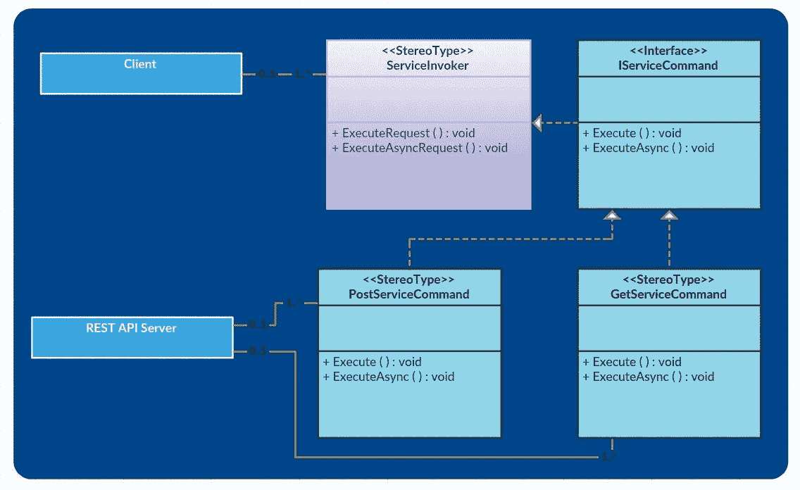

# 用 Spring boot Java 调用 REST API 的命令模式

> 原文：<https://medium.com/javarevisited/command-pattern-for-invoking-rest-api-with-spring-boot-java-39ef4eb2f568?source=collection_archive---------0----------------------->

# 介绍

固体原理教给我们一个基本术语，叫做“开放扩展，封闭修改”具有面向对象编程的良好设计总是提供灵活性，以便在未来添加新功能，而无需对现有代码进行任何更改。

因此，对于这种实现，设计模式通过解决一个复杂的问题帮助很大。命令模式是设计模式之一，它封装了采取任何行动所需的一切，并允许松散耦合的行动执行。

[](https://medium.com/javarevisited/top-5-books-and-courses-to-learn-restful-web-services-in-java-using-spring-mvc-and-spring-boot-79ec4b351d12)

图:带有命令设计模式的 REST API 调用

# REST API 可以直接使用，为什么要使用命令模式？

命令模式适用于以下情况:

1.  它借助命令对象将服务调用方和接收方解耦。在这里，Invoker 提供了发送方和接收方之间的松散耦合。
2.  通过`ServiceInvoker`执行具体命令(`PostServiceCommand`、`GetServiceCommand`)。因此，一个具体类中的变化不会影响另一个具体类。
3.  它封装了进行 REST API 调用所需的一切，并允许动作的执行完全独立于任何上下文。

# 代码讨论

*IServiceCommand*

`IServiceCommand The interface`声明了两个名为“Execute 和 ExecuteAsync”的方法。因此，它以两种不同的方式声明和接口执行 [REST API](/javarevisited/why-java-developer-should-use-spring-to-develop-restful-web-services-efe36d7a6727) 调用:同步和异步。

```
package com.my.service;import java.util.concurrent.CompletableFuture;public interface IServiceCommand {public Object Execute();public CompletableFuture<Object> ExecuteAysnc();}
```

*PostServiceCommand*

它是 Post REST API 请求的具体命令类。它封装了与 POST 请求相关的所有逻辑。

```
package com.my.service;import java.util.concurrent.CompletableFuture;import org.springframework.http.HttpEntity;
import org.springframework.http.client.ClientHttpRequestFactory;
import org.springframework.scheduling.annotation.Async;
import org.springframework.stereotype.Service;
import org.springframework.web.client.RestTemplate;[@Service](http://twitter.com/Service)
public class PostServiceCommand implements IServiceCommand {private RequestMapper requestMapper;
 private String otherUrl = "";public PostServiceCommand(RequestMapper requestMapper, String otherUrl) {
  this.requestMapper = requestMapper;
  this.otherUrl = otherUrl;
 }public Object Execute() {
  ClientHttpRequestFactory requestFactory = ClientConfig.getClientHttpRequestFactory();
  RestTemplate restTemplate = new RestTemplate(requestFactory);
  String requestUrl = String.format(ClientConfig.getBaseUrl(), this.otherUrl);
  HttpEntity<RequestMapper> request = new HttpEntity<RequestMapper>(this.requestMapper);
  Object response = restTemplate.postForObject(requestUrl, request, Object.class);
  return response;
 }[@Async](http://twitter.com/Async)
 public CompletableFuture<Object> ExecuteAysnc() {
  Object response = Execute();
  return CompletableFuture.completedFuture(response);
 }
}
```

*获取服务命令*

它也是 GET REST API 调用的具体命令类。

```
package com.my.service;import java.util.concurrent.CompletableFuture;import org.springframework.http.client.ClientHttpRequestFactory;
import org.springframework.scheduling.annotation.Async;
import org.springframework.stereotype.Service;
import org.springframework.web.client.RestTemplate;[@Service](http://twitter.com/Service)
public class GetServiceCommand implements IServiceCommand {private String otherUrl = "";public GetServiceCommand(String requestUrl) {
  this.otherUrl = requestUrl;
 }public Object Execute() {
  ClientHttpRequestFactory requestFactory = ClientConfig.getClientHttpRequestFactory();
  RestTemplate restTemplate = new RestTemplate(requestFactory);
  String requestUrl = ClientConfig.getBaseUrl() + this.otherUrl;
  Object response = restTemplate.getForEntity(requestUrl, Object.class);
  return response;
 }[@Async](http://twitter.com/Async)
 public CompletableFuture<Object> ExecuteAysnc() {
  Object response = Execute();
  return CompletableFuture.completedFuture(response);
 }
}
```

*服务调用者*

它是一个服务调用程序类，要求服务命令执行请求。

```
package com.my.service;import java.util.concurrent.CompletableFuture;public class ServiceInvoker {private IServiceCommand serviceCommand;public ServiceInvoker(IServiceCommand serviceCommand) {this.serviceCommand = serviceCommand;}public Object ExecuteRequest() {System.out.println("Start: Service Request");return serviceCommand.Execute();}public CompletableFuture<Object> ExecuteAsyncRequest() {System.out.println("Start: Asynchrnous Service Request");return serviceCommand.ExecuteAysnc();}}
```

*请求映射器*

它只是一个请求映射器类，用于在 POST REST API 调用期间映射请求对象。

```
package com.my.service;public class RequestMapper {public String Id;public String Name;public String City;public String Designation;}
```

*客户端操作*

客户端可以像下面这样调用:

同步操作:

```
String requestUrl = "";Map<String, Object> params = workItem.getParameters();RequestMapper requestMapper = new RequestMapper();requestMapper.Id = "123";requestMapper.Name = "Gul"requestMapper.City = "Bangalore";requestMapper.Designation = "Software Engineer";IServiceCommand serviceCommand = new GetServiceCommand(requestUrl);ServiceInvoker serviceInvoker = new ServiceInvoker(serviceCommand);serviceInvoker.ExecuteRequest();}
```

异步操作:

```
IServiceCommand serviceCommand = new PostServiceCommand(requestMapper, requestUrl);ServiceInvoker serviceInvoker = new ServiceInvoker(serviceCommand);CompletableFuture<Object> response = serviceInvoker.ExecuteAsyncRequest();while (true) {if (response.isDone()) {System.out.println("End: Done");break;}}
```

# 结论

**命令模式**为 REST API 调用构建了一个非常好的松耦合系统。它为 POST 和 gets 请求定义了两个独立的具体类。还可以为 PUT 或 DELETE 等其他操作定义单独的具体类。因此，它隐藏了命令的实际执行。