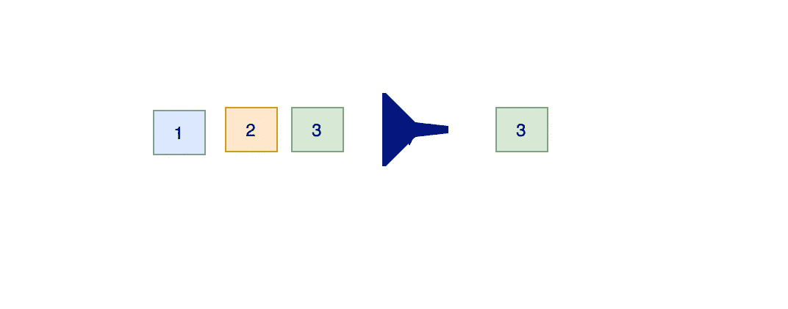

# Java 中常用的中间流操作

> 原文：<https://medium.com/javarevisited/commonly-used-intermediate-stream-operations-in-java-5c2bdad4231e?source=collection_archive---------0----------------------->

## Java 流中间操作的例子

> 最初发表于<https://asyncq.com/how-to-use-java-8-streams-skip-and-limit-operation>

****

## **介绍**

*   **在 [Java 流](/javarevisited/7-best-java-collections-and-stream-api-courses-for-beginners-in-2020-3ad18d52c38)中我们可以执行两种类型的操作，一种是终端操作如 max、count、reduce，另一种是中间操作如 [map](https://www.java67.com/2015/01/java-8-map-function-examples.html) 、 [filter](https://javarevisited.blogspot.com/2018/05/java-8-filter-map-collect-stream-example.html) 等。**