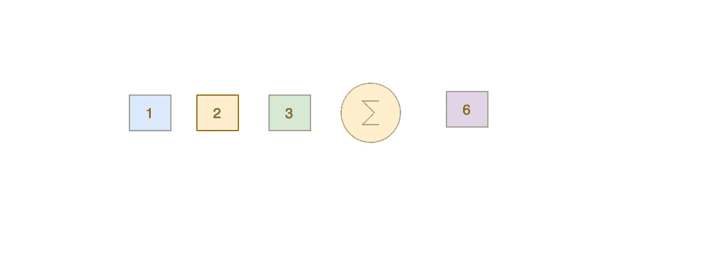

# Java 流中常用的终端操作

> 原文：<https://medium.com/javarevisited/commonly-used-terminal-operations-in-java-streams-ec59ce1e81da?source=collection_archive---------2----------------------->

## Java 流终端操作的例子

> 最初发表于<https://asyncq.com/commonly-used-terminal-operations-in-java-streams>

****

## **介绍**

*   **在 [Java Streams](/javarevisited/8-best-lambdas-stream-and-functional-programming-courses-for-java-developers-3d1836a97a1d) 中，我们可以执行两种类型的操作，一种是终端操作，如 max、count、reduce，另一种是中间操作，如 map、filter 等。**