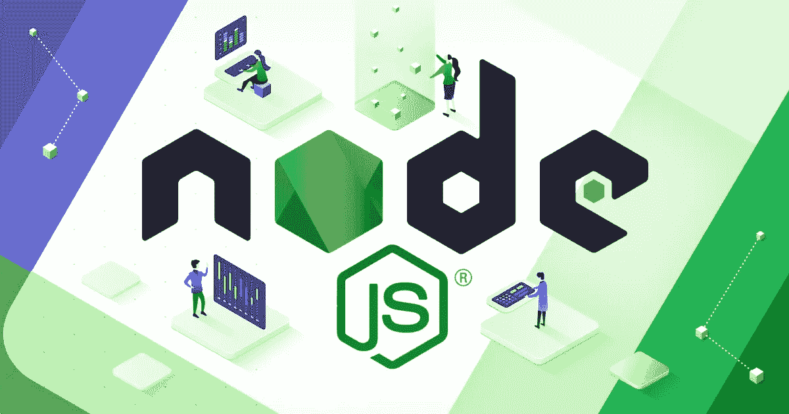

# 使用 Node.js 的公司，2022 年大玩家如何从中受益？

> 原文：<https://medium.com/javarevisited/companies-that-use-node-js-how-do-big-players-benefit-from-it-in-2022-dcb83cb8bebe?source=collection_archive---------3----------------------->

Node.js 是一个用于创建网站和应用程序的开发运行时环境。它非常受欢迎，是开源的，于 2009 年推出。数百家公司使用它，世界各地的开发者使用 [Node.js.](/javarevisited/top-10-online-courses-to-learn-node-js-in-depth-8ef0e31ca139) 创建网站

在 SECL 集团，我们从 2005 年开始为客户开发网站和应用程序。我们与全球 200 多家公司合作过大大小小的项目。

作为开发过程的一部分，我们始终关注新兴的新技术，并选择最有用的技术来开发可扩展的网站和应用程序。

自从 [Node.js](https://seclgroup.com/companies-use-node-js/) 变得可扩展和安全后，我们用它来开发大项目。使用 Node.js 现在是我们的主要专业之一，这就是为什么我们在本文中列出了使用 Node.js 作为主要技术之一开发的前 10 大网站和应用程序。

# Node.js 是什么？

Node.js 是开源的，这意味着它不是专有的；这是一个服务器端跨平台 [JavaScript](/javarevisited/10-best-online-courses-to-learn-javascript-in-2020-af5ed0801645) 运行时环境，内置谷歌的 V8 引擎。对这种开源环境的支持来自 OpenJS 基金会，在与 JS 基金会合并之前，它最初是 Node.js 基金会。对 OpenJS 基金会的持续支持来自 Linux 基金会的合作项目计划。

由 Ryan Dahl 于 2009 年首次创建并发布，现在全球数百万开发人员使用它来运行服务器端脚本，以开发更多可扩展的网站和应用程序，使其成为大型项目的理想选择。

在查看使用 [Node.js](https://javarevisited.blogspot.com/2018/01/top-5-nodejs-and-express-js-online-courses-for-web-developers.html) 构建的十个高负载网站和应用之前，让我们考虑一下将其用于可扩展项目的好处，以及为什么它在全球范围内如此受欢迎。对于那些不是技术人员的人，不要担心，我们已经概述了关键点:为什么使用 Node.js 开发高负载(流行和大型)网站和应用程序会有所不同的商业利益。

# 使用 Node.js 的好处

*   在运行时环境中，代码执行得更快。越快越好，因为速度对于吸引访问者的注意力非常重要。无论你是想让他们买东西，在你的网站或应用上花时间，还是询问更多信息，加载速度都会产生巨大的影响。 [Node.js](https://www.java67.com/2019/07/top-5-free-nodejs-courses-for-web-development.html) 的优势在于它内置了谷歌的 V8 引擎，使得运行时环境中的代码执行更快、更准确。
*   **异步，不等待 API 返回数据。Node.js 可以并发处理数千甚至数百万的数据请求。这意味着它可以在处理大量流量的大型网站中发挥关键作用。使用 [Node.js](https://javarevisited.blogspot.com/2022/02/top-15-nodejs-interview-questions.html) 的好处之一是 js 库是异步和非阻塞的。如果您的服务器在这种环境下运行，如果某个特定的 API 没有快速发送网站或应用程序所需的内容，数据不会延迟。相反，相同的数据将来自另一个 API。**
*   **可扩展，具有单线程机制。由于基于事件循环的单线程机制，Node.js 旨在确保服务器更快地响应请求。这有助于服务器快速响应数据请求，比传统服务器更快、更高效。**

如果我们抛开技术语言，专注于业务优势，它们包括:

*   网站和应用程序加载更快；
*   Web 访问者需要并期望网站快速加载；
*   转换率随着速度的提高而提高，当网站速度慢的时候会急剧下降；
*   利用 Node.js 这样更快速、更轻松的可伸缩技术，可以更容易地构建大型、可伸缩的网站和应用程序。

接下来，让我们来看看在服务器端运行时环境中使用 Node.js 的优势所构建的十个最大的网站。

# 用 Node.js 构建的 10 个网站和应用

# 1.贝宝

作为世界上最早的金融科技公司之一，PayPal 现在拥有超过 3.05 亿活跃用户，在世界各地发送和接收资金。与此同时，2600 万家大大小小的商店使用 PayPal 作为支付平台，为顾客提供了使用 PayPal 账户支付的流行选择。

Node.js 在 PayPal 架构中扮演着不可或缺的角色。它允许开发人员更快更容易地扩展解决方案，为 web 应用程序提供动力，并使团队能够更快地前进。自然，这也改善了用户体验。

**内置有:**

**前端:** [HTML](/javarevisited/10-best-html-and-css-courses-for-beginners-in-2021-6757eec00032) ， [CSS](/javarevisited/10-best-css-online-courses-for-beginners-and-experienced-developers-54aa2e8c0253) ，以及 [JavaScript](/javarevisited/my-favorite-free-tutorials-and-courses-to-learn-javascript-8f4d0a71faf2)

**后端:** Node.js，Express 和 Kraken.js

**数据库技术:** [赫拉](https://github.com/paypal/hera)。

**关于:**Confinity 成立于 1998 年，作为世界上发展最快的金融初创公司之一上市(试图取代汇票和支票)，然后在 2004 年被易贝以 15 亿美元的价格收购。

易贝继续在许多方面受益(易贝的买家和卖家也是如此)，然后在 2015 年将公司剥离给股东，PayPal 继续在纳斯达克公开上市。

PayPal 还拥有许多规模较小但同样受欢迎的金融科技(FinTech)品牌，如 Venmo、Braintree、iZettle、Honey(2019 年以 40 亿美元收购)和其他几家品牌。2019 年收入约为 177 亿美元；尽管随着电子商务在 2020 年增长更快，2200 亿美元的支付通过 PayPal 完成，这意味着收入将会增加。

# 2.商务化人际关系网

世界上第一个也是最大的专业社交网络，现在归科技巨头微软所有。

LinkedIn 最初是一家在线简历网站，由雷德·霍夫曼创建和推出，他是硅谷最多产、最受尊敬的连续创业者之一。它已经发展成为一个大规模的快速增长的专业社交网络，人们在这里寻找商业机会，宣传自己和自己的工作，并且是产生销售线索和赢得新客户的重要方式。

最初，LinkedIn 是用 Ruby on Rails 构建的。然而，考虑到 Node.js 平台的可伸缩性，由于一些关键的原因，他们最终转向了 node . js。与 RoR 相比，Node.js 执行代码的速度是 Rails 的 20 倍。

Node.js 还需要更少的服务器。Rails 可能需要 30 个，Node.js 只需要 3 个，所以随着 LinkedIn 继续扩展，它不需要那么多服务器来提供相同的应用程序功能和用户体验，使 Node.js 更快更流畅。

**建造用:**

**前端:** [HTML](/javarevisited/top-10-free-courses-to-learn-html-5-css-3-and-web-development-872d62d97a97) ，CSS，[反应](https://javinpaul.medium.com/top-5-courses-to-learn-react-js-in-2019-best-of-lot-fa02cd96cdf0)，[引导](/javarevisited/6-best-bootstrap-online-courses-for-web-designers-and-developers-a688e192b2e2)

**后端:** Node.js，Rest.li，动态发现()

**数据库技术:** Hadoop、Voldermort 数据存储、Espresso

**关于:**LinkedIn 由雷德·霍夫曼于 2003 年创立，现在全球拥有 7.4 亿用户，归微软所有(2016 年至今)。他是最初的“贝宝黑手党”之一；他与埃隆马斯克(Elon Musk)一起创立了 PayPal，他的前同事在创立和投资下一波大型科技公司(如脸书)的过程中发挥了重要作用。

# 3.华尔街日报在线

《华尔街日报在线》是美国领先的投资相关和商业媒体公司《华尔街日报》(WSJ)的数字平台。它是商业和投资界最受信任和尊重的来源，自然侧重于华尔街、投资、货币、期货、养老金和其他金融资产。

由于这个网站的规模，以及道琼斯经营的其他在线资产，需要可伸缩性和速度。使用 Node.js，道琼斯和华尔街日报在线开发人员可以比以前更快地构建和推出新功能。

这也意味着特性、页面和其他功能可以更快地传递给读者和 web 访问者。每个人都从中受益，包括广告商，他们渴望确保广告在正确的时间到达正确的受众，而不影响页面加载速度或广告质量。

**建造用:**

**前端:** HTML，CSS， [Next.js](/javarevisited/7-best-online-courses-to-learn-next-js-for-react-developers-ced862a3864) ， [React](/javarevisited/6-best-websites-to-learn-react-js-coding-for-free-ba7ec5c43433)

**数据库技术:** AWS S3、 [Lambda](/javarevisited/7-best-serverless-and-aws-lambda-courses-to-learn-in-2021-de1820111c85) 、 [DynamoDB](/javarevisited/7-best-aws-s3-and-dynamodb-courses-for-beginners-in-2021-a8a44b6066da)

**关于:**华尔街日报(WSJ)是美国乃至全球最大的商业媒体品牌之一。它由道琼斯公司所有，道琼斯公司是默多克家族控制的媒体巨头新闻集团的一个部门。它拥有大量的全球读者，主要是商业专业人士、股东、投资者以及金融部门和商业界的其他人。

# 4.美国 Yahoo 公司(提供互联网的信息检索服务)

雅虎！是早期的科技巨头和搜索引擎之一，除了邮件(email)等其他服务外，还运营着广泛的媒体品牌或门户网站。它为新闻、娱乐、体育、金融、天气、价格比较、本地广告和其他信息源提供了一系列门户或平台。

作为访问量最大的在线平台之一，雅虎受益于可扩展的快速架构。Node.js 在答题、屏幕等几个核心产品中的使用发挥了重要作用。

**建造用:**

**前端:** HTML，CSS， [Redux](https://javarevisited.blogspot.com/2018/08/top-5-react-js-and-redux-courses-to-learn-online.html) ，React

**数据库技术:** Redis，Vespa。

**关于:**最初的科技巨头之一，来自互联网早期。它仍然是最受欢迎的网络平台之一，雅虎品牌下的许多网站仍然排在世界前 10 名。现在归威瑞森媒体所有的雅虎(除了独立的日本部门)，在 2017 年以 44.8 亿美元被收购。

# 5.中等

旨在提供一种新的写作、发表文章和在线阅读的方式。Medium 是由博主(2003 年被谷歌收购)的前联合创始人伊万·威廉姆斯创立的，之后是 Twitter。Medium 不仅仅是一个为任何拥有账户的人提供撰写和发布文章的平台，包括无数的企业，还是一个出版物和在线杂志的媒体平台。

它最初是用 Node.js 编写的，虽然技术栈不同了，也发展了，但是主要的应用服务器还是用 Node 编写的。随着应用和网站的发展，通常会引入更广泛的解决方案来扩展架构和功能。然而，在 Node.js 中已经开发了 Medium 背后的一个关键架构，它将继续发挥重要作用。

**建造用:**

**前端:** HTML，CSS，React，Next.js。

**数据库技术:** [Redis](https://javarevisited.blogspot.com/2022/03/spring-boot-redis-example-in-java.html) ，亚马逊 DynamoDB。

**关于:**伊万·威廉姆斯是 Blogger(2003 年被谷歌收购)和 Twitter 的前联合创始人，他创立了 Medium，将互联网带回更高质量的长篇新闻和用户生成的内容。多亏了 Twitter，人们可以在 140 个字符内表达自己的想法(这个限制从那时起有所增加)。

威廉姆斯认为这远远不够容纳更多微妙的观点。在 Blogger 取得成功后，他试图以一种更具创新性的方式复制它。不幸的是，它仍然没有盈利，尽管它已经筹集了 1.34 亿美元，并拥有庞大且不断增长的发布和阅读文章的用户群。

# 6.快门架

Shutterstock 是最古老的在线图像库之一，包括大量的音乐和视频收藏。该平台上有超过 100 万名贡献者，拥有 3 亿张图片和视频剪辑。迄今为止，已经有 10 亿次下载来自使用过创作者上传的图片和视频的公司和个人。它可以在 150 个国家使用，网站被翻译成 21 种语言。

自然，当向全球观众交付如此大量的内容(图像和视频)时，您需要一个快速的服务器端环境。Node.js 确保了这一点，这就是为什么它仍然在 Shutterstock 的架构中扮演着重要的角色。

**建造用:**

**前端:** HTML，CSS，JavaScript。

**后端:** Node.js，Go，Java，Perl。

**数据库技术:** MariaDB，MemSQL。

**关于:** Shutterstock 于 2012 年上市(首次公开募股)，当时 [The Atlantic](https://www.theatlantic.com/technology/archive/2012/05/the-tao-of-shutterstock-what-makes-a-stock-photo-a-stock-photo/257280/) 详述了该平台的好处，将其描述为“一个类似脸书、Twitter 或 Pinterest 的网络社区，其价值几乎完全依赖于其贡献者的热情。”媒体公司是该平台的客户之一，因为许多公司受益于每月下载所需图像和视频的能力，下载速度低于传统图片库。

虽然从创作者的角度来看，这意味着赚取的费用比市场更小、更集中在专业摄影师和摄像师手中时可能获得的费用更低。

VICE [解释说](https://www.vice.com/en/article/yvx8eb/inside-offset-the-surreal-millennial-targeted-photo-market-within-shutterstock-111)“摄影师保留其图像的版权，但 Shutterstock 被授予完全的许可，可以在他们的网站上向客户销售、展示和许可图像，而无需摄影师的最终批准。”

# 7.祖先

Ancestry.com 是世界上最大的在线家谱公司，旗下有几个品牌可以帮助客户发现他们的祖先是谁，找到坟墓，购买有助于祖先研究的报纸，并测试 DNA 以更深入地追溯你的家谱历史。

Node.js 成立于 25 年前，当各种网站和应用程序开始增长时，它开始用于服务器端应用程序。它帮助他们以比其他在线环境更快的速度和更大的规模提供在线服务。

速度和安全的可扩展性是必不可少的，他们拥有 300 万付费客户，销售了超过 1800 万套 DNA 试剂盒，以及超过 100 亿条历史记录的图书馆。他们仍然拥有的两个主要品牌是 FindAGrave 和 AncestryDNA，这两个部门都在新所有者，私募股权巨头黑石集团的领导下继续增长。

**建造用:**

**前端:** HTML，CSS，JavaScript。

**关于:**Ancestry.com 有限责任公司由保罗·布兰特·艾伦和丹·塔格创建于犹他州，是一家私人所有的在线家谱公司，为那些想了解他们祖先的人提供众多网站。这现在包括 DNA 试剂盒，截至 2020 年 8 月，他们已经售出 1800 万套。

在经历了漫长的收购、上市以及越来越大的投资和估值之后，私募股权公司黑石集团在 2020 年底以 47 亿美元的价格收购了该公司，并任命前高管 Deb Liu 担任首席执行官。

Ancestry 是另一个令人印象深刻的大型数字公司的例子，它依赖 Node.js 提供服务器端环境，确保以用户和网络访问者需要的速度提供在线服务。

# 8.Zendesk

正如 TechCrunch 在 2013 年所说，客户服务软件公司 Zendesk 稳步上升，成为“服务台中的佼佼者”。现在，它创造了 10 亿美元的收入，拥有 17 万付费用户，在全球拥有 3750 名员工。它提供一系列帮助台和客户服务软件产品，为大型团队提供事件高级呼叫和聊天服务，以及人工智能聊天机器人服务。

Node.js 在服务器端环境中扮演着重要的角色，确保向客户大规模提供服务。

**建造用:**

**前端:** HTML，CSS，React。

**数据库技术:** MySQL，Redis，亚马逊 S3。

**关于:**由 Mikkel Svane、Morten Primdahl 和 Alexander Aghassipour 在哥本哈根的一个阁楼里创立，他们都体验过客户服务软件。在 Zendesk 创建之前，从代理用户体验和管理(公司概况)的角度来看，大多数客户服务软件都很难使用。

Zendesk 想要解决这个问题，让客户服务软件成为 SaaS 的产品。多年来，由于投资(从 2008 年的 50 万美元开始)和 2014 年的首次公开募股，该公司收购了其他软件业务，以支持其增长并改善支持软件的技术堆栈。

# 9.Groupon

多年来，Groupon 一直是最受欢迎的日常交易网站，作为一家上市公司，它仍然表现出色，创造了约 30 亿美元的收入。

Groupon 实际上是一个双边市场，在全球 150 个城市运营，为企业和消费者提供交易。

由于受众的规模，Groupon 需要一个技术平台，能够快速、大规模地提供网络访问者和客户需要的东西。因此，他们将 Node.js 作为服务器端环境的关键组件。内置于:

**前端:** HTML，CSS，Ember.js。

**数据库技术:** MySQL

**关于:**首先在芝加哥推出，帮助客户从集团企业购买商品时省钱(因此获得批量折扣)。创始人安德鲁·梅森从他的前雇主埃里克·莱夫科夫斯基那里获得了 100 万美元的种子资金。Groupon 随后发展迅速，成为第一家仅用 16 个月就获得 10 亿美元的公司。

当时，它快速的销售重点鼓励了更多的投资者参与进来，推动它在 2011 年上市。自那以来，增长一直稳定，但没有早期投资者和分析师预期的那么快，尽管它在竞争激烈的电子商务环境中继续表现良好。

# 10.奎兹莱

Quizlet 是一个电子学习应用程序，拥有多种学习工具和游戏，如抽认卡，现已在全球 130 个国家推出，提供 16 种语言选项。2019 年，它拥有约 5000 万用户，增长甚至更快，许多国家的学校将在 2020 年关闭。

Quizlet 也是一个面向学校的电子学习解决方案，当学校付费订阅时，教师可以在课堂上使用它。它使用 Node.js 来加速从服务器端环境向用户交付数字资产。

**内置:**

**前端:** HTML，CSS，React，Linaria， [D3.js](/javarevisited/7-best-online-courses-to-learn-d3-js-for-data-visualization-in-2020-1a8c79add4e4) 。

**后端:** Node.js， [Spring Boot](/javarevisited/10-best-java-microservices-courses-with-spring-boot-and-spring-cloud-6d04556bdfed) 。

**数据库技术:** Percona，Google 云存储。

**关于:**

成立是为了解决学习时产生的问题。无论是在课堂上还是在家里，学生们都需要更多的帮助来掌握和理解他们有困难的科目或参加考试。

Quizlet 以免费增值为基础运营，虽然它是增长最快的电子学习网站，但该公司一直保持私有和盈利，而不是上市。

# 结论

如您所见，Node.js 是一个非常有用的开发运行时环境，用于创建网站和应用程序。在服务器中使用这个来开发可以确保网站和应用程序加载更快。对于企业而言，这意味着它具有以下优势:

*   网站和应用程序加载更快，这是网站访问者期望的最低标准；
*   转化率随着速度的增加而增加，当网站速度慢的时候会急剧下降；
*   使用允许更快、更容易扩展的技术，可以更容易地构建大型、可扩展的网站和应用程序，如 Node.js。
*   它提供了一个健壮的技术栈，因此为构建更可伸缩的 web 和移动应用程序提供了一个强大的框架；
*   由于 V8 引擎，它还确保了更快的处理速度，并且它不阻塞任何输入或输出，允许异步请求处理。
*   这也是微服务架构的理想技术。

为你的下一个网站或应用项目与 SECL 集团合作:如果你想成功开发和启动一个网络项目，请写信给我们。我们拥有与大大小小的客户打交道的经验，整个公司有 70 多名熟练的开发人员和顾问来支持您的目标。

[立即联系我们](https://seclgroup.com/contacts)启动您的下一个项目！

【https://seclgroup.com/】原载于*。*