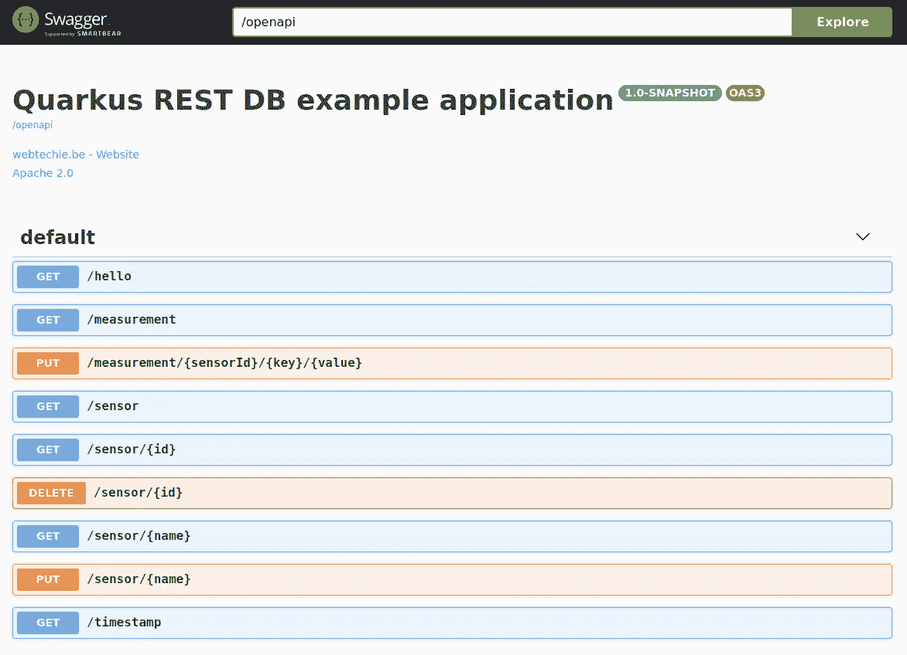
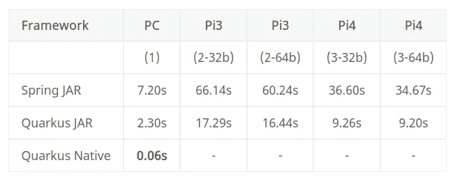

# 树莓 Pi 上 REST H2 弹簧与 Quarkus 应用的比较

> 原文：<https://medium.com/javarevisited/comparing-a-rest-h2-spring-versus-quarkus-application-on-raspberry-pi-13013603fda8?source=collection_archive---------2----------------------->

在之前的文章[“Raspberry Pi 上的 Spring REST 和 H2 数据库应用”](/javarevisited/a-spring-rest-and-h2-database-application-on-the-raspberry-pi-8e4587d57c4f)中，描述了一个通过 REST API 和 Raspberry Pi 上的 Spring 应用在 H2 数据库中存储传感器和测量值的例子。这个应用程序需要一些时间来启动树莓 Pi，制作 [airhacks.fm 播客](https://airhacks.com/)的[亚当·比恩](https://twitter.com/AdamBien)问我是否可以将它与类似的 Quarkus 应用程序进行比较。

接受挑战，以下是结果…；-)


# 用过的工具

我使用 AdoptOpenJDK 11 和 IntelliJ IDEA 在 PC 上构建应用程序。Spring 应用程序的[源代码是我的书](https://github.com/FDelporte/JavaOnRaspberryPi/tree/master/Chapter_10_Spring/java-spring-rest-db)[“在 Raspberry Pi 上开始使用 Java”](https://webtechie.be/books)中所有例子的一部分。在这篇文章中，使用 Quarkus 和 Panache 制作了一个类似的应用程序，完整的代码也可以在 GitHub 上找到。

# 关于夸库斯

[Quarkus](https://quarkus.io/) 是开源的，最初由[红帽](https://www.redhat.com)开发，提供“超音速亚原子 Java”。这是一个 Kubernetes 原生 Java 栈，为 OpenJDK HotSpot 和 GraalVM 量身定制，使用最好的 Java 库和标准。与其他云原生堆栈相比，它承诺使用更少的内存，启动更快。

# 关于派头

Panache 允许你用 Quarkus 简化你的数据库代码，完整的描述见[“quar kus——简化的 Hibernate ORM with Panache”](https://quarkus.io/guides/hibernate-orm-panache)。它构建在 Hibernate ORM 之上，将 Java 对象映射到关系数据库记录。

# 应用程序是做什么的？

这个示例 Quarkus 应用程序的目标与 Spring 概念验证应用程序完全相同:将数据存储在 H2 数据库中，并提供 REST API 来添加和读取该数据库中的数据。所以我们使用相同的图表:


通过集成 Swagger UI，我们可以轻松测试 API:



# 一些代码示例

由于 Quarkus 和 Panache 扩展了 Java EE，代码看起来非常类似于 [Spring 代码](/javarevisited/10-free-spring-boot-tutorials-and-courses-for-java-developers-53dfe084587e?source=collection_home---4------7-----------------------)，例如，对于一个测量实体:

```
@Entity
public class MeasurementEntity extends PanacheEntity {

    public String key;
    public Double value;
    public LocalDateTime timestamp;

    @ManyToOne
    @JoinColumn(name = "sensor_id", nullable = false)
    @JsonbTransient
    public SensorEntity sensorEntity;

    public MeasurementEntity() {
        // Required for mapping
    }

    public MeasurementEntity(SensorEntity sensorEntity, 
        String key, Double value) {
        this.sensorEntity = sensorEntity;
        this.key = key;
        this.value = value;
        this.timestamp = LocalDateTime.now();
    }
}
```

rest 控制器还需要最少的代码，例如从数据库中获取所有测量值:

```
@ApplicationScoped
@Path("/measurement")
public class MeasurementRepository implements
        PanacheRepository<MeasurementEntity> {

    @GET
    @Produces(MediaType.APPLICATION_JSON)
    public List<MeasurementEntity> get() {
        return this.findAll().list();
    }
}
```

# 现场编码和测试

在开发 Quarkus 应用程序时，dev-mode 确实很吸引人。一旦有了可以运行的东西，就用以下命令启动应用程序:

```
$ mvn quarkus:dev
```

代码中的任何更改都将立即被重新编译，并准备好进行使用和测试。这意味着您可以在这个示例应用程序中添加额外的 REST 服务，并在 Swagger UI 中试用它们，而无需编译或重启应用程序。

为了比较 [Spring](/javarevisited/10-best-online-courses-to-learn-spring-framework-in-2020-f7f73599c2fd) 和 Quarkus 应用程序的启动速度，我使用了 Spring JAR、Quarkus JAR 和 Quarkus 本地应用程序。

# 作为 JAR 文件

JAR 文件可以用 Maven 在两个项目中创建，也可以像其他项目一样用 java 启动:

```
$ mvn clean package
$ java -jar target/java-spring-rest-db-0.0.1-SNAPSHOT.jar
$ java -jar target/javaquarkusrestdb-1.0-SNAPSHOT-runner.jar
```

# 作为本机应用程序

# 在 Linux PC 上

使用提供的 Docker 文件，应用程序可以通过一个单独的 [Maven 命令](/javarevisited/top-10-free-courses-to-learn-maven-jenkins-and-docker-for-java-developers-51fa7a1e66f6?source=collection_home---4------3-----------------------)使用 [GraalVM](https://www.graalvm.org/) 转换为本地应用程序。请记住，H2 不能作为应用程序中的集成数据库，您需要独立运行它并调整应用程序。

```
$ mvn package -Pnative -Dquarkus.native.container-build=true
$ target/javaquarkusrestdb-1.0-SNAPSHOT-runner
__  ____  __  _____   ___  __ ____  ______ 
 --/ __ \/ / / / _ | / _ \/ //_/ / / / __/ 
 -/ /_/ / /_/ / __ |/ , _/ ,< / /_/ /\ \   
--\___\_\____/_/ |_/_/|_/_/|_|\____/___/   
22:10:15 INFO  [io.ag.pool]] (main) Datasource '<default>': Initial size smaller than min. Connections will be created when necessary
22:10:15 INFO  [io.quarkus]] (main) javaquarkusrestdb 1.0-SNAPSHOT native (powered by Quarkus 1.6.0.Final) started in 0.062s. Listening on: http://0.0.0.0:8080
22:10:15 INFO  [io.quarkus]] (main) Profile prod activated. 
22:10:15 INFO  [io.quarkus]] (main) Installed features: [agroal, cdi, hibernate-orm, hibernate-orm-panache, jdbc-h2, mutiny, narayana-jta, resteasy, resteasy-jsonb, smallrye-context-propagation, smallrye-openapi, swagger-ui]
```

请看上面几行，确实**启动时间是 0.062s** ！！！我试了几次，得到的**在 0.040s 到 0.078s** 之间。比光还快:-)

# 为了树莓派

Raspberry Pi 3 和 4 有 64 位芯片，但 Raspbian OS 目前是 32 位系统。

## 运行在 32 位 Raspbian 操作系统上

还没有 GraalVM(还没有？)用于 32 位系统，所以不可能将 Quarkus 编译成 Raspbian OS 的本机应用程序。

使用的是 JAR 版本。启动[弹簧作用](/javarevisited/top-10-free-courses-to-learn-spring-framework-for-java-developers-639db9348d25):

```
$ java -jar target/java-spring-rest-db-0.0.1-SNAPSHOT.jar

  .   ____          _            __ _ _
 /\\ / ___'_ __ _ _(_)_ __  __ _ \ \ \ \
( ( )\___ | '_ | '_| | '_ \/ _` | \ \ \ \
 \\/  ___)| |_)| | | | | || (_| |  ) ) ) )
  '  |____| .__|_| |_|_| |_\__, | / / / /
 =========|_|==============|___/=/_/_/_/
 :: Spring Boot ::        (v2.1.8.RELEASE)

22:49:42.131  INFO 1702 --- [           main] b.w.j.JavaSpringRestDbApplication        : Starting JavaSpringRestDbApplication v0.0.1-SNAPSHOT on ubuntu with PID 1702 (/home/ubuntu/JavaOnRaspberryPi/Chapter_10_Spring/java-spring-rest-db/target/java-spring-rest-db-0.0.1-SNAPSHOT.jar started by ubuntu in /home/ubuntu)
22:49:42.148  INFO 1702 --- [           main] b.w.j.JavaSpringRestDbApplication        : No active profile set, falling back to default profiles: default
...
22:50:16.205  INFO 1702 --- [           main] b.w.j.JavaSpringRestDbApplication        : Started JavaSpringRestDbApplication in 36.606 seconds (JVM running for 39.212)
```

启动 Quarkus 应用程序:

```
$ java -jar target/javaquarkusrestdb-1.0-SNAPSHOT-runner.jar
__  ____  __  _____   ___  __ ____  ______ 
 --/ __ \/ / / / _ | / _ \/ //_/ / / / __/ 
 -/ /_/ / /_/ / __ |/ , _/ ,< / /_/ /\ \   
--\___\_\____/_/ |_/_/|_/_/|_|\____/___/   
22:20:46 INFO  [io.ag.pool]] (main) Datasource '<default>': Initial size smaller than min. Connections will be created when necessary
22:20:50 INFO  [io.quarkus]] (main) javaquarkusrestdb 1.0-SNAPSHOT on JVM (powered by Quarkus 1.6.0.Final) started in 9.259s. Listening on: http://0.0.0.0:8080
```

## 在 64 位 Ubuntu 上运行

在 Raspberry，他们正在开发 Raspbian 操作系统的 64 位预发布版本，但在这次测试中，我使用带有“Ubuntu 20.04 LTS (Raspberry Pi 3/4/，用于 arm64 架构的 64 位服务器操作系统)”的 Raspberry Imager 工具闪存了一个新的 SD 卡。


为了能够在新的 SD 卡上运行和编译测试应用程序，需要一些额外的步骤，完整的步骤见本文底部。

下面的概览表使用了与 32 位系统相同的 JAR。

不幸的是，我没能在 Pi 上创建一个本地应用程序。本机构建过程花费了很多时间，并且在该过程中的某个地方由于内存不足异常而不断失败。Docker 构建过程也不能在 Pi 上工作。也许可以在 PC 上的 [Docker](/javarevisited/top-5-free-courses-to-learn-docker-for-beginners-best-of-lot-b2b1ad2b98ad?source=collection_home---4------2-----------------------) 中交叉编译 aarch64 的 Raspberry Pi，但目前这已经超出了我的“舒适区”,所以我没有继续走这条路。

**“惊人的快速启动时间”——正如 Quarkus 网站上承诺的——已经被证实，至少在 PC 上是这样。而且在树莓派上，启动速度也快了很多。**



原生的速度非常快，但我只在我的电脑上安装了它…

*   (1 个):戴尔 i7，16 Gb 内存，64 位 Ubuntu 20.04
*   (2):树莓派 3B+ 1GB 内存，博通 BCM2837B0，Cortex-A53 (ARMv8) 64 位 SoC @ 1.4GHz
*   (3): Raspberry Pi 4B 4GB RAM、Broadcom BCM2711、四核 Cortex-A72 (ARM v8) 64 位 SoC @ 1.5GHz
*   (32b):32 位 Raspbian 操作系统
*   (64b): Ubuntu 服务器操作系统 20.04 LTS 64 位

# 更多详细信息

# 使用独立的 H2 数据库

参见[https://o7 planning . org/en/11895/installing-H2-database-and-use-H2-console](https://o7planning.org/en/11895/installing-h2-database-and-using-h2-console)

```
$ wget https://h2database.com/h2-2019-10-14.zip
$ unzip h2-2019-10-14.zip
$ cd h2/bin
$ chmod +x h2.sh
$ ./h2.sh
```

要能够从网络中的任何其他 PC 连接到 web 控制台，请参见[https://www.h2database.com/html/tutorial.html:](https://www.h2database.com/html/tutorial.html:)

```
$ nano /home/ubuntu/.h2.server.properties webAllowOthers=true
```

要在 web 控制台中使用的连接设置:

driver Class:org . H2 . driver JDBC URL:JDBC:H2:TCP://localhost/~/H2 . db 用户名:sa 密码:{empty}

要将 Quarkus 应用程序与独立的 H2 数据库一起使用，需要将 application.properties 更改为:

```
# H2 database
quarkus.datasource.url=jdbc:h2:tcp://localhost/~/test;DB_CLOSE_DELAY=-1;DB_CLOSE_ON_EXIT=FALSE
quarkus.datasource.driver=org.h2.Driver
quarkus.datasource.username=sa
quarkus.datasource.password=
```

# 在树莓 Pi 上编译 Quarkus 本地应用程序

为了完整起见，这是我用来尝试从 Quarkus 应用程序的源代码构建本机应用程序的一步一步的步骤。

```
# Install Maven
$ sudo apt install maven

$ mvn -v
Apache Maven 3.6.3
Maven home: /usr/share/maven
Java version: 11.0.8, vendor: Ubuntu, runtime: /usr/lib/jvm/java-11-openjdk-arm64
Default locale: en, platform encoding: UTF-8
OS name: "linux", version: "5.4.0-1013-raspi", arch: "aarch64", family: "unix"

$ java -version
openjdk version "11.0.8" 2020-07-14
OpenJDK Runtime Environment (build 11.0.8+10-post-Ubuntu-0ubuntu120.04)
OpenJDK 64-Bit Server VM (build 11.0.8+10-post-Ubuntu-0ubuntu120.04, mixed mode)

# Spring DB application
$ git clone https://github.com/FDelporte/JavaOnRaspberryPi.git
$ cd JavaOnRaspberryPi/Chapter_10_Spring/java-spring-rest-db/
$ mvn clean package
$ java -jar target/java-spring-rest-db-0.0.1-SNAPSHOT.jar

# Quarkus DB application (first as JAR)
$ git clone https://github.com/FDelporte/JavaQuarkusRestDb.git
$ cd JavaQuarkusRestDb
$ nano src/main/resources/application.properties
quarkus.datasource.url=jdbc:h2:file:/home/ubuntu/database.db;DB_CLOSE_DELAY=-1;DB_CLOSE_ON_EXIT=FALSE
$ java -jar target/javaquarkusrestdb-1.0-SNAPSHOT-runner.jar

# Quarkus DB application (then as native)
# Building with Docker doesn't seem to work, so install GraalVM first
# https://www.graalvm.org/docs/getting-started/linux
$ cd /home/ubuntu
$ wget https://github.com/graalvm/graalvm-ce-builds/releases/download/vm-20.1.0/graalvm-ce-java11-linux-aarch64-20.1.0.tar.gz
$ tar -xzf graalvm-ce-java11-linux-aarch64-20.1.0.tar.gz
$ export PATH=/home/ubuntu/graalvm-ce-java11-20.1.0/bin:$PATH
$ which java
/home/ubuntu/graalvm-ce-java11-20.1.0/bin/java
$ export GRAALVM_HOME=/home/ubuntu/graalvm-ce-java11-20.1.0/
$ export JAVA_HOME=/home/ubuntu/graalvm-ce-java11-20.1.0/
# Make sure GRAALVM_HOME and JAVA_HOME are set as part of PATH
$ echo $PATH
$ echo GRAALVM_HOME
$ echo JAVA_HOME
# Or use gu to install correctly
$ /home/ubuntu/graalvm-ce-java11-20.1.0/bin/gu install native-image

# You will will also need GCC, and the glibc and zlib headers
# https://quarkus.io/guides/building-native-image
$ sudo apt-get install build-essential libz-dev zlib1g-dev

# Tried to compile to native up to 4g xmx but each with out of memory exception
$ mvn package -Pnative -Dquarkus.native.native-image-xmx=2g

$ mvn package -Pnative -DskipTests -Dquarkus.native.native-image-xmx=4g
WARNING: An illegal reflective access operation has occurred
WARNING: Illegal reflective access by com.google.inject.internal.cglib.core.$ReflectUtils$1 (file:/usr/share/maven/lib/guice.jar) to method java.lang.ClassLoader.defineClass(java.lang.String,byte[],int,int,java.security.ProtectionDomain)
WARNING: Please consider reporting this to the maintainers of com.google.inject.internal.cglib.core.$ReflectUtils$1
WARNING: Use --illegal-access=warn to enable warnings of further illegal reflective access operations
WARNING: All illegal access operations will be denied in a future release
[INFO] Scanning for projects...
[INFO] 
[INFO] -------------------< be.webtechie:javaquarkusrestdb >-------------------
[INFO] Building javaquarkusrestdb 1.0-SNAPSHOT
[INFO] --------------------------------[ jar ]---------------------------------
[INFO] 
[INFO] --- maven-resources-plugin:2.6:resources (default-resources) @ javaquarkusrestdb ---
[INFO] Using 'UTF-8' encoding to copy filtered resources.
[INFO] Copying 2 resources
[INFO] 
[INFO] --- maven-compiler-plugin:3.8.1:compile (default-compile) @ javaquarkusrestdb ---
[INFO] Nothing to compile - all classes are up to date
[INFO] 
[INFO] --- maven-resources-plugin:2.6:testResources (default-testResources) @ javaquarkusrestdb ---
[INFO] Using 'UTF-8' encoding to copy filtered resources.
[INFO] skip non existing resourceDirectory /home/ubuntu/JavaQuarkusRestDb/src/test/resources
[INFO] 
[INFO] --- maven-compiler-plugin:3.8.1:testCompile (default-testCompile) @ javaquarkusrestdb ---
[INFO] Nothing to compile - all classes are up to date
[INFO] 
[INFO] --- maven-surefire-plugin:2.22.1:test (default-test) @ javaquarkusrestdb ---
[INFO] Tests are skipped.
[INFO] 
[INFO] --- maven-jar-plugin:2.4:jar (default-jar) @ javaquarkusrestdb ---
[INFO] 
[INFO] --- quarkus-maven-plugin:1.6.0.Final:build (default) @ javaquarkusrestdb ---
[INFO] [org.jboss.threads] JBoss Threads version 3.1.1.Final
[INFO] [org.hibernate.Version] HHH000412: Hibernate ORM core version 5.4.18.Final
[INFO] [io.quarkus.deployment.pkg.steps.JarResultBuildStep] Building native image source jar: /home/ubuntu/JavaQuarkusRestDb/target/javaquarkusrestdb-1.0-SNAPSHOT-native-image-source-jar/javaquarkusrestdb-1.0-SNAPSHOT-runner.jar
[INFO] [io.quarkus.deployment.pkg.steps.NativeImageBuildStep] Building native image from /home/ubuntu/JavaQuarkusRestDb/target/javaquarkusrestdb-1.0-SNAPSHOT-native-image-source-jar/javaquarkusrestdb-1.0-SNAPSHOT-runner.jar
[INFO] [io.quarkus.deployment.pkg.steps.NativeImageBuildStep] Running Quarkus native-image plugin on GraalVM Version 20.1.0 (Java Version 11.0.7)
[INFO] [io.quarkus.deployment.pkg.steps.NativeImageBuildStep] /home/ubuntu/graalvm-ce-java11-20.1.0/bin/native-image -J-Dsun.nio.ch.maxUpdateArraySize=100 -J-DCoordinatorEnvironmentBean.transactionStatusManagerEnable=false -J-Djava.util.logging.manager=org.jboss.logmanager.LogManager -J-Dvertx.logger-delegate-factory-class-name=io.quarkus.vertx.core.runtime.VertxLogDelegateFactory -J-Dvertx.disableDnsResolver=true -J-Dio.netty.leakDetection.level=DISABLED -J-Dio.netty.allocator.maxOrder=1 -J-Duser.language=en -J-Dfile.encoding=UTF-8 --initialize-at-build-time= -H:InitialCollectionPolicy=com.oracle.svm.core.genscavenge.CollectionPolicy$BySpaceAndTime -H:+JNI -jar javaquarkusrestdb-1.0-SNAPSHOT-runner.jar -H:FallbackThreshold=0 -H:+ReportExceptionStackTraces -J-Xmx4g -H:-AddAllCharsets -H:-IncludeAllTimeZones -H:EnableURLProtocols=http,https --enable-all-security-services -H:NativeLinkerOption=-no-pie --no-server -H:-UseServiceLoaderFeature -H:+StackTrace javaquarkusrestdb-1.0-SNAPSHOT-runner
-H:IncludeAllTimeZones and -H:IncludeTimeZones are now deprecated. Native-image includes all timezonesby default.
[javaquarkusrestdb-1.0-SNAPSHOT-runner:31956]    classlist:  37,726.34 ms,  1.18 GB
[javaquarkusrestdb-1.0-SNAPSHOT-runner:31956]        (cap):   3,495.30 ms,  1.18 GB
[javaquarkusrestdb-1.0-SNAPSHOT-runner:31956]        setup:  13,476.39 ms,  1.18 GB
04:55:45,582 INFO  [org.hib.Version] HHH000412: Hibernate ORM core version 5.4.18.Final
04:55:45,631 INFO  [org.hib.ann.com.Version] HCANN000001: Hibernate Commons Annotations {5.1.0.Final}
04:55:45,948 INFO  [org.hib.dia.Dialect] HHH000400: Using dialect: io.quarkus.hibernate.orm.runtime.dialect.QuarkusH2Dialect
04:57:24,391 INFO  [org.jbo.threads] JBoss Threads version 3.1.1.Final
Error: Image build request failed with exit status 137
[INFO] ------------------------------------------------------------------------
[INFO] BUILD FAILURE
[INFO] ------------------------------------------------------------------------
[INFO] Total time:  04:24 min
[INFO] Finished at: 2020-07-28T04:58:44Z
[INFO] ------------------------------------------------------------------------
[ERROR] Failed to execute goal io.quarkus:quarkus-maven-plugin:1.6.0.Final:build (default) on project javaquarkusrestdb: Failed to build quarkus application: io.quarkus.builder.BuildException: Build failure: Build failed due to errors
[ERROR]         [error]: Build step io.quarkus.deployment.pkg.steps.NativeImageBuildStep#build threw an exception: java.lang.RuntimeException: Failed to build native image
[ERROR]         at io.quarkus.deployment.pkg.steps.NativeImageBuildStep.build(NativeImageBuildStep.java:366)
[ERROR]         at java.base/jdk.internal.reflect.NativeMethodAccessorImpl.invoke0(Native Method)
[ERROR]         at java.base/jdk.internal.reflect.NativeMethodAccessorImpl.invoke(NativeMethodAccessorImpl.java:62)
[ERROR]         at java.base/jdk.internal.reflect.DelegatingMethodAccessorImpl.invoke(DelegatingMethodAccessorImpl.java:43)
[ERROR]         at java.base/java.lang.reflect.Method.invoke(Method.java:566)
[ERROR]         at io.quarkus.deployment.ExtensionLoader$2.execute(ExtensionLoader.java:932)
[ERROR]         at io.quarkus.builder.BuildContext.run(BuildContext.java:277)
[ERROR]         at org.jboss.threads.ContextClassLoaderSavingRunnable.run(ContextClassLoaderSavingRunnable.java:35)
[ERROR]         at org.jboss.threads.EnhancedQueueExecutor.safeRun(EnhancedQueueExecutor.java:2046)
[ERROR]         at org.jboss.threads.EnhancedQueueExecutor$ThreadBody.doRunTask(EnhancedQueueExecutor.java:1578)
[ERROR]         at org.jboss.threads.EnhancedQueueExecutor$ThreadBody.run(EnhancedQueueExecutor.java:1452)
[ERROR]         at java.base/java.lang.Thread.run(Thread.java:834)
[ERROR]         at org.jboss.threads.JBossThread.run(JBossThread.java:479)
[ERROR] Caused by: java.lang.RuntimeException: Image generation failed. Exit code was 137 which indicates an out of memory error. Consider increasing the Xmx value for native image generation by setting the "quarkus.native.native-image-xmx" property
[ERROR]         at io.quarkus.deployment.pkg.steps.NativeImageBuildStep.imageGenerationFailed(NativeImageBuildStep.java:411)
[ERROR]         at io.quarkus.deployment.pkg.steps.NativeImageBuildStep.build(NativeImageBuildStep.java:344)
[ERROR]         ... 12 more
[ERROR] -> [Help 1]
[ERROR] 
[ERROR] To see the full stack trace of the errors, re-run Maven with the -e switch.
[ERROR] Re-run Maven using the -X switch to enable full debug logging.
[ERROR] 
[ERROR] For more information about the errors and possible solutions, please read the following articles:
[ERROR] [Help 1] http://cwiki.apache.org/confluence/display/MAVEN/MojoExecutionException
```

在 PC 上，我还成功地用 [Docker](/javarevisited/top-15-online-courses-to-learn-docker-kubernetes-and-aws-for-fullstack-developers-and-devops-d8cc4f16e773) 创建了一个原生应用程序，但在 Raspberry Pi 上却完全没有成功…

```
# Build native Quarkus appplication with Docker (skipping tests to speed up a bit...)
$ sudo apt install docker.io
$ sudo gpasswd -a ubuntu docker
$ newgrp docker
$ mvn package -Pnative -Dquarkus.native.container-build=true -DskipTests
```

*最初发布于*[*https://web techie . be*](https://webtechie.be/post/2020-07-28-spring-versus-quarkus-rest-h2-db-on-raspberry-pi/)*。*