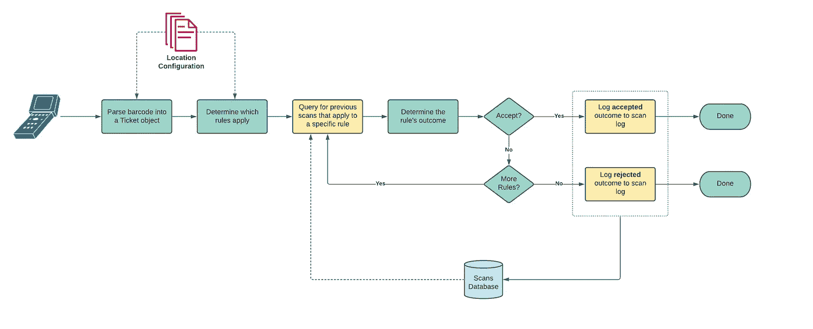
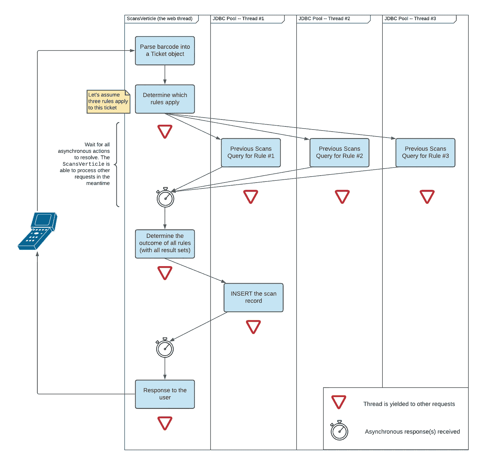
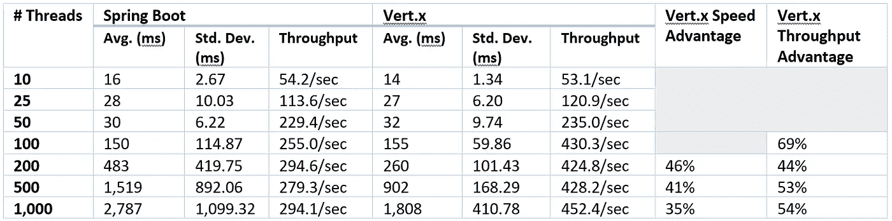
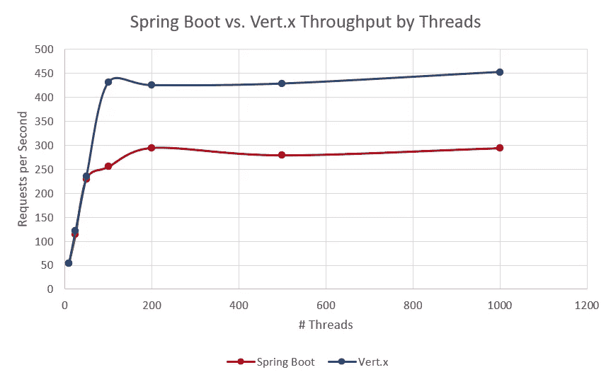
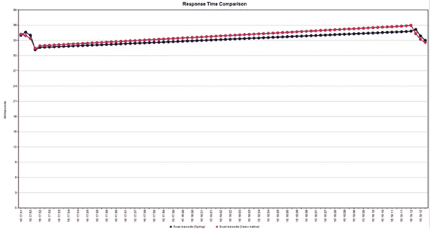

# 将 Spring Boot 后端迁移到 Vert.x 的性能和开发人员体验比较

> 原文：<https://medium.com/javarevisited/comparing-performance-and-developer-experience-of-migrating-a-spring-boot-back-end-to-vert-x-8f3281b4814?source=collection_archive---------0----------------------->

*将现有的 Sprint 引导逻辑迁移到 Vert.x 的收益和缺陷的实例*

由[克劳迪奥·施瓦茨](https://unsplash.com/@purzlbaum)在 [Unsplash](https://unsplash.com/photos/wMgW6bjjzZU) 上拍摄的照片

Vert.x 是 JVM 的一个反应式框架，它使用一个非阻塞事件循环来响应类似 Node.js 的请求。这与 web 应用程序开发(包括 Spring Boot)中更常见的为每个请求分配一个线程相反。这种方法的目的是最大限度地利用每个线程，同时最小化为每个请求创建一个线程的开销，特别是在请求线程主要用于等待(例如，等待数据库查询的结果)的情况下。在这些情况下，事件循环方法提高了应用程序的运行时效率和响应时间。

可以说，使用 Vert.x 和基于 Spring Boot 的 web 后端之间的权衡是开发人员角度的必要转变。一个典型的三层 Spring Boot 应用程序(web 端点、服务、数据访问)的数量是已知的:逻辑通常很容易理解和调试，Spring 和 Hibernate 堆栈非常受欢迎，有大量可用的资源和示例。鉴于 Vert.x 的异步特性，如果不需要它的效率和可伸缩性优势，它需要转换视角，这会使代码变得不必要的复杂。考虑到这一点，本文将 Vert.x 与 Sprint Boot 的性能和开发人员体验进行了比较，采用了一个 Spring Boot 项目，并将其改编为功能相当的 Vert.x 后端。

这个案例研究的灵感来自于我和我的朋友们在 AuthentiGATE 做的一个项目。他们提供了一个电子商务平台，用于销售和扫描加拿大一些大型活动的门票。特别是，他们的扫描系统处理来自手持扫描仪的票证和徽章，是评估 Vert.x 的理想候选:它处理大量需要快速响应的请求，其大部分响应时间都花在等待 SQL 查询结果上。AuthentiGATE scanner API 是一个基于 Spring Boot 的应用程序，所以我们将使用它的玩具版本，并将其改编到 Vert.x 中进行比较。

# 方案

在本练习中，我们将简化域，仅查看票证的扫描。当扫描器登录时，它们被分配扫描特定位置。每个位置都有自己的规则集，如果满足其中任何一个规则，扫描就成功。否则，扫描将被拒绝。

描述扫描票据现状的流程图。那些突出显示为黄色的步骤代表*阻塞操作。*图片作者。

当前位置的所有配置都保存在内存中，以便快速访问(上图中的*位置配置*)。这包括配置如何解析扫描的条形码和所有可能的扫描规则(例如，在活动期间，X 类型的门票可以每天扫描一次，最多扫描三次)。

一旦为扫描的条形码确定了相关规则的列表，将对每个规则进行评估，直到一个规则成功为止。如果没有成功评估的规则，或者没有适用于该票据的规则，则该票据将被拒绝。每个规则评估都需要检索该票据的一组以前的扫描。由于规则之间存在一些微小的差异(例如，是考虑来自所有位置的扫描还是仅考虑当前位置的扫描)，因此每个规则负责查询数据库以获得它需要做出决策的先前扫描。

现有的应用程序是在标准的三层 Spring Boot 项目中编写的，API 通过 Jersey 和嵌入式 Tomcat web 服务器(Spring Boot 的默认设置)提供服务，业务逻辑位于服务层，数据通过 JDBC 使用直接查询从 PostgreSQL 数据库获得。

# 调整 Vert.x 的架构

为了让我们的 Spring 应用程序在 Vert.x 中有效工作并利用它的优势，我们需要重构所有的阻塞代码。作为参考，上图中流程的阻塞部分以黄色突出显示。需要注意的一些最常见的阻塞情况是数据库查询、文件系统操作和 API 调用。在这个特定的场景中，我们只处理数据库查询。

在 Spring Boot 方法中，我们按顺序评估每个规则。当我们对每个请求都有一个可以阻塞的线程时，这种命令式逻辑很容易理解和调试；然而，对于像 Vert.x 这样的非阻塞异步框架，这种逻辑必须重构。相反，我们希望将所有的查询分派到 JDBC 池，并等待它们的响应。查询将被并行评估，处理 web 请求的线程(*scans article*)将让位于其他请求。一旦我们从所有被分派的查询中收到响应，web 线程将在它再次可用时跳回。

作者调整了 Vert.x. Image 的架构。

# 比较实现

Spring Boot 应用程序中的流程非常简单，可以通过下面来自 web 和服务层的简化的 Kotlin 片段来捕获。

许多细节都被删除了，但是所有的阻塞操作都被描述了。每个请求都在一个线程上运行，这使得代码对于第一次看代码的人来说非常简单易懂。

正如所料，Vert.x 代码看起来有点不同。让我们从垂直扫描开始。如果您熟悉 Node 和 Express，那么代码的结构可能看起来很熟悉。在 **start()** 方法的顶部，我们组装 HTTP 路由器及其回调。在扫描端点的处理程序中，我们首先评估扫描的结果(接受/拒绝),然后保存结果。 **start()** 方法以在端口 8080 上创建 HTTP 服务器所需的逻辑结束。

接下来，我们看看消费逻辑，我们已经将其浓缩到下面的**消费逻辑**类中。 **evaluateScan()** 方法为扫描票据的每个匹配规则调用 **evaluateRule()** 方法。注意 **evaluateRule()** 返回一个 **Future** (在概念上类似于 Javascript 中的一个承诺)，而 **CompositeFuture.all()** 将等待所有这些 Future 解决后再决定下一步。

最后，我们有了 **main()** 方法，它创建了 JDBC 池并创建了 **ScanningVerticle** 的一个实例。

# 对实现进行基准测试

我们将使用 JMeter 在 Spring Boot 和 Vert.x 后端模拟相同的负载。以下测试计划将通过算法生成随机条形码，这种条形码在两种情况下扫描时都被接受。我们将在 Spring Boot 和 Vert.x 测试中模拟相同数量的并发线程(用户),一秒钟加速并循环五次。两个应用程序都运行在同一台 PC 上，以便比较两者之间的相对性能。我们将改变并发线程的数量并比较结果。请注意，这两种情况下的票证将始终只有一个规则需要评估，因为这也反映了现实中的典型情况。

JMeter 基准测试的结果。

按并发线程(用户)数比较 Spring Boot 和 Vert.x 吞吐量(每秒请求数)。

我们可以看到，响应时间和吞吐量在大约 50 个线程时大致相同。然而，当我们接近 100 个线程时，我们就接近了两个后端的终端吞吐量:Spring Boot 达到了大约 295 的最大请求/秒，而 Vert.x 为 450(都是 1000 个线程)。Vert.x 的吞吐量增加了 50%以上，令人印象深刻。在负载情况下，Vert.x 的响应速度始终更快，标准偏差也更小。我们看到，一旦我们在 200 个线程时达到两个实现的终端吞吐量，Vert.x 能够继续以 46%的速度响应请求，尽管这一优势会随着负载的增加而缩小。

如果我们运行一个额外的负载测试，同时评估 Spring Boot 和 Vert.x 后端，那么我们可以在同一个图表中比较两者之间的相对响应时间。我们首先来看一个场景，在这个场景中，两个后端仍然低于 50 个线程的终端吞吐量。

50 个并发线程时 Spring(蓝色)和 Vert.x(红色)的响应时间比较。

这与上表一致，上表中两者的响应时间(平均值和标准偏差)和吞吐量几乎相同。接下来，我们将在 200 个线程处两个后端都变得“紧张”时再次运行这个模拟。

Vert.x(蓝色)和 Spring(红色)在 200 个并发线程时的响应时间比较。

在该测试中，Spring Boot 的平均响应时间为 593**482 毫秒，而 Vert.x 的平均响应时间为 382 90.64 毫秒。Spring Boot 的吞吐量为 239.1 个请求/秒，而 Vert.x 为 349.5 个请求/秒(高出 46%)。在这种情况下，Spring Boot 的响应时间偏差非常突出(比 Vert.x 高出五倍以上),而 Vert.x 处理负载的一致性要高得多。您还可以看到，Vert.x 能够在 Spring Boot 之前很好地处理积压的扫描。**

# **讨论和结论**

**从开发者体验的角度来看，使用 Vert.x 是一个令人愉快的挑战。尤其是当与 Kotlin 结合使用时，这是一个非常现代和令人愉快的开发平台。它需要 Spring Boot 开发的思维方式的改变，但是文档和资源被很好地放在一起，并且框架的直观性和一致性使得它很容易使用。**

**然而，我担心把它介绍给一个没有完全入伙的团队，或者他们的经验更偏向于初级团队。跟上速度确实需要时间投入，考虑到它所处的特殊位置，找到能够适应所有技能水平的培训资源将更加困难。还有一个风险是，不正确实现的 Vert.x 代码可能比线程逻辑慢(例如，如果您不小心阻塞了 Verticle 的线程)。另一方面，来自需要在 JVM 上工作的节点生态系统的开发人员可能会发现过渡到 Vert.x 比 Spring Boot 更舒服。**

**从基准测试中得到的最有趣的结果是，速度和吞吐量结果几乎相同，直到它们开始接近它们的终端吞吐量。即使在普通台式电脑上运行，Spring Boot 也能一次轻松处理 50 个请求。如果我们假设普通人类扫描仪只能每三秒钟扫描一次条形码，那么这就意味着，从理论上讲，一台商用电脑可以处理 150 台活动扫描仪的扫描，并且仍然可以在不到 40 毫秒的时间内做出响应。因此，在这种情况下，对 Spring Boot 来说有一个强有力的理由:Spring Boot 代码更容易遵守，需要维护的部件更少，而且由于 Spring Boot 达到其码头吞吐量的负载水平相当高，在这种情况下，合并 Vert.x 可能没有优势。**

**也就是说，由于可以在同一个代码库中开发 Vert.x 端点和 Spring Boot 端点，所以可以根据需要将特定端点迁移到 Vert.x。例如，我们可以使用 Gradle 为每个入口点(Spring Boot 和 Vert.x)生成一个单独的 fat JAR，每个入口点运行在不同的容器上。事实上，上面基准测试的 Spring Boot 和 Vert.x 应用程序都是在同一个项目中完成的，只是运行了两个不同类的 **main()** 。**

**对于未来的工作，我有兴趣将 Vert.x 应用于需要处理大量数据点的情况(例如，物联网或分析事件流)。基于 Vert.x 如何优雅地处理重负载，以类似的方式对照其他选项来评估 Vert.x 会很有趣。特别是有了 Vert.x 也支持的 [GraalVM 做后盾。](https://how-to.vertx.io/graal-native-image-howto/)**