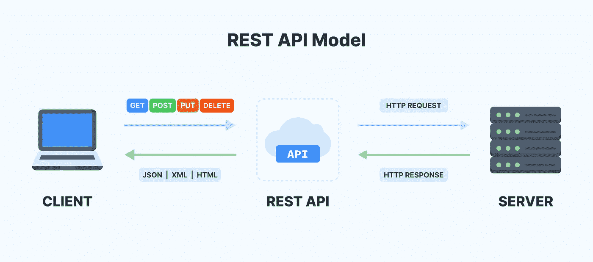

# API 完全初学者指南

> 原文：<https://medium.com/javarevisited/complete-beginners-guide-to-apis-e526d8ee319f?source=collection_archive---------2----------------------->

这篇文章旨在为任何有兴趣学习[API](/javarevisited/best-web-api-design-and-development-courses-for-beginners-fb1c8dd83379)的人提供教程支持。我的目标是保持信息简洁，并集中在必须理解的最关键点上。所以去喝杯咖啡，☕，读读这篇文章吧！

**什么是 API？**

API 是现代计算机器的支柱。API 代表应用程序编程接口。API 用于 Web 浏览器和 Web 服务器之间的通信。基本上，API 接受来自应用程序的请求并返回所需的数据。API 通常使用 [JSON 格式](https://javarevisited.blogspot.com/2015/05/how-to-print-json-string-in-java-jackson-example.html#axzz7CGC6wxzA)在浏览器和服务器之间传输数据。

**API 与 API 端点**

[API](https://javarevisited.blogspot.com/2021/10/top-5-courses-to-learn-api-development.html)和 API 端点是两回事。相反，端点是 API 的一个组件。端点是应用程序可以访问的 API 上的 URIs。所有 API 都有端点。

考虑一下[卡特彼勒事实 API](https://catfact.ninja/) 。这个 API 提供了随机的 cat 事实。但是，它列出了可以用来请求分类信息的各种端点。有三个可用的端点。

/fact:返回单个随机的 cat 事实

/facts:返回随机 cat 事实的列表

/breedies:返回猫的品种列表

每个端点都特定于数据的特定部分。

**JSON 是什么？**

JSON 是使用 API 传输数据的最广泛使用的数据格式。JSON 文档由名称/值对组成。数据的结构反映在这些名称/值对中。

**原料药的种类**

有一些可用的 API 范例，如 REST、RPC、 [SOAP](/javarevisited/10-best-java-web-services-rest-soap-and-api-courses-for-beginners-724a8f51298d) 和 [GraphQL](/javarevisited/top-5-graphql-tutorials-and-courses-for-beginners-fb5543506fc2) 等。REST 是其中最常用的范例。

**什么是 REST API？**

REST 代表表述性状态转移，这是一种用于开发通过 HTTP 协议交互的 API 的架构风格。

为了访问资源，客户端发送一个 HTTP 请求。然后服务器生成一个 HTTP 响应。

**请求结构**

任何 REST 请求都由四部分组成:HTTP 方法、端点、头和主体。

**HTTP 方法**描述了要对资源做什么。有四种基本方法可用，分别是:[发布、](https://javarevisited.blogspot.com/2016/10/difference-between-put-and-post-in-restful-web-service.html)获取、上传和删除。**端点**是一个 URL，指示在互联网上何处可以找到资源。**头**存储 API 密钥、IP 地址等信息。**主体**用于向服务器发送额外的信息。大多数情况下，我们可以用 POST 和 UPDATE 方法在主体中发送数据，以添加和更新数据。

**响应结构**

作为响应，服务器发送资源的表示，即其当前状态的机器可读描述。响应以不同的格式表示，但是，广泛使用的格式是 XML 和 JSON。响应还包括一个 HTTP 响应代码，指示 HTTP 请求是否已成功完成。

常见的响应代码:200 正常，201 已创建，400 错误请求，404 未找到，500 内部服务器错误。

**使用 API 键**

API 密钥为调用应用程序提供标识和身份验证。当进行 API 调用时，我们可以在请求的头部分包含 API 键。

**第一方与第三方 API 的区别**

第一方 API 是内部开发的 API。这些 API 是使用内部资源、人才和系统开发的。第一方让您完全控制 API 的设计、生命周期和实现。

由第三方开发的 API 称为第三方 API。如果 API 可以满足您的需求，那么您可以轻松地使用第三方 API，否则，选择第三方 API 并不是一个好主意，因为您不能修改这些 API，而且您还必须考虑使用第三方 API 的特定规则。

例如:脸书的 API，谷歌的 API

**API 文档**

API 文档是记录 API 的技术内容。它包括如何有效地使用和集成 API 的说明。

斯瓦格，雷多克

**觉得有意思？**
请通过👏。