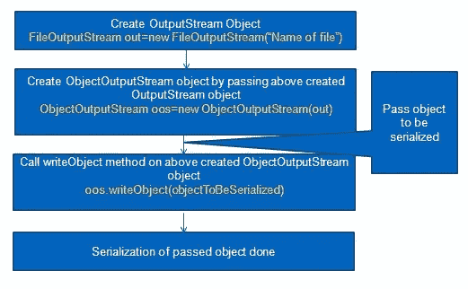
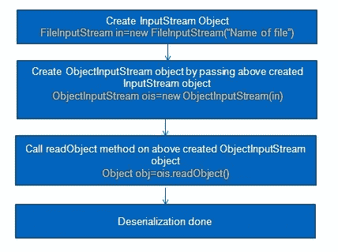

# java 序列化完全指南

> 原文：<https://medium.com/javarevisited/complete-guide-to-serialization-in-java-44b36032157?source=collection_archive---------0----------------------->

[Java](https://java2blog.com/core-java-tutorial-for-beginners-experienced/) 提供了一种叫做[序列化](https://java2blog.com/serialization-in-java/)的机制，以字节有序或序列的形式持久化 Java 对象，包括对象的数据以及关于对象类型和存储在对象中的数据类型的信息。

因此，如果我们需要序列化任何[对象](https://java2blog.com/object-class-java/)，那么它可以被读取，并使用对象的类型和其他信息进行反序列化，这样我们就可以检索原始对象。

ObjectInputStream 和 ObjectOutputStream 类是包含序列化和反序列化对象的方法的高级流。
ObjectOutputStream 有许多序列化对象的方法，但常用的方法是

类似地，ObjectInputStream 具有

# java 中需要序列化吗？

当需要通过网络发送数据或存储在文件中时，通常使用序列化。我说的数据是指对象，而不是文本。

现在的问题是你的网络基础设施和你的硬盘是理解位和字节但不理解 Java 对象的硬件组件。

序列化是将 Java 对象的值/状态转换成字节，以便通过网络发送或保存。另一方面，反序列化是将字节码转换成相应的 java 对象。

# serialVersionUID 的概念:

serialVersionUID 用于确保在反序列化过程中加载(在序列化过程中使用的)相同的类。serialVersionUID 用于对象的版本控制。你可以在 java 序列化中的 [serialVersionUID 了解更多信息](http://www.java2blog.com/2013/03/serialversionuid-in-java-serialization.html)

**对于 java 中的序列化:**
步骤是:



**举个例子:**
在 src->org . arpit . javaportsforlearning 中创建 Employee.java

1.  **Employee.java**

```
As you can see above,if you want to serialize any class then **it must implement Serializable interface which is marker** [**interface**](https://java2blog.com/interface-in-java-with-example/)**.** 
Marker interface in Java is interfaces with no field or methods or in simple word empty interface in java is called marker interface
Create SerializeMain.java in src->org.arpit.javapostsforlearning
```

**2.SerializeMain.java**

# 对于反序列化:

步骤是:



在 src-> org . arpit . javaportsforlearning 中创建 DeserializeMain.java

**3.DeserializeMain.java**

## 4.运行它:

首先运行 SerializeMain.java，然后运行 DeserializeMain.java，您将得到以下输出:

```
Deserialized Employee...
Emp id: 101
Name: Arpit
Department: CS
```

所以我们序列化了一个 employee 对象，然后反序列化了它。这看起来很简单，但当涉及到引用对象、继承时，情况可能会非常复杂。因此，我们将一个接一个地看到不同的情况，以及我们如何在不同的场景中应用序列化。

## 案例 1——如果一个对象引用了其他对象怎么办

我们已经看到了非常简单的序列化情况，现在如果它也是对其他对象的引用呢？

那要怎么连载呢？引用对象也会被序列化吗？。

是的，您不必显式序列化引用对象。当您序列化任何对象时，如果它包含任何其他对象引用，那么 Java 序列化将序列化该对象的整个对象图。

例如:假设 Employee 现在可以引用 address 对象，而 address 可以引用其他对象(例如 Home ),那么当您序列化 Employee 对象时，所有其他引用对象(例如 Address 和 home)都将被自动序列化。让我们创建地址类并添加地址对象作为对上述雇员类的引用。

**Employee.java:**

在 org . arpit . javaportsforlearning
address . Java:中创建 Address.java

在 org . arpit . javaportsforlearning 中创建 SerializeDeserializeMain.java

**serializedeserializemain . Java:**

**运行它:**

当您运行 SerializeDeserializeMain.java.You .时，您将获得以下输出

```
java.io.NotSerializableException: org.arpit.javapostsforlearning.Address
    at java.io.ObjectOutputStream.writeObject0(Unknown Source)
    at java.io.ObjectOutputStream.defaultWriteFields(Unknown Source)
    at java.io.ObjectOutputStream.writeSerialData(Unknown Source)
    at java.io.ObjectOutputStream.writeOrdinaryObject(Unknown Source)
    at java.io.ObjectOutputStream.writeObject0(Unknown Source)
    at java.io.ObjectOutputStream.writeObject(Unknown Source)
```

我们对出错的地方提出了异议。我忘了说，地址类也必须是可序列化的。因此，您必须通过实现 serializable 接口来使地址可序列化。

**Address.java:**

**再次运行:**

当您再次运行 SerializeDeserializeMain.java.You .时，您将获得以下输出

```
Deserialized Employee...
Emp id: 101
Name: Arpit
Department: CS
City :Pune
```

**情况 2:如果你没有访问引用对象源代码的权限(例如，你没有访问上述地址类的权限)怎么办**
如果你没有访问地址类的权限，那么你将如何在地址类中实现可序列化接口。除此之外还有其他选择吗？是的，你可以创建另一个类来扩展地址并使其可序列化，但是在很多情况下它会失败:

*   如果类被声明为 final 怎么办
*   如果类引用了其他不可序列化的对象。

那么如何序列化 Employee 对象呢？所以解决方法是你可以让它暂时消失。如果你不想序列化任何字段，那么就让它成为瞬态的。

```
transient Address address
```

所以在运行程序时，在 Employee 类中进行地址转换之后。您将得到 nullPointerException，因为在反序列化期间，地址引用将为 null

**情况 3:如果您仍然想要保存引用对象(例如上面的地址对象)的状态，该怎么办:**

如果您使地址成为瞬态的，那么在反序列化期间，它将返回 null。但是，如果您仍然希望拥有与序列化地址时相同的状态，该怎么办呢？object.Java 序列化提供了一种机制，如果您有带有特定签名的私有方法，那么它们将在序列化和反序列化期间被调用，因此，如果我们提供 employee 类的 writeObject 和 readObject 方法，它们将在 Employee 对象的序列化和反序列化期间被调用。

**Employee.java:**

应该记住一点，ObjectInputStream 应该按照我们将数据写入 ObjectOutputStream 相同顺序读取数据。
在 org . arpit . javaportsforlearning
address . Java:中创建 Address.java

在 org . arpit . javaportsforlearning 中创建 SerializeDeserializeMain.java

**serializeserializemain . Java:**

**运行它:**

当您运行 SerializeDeserializeMain.java.You .时，您将获得以下输出

```
Deserialized Employee...
Emp id: 101
Name: Arpit
Department: CS
City :Pune
```

所以现在我们得到了与序列化之前相同的地址对象状态。

## java 中序列化的继承:

现在我们将看到[继承](https://java2blog.com/inheritance-java/)如何影响序列化。因此，超类是否可序列化可能有多种情况。如果不是，那么你将如何处理它，它是如何工作的。

**举个例子。**
我们将创建 Person.java，它将是雇员的超类。


**案例四:** **超类可序列化怎么办？如果超类是可序列化的，那么它的所有子类都是可自动序列化的。**

**案例 5:如果超类不可序列化怎么办？如果超类是不可序列化的，那么我们必须用完全不同的方式来处理它。**

*   如果超类是不可序列化的，那么它必须没有参数构造函数。

**Person.java**

在 org . arpit . javaportsforlearning
**employee . Java:**中创建 Employee.java

在 org . arpit . javaportsforlearning 中创建 SerializeDeserializeMain.java

**serializedeserializemain . Java:**

**运行它:**

当您运行 SerializeDeserializeMain.java.You .时，您将获得以下输出


如果超类不可序列化，那么从超类继承的实例变量[的所有值将在反序列化过程中通过调用不可序列化超类的构造函数来初始化。所以这里的名称是从 person 继承的，所以在反序列化期间，名称被初始化为默认值。](https://java2blog.com/variables-java/)

**案例 6——如果超类是可序列化的，但你不希望子类是可序列化的**
如果你不希望子类是`Serializable`那么你需要在**子类**中实现`writeObject()`和`readObject()`方法，并需要从这些方法中抛出**NotSerializableException**。

**案例 7——你能序列化静态变量吗？**
不，你不能。如你所知，静态变量是在类级别而不是在对象级别，你序列化一个对象，所以你不能序列化静态变量。

如果你想对序列化有更多的控制，可以使用可外部化的接口来代替可序列化的接口。你可以在[Java 中的外部化](http://www.java2blog.com/2014/02/externalizable-in-java.html)了解更多

# Java 序列化教程:

*   [Java 中的序列化](http://www.java2blog.com/2013/03/serialization-in-java.html)
*   [Java 序列化面试问答](http://www.java2blog.com/2017/02/java-serialization-interview-questions-and-answers.html)
*   [Java 中的 serialversionuid](http://www.java2blog.com/2013/03/serialversionuid-in-java-serialization.html)
*   [序列化](http://www.java2blog.com/2013/03/serialversionuid-in-java-serialization.html) [可在 java 中外部化](http://www.java2blog.com/2014/02/externalizable-in-java.html)
*   [Java 中的瞬态关键字](http://www.java2blog.com/2016/05/java-transient-keyword-with-example.html)
*   [Java 中可序列化和可外部化的区别](http://www.java2blog.com/2017/02/difference-between-serializable-and-externalizable-in-java.html)

# 总结:

*   java 中的序列化是将 Java 对象的值/状态转换成字节，以便通过网络发送或保存。另一方面，反序列化是将字节码转换成相应的 java 对象。
*   序列化的好处是整个过程是独立于 JVM 的，这意味着一个对象可以在一个平台上序列化，而在一个完全不同的平台上反序列化。
*   如果你想序列化任何一个类，那么它必须实现可序列化的接口，也就是标记接口。
*   java 中的标记接口是没有字段或方法的接口，或者简单地说，Java 中的空接口称为标记接口
*   serialVersionUID 用于确保在反序列化期间加载相同的对象(在序列化期间使用的)。serialVersionUID 用于对象的版本控制。
*   当您序列化任何对象时，如果它包含任何其他对象引用，那么 Java 序列化将序列化该对象的整个对象图。
*   如果不想序列化任何字段，那么就让它[瞬态](https://java2blog.com/java-transient-keyword-with-example/)。
*   如果超类是可序列化的，那么它的子类也是自动可序列化的。
*   如果超类不可序列化，那么从超类继承的实例变量的所有值将在反序列化过程中通过调用不可序列化超类的[构造函数](https://java2blog.com/constructor-java/)来初始化。
*   如果你不想让子类序列化，那么你需要实现 writeObject()和 readObject()方法，并从这些方法中抛出 NotSerializableException。
*   不能序列化静态变量。

## 您可能还喜欢:

*   [Java 多线程面试试题](https://java2blog.com/java-multithreading-interview-questions-and-answers/)。
*   [Java 面试问题](https://java2blog.com/java-interview-questions/)
*   [Java 面试题 5 年经验](https://java2blog.com/java-interview-questions-for-5-years-experience/)
*   [核心 java 面试问题](https://java2blog.com/core-java-interview-questions-and-answers/)
*   [Java 集合面试问题](https://java2blog.com/java-collections-interview-questions/)
*   [Java 线程示例](https://java2blog.com/java-thread-example/)

这就是 java 中序列化的全部内容。