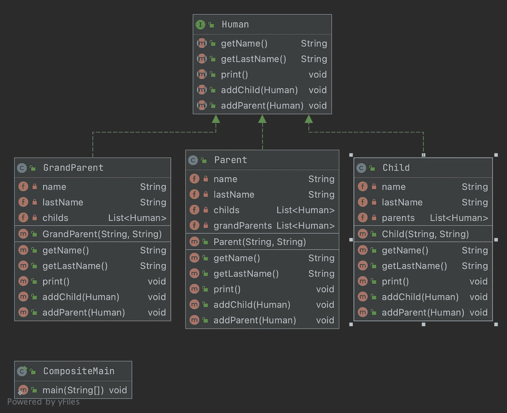

# 复合设计模式— Java

> 原文：<https://medium.com/javarevisited/composite-design-pattern-java-9cd0964d3b12?source=collection_archive---------1----------------------->

## 复合图案教程


# 复合模式的定义

> 在软件工程中，**复合模式**是一种划分设计模式。复合模式描述了一组对象，它们被视为同一类型对象的单个实例。复合的目的是将对象“组合”成树形结构，以表示部分-整体层次结构。实现复合模式让客户可以统一处理单个对象和复合。

# 在哪里使用复合模式？

当我们想要在树叶和复合物上实现相同的接口，以便以相同的方式处理它们时。

# UML 示例

[](https://javarevisited.blogspot.com/2018/02/top-5-java-design-pattern-courses-for-developers.html)

# 复合模式的实现

首先，我们需要声明描述组件行为的接口。

那么实现将具有相同的行为，但是它们之间有一些层次结构。

这些实现的唯一区别是使用了 *addParent()* 和 *addChild()* 来创建层次结构，就像我们可以看到下面的例子和它将产生的输出一样。

```
==============================
Name : Philippe
Last name : Le Tutour
Childs :
  - Name : Erwan
==============================
==============================
Name : Erwan
Last name : Le Tutour
Parents :
  - Name : Philippe
Childs :
  - Name : Mathys
==============================
==============================
Name : Mathys
Last name : Le Tutour
Parents :
  - Name : Erwan
  - Name : Amelie
==============================
```