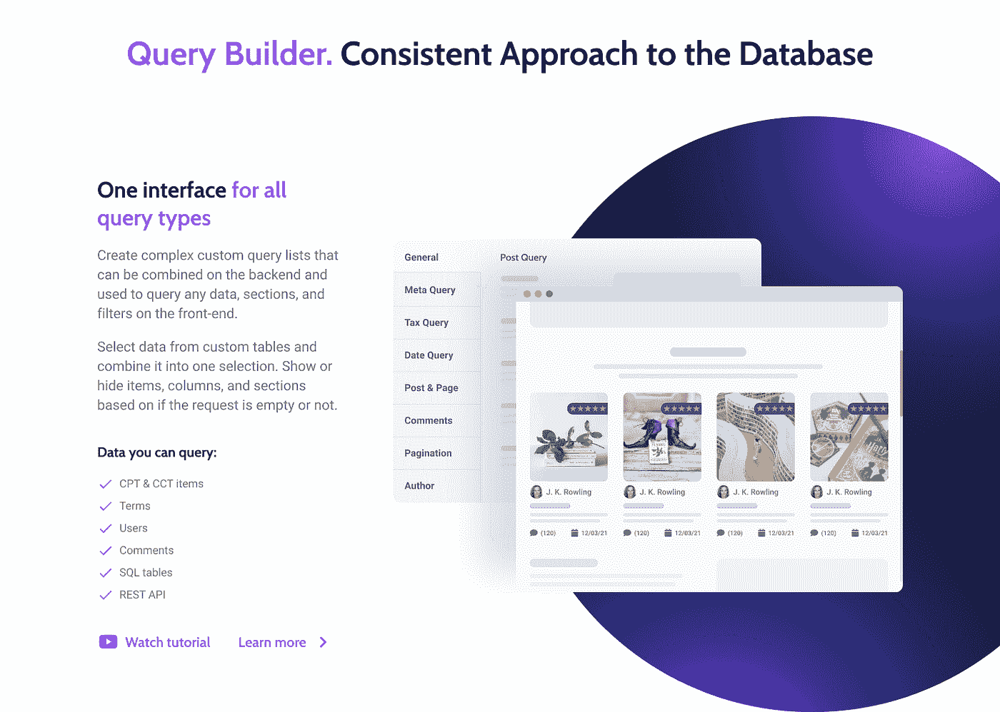
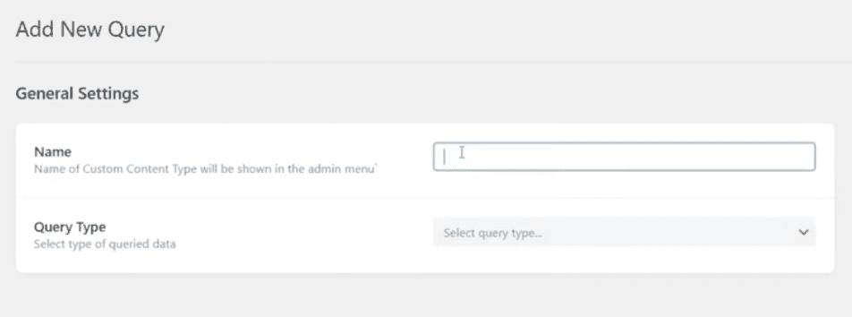
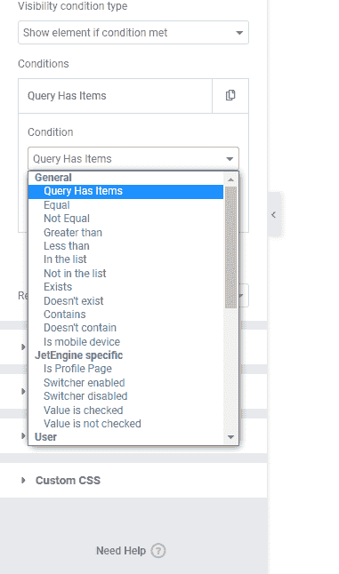

# 全面的查询变得容易:JetEngine 查询生成器评论

> 原文：<https://medium.com/javarevisited/comprehensive-queries-made-easy-jetengine-query-builder-review-26b8c148e8f6?source=collection_archive---------0----------------------->

> 你知道 WordPress 插件通常是如何执行数据库查询来获取某些东西(CPT，术语，自定义表格数据等)的吗？)?

所有请求都在输出数据的小部件、短代码或块中配置。

根据一种常见的方法，所有查询都配置在显示其数据的块中。

> **一方面**，方便是因为可以快速显示区块，设置查询，大功告成。
> 
> **但是另一方面**，如果你需要在页面上从查询中访问数据，这种方法并不合适。

这就是为什么 [**Crocoblock**](https://crocoblock.com/?ref=2817) 决定改变解决这个问题的方法，让查询构建器成为一个独立的功能。这不依赖于小部件、块或短代码。在本文中，我将讨论 JetEngine 中的一个新的 [**查询构建器特性。**](https://crocoblock.com/knowledge-base/articles/jetengine-query-builder-overview/?ref=2817)

# 什么是 JetEngine 和 Crocoblock？

开发插件和模板来处理动态数据，甚至不用编码就能构建复杂的网站。该团队用三年时间，用数百个小部件和几十个模板，为 Elementor 和 Gutenberg 创建了 20 个多功能插件。

[**JetEngine**](https://crocoblock.com/plugins/jetengine/?ref=2817) 是一个动态内容插件，是 Crocoblock 团队的一个关键开发。它帮助您创建:

*   自定义文章类型(CPT)
*   自定义内容类型(CCT)
*   自定义元字段
*   元框
*   选项页面

然后，您可以在分类法和关系特性的帮助下对其进行结构化和关联。为了在前端输出所有这些内容，JetEngine 附带了用于 Elementor 的 **14 个小部件和 **10 个古腾堡动态块。****

JetEngine 不断更新，最近增加了一个**新的查询构建器部分**。它提供了尖端的功能。

# JetEngine 查询生成器

[**获取 JetEngine 查询生成器**](https://crocoblock.com/plugins/jetengine/?ref=2817)

我已经展示并解释了查询设置通常是如何在[插件中实现的。](/javarevisited/5-best-wordpress-courses-for-beginners-and-experienced-website-developers-b45f7976ee40)

JetEngine Query Builder 提供了一种全新的方法。

列表网格或任何呈现项目的块只是一个接收和输出数据的可视包装器。但是从数据库中获取这个列表的查询可以在没有块本身的情况下存在，并且仍然是有用的。

因此，这些物品被转移到另一个部门进行处理。稍后，列表网格小部件接收这些项目并显示它们。

这是这种方法的一个示例:

如您所见，只有一个查询，但它显示了:

*   在节呈现之前查询项的计数器
*   列出网格前的部分中已查询项目的计数器
*   列出网格本身
*   列表网格后的计数器

此外，它还可以根据基于查询结果的设置条件隐藏或显示部分。所有这些都只能从查询实例中执行。

查询方法变得更加集中，现在对数据库的任何查询都在同一个界面中配置。在这里，查询作为一个独立的对象存在，可以随时访问。

查询被处理一次，然后被缓存。并且在第一次调用该查询之后，所有进一步的查询都将使用缓存的值。这种方法的优势如下:

*   良好的性能和速度
*   无需为每个小部件重新设置查询
*   在页面加载的任何阶段发出请求
*   添加新查询类型的灵活性

让我们从复杂的技术部分转移到描述新的查询构建器的真正好处。

# 为什么需要 JetEngine 查询构建器？

JetEngine 允许查询 CPT 和 CCT 项目、术语、用户、评论、SQL 表和 REST API。

它为此提供了一个设置部分，但是您设置的条件只适用于特定的列表网格。如果您在其他页面上有类似的网格，并且需要进行一些更改，则当这些列表网格出现错误时，您必须在每个页面上手动更改设置。

又来了 [**查询生成器**](https://crocoblock.com/knowledge-base/article-category/jet-engine/?ref=2817) ！

它提供了一个单一的界面来**创建列表并把它们添加到你需要的任何地方**。您在“查询构建器”菜单选项卡中对列表所做的任何更改都将应用于启用该查询的所有列表网格。

让我们来看看具体的用例。

# 用例 1:追加销售产品

借助 Query Builder，您可以在单品页面上动态展示相关产品的目录，从而刺激您的客户购买更多产品。此外，您可以设置可见性条件，因此如果没有相关项目，此相关产品部分将不会显示。

# 用例 2:评论部分

现在，您可以在主页上动态显示关于您产品的评论和用户评论。

同时，自定义评论的分类、撰写日期等等。

# 用例#3:用户的内容

显示用户在其用户资料页面或任何单个页面上留下的评论，并通过帖子状态或日期进行查询。

# 总结

JetEngine 是一个动态内容插件，可以帮助你创建即使是最复杂的网站，而无需编码技能。在上一次更新中，JetEngine 获得了新模块 Query Builder。它以一种全新的方式实现了构建查询。

**Paul Charlton** 在 **WPTuts Youtube 频道**的视频中清楚地展示了这一点:

简而言之，Query Builder 是一个统一的系统，用于排序和显示不同的 WordPress 元素——文章、术语、用户、评论、 [SQL 表](/hackernoon/top-5-sql-and-database-courses-to-learn-online-48424533ac61)、 [REST API](/javarevisited/10-best-java-web-services-rest-soap-and-api-courses-for-beginners-724a8f51298d) 。