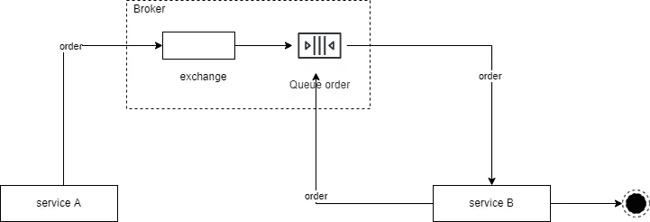
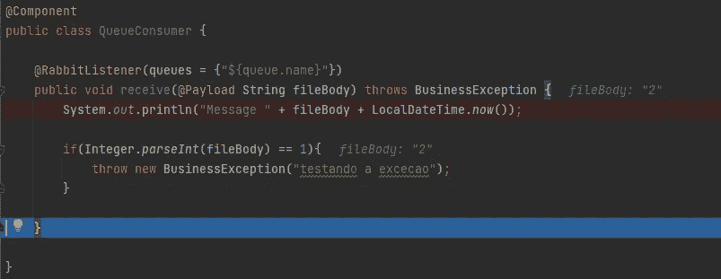
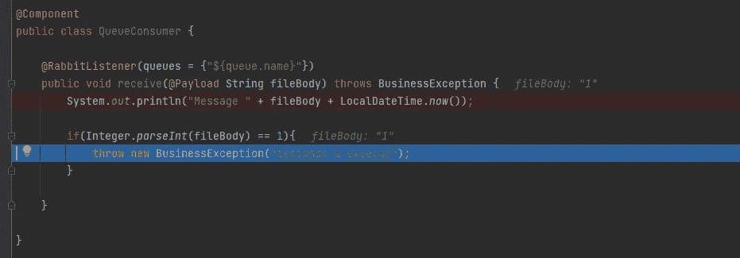
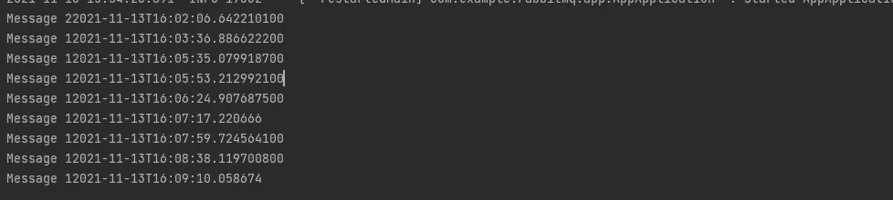

# 使用 RabbitMQ 和 Spring Boot 配置自动消息重试

> 原文：<https://medium.com/javarevisited/configuring-automatic-message-retry-using-rabbitmq-and-spring-boot-6259f376f163?source=collection_archive---------1----------------------->


在某些特定的情况下，当我们使用队列中的消息时，如果特定的事情还没有发生，我们可能希望这些消息不要离开队列。变得很抽象，对吧？我来举个例子:

假设在网站上进行了一次购买。

现在想象一下，产品从库存中分离出来后，必须发送一封电子邮件。

但是，这封电子邮件只应在满足条件的情况下发送，该条件是库存产品的分离。

不要问我这从商业角度讲有没有意义，这只是一个证明重试 lol 正当性的情况。

一个简单的绘图应该是这样的:

[](https://javarevisited.blogspot.com/2014/03/top-10-websphere-mq-series-interview-questions-answers-active-rabbit.html)

在 [spring boot 应用程序](https://www.java67.com/2019/07/spring-boot-3-ways-to-change-port-of-tomcat.html)中会是什么样子呢？

让我们这样做:

**pom.xml** :

```
<dependency>
   <groupId>org.springframework.boot</groupId>
   <artifactId>spring-boot-starter-amqp</artifactId>
</dependency>
<dependency>
   <groupId>org.springframework.amqp</groupId>
   <artifactId>spring-rabbit-test</artifactId>
   <scope>test</scope>
</dependency>
```

**应用属性:**

```
spring.rabbitmq.host=localhost
spring.rabbitmq.port=5672
spring.rabbitmq.username=guest
spring.rabbitmq.password=guest

spring.rabbitmq.listener.simple.retry.enabled=true
spring.rabbitmq.listener.simple.retry.initial-interval=5000 // the first time will wait 5 seconds to try again
spring.rabbitmq.listener.simple.retry.max-attempts=10 //will try a maximum of 10 times
spring.rabbitmq.listener.simple.retry.max-interval=300000 // the maximum interval between attempts is 5 minutes
spring.rabbitmq.listener.simple.retry.multiplier=3.0 // multiplies the range by 3

queue.name=test //queue name
```

**监听器:**

```
@Component
public class QueueConsumer {

    @RabbitListener(queues = {"${queue.name}"})
    public void receive(@Payload String fileBody) throws BusinessException {
        System.out.println("Message " + fileBody + LocalDateTime.now());

        if(Integer.parseInt(fileBody) == 1){
            throw new BusinessException("testing for exception");
        }

    }

}
```

**主类:**

```
@EnableRabbit
@SpringBootApplication
public class AppApplication {

   public static void main(String[] args) {
      SpringApplication.run(AppApplication.class, args);
   }

}
```

好了，这就是我们要测试的。在第一条消息中，我发送了值 2:

[](https://javarevisited.blogspot.com/2018/02/top-5-spring-microservices-courses-with-spring-boot-and-spring-cloud.html)

然后它被消费并从队列中删除。

在第二个例子中，我发送了值 1，它将被返回到[队列](https://javarevisited.blogspot.com/2020/05/top-16-jms-java-messaging-service-interview-questions-answers.html)，因为发生了一个异常:

[](https://www.youtube.com/watch?v=h28rnSsDIq4)

看一下间隔:

[](https://www.java67.com/2020/04/top-jms-java-messaging-service-interview-questions-answers.html)

这已经给了我们一个很酷的概念证明来解决一些问题。

从这里开始，就按照各个项目出现的情况来放这个吧。