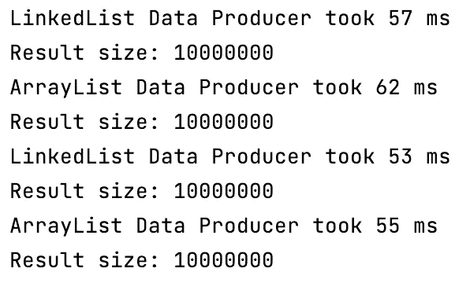
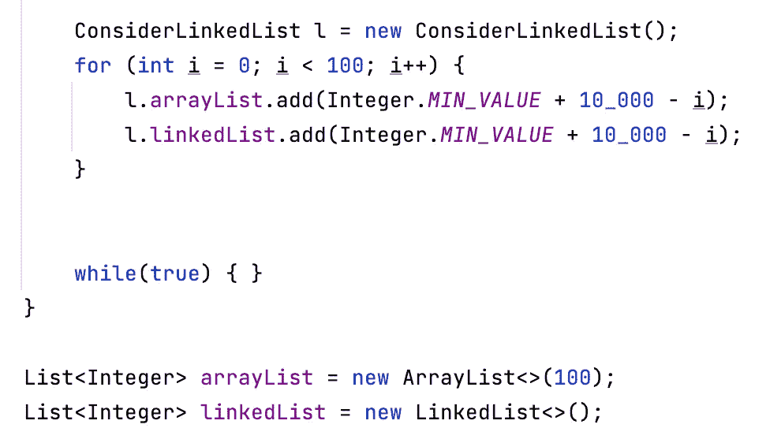

# 关于在 Java 中使用 LinkedList 的几点思考

> 原文：<https://medium.com/javarevisited/consider-linkedlist-in-java-2fed1b945b48?source=collection_archive---------2----------------------->

这将是一篇不同的文章，因为在我的机器上测试了一些之后，我的假设被证明是稍微错误的。这是我的发现。

**TL；** 博士使用[数组列表](https://javarevisited.blogspot.com/2011/05/example-of-arraylist-in-java-tutorial.html#axzz6qVaG06bu)在大多数标准情况下，你简单地添加到列表中，然后迭代它。这会节省你的时间和记忆。

**注意**本文并没有讨论其中一些操作的复杂性，我们知道其中一个操作的性能会更好(例如，在列表的开头添加元素或者随机访问)。这里讨论的用例只是简单地添加项目，以便在以后的某个时刻对其进行迭代。

我的假设是，在所有情况下，当简单地将元素添加到列表末尾时， [**LinkedList**](https://www.java67.com/2012/12/difference-between-arraylist-vs-LinkedList-java.html) 会比 **ArrayList** 执行得更好。然后我会建议我们应该放弃默认输入

```
List<Object> list = new ArrayList<>();
```

相反，写下

```
List<Object> list = new LinkedList<>();
```

***为什么？***

因为一旦内部容器填满， [ArrayList](https://javarevisited.blogspot.com/2015/07/java-arraylist-tutorial.html) 就必须执行调整大小操作，而 [LinkedList](http://www.java67.com/2016/02/how-to-sort-linkedlist-in-java-example.html) 只需追加一个新节点(无论大小如何都是相同的操作)。

## 测试

所以我做了一个小测试，给每种类型的列表添加 1000 万个元素，如下所示。

这是一个虚拟的例子，但类似的设置在生产中并非不可能见到。我的结果是他们的表现非常相似。

测试使用以下 [VM 选项](https://www.java67.com/2016/08/10-jvm-options-for-java-production-application.html)运行，以消除自适应堆大小调整或 GC 的任何问题。

```
-Xms5G -Xmx5G -XX:+UnlockExperimentalVMOptions -XX:+AlwaysPreTouch -XX:+UseEpsilonGC
```

[](https://javarevisited.blogspot.com/2011/11/hotspot-jvm-options-java-examples.html#axzz54oJiRW8k)

epsilon GC 的首次测试结果。

显然这与现实相差甚远，所以我决定修改测试，只指定 [G1 垃圾收集器](/javarevisited/7-best-courses-to-learn-jvm-garbage-collection-and-performance-tuning-for-experienced-java-331705180686?source=---------8------------------)。

```
-XX:+UseG1GC
```

新的测试见下文。

不同之处在于，我对引入一些额外预热的时间进行了平均，因此编译器有更多的时间进行优化，我们可以获得更真实的结果。


更真实的结果。

***发生了什么事？***

很难说最后一个例子中 ArrayList 和 LinkedList 之间的差异是因为编译器优化对 ArrayList 更有效，还是 GC 的影响，还是因为 [LinkedList](https://www.java67.com/2020/07/how-to-get-first-and-last-element-of-linkedlist-in-java.html) 需要更多内存。要想弄清楚这一点，必须深入研究编译器的 GC 日志。

但是现在，我们可以得出结论，由于这些影响中的任何一个， [ArrayList](https://javarevisited.blogspot.com/2012/01/how-to-sort-arraylist-in-java-example.html) 似乎比 LinkedList 使用一个更真实的设置和一个实际的 GC 运行来执行要好得多。

## 最后一些内存方面的考虑

我执行了以下测试，并记录了内存差异。

[](https://www.java67.com/2012/08/how-to-sort-arraylist-in-java-list.html)

100 个元素的记忆测试。

下表说明了使用 MAT [2]报告的 100 个和 1000 个整数元素(需要 16B，因为 int 需要 4 个字节，header info 需要 12 [1])进行上述测试时保留的堆中的结果。

```
+--------------+----------------+-----------------+----------------+
|     Type     |  100 elements  |  1000 elements  |  Overhead (*)  |
+--------------+----------------+-----------------+----------------+
|  LinkedList  |     4032B      |      40032B     |      24B       |
|  ArrayList   |     2040B      |      20040B     |       4B       |
+--------------+----------------+-----------------+----------------+
```

这里的开销就是每个条目保留的堆减去 16B，由 MAT 减去实际列表的一些头信息提供。不出所料，与[数组列表](https://javarevisited.blogspot.com/2014/01/ow-to-remove-objects-from-collection-arraylist-java-iterator-traversing.html)相比，LinkedList 占用了大约两倍的内存。然而，这是给定的一个小元素，更大的元素的开销将可以忽略不计。

## 外卖食品

我从这里学到的是在大多数标准的情况下**更喜欢 ArrayList 而不是 LinkedList，用例是简单地添加到末尾并迭代列表。**

**参考文献**

[1]如何计算 Java 对象的内存使用量
[https://www . javax . com/tutorials/memory/object _ memory _ usage . shtml](https://www.javamex.com/tutorials/memory/object_memory_usage.shtml)

[2]内存分析器(MAT)
[https://www.eclipse.org/mat/](https://www.eclipse.org/mat/)