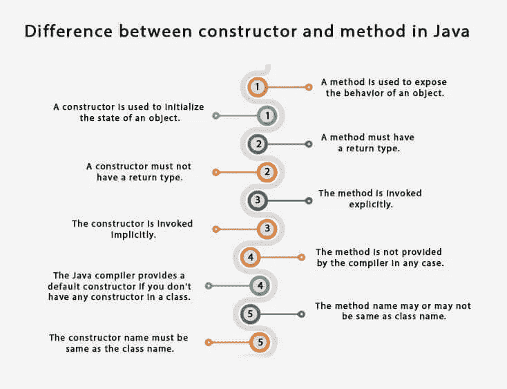

# Java 中的构造函数

> 原文：<https://medium.com/javarevisited/constructor-in-java-92b9c593965a?source=collection_archive---------1----------------------->

图片来源:Google/Hackr.io

这是 Java 中非常重要的概念之一，也是面试中的一个重要问题。那么，让我们修改一下什么是构造函数、类型和用途？

## 什么是**构造函数**？

1.  构造函数就像一个方法，当一个类的对象被实例化时，它被自动调用。
2.  构造函数与您的类名同名。
3.  构造函数没有任何返回类型。
4.  它可以用来设置对象变量的值。

> 示例:

公共类 LinkedIn()

{

私有字符串 Full _ Name

私有字符串 Profile _ Name

私有字符串 Job _ Role

}

//构造函数

LinkedIn()

{

Full _ Name = " Mukta Sharma

Profile _ Name = " Mukta Sharma

Job_Role = "QA 社区支持者"；

}

}

## 构造函数的类型

有两种类型的构造函数:

1.  默认构造函数
2.  参数化构造函数

## 默认构造函数:

默认构造函数是没有参数的构造函数。如果类中没有构造函数，编译器会自动创建一个默认的构造函数。

阶级领英

}

在这里，编译器会自动创建一个与 class 同名的默认构造函数来简化您的工作。所以，这个会看起来如下:
类 LinkedIn
{
//编译器
LinkedIn()
{
system . out . println("默认构造函数调用")；
}
}

## 参数化构造函数:

一种构造函数，它有一个或多个参数来初始化一个类的实例变量。下面给出了一个理解参数化构造函数的非常简单的例子。我自己也觉得简单易行。

图片来源:google images 上的 BytesofGigabytes。

## 构造函数和方法的区别:

如果你是构造函数的新手，那么你在理解构造函数和方法之间的区别时一定会有点困惑。为了消除你所有的疑虑，这是我给你的。请随意阅读下图中的所有要点并传播信息。感谢 [Java 教程点](https://medium.com/u/ee9cdeeda87d?source=post_page-----92b9c593965a--------------------------------)供图！

图片来源:Javatpoint

参考文献:Javatpoint，w3schools，Google Images，Hackr.io

我希望，这将有助于你理解构造函数，因为这些也帮助了我。您可以从一些基本代码开始编写，以理解用于实践目的的构造函数。

请随时分享您的意见。让我们一起学习，一起成长，一起提高。感谢您的阅读！