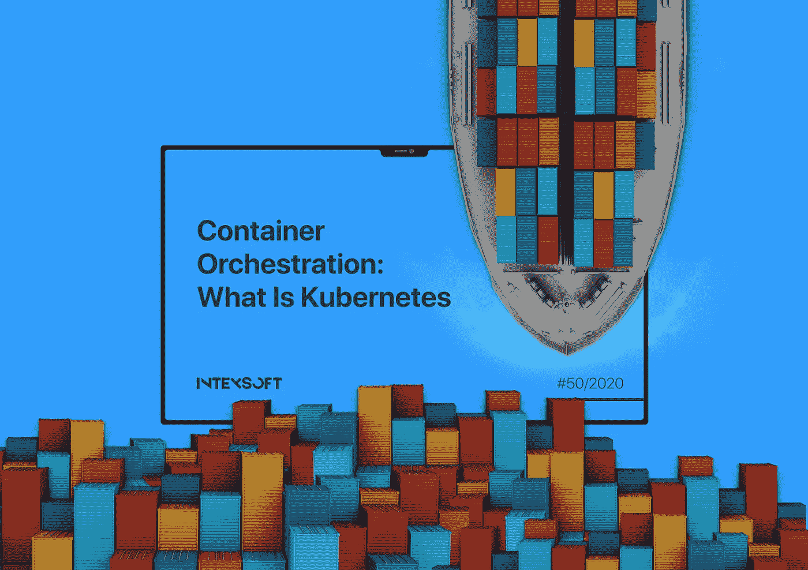
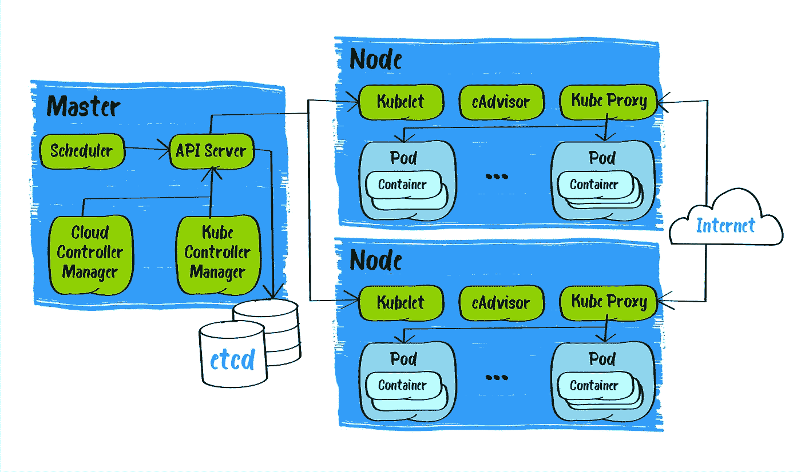
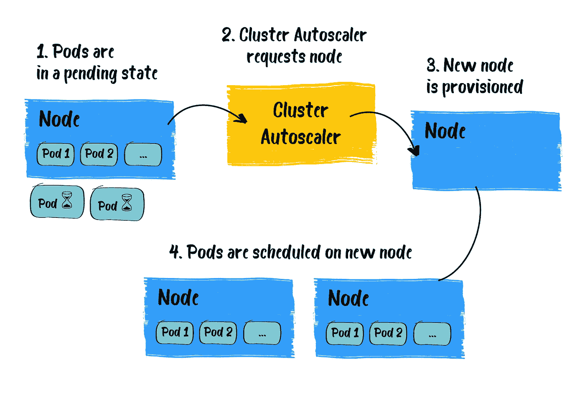

# Kubernetes 和容器编排入门指南

> 原文：<https://medium.com/javarevisited/container-orchestration-what-is-kubernetes-b3dce516c6a4?source=collection_archive---------3----------------------->

> 首先，我要感谢我的同事**Dzmitry Iliushyn****对本文的帮助。**

**随着横向可扩展性和微服务架构的兴起，世界观察到了“容器部署时代”。集装箱已经用了十多年了。今天，至少有四分之一的领先 IT 公司在大型生产中使用容器解决方案，这个数字可能会进一步增长。**

**许多市场解决方案提供容器运行时和编排，如 Docker Swarm、Mesos 等。然而，超过一半的用户选择 Kubernetes 作为基础设施标准。在这里，我们将把 Kubernetes 作为一种广泛的、快速发展的解决方案来讨论。**

# **为什么是集装箱？**

**让我们首先从容器的特性和优点开始。**

**正如 [Docker developers](/javarevisited/top-15-online-courses-to-learn-docker-kubernetes-and-aws-for-fullstack-developers-and-devops-d8cc4f16e773) 所说:“容器是一个标准的软件单元，它打包了一个应用程序运行所需的所有依赖——应用程序代码、运行时、系统工具、库和设置。”与虚拟机相比，容器本质上不是完全独立的操作系统，而是在同一操作系统内隔离的配置空间，使用主机的 Linux 内核来访问硬件资源以及主机的内存和存储。因此，容器需要更少的资源来启动和运行，这对项目的性能和预算有积极的影响。**

**轻量级、高速启动和出色的性能、将硬件和操作系统维护委托给提供商(在“即服务”解决方案的情况下)是容器的优势，这降低了应用程序的开发和维护成本，使得基于容器的解决方案对企业如此有吸引力。**

**至于技术专家的优势，容器允许他们将应用程序与其运行时环境打包，从而解决不同环境中的依赖性问题。例如，开发人员笔记本电脑上的软件包版本与后续的试运行或生产环境之间的差异迟早会导致失败。因此，至少需要努力去了解它们:分析和修复产品中的 bug。使用容器消除了“一切都在我的机器上工作”的问题。**

**容器还减少了应用程序开发时间，简化了生产中的管理，因为:**

*   **易于设置和更改配置；**
*   **对配置和应用程序代码进行版本控制；**
*   **为实施 [CI/CD](/javarevisited/7-best-courses-to-learn-jenkins-and-ci-cd-for-devops-engineers-and-software-developers-df2de8fe38f3?source=---------15------------------) 流程创造一个易于复制的环境；**
*   **方便的编排工具允许快速扩展基础架构。**

**此外，在选择或改变提供者时，没有将容器绑定到托管平台给了极大的灵活性。人们可以在个人电脑、裸机服务器或[云服务](/javarevisited/5-best-cloud-computing-courses-to-learn-in-2020-f5f091159401)上运行它们，没有根本的区别。**

****

**容器是捆绑和运行应用程序的好方法。在生产环境中， [DevOps 工程师](/javarevisited/top-10-courses-to-learn-devops-for-experienced-programmers-d93b666db151)需要管理运行应用程序的容器，并确保没有宕机。为了承受估计的负载，应用容器的数量应该是一定的或者不少于所需的最小值。因此，这里需要一些机制，如果负载变得更高或者其中一些由于任何原因而失败，这些机制将启动应用程序容器的新副本。当这种行为由系统像这些容器的“指挥者”一样来处理时，这个过程更容易。所有这些都导致了 Kubernetes。**

# **关于 Kubernetes**

**Kubernetes (也称为 K8s)是一个在集群环境中实现容器编排的平台。以前，它主要用于码头集装箱，因为它们非常受欢迎和广泛传播。但是，在最新的 Kubernetes 版本中，Docker 被列为不推荐使用，而容器运行时接口(CRI)被称为本机容器机制。**

**[Kubernetes](https://javarevisited.blogspot.com/2020/06/top-5-courses-to-learn-kubernetes-for-devops-and-certification.html) 显著扩展了容器功能，使管理部署、网络路由、资源消耗、负载平衡和运行应用程序的容错变得更加容易。**

**这个平台现在由[云提供商](/javarevisited/top-10-courses-to-learn-amazon-web-services-aws-cloud-in-2020-best-and-free-317f10d7c21d)在“即服务”模式中广泛提供。同时，无论您是在云中还是在本地，都可以将它安装在一组物理机或虚拟机上。**

**Kubernetes 是 IT 行业迈出的新一步，它允许简化应用程序的交付，包括这些应用程序的运行环境。使用 [Kubernetes](/javarevisited/7-free-online-courses-to-learn-kubernetes-in-2020-3b8a68ec7abc) ，可以从硬件配置中抽象出该环境的描述。**

**K8s 允许我们基于几个物理或虚拟机创建一个集群。该群集作为单一环境工作，由两种类型的节点组成:**

*   ****管理集群的主**节点(对于高可用性最佳实践，应该至少有 2 个主节点)；**
*   ****Worker** 节点是运行应用程序的机器(对于成熟的集群是 2 个或更多，具体取决于负载)。**

****

**当您在 K8s 中部署应用程序时，您提醒主服务器启动应用程序容器。主节点调度容器在工作节点上运行。每个工作节点与主节点通信。为此，Kubernetes 有一个 [API](https://kubernetes.io/docs/concepts/overview/kubernetes-api/) ，它也可以用于使用 [REST](/javarevisited/21-spring-mvc-rest-interview-questions-answers-for-beginners-and-experienced-developers-21ad3d4c9b82) 调用的直接管理。**

**为了开始使用 Kubernetes，开发人员可以使用一个轻量级实现——Minikube。Minikube 是一个跨平台解决方案工具。它在本地机器上创建一个简单的单节点集群。**

**要使用 Kubernetes 集群并在这样的环境中运行应用程序，需要一些指令来确定应用程序的期望状态。这样的指令就是 Kubernetes 清单，它描述了在集群中运行容器化代码的内容和方式。基本清单可能相对简单。**

**它们是 YAML/JSON 格式的代码，所以对于开发人员来说，编写一个简单的清单不成问题，清单也可以使用 GitOps 模型来处理。但是当我们从开发中的简单清单转移到生产时，问题是 K8s 的抽象级别如此之高，以至于人们应该很好地理解在集群的引擎盖下事情是如何工作的。**

**Kubernetes 有很多种描述和管理集群中容器行为的方法。K8s 本身主要是一个容器编排器，因此它的部件也是容器。这一事实导致了两个主要特点:**

1.  **平台的组件互不影响。如果一家倒闭，那么所有其他公司都将继续运营。**
2.  **这些组件根据拉模型工作。没有一个中心成分，一个统治所有人的指挥官。每个组件都执行并完成自己的功能。如果组件失败，则不会执行其操作。**
3.  **Kubernetes 模型专注于维护所需数量的工作容器:它重新启动关闭的容器，或者不响应用户定义的健康检查的容器，替换它们。**

# **库伯内特斯的核心种类**

****节点**
节点是 Kubernetes 集群的组成部分。主节点(可以有几个)通过调度器和控制器管理器控制集群，通过 API 服务器提供与用户交互的接口，并包含带有集群配置、其对象状态和元数据的 *etcd* 存储库。工作节点专门用于启动和使用容器；为此，在其上安装了两个 Kubernetes 服务——一个网络路由器和一个调度代理。**

****名称空间**
一个结构化对象，允许您在环境、用户和团队之间划分集群资源。**

****Pod**
这是 Kubernetes 中最小的单元——一组一个或多个容器，作为一个服务或应用程序工作，组装起来在一个节点上联合部署。当不同类型的容器相互依赖，因此必须在同一节点上运行以减少它们交互时的响应时间时，将它们分组在一个 Pod 中是有意义的。一个例子:带有 web 应用程序和缓存服务的容器。**

****ReplicaSet**
描述和控制集群上运行的 Pod 副本数量对应关系的对象。需要将副本的数量设置为一个以上，以提高应用程序的容错能力和可伸缩性。部署类型提供了更多的功能，并且更经常地用于应用程序，但是在某些特定情况下，ReplicaSet 就足够了。**

****部署**部署允许根据声明的规则更新不同的 pod。这使得已经发布的服务或应用程序的更新尽可能地平稳和无痛苦。**

****stateful set**
stateful set 允许你描述和保存 Pods 的状态:重启时唯一的网络地址和它们的磁盘存储，从而实现有状态应用模型。**

**这是一种根据指定的 Pod 实例来控制在每个(或几个选定的)节点上启动什么的类型。它用于运行集群存储、日志收集或节点监控。**

****Job 和 CronJob**
启动指定的 Pod 一次(或者在 CronJob 的情况下定期启动)并监控其执行结果的类型。**

****服务**
一种将应用发布为网络服务的虚拟服务，也实现了应用之间的负载均衡。**

****CRD**
K8s 不仅受到其基本功能的限制，还可以通过自定义资源定义进行扩展(CRD)。除了现成的，CRD 允许我们注入甚至“发明”新的定制种类。**

# **Kubernetes 的利弊**

**K8s 本质上是一个很棒的抽象工具:不需要深入考虑技术、硬件资源或者它的维护等等。让我们看得更深入一点。**

****+硬件抽象****

**首先，没有必要深究硬件特性和参数，尽管项目本身并没有要求一些特定的需求。在任何定制解决方案的情况下，开发人员或 [DevOps 工程师](/javarevisited/13-best-courses-to-learn-devops-for-senior-developers-in-2020-a2997ff7c33c?source=extreme_sidebar---------0-2----------------------)会在清单中指出这些定制调整，甚至可能会为它们添加检查。**

**例如，如果您的项目使用一个数据库，并且它不是云数据库即服务，您应该有一个或几个节点比其他节点稍有改进(它们应该有更多的内存和快速存储)，并且您应该通过清单“告诉”数据库 pods 在这些改进的节点上运行。**

**此外，您可以自己限制所有需要的资源(RAM、CPU 等)。处理能力的不足可以通过集群监控和节点扩展来弥补。如果谈到云，这一过程甚至可以通过[集群自动缩放器](https://kubernetes.io/blog/2016/07/autoscaling-in-kubernetes/)自动执行，该缩放器可以扩展或缩小目标集群，因此它可以满足顶层工作负载的任何变化需求。**

****

**当您不知道确切的负载是多少，以及应用程序需要多少资源来保持这样的负载时，自动缩放是一个很好的解决方案。例如:当请求流量在短时间内增加时，销售足球比赛的门票。因此，借助集群自动扩展，集群会自动扩展以应对负载，并在负载减少后返回。**

****+资源隔离**
借助名称空间，您可以在一个集群中将几个项目或一个项目的不同阶段——非生产和生产环境——相互隔离。使用 RBAC，您还可以根据用户的角色配置对重要资源的访问限制。所有这些为我们提供了可预测的应用程序安全性。**

****+微服务系统的安全更新**
我们都知道，微服务架构现在已经很普遍了。举个例子，如果我们有一个网站，分成几个模块分别操作，一个模块的故障不会影响整个系统。此外，有可能用[部署](https://kubernetes.io/docs/concepts/workloads/controllers/deployment/)来更新每个单独的模块，这样更新的任何问题都不会涉及所有观众，而是没有人或他们中的一小部分。最终，如果出现问题，版本控制将帮助我们回滚更新。**

**没有实际的操作系统依赖性，你只是有一个集成的接口，你可以通过标准命令或 API 与之交互。**

****+与第三方软件的集成**
与监控系统、 [CI/CD 系统](https://javarevisited.blogspot.com/2018/09/top-5-jenkins-courses-for-java-and-DevOps-Programmers.html)、秘密存储等等的集成。至于秘密:如果您不想将秘密放在集群中，那么有机会将 K8s 与存储秘密的系统集成，以便将它们放在秘密存储中，而 K8s 可以在需要时安全地访问它们。**

****+-开源**
K8s 由 Google 创建，已经开源发布。这既是优势也是劣势，因为我们可能会面临技术支持的问题。如果出现紧急的 Kubernetes 平台问题，就没有机会向负责修复该问题的专家提出。所以，无论谁使用 K8s，都应该明白，目前只有开源社区支持它。**

**但是商业需要软件平台的支持。所以有些公司决定将 Kubernetes 作为商业产品发布。其中之一是 red hat——一家向企业提供受支持的开源软件产品的公司。他们基于 Kubernetes 发布了自己的容器编排平台，名为 [OpenShift](https://javarevisited.blogspot.com/2020/07/top-5-courses-to-learn-redhat-openshift.html) ，支持企业生命周期。**

**另外值得一提的是，Rancher[在一个开源包中提供了商业 K8s 发行版的功能。它现在非常受欢迎，因为它允许使用牧场主 Kubernetes 引擎以及托管提供商(如 AKS 和 GKE)在裸机上轻松创建集群。Rancher 不是 Kubernetes 的重新设计，而是一个平台，即使在多集群环境中，它的部署和使用也更容易。](https://rancher.com/)**

****-高进入门槛**
Kubernetes 接口被实现为许多相当复杂的清单或对每种抽象类型的描述。为了理解所有的特性并有能力配置和调试这样的系统，一个人应该对微服务架构和容器化原理有很好的理解，因此，应该对 [Linux](/javarevisited/top-10-courses-to-learn-linux-command-line-in-2020-best-and-free-f3ee4a78d0c0?source=collection_home---4------0-----------------------) 本身有很好的了解作为基础。因此，如果这是一个小型或中型项目，那么对于一个开发人员来说，如果没有足够的技术知识，从头开始使用 Kubernetes 将是一个艰难的开始。**

**至于项目，有些情况下，初创公司希望他们的系统快速启动和高负载，最终，他们的期望落空了，这意味着他们花费了额外的精力和资源来实施微服务和流程编排，结果是开销。这一点就引出了下面的问题。**

# **一直都是 Kubernetes 吗？**

**由于 Kubernetes 在过去几年里一直在大肆宣传，当一个小型项目的客户从一开始就要求使用 Kubernetes 时，这是一种常见的做法。**

**但是 Kubernetes 必须有意识地使用。当您有大量的[微服务](/javarevisited/5-best-courses-to-learn-spring-cloud-and-microservices-1ddea1af7012)时，当您的项目/系统的可用性水平有一定的要求时，当几个团队正在处理应用程序时，或者当需要基础设施来更有效地自动化部署和测试时，应该考虑使用 Kubernetes。在这一点上，Kubernetes 确实值得思考。**

**如果你是一家小公司，或者你有一个很难拆分成[微服务](/javarevisited/top-5-courses-to-learn-microservices-in-java-and-spring-framework-e9fed1ba804d)的单片应用，那么 Kubernetes 肯定不是最好的选择。**

**对于微服务解决方案来说，Kubernetes 是一个福音。渐渐的，应用变得逻辑丛生，微服务越来越多。而 [Docker](https://www.java67.com/2018/02/5-free-docker-courses-for-java-and-DevOps-engineers.html) 本身已经开始变得不足了。此外，客户可能还需要某种容错能力。**

**渐渐地，当公司需要一个全新的高效解决方案时，他们遇到了瓶颈。这里，当然，你需要一个容器协调器。K8s 是一种管理所有微服务的软件，负责维护、修复、在集群内转移、构建网络和路由流量，通常是项目整个基础设施的切入点。**

# **总结**

**IT 行业高度灵活多变。软件一年比一年复杂。为了跟上时代，企业需要使用最新的工具和解决方案。**

**如果我们从部署的角度来看这个问题，几年前，在生产中使用容器被认为是不可靠的解决方案。然而，时间不会停滞不前，业界评估和赞赏集装箱的前景。现在，基于容器的各种解决方案对企业来说越来越方便和有吸引力。**

**至于 Kubernetes，如果正确实现和维护，它将为开发人员、 [DevOps 工程师](/javarevisited/top-5-online-courses-to-become-a-devops-engineer-in-2020-764f5e60c2b)和企业所有者带来巨大的好处:可伸缩性、工作负载可移植性、改进的应用程序开发/部署效率、工作量和成本优化。**

***原载于 2020 年 12 月 22 日*[*【https://intexsoft.com】*](https://intexsoft.com/blog/container-orchestration-what-is-kubernetes/)*。***