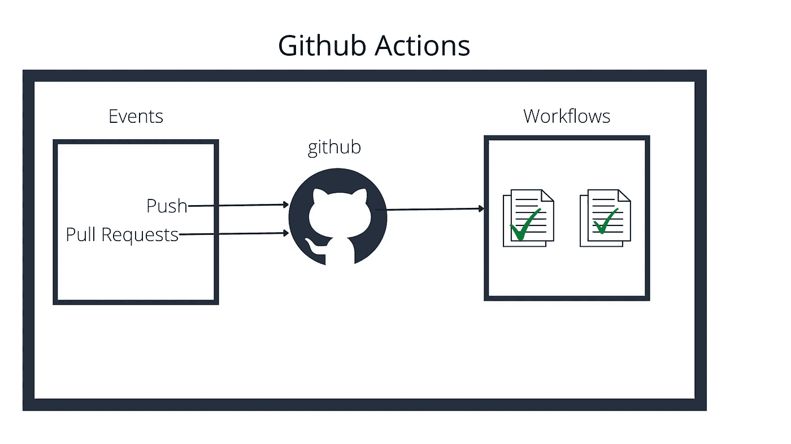

# 使用 Github 动作实现持续部署和工作流自动化

> 原文：<https://medium.com/javarevisited/continuous-deployment-and-workflow-automation-using-github-actions-55ba9e0e1e16?source=collection_archive---------0----------------------->

Github 操作

Github Actions 让开发者可以轻松实现软件工作流程的自动化。

在 Github 行动之前，我们不得不使用类似于 [Jenkins](/javarevisited/7-best-courses-to-learn-jenkins-and-ci-cd-for-devops-engineers-and-software-developers-df2de8fe38f3) 的 CI/CD 工具，在每次代码被推送到资源库时触发构建。我们还将这些构建与 Sonar 之类的代码质量检查插件集成在一起。